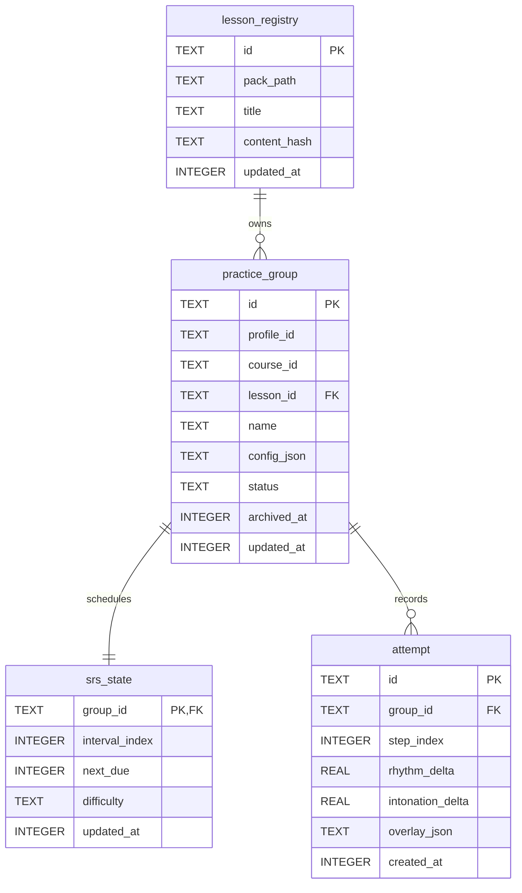

// AI-Generate
# backend-database

## 1 資料模型設計

資料來源：`packages/infra/lib/db/schema/V1__create_all.sql`、`V2__alter_placeholder.sql` 與 `packages/infra/lib/src/db/app_database.dart`。掃描到表 6 張（全量展示）。

### 1.1 表結構設計

#### 表 1: `lesson_registry`

- **說明**: 課件註冊表，保存 `.abopack` 最後已知路徑、標題與 content hash。
- **欄位**:
  | 欄位名 | 型別 | 必填 | 預設值 | 說明 |
  |---|---|---|---|---|
  | `id` | TEXT | 是 | - | Lesson UUID，主鍵 |
  | `pack_path` | TEXT | 是 | - | `.abopack` 最後已知路徑 |
  | `title` | TEXT | 是 | - | 課件標題 |
  | `content_hash` | TEXT | 是 | - | M6 局部重置依據 |
  | `updated_at` | INTEGER | 是 | - | epoch ms UTC |
- **索引**: 主鍵 `id`

#### 表 2: `practice_group`

- **說明**: 練習分組，進度/SRS 結算最小單位。
- **欄位**:
  | 欄位名 | 型別 | 必填 | 預設值 | 說明 |
  |---|---|---|---|---|
  | `id` | TEXT | 是 | - | Practice group UUID，主鍵 |
  | `profile_id` | TEXT | 是 | - | 本機 profile 識別 |
  | `course_id` | TEXT | 是 | - | 課程識別 |
  | `lesson_id` | TEXT | 是 | - | 參照 `lesson_registry.id` |
  | `name` | TEXT | 是 | - | 分組名稱 |
  | `config_json` | TEXT | 是 | - | stepRange、repeatN 等設定 JSON |
  | `status` | TEXT | 是 | `ACTIVE` | `ACTIVE` / `ARCHIVED` / `EXPIRED` |
  | `archived_at` | INTEGER | 否 | - | M8 168 小時恢復起算時間 |
  | `updated_at` | INTEGER | 是 | - | M6 upsert 比較鍵 |
- **索引**: 主鍵 `id`；`idx_pg_sync_key(profile_id, course_id, lesson_id)`；`idx_pg_status(status)`
- **備註**: M7 結構防線，本表沒有逾期/失敗/懲罰欄位。

#### 表 3: `srs_state`

- **說明**: SRS 排程狀態。
- **欄位**:
  | 欄位名 | 型別 | 必填 | 預設值 | 說明 |
  |---|---|---|---|---|
  | `group_id` | TEXT | 是 | - | 參照 `practice_group.id`，主鍵 |
  | `interval_index` | INTEGER | 是 | `0` | 間隔序列 `[0,1,3,7,14,30]` 的索引 |
  | `next_due` | INTEGER | 是 | - | 下次到期時間 epoch ms |
  | `difficulty` | TEXT | 是 | `NORMAL` | `HARD` / `NORMAL` / `EASY` |
  | `updated_at` | INTEGER | 是 | - | epoch ms UTC |
- **索引**: 主鍵 `group_id`；`idx_srs_due(next_due)`

#### 表 4: `attempt`

- **說明**: 錄音練習嘗試紀錄。
- **欄位**:
  | 欄位名 | 型別 | 必填 | 預設值 | 說明 |
  |---|---|---|---|---|
  | `id` | TEXT | 是 | - | Attempt UUID，主鍵 |
  | `group_id` | TEXT | 是 | - | 參照 `practice_group.id` |
  | `step_index` | INTEGER | 是 | - | 練習步驟索引 |
  | `rhythm_delta` | REAL | 是 | - | 節奏差異 |
  | `intonation_delta` | REAL | 是 | - | 音高差異 |
  | `overlay_json` | TEXT | 是 | - | 非音訊 overlay 快照 |
  | `created_at` | INTEGER | 是 | - | 建立時間 epoch ms |
- **索引**: 主鍵 `id`；`idx_attempt_group(group_id, created_at)`
- **備註**: M10 結構防線，本表不含 audio、recording、path 類欄位。

#### 表 5: `app_settings`

- **說明**: 使用者可調設定 key-value。
- **欄位**:
  | 欄位名 | 型別 | 必填 | 預設值 | 說明 |
  |---|---|---|---|---|
  | `key` | TEXT | 是 | - | 設定鍵，主鍵 |
  | `value` | TEXT | 是 | - | 設定值 |
- **索引**: 主鍵 `key`

#### 表 6: `audit_log`

- **說明**: 本機自審用設定/狀態操作紀錄。
- **欄位**:
  | 欄位名 | 型別 | 必填 | 預設值 | 說明 |
  |---|---|---|---|---|
  | `id` | TEXT | 是 | - | Audit log UUID，主鍵 |
  | `occurred_at` | INTEGER | 是 | - | 發生時間 epoch ms UTC |
  | `actor` | TEXT | 是 | - | 操作者，現為 `local-user` |
  | `action` | TEXT | 是 | - | 操作名稱 |
  | `target_type` | TEXT | 是 | - | 目標類型，如 `app_settings` / `ai_service` |
  | `target_id` | TEXT | 否 | - | 非敏感識別 |
  | `metadata_json` | TEXT | 是 | - | 非敏感摘要 JSON |
- **索引**: 主鍵 `id`；`idx_audit_log_time(occurred_at)`；`idx_audit_log_action(action)`
- **備註**: 不存 API key、音訊 bytes、錄音路徑或檔案路徑。

### 2.2 表關係

- `lesson_registry` 與 `practice_group`: 一對多，`practice_group.lesson_id` 參照 `lesson_registry.id`。
- `practice_group` 與 `srs_state`: 一對一，`srs_state.group_id` 參照 `practice_group.id`。
- `practice_group` 與 `attempt`: 一對多，`attempt.group_id` 參照 `practice_group.id`。
- `app_settings` 與 `audit_log`: 無物理外鍵；audit log 透過 `target_type` / `target_id` 保存非敏感追溯。

