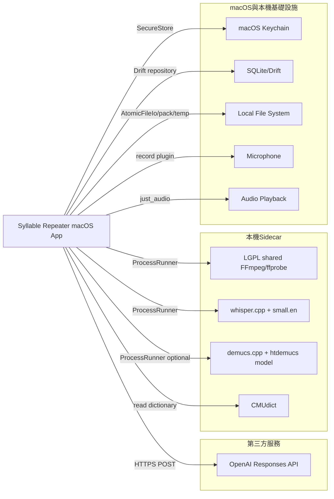

// AI-Generate
# backend-external-dependency

## 1 說明

本專案沒有伺服器端業務系統依賴；主要外部依賴是本機 sidecar executable、macOS 系統能力、SQLite/檔案系統與一個可選遠端 AI provider。

## 2 外部依賴全景

### 2.1 外部依賴關係圖

### 2.2 外部依賴彙整表

| 依賴名稱 | 型別 | 呼叫方式 | 設定項/位址 | 用途 |
|---|---|---|---|---|
| OpenAI Responses API | 第三方服務 | HTTPS | `https://api.openai.com/v1/responses` | 可選文字翻譯 |
| macOS Keychain | 基礎設施 | `flutter_secure_storage` | `SecureStore` key `ai.apiKey` | 儲存 AI credential |
| LGPL shared FFmpeg/ffprobe | 本機 sidecar | `ProcessRunner` | `SidecarPaths.ffmpegPath/ffprobePath` | 解碼、時長探測、mp3 匯出 |
| whisper.cpp | 本機 sidecar | `ProcessRunner` | `SidecarPaths.whisperCliPath` | 詞級時間戳辨識；v1.1 另供 segment 級切段（段落標籤） |
| macOS audio session | 基礎設施 | `audio_session` plugin（v1.1 直接依賴） | `PracticeAudioSessionCoordinator` | 錄音/播放 category 切換；錄後即播不卡 record 類別 |
| whisper small.en model | 本機模型 | 檔案讀取 | `SidecarPaths.whisperModelPath` | whisper.cpp 模型 |
| demucs.cpp | 本機 sidecar | `ProcessRunner` | `SidecarPaths.demucsCliPath` | 可選人聲分離 |
| htdemucs 4-source model | 本機模型 | 檔案讀取 | `SidecarPaths.demucsModelPath` | demucs.cpp 模型 |
| CMUdict | 本機資料 | 檔案讀取 | `SidecarPaths.cmudictPath` | 英文音節切分字典 |
| SQLite/Drift | 基礎設施 | Drift | `AppDatabase` | 課件註冊、SRS、attempt、settings、audit log |
| local file system | 基礎設施 | `dart:io` adapter | pack/temp/export paths | `.abopack`、暫存 WAV、匯出 mp3 |
| macOS release zip | 發布產物 | `ditto` zip | `dist/SyllableRepeater-macos-x86_64-unsigned.zip` | 使用者解壓後略過 Gatekeeper 開啟 |

## 3 業務系統

無。本專案是純本機單人 macOS App，不依賴其他業務系統或內部服務。

## 4 第三方服務

### 4.1 OpenAI Responses API

- **服務說明**: 可選文字翻譯 provider；手動譯文永遠可用且優先。
- **呼叫方式**: HTTPS POST，透過 `OpenAiResponsesClient`。
- **依賴場景**: 使用者已設定 API key 且要求 AI 翻譯時。

### 4.2 OpenAI API 介面資訊

#### OpenAI Responses - create response

- **介面路徑**: `POST https://api.openai.com/v1/responses`
- **功能描述**: 將輸入文字翻譯成目標語言；request body 包含 `model`、`store:false`、`instructions`、`input`，credential 僅放在 Authorization header。
- **錯誤碼**:
  | 錯誤碼 | 說明 |
  |---|---|
  | `ERR_AI_KEY_MISSING` | 未設定 AI key |
  | `ERR_AI_CALL_FAILED` | provider 失敗、timeout、host blocked、prompt injection review required、rate limit 等 |

## 5 本機 sidecar 與模型

| 依賴 | 授權/發布約束 | release gate |
|---|---|---|
| FFmpeg/ffprobe | 只允許 LGPL dynamic shared；禁止 GPL/nonfree/static LGPL | `scripts/check_licenses.py`、`prepare_release_sidecars.py`、`fetch_sidecar_artifacts.py` |
| whisper.cpp | MIT | release sidecar manifest 必須含 binary/model |
| demucs.cpp | MIT | CLI contract 為 `demucs.cpp.main <model-file> <input-audio> <out-dir>` |
| htdemucs model | 依 manifest 記錄 | SHA-256 pinning |
| CMUdict | BSD-like | release manifest 必須含 data |

### 5.0 v1.1 依賴用途擴充（2026-07-16）

- whisper.cpp：新增 segment 級時間戳消費（`WhisperJsonParser.parseSegments`），供段落標籤自動切段；binary/model 不變。
- demucs.cpp：輸入改由原始匯入檔直接準備 44.1kHz stereo（不先 downmix mono）；CLI 契約不變。
- `audio_session` ^0.2.4：由 transitive 升為 app 直接依賴，錄音停止後先釋放 record session 再啟用 playback。
- 無新增遠端服務、無新增模型、無授權變更；license manifest 仍為 25 components。

### 5.1 2026-07-11 release dependency snapshot（v1；v1.1 沿用同批 sidecar/model）

| 依賴 | 發布事實 |
|---|---|
| FFmpeg/ffprobe | FFmpeg 8.1.2 官方 source build，source SHA-256 `464beb5e7bf0c311e68b45ae2f04e9cc2af88851abb4082231742a74d97b524c`；configure `--enable-shared --disable-static --disable-gpl --disable-nonfree --enable-libmp3lame` |
| LAME | bundled `libmp3lame.0.dylib` dynamic linking，供 mp3 export |
| demucs.cpp | `v0.0.4-alpha` commit `84e62f07ff77c5058a3493f7f9702cde606dae76`，x86_64 binary 只連系統 `Accelerate.framework`、`libc++`、`libSystem` |
| htdemucs model | SHA-256 `72b17c42d308982ddb5069bc3bf48b81a5aac4cb6516e4366c0fa7cef6df0064` |
| Release artifact | `dist/SyllableRepeater-macos-x86_64-unsigned.zip` SHA-256 `38de745c051c7d19f11c254fe0406055979dbca7c4e6c07ef4474f2f670db8a2` |

## 6 安全與隱私約束

- API key 不得出現在程式碼、設定、pack、DB、log、commit。
- 錄音只作暫存比較；attempt/audit log schema 均不含音訊或路徑欄位。
- sidecar 錯誤一律透過 `SidecarRunner`/DomainException 映射，不讓 App process 因 child process crash 被拖垮。
- 發布 bundle 不得引用 `/usr/local/bin/ffmpeg`；Release 只能使用 bundled LGPL shared sidecar。
