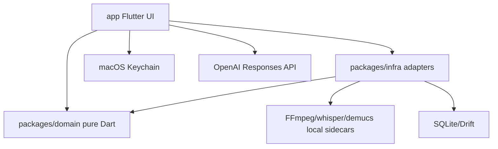
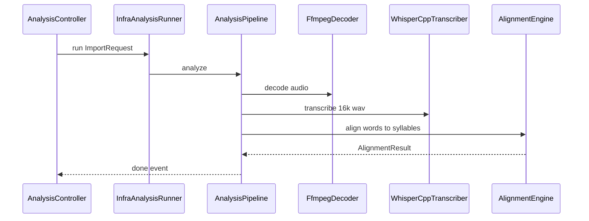
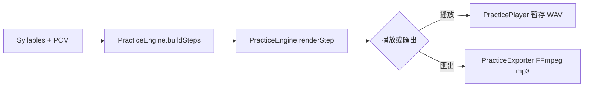
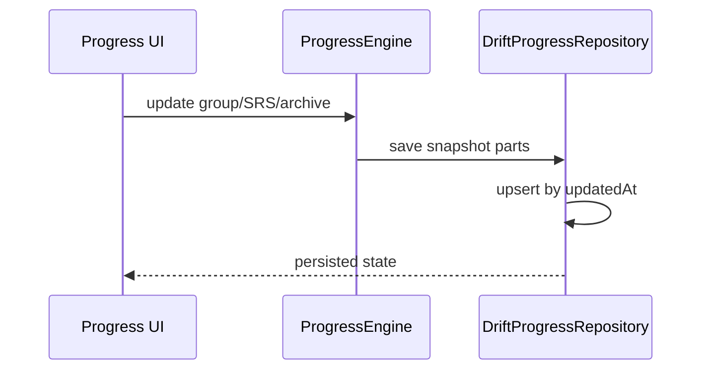
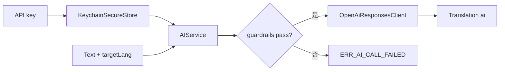

// AI-Generate
# backend-project

## 1 專案目的

Syllable Repeater 的後端視角是本機領域服務與基礎設施 adapter：在不啟動伺服器的情況下，完成音訊解碼/辨識/音節對齊、跟讀渲染、錄音比對、課件封裝、SRS 進度與可選 AI 翻譯。核心守則是音訊播放/匯出必須逐 sample 來自原始 PCM 切片，Domain 維持純 Dart。

## 2 專案目錄結構

### 2.1 分層歸類

| 層級 | 實際目錄/檔案 | 說明 |
|---|---|---|
| 入口層 | `app/lib/main.dart`、`app/lib/features/**` Riverpod controllers/providers | Flutter UI 與 workflow 入口，不是 HTTP Controller |
| 業務邏輯編排層 | `app/lib/features/*/*_controller.dart`、`app/lib/shared/infra/infra_analysis_runner.dart` | UI flow orchestration、provider 接線、analysis runner 組裝 |
| 核心領域服務層 | `packages/domain/lib/src/**` | 純 Dart models、engines、ports、business rules |
| 外部依賴層 | `packages/infra/lib/src/sidecar/**`、`app/lib/shared/infra/keychain_secure_store.dart`、`openai_responses_client.dart` | sidecar、Keychain、HTTPS provider adapter |
| 資料層 | `packages/infra/lib/src/db/**`、`packages/infra/lib/db/schema/**` | Drift/SQLite schema 與 repository |
| 發布層 | `scripts/fetch_sidecar_artifacts.py`、`scripts/prepare_release_sidecars.py`、`scripts/make_release_zip.py`、`app/macos/Runner/Scripts/copy_release_sidecars.sh` | release sidecar acquisition/staging、x86_64 `.app`、unsigned zip |

### 2.3 程式碼目錄結構樹

```text
syllable repeater/
├── pubspec.yaml                       # Dart workspace: app/domain/infra
├── app/
│   └── lib/
│       ├── main.dart                  # Flutter app + sidecar provider bootstrap
│       ├── shell/                     # NavigationRail shell
│       ├── features/                  # UI workflow entrypoints/controllers
│       └── shared/infra/              # app-layer infra adapters/providers
├── packages/
│   ├── domain/
│   │   └── lib/
│   │       ├── domain.dart            # public exports
│   │       └── src/
│   │           ├── ai/                # AIService guardrails
│   │           ├── alignment/         # syllable alignment, zero crossing
│   │           ├── analysis/          # AnalysisPipeline, prosody, peaks
│   │           ├── model/             # immutable domain models
│   │           ├── pack/              # LessonPackEngine
│   │           ├── ports/             # side-effect contracts
│   │           ├── practice/          # PracticeEngine/export WAV
│   │           ├── progress/          # ProgressEngine/SRS/archive
│   │           └── recording/         # RecordingComparator
│   └── infra/
│       └── lib/
│           ├── infra.dart             # infra exports
│           ├── db/schema/             # DDL truth snapshots
│           └── src/
│               ├── analysis/          # analysis adapters/cache
│               ├── db/                # Drift database/repository
│               ├── practice/          # recording/export adapters
│               └── sidecar/           # FFmpeg/whisper/demucs wrappers
└── scripts/                           # release/license/guardrail gates
```

## 3 模組劃分

### 3.0 模組依賴圖



### 3.1 核心業務流程

#### 業務流程 1: 匯入音檔與音節對齊

- **輸入**: 使用者選取的音檔路徑、可選 transcript、可選 separateVocals。
- **處理**: FFmpeg decode → 可選 demucs 分離 → whisper.cpp transcription → `AlignmentEngine` syllabify → waveform peaks。
- **輸出**: `AlignmentResult`、`Pcm`、`WaveformPeak` list。
- **例外處理**: sidecar timeout/crash/exit 非 0 轉 DomainException；pipeline checkpoint 支援重試。



#### 業務流程 2: 句尾疊加練習與匯出

- **輸入**: `AlignmentResult.syllables`、原始 `Pcm`、repeatN、export mode。
- **處理**: `PracticeEngine.buildSteps` 依 M2 建 steps；`renderStep` 只切原始 PCM；export 以 FFmpeg 轉 mp3。
- **輸出**: 播放用 WAV 暫存或 mp3 export。
- **例外處理**: repeatN 越界、source range 超界、sidecar export 失敗皆回 DomainException/錯誤呈現。



#### 業務流程 3: SRS 進度、封存與同步匯入

- **輸入**: practice group、attempt、settings、imported snapshot。
- **處理**: `ProgressEngine` 套用 interval `[0,1,3,7,14,30]`、updatedAt newer-wins、archive 168 小時規則。
- **輸出**: Drift repository 中的 lesson/practice_group/srs_state/attempt/settings/audit_log。
- **例外處理**: EXPIRED 不可逆；跨日零懲罰；schema 不含逾期/失敗欄位。



#### 業務流程 4: AI credential 與翻譯

- **輸入**: 使用者 API key、文字、目標語言。
- **處理**: `AIService.configure` 寫 Keychain 並記 audit；`translate` 檢查 credential、HTTPS allowlist、rate limit、prompt injection token；`OpenAiResponsesClient` 呼叫 provider。
- **輸出**: `Translation(source=ai)`；manual translation 仍可覆蓋。
- **例外處理**: 未設 key、provider failure、host blocked、timeout 皆轉 DomainException，不洩 credential。



#### 業務流程 5: release sidecar staging 與 unsigned macOS 打包

- **輸入**: `release/sidecar-artifacts.json`、本機 release-safe sidecar/model artifacts、Flutter macOS project。
- **處理**: `fetch_sidecar_artifacts.py` 檢查 HTTPS/SHA-256/license/linking policy；`prepare_release_sidecars.py` 檢查 CT-09、FFmpeg LGPL shared、Mach-O 依賴並產 staging；Release build phase 檢查必要 sidecar；`flutter build macos --release --no-pub` 產 x86_64 `.app`；`make_release_zip.py` 產 unsigned zip 與 SHA-256。
- **輸出**: `dist/SyllableRepeater-macos-x86_64-unsigned.zip` 與 `.sha256`；release artifact 不進版控。
- **例外處理**: 缺 artifact、GPL/nonfree/static LGPL、TLS/CERT 降級、非 HTTPS URL、缺 SHA-256 或 bundle 缺必要檔，一律 fail-closed。

### 3.2 業務模組

| 模組 | 功能 | 核心實體/資料 | 主要介面 |
|---|---|---|---|
| Analysis | 解碼、分離、轉寫、音節對齊 | `ImportRequest`、`AnalysisEvent`、`AlignmentResult` | `AnalysisPipeline.analyze` |
| Alignment | CMUdict + vowel fallback syllabify | `Word`、`Syllable`、`TimeRange` | `AlignmentEngine.align` |
| Practice | 疊加步驟與原始 PCM 渲染 | `PracticeStep`、`Pcm` | `PracticeEngine.buildSteps/renderStep/renderMergedExport` |
| Recording | 錄音比對 | `ComparisonResult`、`ProsodyPoint` | `RecordingComparator.compare` |
| Pack | `.abopack` encode/decode | `Lesson`、archive entries | `LessonPackEngine.encode/decode` |
| Progress | SRS、archive、settings | `ProgressSnapshot`、`PracticeGroup`、`SrsState` | `ProgressEngine`、`ProgressRepository` |
| AI | credential + translation | `AiProviderConfig`、`Translation` | `AIService.configure/translate` |
| Infra Sidecar | child process isolation | `SidecarResult` | `SidecarRunner.run` |
| Infra DB | Drift persistence | 6 張 SQLite 表 | `DriftProgressRepository` |
| Release Gate | x86_64 sidecar 發布 | `.app` bundled sidecar + zip | `fetch/prepare/make_release_zip` scripts |

### 3.3 業務規則

- M1：播放/匯出音訊逐 sample 來自原始 PCM；禁止 TTS/生成/合成。
- M2：步數等於音節數，第 n 步為句尾倒數 n 個音節，不做單字邊界吸附。
- M3：合併匯出靜音等於前一步 totalDurationMs，以 sample 數計。
- M5：Domain 純 Dart，不 import Flutter、infra、dart:io/ffi/html。
- M6：進度合併依 updatedAt 較新覆寫；contentHash 僅重置該課。
- M7：跨日零懲罰，schema 無逾期/失敗/懲罰欄位。
- M8：ARCHIVED 168 小時內可恢復，不含 168 小時；EXPIRED 不可逆。
- M9：release 僅允許 MIT/BSD/ISC/Apache-2.0/LGPL dynamic，禁止 GPL/AGPL/non-commercial。
- M10：API key 只進 Keychain，錄音比較後清理，DB/audit 不存音訊或路徑欄位。
