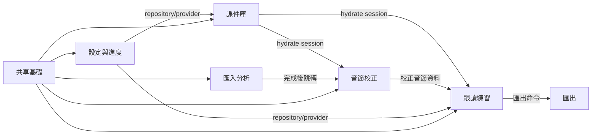

// AI-Generate
# frontend-project

## 業務總覽

- **專案名稱**: `syllable-repeater`
- **技術堆疊型別**: Flutter macOS + Riverpod 3 桌面應用
- **業務背景**: 本機匯入音檔後做音節對齊、波形校正、句尾疊加跟讀、錄音比對、課件儲存與 SRS 進度設定；無伺服器與雲端同步。

## 業務功能模組

### 功能模組清單

- **課件庫 (`library`)**: 開啟/儲存 `.abopack`，維持課件 session 與手動譯文。
  - 核心功能: 檔案選取、pack 解碼驗證、課件卡展示、手動譯文輸入。
- **匯入分析 (`import-analysis`)**: 音檔拖放/選取後啟動真 sidecar pipeline。
  - 核心功能: 選音檔、可選 demucs 分離、階段進度、失敗 checkpoint 重試、完成後跳校正頁。
- **音節校正 (`editor`)**: 顯示音節切點、波形與韻律 overlay。
  - 核心功能: 音節列表、波形 canvas、韻律圖層、切點校正入口。
- **跟讀練習 (`practice`)**: 句尾疊加步驟播放、錄音與比較。
  - 核心功能: `PracticeEngine.renderStep` 播放、repeatN、錄音面板、節奏/音高 overlay。
- **匯出 (`export`)**: 以原始 PCM 切片產出 mp3。
  - 核心功能: 單步/合併匯出、FFmpeg mp3 adapter、輸出資料夾開啟。
- **設定與進度 (`progress`)**: 提醒/sidecar/AI key 設定與 SRS 狀態儲存。
  - 核心功能: `.abopack` 匯入、進度 repository、Keychain credential、AI provider config。
- **共享基礎 (`shared`)**: AppShell、錯誤呈現、sidecar path、player bar、design tokens。
  - 核心功能: NavigationRail、錯誤碼對照、Release/Debug sidecar 路徑、Keychain/OpenAI adapters、主題與固定視窗尺寸。
- **macOS 發布 (`app/macos`)**: x86_64 Release build 與 bundled sidecar 資源。
  - 核心功能: Release entitlements 關閉 sandbox、`ARCHS=x86_64`、Xcode build phase 複製 release sidecars、未簽章 zip 交付。

### 核心業務流程

1. 音檔匯入到校正
   - 入口：`ImportScreen` 拖放或 `file_selector.openFile`
   - 關鍵步驟：`AnalysisController.start` → `InfraAnalysisRunner` → FFmpeg decode → 可選 demucs → whisper.cpp → `AlignmentEngine` → `AppSection.editor`
   - 輸出結果：`AlignmentResult`、`Pcm`、waveform peaks 進入 editor/practice session

   ```mermaid
   sequenceDiagram
       participant User as 使用者
       participant Import as ImportScreen
       participant Controller as AnalysisController
       participant Runner as InfraAnalysisRunner
       participant Domain as AnalysisPipeline
       participant Shell as AppShell
       User->>Import: 選取或拖放音檔
       Import->>Controller: selectAudioPath + start
       Controller->>Runner: run ImportRequest
       Runner->>Domain: decode/separate/transcribe/syllabify
       Domain-->>Controller: AnalysisEvent.done
       Controller->>Shell: select editor
       Shell-->>User: 顯示音節校正
   ```

2. 跟讀練習與錄音比對
   - 入口：`PracticeScreen`
   - 關鍵步驟：使用 session PCM + syllables 建 steps；播放走 `PracticePlayer` 產暫存 WAV；錄音走 `RecordPracticeRecorder`；比較走 `RecordingComparator`
   - 輸出結果：當次 comparison result 與 overlay 視覺化；錄音檔由 finally/cancel 路徑清理

   ```mermaid
   sequenceDiagram
       participant User as 使用者
       participant Practice as PracticeScreen
       participant Controller as PracticeController
       participant Engine as PracticeEngine
       participant Recorder as RecordPracticeRecorder
       User->>Practice: 播放疊加步驟
       Practice->>Controller: playStep
       Controller->>Engine: renderStep 原始 PCM 切片
       Engine-->>Controller: Pcm
       User->>Practice: 錄音並停止
       Practice->>Recorder: start/stop
       Recorder-->>Controller: 暫存錄音路徑
       Controller-->>User: 顯示節奏/音高比較
   ```

3. AI key 設定與手動譯文共存
   - 入口：`ProgressSettingsScreen` 與 `LibraryScreen`
   - 關鍵步驟：API key 只寫入 Keychain；AI 翻譯須經 `AIService` allowlist/rate limit/prompt guard；手動譯文永遠優先覆蓋 AI
   - 輸出結果：credential 不落 DB/pack/log；manual translation 不被 provider failure 阻斷

   ```mermaid
   flowchart LR
       A[設定頁輸入 API key] --> B[KeychainSecureStore]
       B --> C[AIService.configure]
       D[課件庫手動譯文] --> E[LessonSessionController]
       C --> F[OpenAiResponsesClient]
       F --> G[Translation source=ai]
       E --> H{既有 manual?}
       H -->|是| I[保留 manual]
       H -->|否| J[可採 AI 結果]
   ```

4. macOS release 啟動與 sidecar 載入
   - 入口：Release `.app` 的 `main()` 與 `SidecarPaths.current()`
   - 關鍵步驟：Release build phase 檢查並複製 `Contents/Resources/sidecar/`；執行期使用 bundled FFmpeg/ffprobe/whisper/demucs/model/cmudict；打包由 `scripts/make_release_zip.py` 產 unsigned zip 與 SHA-256。
   - 輸出結果：x86_64 未簽章 `.app` / `.zip`，不依賴開發機 `/usr/local/bin/ffmpeg`。

### 模組依賴關係



## 介面呼叫清單

本專案無前端對自家伺服器 REST API 的呼叫。唯一遠端 HTTPS provider 由 `OpenAiResponsesClient` 封裝，credential 僅進 Authorization header。

| 序號 | 介面函式 | HTTP 方法 | 介面路徑 | 說明 |
|---:|---|---|---|---|
| 1 | `OpenAiResponsesClient.translate` | POST | `https://api.openai.com/v1/responses` | 將文字翻譯成目標語言，回傳 `output_text` 或 `output[].content[].text` |

### 介面呼叫規範

- HTTP 呼叫不得散落於 widget；目前集中於 `app/lib/shared/infra/openai_responses_client.dart`。
- API key 不得寫入 widget state、DB、pack、log 或 commit；只透過 `KeychainSecureStore` 寫 macOS Keychain。
- 自家本機 pipeline 透過 Dart service/provider 及 domain ports 呼叫，不走 HTTP。

## 目錄結構說明

```text
app/lib/
├── main.dart                         # Flutter app 啟動與 sidecar/provider 接線
├── shell/app_shell.dart              # NavigationRail + IndexedStack
├── features/
│   ├── library/                      # 課件庫與 .abopack 開啟/儲存
│   ├── import_analysis/              # 音檔匯入、pipeline 進度、重試
│   ├── editor/                       # 波形、音節校正、韻律 overlay
│   ├── practice/                     # 跟讀播放、錄音、比較 UI
│   ├── export/                       # 匯出對話框與 mp3 pipeline
│   ├── pack_translate/               # lesson session controller
│   └── progress/                     # 設定、進度 repository、AI adapter provider
└── shared/
    ├── error/                        # 錯誤碼呈現
    ├── infra/                        # sidecar paths、analysis runner、Keychain/OpenAI adapters
    ├── player/                       # player bar
    ├── navigation.dart               # AppSection index
    └── tokens.dart                   # theme、間距、視窗尺寸

app/macos/
├── Runner/Configs/Release.xcconfig   # Release 固定 x86_64
└── Runner/Scripts/                   # Release build phase sidecar 檢查/複製
```

## 技術堆疊

| 類別 | 實際依賴/檔案 | 用途 |
|---|---|---|
| UI framework | Flutter Material | macOS desktop UI |
| 狀態管理 | `flutter_riverpod` 3 | Notifier/providers |
| 檔案選取/拖放 | `file_selector`、`desktop_drop` | 匯入音檔與 pack |
| 播放 | `just_audio` | 練習音訊播放 |
| 錄音 | `record` | 本機麥克風錄音 |
| Keychain | `flutter_secure_storage` | AI credential SecureStore |
| HTTP | `http` | OpenAI Responses API adapter |
| Domain/Infra | path dependencies | 純 Dart domain + local adapters |
| Release packaging | Flutter macOS build + `ditto` zip | x86_64 unsigned `.app` 與 `.zip.sha256` |

## 開發約束

- UI 首屏是工具本體，不做 landing page。
- Domain 純 Dart；Flutter widget 不直接碰 sidecar implementation。
- 練習播放/匯出只能走 `PracticeEngine.renderStep`/export path 的原始 PCM 切片。
- AI 翻譯不影響手動譯文可用性；provider failure 不阻斷課件工作流。
- Release build 只支援 macOS x86_64；bundled sidecar 必須通過 M9 license/staging gate，不得使用開發機 GPL FFmpeg。
