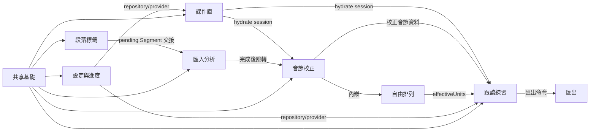

// AI-Generate
# frontend-project

## 業務總覽

- **專案名稱**: `syllable-repeater`
- **技術堆疊型別**: Flutter macOS + Riverpod 3 桌面應用
- **業務背景**: 本機匯入音檔後做段落切段、音節對齊、波形校正、自由排列、句尾疊加跟讀、錄音比對、課件儲存與 SRS 進度設定；無伺服器與雲端同步。

## 業務功能模組

### 功能模組清單

- **課件庫 (`library`)**: 開啟/儲存 `.abopack`（v1/v2/v3 相容），維持課件 session。
  - 核心功能: 檔案選取、pack/bundle 解碼驗證、課件卡展示、v3 複合封包開啟服務。
- **段落標籤 (`labeling`，v1.1 新增)**: 多句音檔切段與 `.abolabel` 管理。
  - 核心功能: 真實階段進度、全軌波形、標籤線拖曳/增刪、三態區段（保留/捨棄）、原音段落試聽、dirty 三選一攔截、既有標籤指紋提醒、勾選區段送單句分析。
- **匯入分析 (`import-analysis`)**: 單句模式——直接匯入或承接段落區段後啟動真 sidecar pipeline。
  - 核心功能: 逐 byte 就緒驗證（M15）、pending Segment 來源徽章、可選 demucs 分離、真實階段進度、手動/AI 譯文群組（v1.1 自設定頁搬入、⌘S 存課件）、TTS 零入口。
- **音節校正 (`editor`)**: 音節切點增減校正、雙向高亮與自由排列區。
  - 核心功能: 波形＋/×切點手勢、chip 雙擊改字（needsReview）、時間範圍選取與文字積木雙向黃色高亮、序號即時重排、prosody isolate 背景計算、校正 undo（獨立於排列 undo）。
- **自由排列 (`arrangement`，v1.1 新增)**: 音節積木自訂練習內容（掛於校正頁）。
  - 核心功能: 一鍵生成 N 列、同列長按排序/成組/組內排序/拆組、來源段落點選插入、雙擊集中設定（repeat 1–10、silence 0–20/0.5、reset 預設）、列預覽播放、stale banner、獨立 undo。
- **跟讀練習 (`practice`)**: 依 M12 單元化播放、錄音與比較。
  - 核心功能: `effectiveUnits` 消費（0 列＝1 單元、N 列＝N 單元）、四態字稿/譯文顯示（每 Lesson 記憶）、hidden 只留編號、錄音單次參考比對、目前單元記憶體 PCM 回放/停止/刪除、audio_session 錄播分離。
- **匯出 (`export`)**: 四層選擇匯出原始 PCM 切片 mp3。
  - 核心功能: 音訊來源→排列來源→單元範圍→設定覆寫四層選擇、相容排列候選過濾、FFmpeg mp3 adapter。
- **設定與進度 (`progress`)**: 提醒/sidecar/AI key 設定與 SRS 狀態儲存。
  - 核心功能: `.aboprogress` 匯入匯出（含 transcriptDisplayModes）、進度 repository、Keychain credential、AI provider config、批次儲存。
- **共享基礎 (`shared`)**: AppShell、響應式佈局、錯誤呈現、sidecar path、跨頁交接。
  - 核心功能: NavigationRail（含「段落標籤」項）、`ResponsiveLayout`/`ResponsiveTwoPane`（1280px 斷點、1100×700 最小內容）、26 碼錯誤對照、Release/Debug sidecar 雙向路徑搜尋、`pendingSegmentProvider` 單槽交接、Keychain/OpenAI adapters。
- **macOS 發布 (`app/macos`)**: x86_64 Release build 與 bundled sidecar 資源。
  - 核心功能: Release entitlements 關閉 sandbox、`ARCHS=x86_64`、Xcode build phase 複製 release sidecars、未簽章 zip 交付。

### 核心業務流程

0. 段落標籤到單句交接（v1.1）
   - 入口：`LabelingScreen` 選取多句音檔
   - 關鍵步驟：`LabelingController` → `SegmentEngine.openAudio`（真實階段事件）→ 波形＋自動切段 → 手動三態標記／`.abolabel` 存載 → 勾選區段 `handoffSelectedSegment` → `pendingSegmentProvider`（單槽、僅 metadata）→ `ImportScreen` 自動消費並預填
   - 輸出結果：`LabelSession`、`.abolabel` v2、pending Segment 交接（不複製 PCM）

1. 音檔匯入到校正（v1.1 改單句模式）
   - 入口：`ImportScreen` 拖放/選取，或承接 pending Segment
   - 關鍵步驟：`AudioImportReader` 逐 byte 就緒 → `AnalysisController.start` → `InfraAnalysisRunner` → FFmpeg decode → 可選 demucs → whisper.cpp（經雙 Registry 語言路由）→ `AlignmentEngine` → 建 `DraftLessonIdentity` → `AppSection.editor`
   - 輸出結果：`AlignmentResult`、`AnalysisAudioTracks`（original/analysis 雙軌）、waveform peaks 進入 editor/practice session

   ```mermaid
   sequenceDiagram
       participant User as 使用者
       participant Import as ImportScreen
       participant Controller as AnalysisController
       participant Runner as InfraAnalysisRunner
       participant Domain as AnalysisPipeline
       participant Shell as AppShell
       User->>Import: 選取或拖放音檔
       Import->>Controller: selectAudioPath + start
       Controller->>Runner: run ImportRequest
       Runner->>Domain: decode/separate/transcribe/syllabify
       Domain-->>Controller: AnalysisEvent.done
       Controller->>Shell: select editor
       Shell-->>User: 顯示音節校正
   ```

2. 跟讀練習與錄音比對（v1.1 單元化）
   - 入口：`PracticeScreen`
   - 關鍵步驟：`PracticeController` 消費 `PracticeEngine.effectiveUnits` 建單元目錄；auto 走 `renderStep`、custom 走 `renderBlockRow`；錄音前 audio session 切 record、停止後切 playback；比較走 `renderSinglePassReference`＋`RecordingComparator`（isolate、每圖 ≤1000 點）
   - 輸出結果：當次 comparison result 與 overlay 視覺化；目前單元記憶體 PCM 供回放（五時機清除）；磁碟錄音由 finally/cancel 路徑清理

   ```mermaid
   sequenceDiagram
       participant User as 使用者
       participant Practice as PracticeScreen
       participant Controller as PracticeController
       participant Engine as PracticeEngine
       participant Recorder as RecordPracticeRecorder
       User->>Practice: 播放疊加步驟
       Practice->>Controller: playStep
       Controller->>Engine: renderStep 原始 PCM 切片
       Engine-->>Controller: Pcm
       User->>Practice: 錄音並停止
       Practice->>Recorder: start/stop
       Recorder-->>Controller: 暫存錄音路徑
       Controller-->>User: 顯示節奏/音高比較
   ```

3. AI key 設定與手動譯文共存
   - 入口：`ProgressSettingsScreen` 與 `LibraryScreen`
   - 關鍵步驟：API key 只寫入 Keychain；AI 翻譯須經 `AIService` allowlist/rate limit/prompt guard；手動譯文永遠優先覆蓋 AI
   - 輸出結果：credential 不落 DB/pack/log；manual translation 不被 provider failure 阻斷

   ```mermaid
   flowchart LR
       A[設定頁輸入 API key] --> B[KeychainSecureStore]
       B --> C[AIService.configure]
       D[課件庫手動譯文] --> E[LessonSessionController]
       C --> F[OpenAiResponsesClient]
       F --> G[Translation source=ai]
       E --> H{既有 manual?}
       H -->|是| I[保留 manual]
       H -->|否| J[可採 AI 結果]
   ```

4. macOS release 啟動與 sidecar 載入
   - 入口：Release `.app` 的 `main()` 與 `SidecarPaths.current()`
   - 關鍵步驟：Release build phase 檢查並複製 `Contents/Resources/sidecar/`；執行期使用 bundled FFmpeg/ffprobe/whisper/demucs/model/cmudict；打包由 `scripts/make_release_zip.py` 產 unsigned zip 與 SHA-256。
   - 輸出結果：x86_64 未簽章 `.app` / `.zip`，不依賴開發機 `/usr/local/bin/ffmpeg`。

### 模組依賴關係



## 介面呼叫清單

本專案無前端對自家伺服器 REST API 的呼叫。唯一遠端 HTTPS provider 由 `OpenAiResponsesClient` 封裝，credential 僅進 Authorization header。

| 序號 | 介面函式 | HTTP 方法 | 介面路徑 | 說明 |
|---:|---|---|---|---|
| 1 | `OpenAiResponsesClient.translate` | POST | `https://api.openai.com/v1/responses` | 將文字翻譯成目標語言，回傳 `output_text` 或 `output[].content[].text` |

### 介面呼叫規範

- HTTP 呼叫不得散落於 widget；目前集中於 `app/lib/shared/infra/openai_responses_client.dart`。
- API key 不得寫入 widget state、DB、pack、log 或 commit；只透過 `KeychainSecureStore` 寫 macOS Keychain。
- 自家本機 pipeline 透過 Dart service/provider 及 domain ports 呼叫，不走 HTTP。

## 目錄結構說明

```text
app/lib/
├── main.dart                         # Flutter app 啟動與 sidecar/provider 接線
├── shell/app_shell.dart              # NavigationRail + IndexedStack（含段落標籤項）
├── features/
│   ├── library/                      # 課件庫、.abopack v1/v2/v3 開啟/儲存
│   ├── labeling/                     # 段落標籤：全軌波形、區段清單、.abolabel（v1.1）
│   ├── import_analysis/              # 單句匯入、逐 byte 就緒、譯文群組、pipeline 進度
│   ├── editor/                       # 波形、切點增減、雙向高亮、prosody isolate runner
│   ├── arrangement/                  # 自由排列：controller/section/row/config menu（v1.1）
│   ├── practice/                     # 單元化播放、四態顯示、錄音回放、比較 UI
│   ├── export/                       # 四層匯出對話框與 mp3 pipeline
│   ├── pack_translate/               # lesson session controller
│   └── progress/                     # 設定、進度 repository、AI adapter provider
└── shared/
    ├── error/                        # 錯誤碼呈現（26 碼）
    ├── infra/                        # sidecar paths、analysis runner、segment engine factory、Keychain/OpenAI adapters
    ├── player/                       # player bar
    ├── navigation.dart               # AppSection index
    ├── pending_segment.dart          # 段落→單句單槽交接（v1.1）
    ├── responsive_layout.dart        # 1280px 斷點響應式容器（v1.1）
    └── tokens.dart                   # theme、間距、視窗尺寸

app/macos/
├── Runner/Configs/Release.xcconfig   # Release 固定 x86_64
└── Runner/Scripts/                   # Release build phase sidecar 檢查/複製
```

## 技術堆疊

| 類別 | 實際依賴/檔案 | 用途 |
|---|---|---|
| UI framework | Flutter Material | macOS desktop UI |
| 狀態管理 | `flutter_riverpod` 3 | Notifier/providers |
| 檔案選取/拖放 | `file_selector`、`desktop_drop` | 匯入音檔與 pack |
| 播放 | `just_audio` | 練習音訊與段落原音（clip 相對 seek）播放 |
| 錄音 | `record` | 本機麥克風錄音 |
| 音訊 session | `audio_session` ^0.2.4（v1.1 轉直接依賴） | macOS 錄音/播放 category 切換協調 |
| Keychain | `flutter_secure_storage` | AI credential SecureStore |
| HTTP | `http` | OpenAI Responses API adapter |
| Domain/Infra | path dependencies | 純 Dart domain + local adapters |
| Release packaging | Flutter macOS build + `ditto` zip | x86_64 unsigned `.app` 與 `.zip.sha256` |

## 開發約束

- UI 首屏是工具本體，不做 landing page。
- Domain 純 Dart；Flutter widget 不直接碰 sidecar implementation。
- 練習播放/匯出只能走 `PracticeEngine.renderStep`/`renderBlockRow`/export path 的原始 PCM 切片；不得建第二套 renderer。
- 單元判定只能消費 `PracticeEngine.effectiveUnits`，UI/infra 不得重做 lesson.arrangement 判定（M12）。
- 「音檔已就緒」與各階段進度只能消費 Domain/reader 事件，UI 不得硬編百分比（M15）。
- 錄音零持久化：無 RecordingBuffer；目前單元記憶體 PCM 只存 `PracticeUiState`，五時機清除（M10 r7）。
- AI 翻譯不影響手動譯文可用性；provider failure 不阻斷課件工作流。
- 新頁面必須沿用 `ResponsiveLayout`/`ResponsiveTwoPane`，不得破壞 1100×700 最小內容與切頁狀態保留。
- Release build 只支援 macOS x86_64；bundled sidecar 必須通過 M9 license/staging gate，不得使用開發機 GPL FFmpeg。
