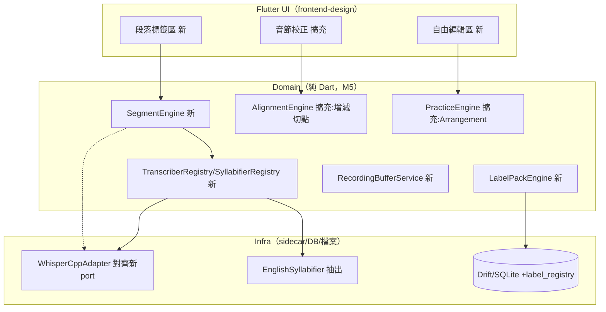
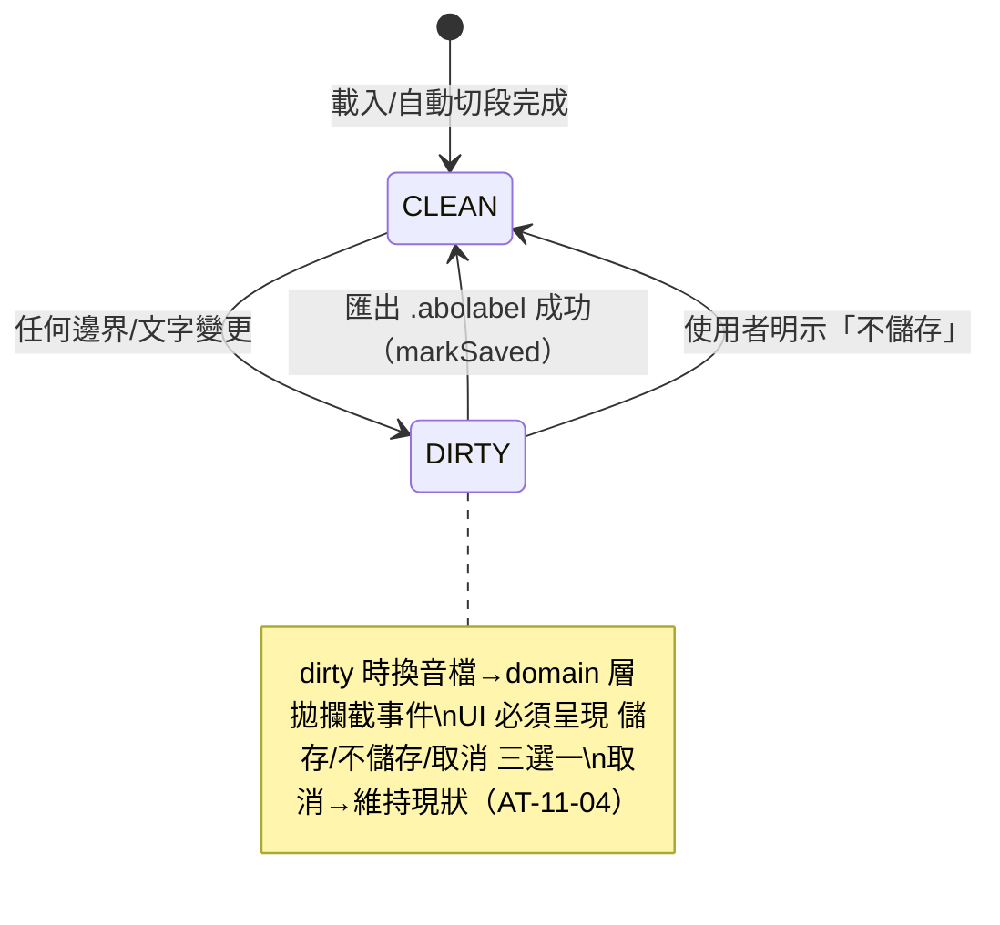
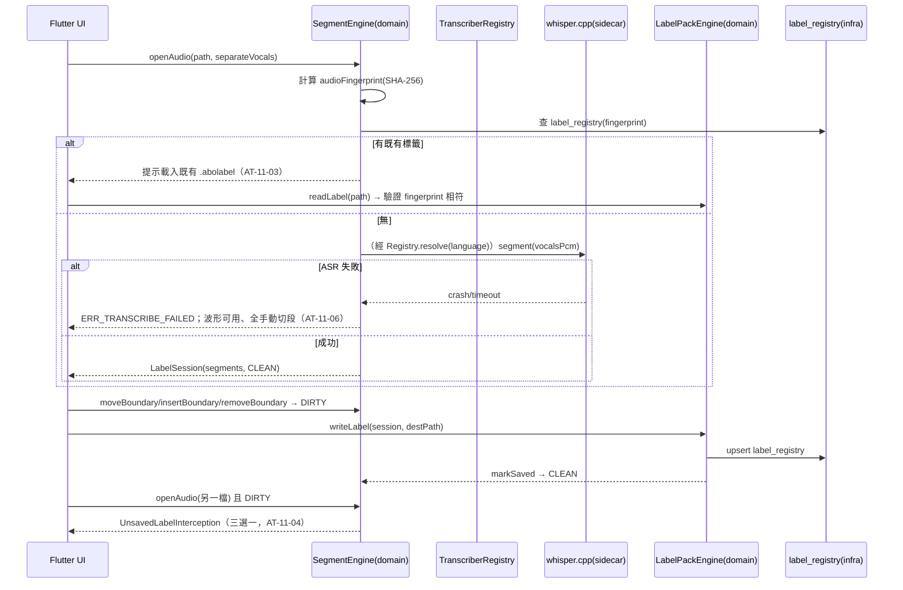
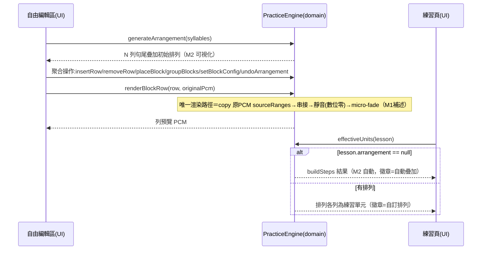

# Syllable Repeater macOS v1.1 — 後端（Domain Layer）技術方案設計（增量）

> 本檔為 **v1 增量設計**：v1 backend-design（`../../syllable-practice-macos-v1_20260704/design/backend-design.md`）之 §1～§6 全部繼續有效；本檔只寫 v1.1 新增與變更，介面編號從 **20** 續編、錯誤碼於 §3.2.8 增補。無伺服器簡化路徑（同 v1）：無 HTTP 介面，「對外介面＝Domain 公開 API」。

## 1. 背景與目標

### 1.1 背景

v1 已交付單句音檔的「匯入對齊→校正→句尾疊加→匯出→比對→進度」全鏈路。v1.1 需求成稿（REQ-10～REQ-20）擴充三個方向：**多句音檔的段落標籤**（整首歌切句選句）、**練習的自主編排**（切點增減＋積木式自由排列）、**架構前瞻**（ASR 與音節切分雙抽層打通多語言基礎）。

### 1.2 目標

- REQ-11：段落自動切句＋手動微調＋`.abolabel` 可攜標籤檔（讀寫、指紋比對、未儲存攔截）。
- REQ-12/13：單句分析入口整合；切點增減（合併/拆分/改字）且音節總數即當時值（M11）。
- REQ-15/16：`PracticeArrangement` 積木編排模型與渲染（M1 補述路徑）；自動疊加預設可被覆蓋（M12）。
- REQ-17：`TranscriberEngine`／`Syllabifier` 雙 port＋語言路由 Registry（M13/M14）；v1.1 僅交付英文切分器與 whisper.cpp adapter，行為與 v1 逐位一致（回歸不變性）。
- REQ-18：`RecordingBuffer` 暫存回聽（M10 補述三保證）。
- REQ-19/20：顯示模式偏好持久化；譯文編輯入口搬移（Domain 不變，僅前端）。

### 1.3 約束

- v1 核心 M1～M10 不可動；v1.1 新增 M11～M14 與 M1/M10 補述（requirement §2.5）。
- 七決策 D1～D7：TTS 撤回（D1）、段落切句跑分離後人聲軌（D2）、雙抽層（D3）、串接白名單（D4）、預設可覆蓋（D5）、暫存例外（D6）、僅本地 ASR（D7）。
- guardrails v1.1 matrix #38～#50：本設計為 #39～#49 的 API 簽名與落點依據。
- Non-scope 10～13：TTS 永不、線上 ASR API 不串、跨 Lesson 拼接不做、標籤單層不巢狀。

### 1.4 參考檔案

- 主需求：`../requirement/requirement.md`（v1.1 定稿 2026-07-12）。
- v1 設計：`../../syllable-practice-macos-v1_20260704/design/backend-design.md`（介面 1–19、錯誤碼 19 個、ER、狀態機）。
- guardrails：`../guardrails/hard-limits-matrix.md`（#38–#50）。

### 1.5 路徑與設定類約定（既有增量）

| 類別 | 值 | 新/既有 |
|---|---|---|
| `.abolabel` 標籤檔 | 使用者自選路徑（file picker），格式 zip+JSON（同 `.abopack` 家族） | 新 |
| 標籤庫索引 | SQLite `label_registry` 表（見 §3.1.2），記音檔指紋→最後已知 `.abolabel` 路徑 | 新 |
| 錄音暫存目錄 | `<App 暫存目錄>/recording_buffer/`（`getTemporaryDirectory()` 之下；程式層路徑白名單，唯一可寫處） | 新 |
| 顯示模式偏好 | `app_settings` key `display.transcriptMode.<lessonId>`（既有表，新 key 樣式） | 既有表新 key |
| Arrangement 持久化 | `.abopack` 內 `manifest.json` 之 `arrangement` 欄（schemaVersion 升 2，向後相容：無此欄＝無自訂排列） | 既有檔新欄 |
| sidecar 路徑 | 沿用 v1 `SidecarPaths`（dev/.local-tools、release/bundle）；新 ASR 引擎進同一 staging 機制 | 既有 |

## 2. 技術方案

### 2.1 架構設計（既有增量）

現狀（v1）：Flutter UI → Domain（純 Dart 引擎）→ Infra（sidecar wrapper／Drift）。**本期變更邊界**：



**選型理由（conatus 固定句式）**：因為核心要求 M13「換引擎不改 Domain」、M14「語言查無即拒」，所以把 v1 的 `AnalysisTranscriber` 升級為帶語言自述的 `TranscriberEngine` port＋Registry 路由；因為核心要求 M1「逐 sample 原音」且使用動機要求「積木自由排列」，所以 `PracticeBlock` 型別上只存 `sourceRanges`（與 v1 `PracticeStep` 同手法）——結構上不存在生成音訊的位置。

### 2.2 技術選型（既有增量）

全部沿用 v1（Dart/Drift/SQLite/zip+JSON/Process.start sidecar）。唯一新增決策：**段落切句演算法**＝whisper.cpp 既有 segment 級時間戳直用（v1 parser 已收到但未讀出，成本最低），輔以「相鄰 segment 間靜音 ≥800ms 則視為段落邊界」的合併規則；不引入新 sidecar。`[需與產品確認]` 已列 requirement Q1，屬「允許變動」，實測不佳可換 VAD（語音活動偵測）方案而不動 port。

### 2.3 模組設計（本期涉及）

| 模組 | 職責 | 新/擴充 | 依賴 |
|---|---|---|---|
| `SegmentEngine` | 段落偵測、Segment 邊界移動/插入/刪除、未儲存 dirty 追蹤 | 新 | TranscriberEngine（經 Registry）、FFmpeg（經既有 pipeline） |
| `LabelPackEngine` | `.abolabel` 讀寫、指紋比對、schema 驗證 | 新 | AtomicFileIo（既有） |
| `AlignmentEngine` | ＋`removeBoundary`/`insertBoundary`/`updateSyllableText`（v1 已有 `updateSyllableBoundary`） | 擴充 | — |
| `PracticeEngine` | ＋`generateArrangement`/Arrangement 聚合操作/`renderBlock`/`effectiveUnits`（M12 判定） | 擴充 | — |
| `TranscriberRegistry`/`SyllabifierRegistry` | 依 language 路由；查無→`ERR_LANGUAGE_UNSUPPORTED` | 新 | port 定義 |
| `RecordingBufferService` | 暫存寫入/清單/刪除/TTL 清掃/啟動清空 | 新 | 路徑白名單（暫存目錄） |
| `EnglishSyllabifier` | 從 `alignment_engine.dart` 抽出 CMUdict＋母音團 fallback，包成 `Syllabifier` 實作 | 抽出重構 | CMUdict loader（既有） |

## 3. 詳細設計

### 3.1 模型設計

#### 3.1.1 領域模型（新增/變更）

**實體**

- **Segment**（新）：`{ id: String, startMs: int, endMs: int, text: String, language: String, confidence: double, userAdjusted: bool }`；構造驗證 `startMs < endMs`。
- **LabelSession**（新，聚合根）：一個音檔的標籤工作階段。屬性：`audioFingerprint: String`（SHA-256）、`audioDurationMs: int`、`segments: List<Segment>`、`dirty: bool`。行為：`moveBoundary(i, ms)`（不可跨相鄰、吸附零交越）、`insertBoundary(ms)`（距既有 <500ms 拒絕——段落級間距，比音節級 50ms 寬）、`removeBoundary(i)`（相鄰合併，文字串接）、`markSaved()`。不變式：segments 單調遞增、互不重疊、全落在 `[0, audioDurationMs]`。
- **Lesson**（變更）：＋`language: String`（預設 `'en'`；讀舊檔無此欄補 `'en'`，AT-17-04）＋`arrangement: PracticeArrangement?`（null＝無自訂排列，M12 判定鍵）。

**值物件（新增）**

- **PracticeBlock**：`{ blocks 內容: List<Syllable>, sourceRanges: List<TimeRange>, repeatN: int（1–10，預設 3）, silenceFactor: double（0–5，預設 2.0）, isGrouped: bool }`；靜音長度＝`sourceRanges 總長 × silenceFactor`（M3 自訂軌）。構造 assertion 驗證範圍（AT-15-06 兩側）。
- **PracticeRow**：`{ index: int, blocks: List<PracticeBlock> }`——自由編輯區的一個長條次區域。
- **PracticeArrangement**（聚合於 Lesson 內）：`{ lessonId: String, rows: List<PracticeRow>, staleFlag: bool, updatedAt }`——**型別上綁定單一 lessonId，block 無跨檔參照欄位**（Non-scope 12／guardrails #47 結構防線）；`staleFlag` 由音節總數變更事件置 true（AT-15-08）。
- **RecordingBufferEntry**：`{ attemptContext: String, pcmPath: String, createdAt: DateTime, ttl: Duration }`——`pcmPath` 建構時驗證必在暫存白名單目錄下，否則拋例外（guardrails #43）。
- **TranscriptDisplayMode**：enum `{ transcript, transcriptWithTranslation, translationOnly, hidden }`。

**port（Domain 定義，M5/M13）**

```dart
// 伪程式碼——僅表達契約，非可執行程式碼
abstract interface class TranscriberEngine {
  String get engineName;            // 'whisper.cpp'
  Set<String> get supportedLanguages;  // {'en'}
  // 注意：契約中沒有 URL/endpoint 欄位——型別層排除線上 ASR（D7，guardrails #46）
  Future<List<Word>> transcribe(Pcm pcm, {required String language, String? transcript});
  Future<List<Segment>> segment(Pcm pcm, {required String language});  // v1.1 新增能力
}
abstract interface class Syllabifier {
  Set<String> get supportedLanguages;
  SyllabifyResult syllabify(Word word, {required String language}); // 音節數+切分+needsReview
}
```

- **TranscriberRegistry / SyllabifierRegistry**：`resolve(language)` 查無→拋 `ERR_LANGUAGE_UNSUPPORTED`（附 `registeredLanguages` 清單）；**兩表皆有該語言才放行建課件**（M14，AT-17-02/03）。

#### 3.1.2 資料模型（增量）

**修改腳本**：`packages/infra/lib/db/schema/V3__v11_label_registry.sql`

```sql
-- V3：REQ-11 標籤庫索引（重匯入提醒依據）
CREATE TABLE IF NOT EXISTS label_registry (
    audio_fingerprint TEXT PRIMARY KEY,   -- 音檔 SHA-256
    label_path TEXT NOT NULL,             -- .abolabel 最後已知路徑
    segment_count INTEGER NOT NULL,
    updated_at INTEGER NOT NULL           -- epoch ms（UTC）
);
-- 注意：本表無音訊欄位、無錄音欄位（M10 結構防線一致性；db_schema_test 增補斷言）
```

`lesson_registry` 不改（language 存於 pack JSON，registry 只是索引）。**RecordingBuffer 不建表**——結構上不可能持久化（guardrails #43 最硬防線）。

**檔案格式**

- `.abolabel`（新）：zip 內含 `label.json`——`{ schemaVersion: 1, audioFingerprint, audioDurationMs, language, separateVocals: bool, segments: [{id, startMs, endMs, text, userAdjusted}] }`（`separateVocals`＝當時人聲分離開關，重載不重跑分離——O2 使用者 2026-07-12 定案）；讀取全檔驗證後才套用，損毀→`ERR_LABEL_CORRUPTED` 零副作用（同 v1 pack 手法，AT-07-03 同款）。
- `.abopack` `manifest.json`：schemaVersion 1→**2**；＋`lesson.language`（缺省補 `'en'`）＋`lesson.arrangement`（可 null）。v2 讀 v1 檔＝相容；v1 讀 v2 檔＝拒絕並提示升級（schemaVersion 檢查既有機制）。

#### 3.1.3 狀態機（新增）

**LabelSession dirty 狀態機（REQ-11 未儲存攔截，guardrails #48）**



**Arrangement 過期旗標**：音節總數變更（REQ-13 增減）→ `staleFlag=true`；使用者「重新一鍵生成」或明示保留→清旗標。不自動重排（AT-15-08）。

### 3.2 功能設計

> 介面編號續 v1（1–19），自 **20** 起。錯誤以 `DomainException(code, message)` 拋出，新增碼見 §3.2.8 增補表。

#### 3.2.1 段落標籤模組（SegmentEngine / LabelPackEngine）｜REQ-11

**功能時序圖**：



**對外介面**：

##### 介面 20：`SegmentEngine.openAudio`
- **簽名**：`Future<LabelOpenResult> openAudio(String path, {bool separateVocals = true, String language = 'en'})`
- **輸入**：

| 欄位 | 型別 | 必填 | 說明 |
|------|------|------|------|
| `path` | `String` | 是 | 音檔路徑（格式/時長驗證沿用 v1 介面 1） |
| `separateVocals` | `bool` | 否（預設 true） | D2：切句預設跑分離後人聲軌；demucs 未就緒降級原音（沿用 v1 降級語意） |
| `language` | `String` | 否（預設 en） | M14：先過雙 Registry 檢查 |

- **輸出（LabelOpenResult）**：

| 欄位 | 型別 | 說明 |
|------|------|------|
| `session` | `LabelSession` | 含 segments（自動切段或載入之標籤） |
| `existingLabelPath` | `String?` | 非 null＝找到既有標籤檔，UI 需提示 |
| `peaks` | `List<double>` | 全檔波形資料（沿用 v1 peaks 快取） |

- **例外**：`ERR_LANGUAGE_UNSUPPORTED`（M14）／`ERR_UNSUPPORTED_FORMAT`／`ERR_FILE_TOO_LONG`／`ERR_DECODE_FAILED`（沿用）；`ERR_TRANSCRIBE_FAILED` 時 session 仍回傳（segments 空、全手動）。
- **冪等**：同檔重開＝重算指紋命中索引，冪等。

##### 介面 21：`LabelSession` 聚合操作（Domain 方法，非跨模組介面）
- `moveBoundary(int index, int newMs)`：開區間驗證＋零交越吸附（沿用 v1 介面 5 手法）；違反→`ERR_BOUNDARY_INVALID`。
- `insertBoundary(int atMs)`：距既有邊界 <500ms→`ERR_SEGMENT_TOO_CLOSE`。
- `removeBoundary(int index)`：相鄰段合併（文字以空白串接）；僅剩 1 段時拒絕。
- 全部操作置 `dirty=true` 並寫 undo 歷史（沿用 v1 undo 手法）。

##### 介面 22：`LabelPackEngine.writeLabel` / 介面 23：`readLabel`
- **簽名**：`Future<String> writeLabel(LabelSession s, String destPath)`；`Future<LabelSession> readLabel(String path, {required String expectedFingerprint})`
- **writeLabel 行為**：temp→原子搬移（無半成品）；成功後 upsert `label_registry`＋`markSaved()`。
- **readLabel 例外**：schema/欄位驗證失敗→`ERR_LABEL_CORRUPTED`（零副作用）；`audioFingerprint ≠ expectedFingerprint`→`ERR_LABEL_FINGERPRINT_MISMATCH`（明確提示非同一音檔）。

#### 3.2.2 切點增減（AlignmentEngine 擴充）｜REQ-13（★M11 防線）

**對外介面**：

##### 介面 24：`AlignmentEngine.removeBoundary`
- **簽名**：`AlignmentResult removeBoundary(AlignmentResult r, int boundaryIndex)`
- **行為**：合併左右音節（文字空白串接、TimeRange 取聯集、`needsReview=true`）；音節總數 −1；僅剩 1 音節時拒絕→`ERR_SYLLABLE_MIN_COUNT`（AT-13-05）。
- **輸出**：新 `AlignmentResult`（不可變資料結構，undo 靠保留舊值——沿用 v1 手法）。

##### 介面 25：`AlignmentEngine.insertBoundary`
- **簽名**：`AlignmentResult insertBoundary(AlignmentResult r, int syllableIndex, int atMs)`
- **行為**：`atMs` 吸附最近零交越（±10ms 窗，沿用 v1 決策）；距該音節兩端或任一既有切點 <50ms→`ERR_BOUNDARY_TOO_CLOSE`（AT-13-06 兩側）；拆分後後半 `text=''`＋`needsReview=true`（AT-13-02）；總數 +1。

##### 介面 26：`AlignmentEngine.updateSyllableText`
- **簽名**：`AlignmentResult updateSyllableText(AlignmentResult r, int index, String newText)`
- **行為**：覆蓋顯示文字；原辨識文字保留於 `originalText` 佐證欄（首次編輯時寫入）；空字串允許暫存並強制 `needsReview=true`（REQ-13 例外條款）。

**M11 樞紐**：上述操作後 `syllables.length` 即為後續 `buildSteps`／統計的唯一輸入——v1 介面 6 `buildSteps(syllables, repeatN)` 簽名**不變**，步數自然＝當時值（AT-13-07）。變更事件同時觸發 Arrangement `staleFlag`（§3.1.3）。

#### 3.2.3 自由編排（PracticeEngine 擴充）｜REQ-15、REQ-16（★M1 補述/M12 防線）

**功能時序圖**：



**對外介面**：

##### 介面 27：`PracticeEngine.generateArrangement`
- **簽名**：`PracticeArrangement generateArrangement(List<Syllable> syllables)`
- **行為**：N＝當時音節總數（M11）；第 i 列預填句尾數來 i 個音節之 blocks（每塊預設 `repeatN=3, silenceFactor=2.0`）——即 M2 步驟表的可視化（AT-15-01）。

##### 介面 28：`PracticeArrangement` 聚合操作
- `insertRow(atIndex)`／`removeRow(index)`／`placeBlock(rowIndex, position, syllableRef)`（可重複放同一音節，AT-15-02）／`moveBlock(...)`／`groupBlocks(rowIndex, fromPos, toPos)`（相鄰才可圈組）／`ungroup(...)`／`setBlockConfig(rowIndex, blockPos, {repeatN?, silenceFactor?})`（範圍驗證→`ERR_BLOCK_CONFIG_OUT_OF_RANGE`，AT-15-06）。
- **獨立撤銷**：Arrangement 專屬 undo 堆疊，與 AlignmentResult 的校正 undo 完全分離（AT-15-03）。

##### 介面 29：`PracticeEngine.renderBlockRow`
- **簽名**：`Future<Pcm> renderBlockRow(PracticeRow row, Pcm originalPcm)`
- **行為（M1 補述唯一路徑）**：對每個 block：copy `sourceRanges` PCM→串接→重複 `repeatN` 次→塊間插靜音（`sourceRanges 總長 × silenceFactor`，數位零 sample）→端點零交越/≤10ms micro-fade。**無任何生成分支**；跨 lessonId 的 block 在型別層就不存在（§3.1.1）。播放中排列被改→取消本次渲染或以舊排列播完（AT-15-07）。

##### 介面 30：`PracticeEngine.effectiveUnits`（★M12 判定唯一入口）
- **簽名**：`PracticeUnits effectiveUnits(Lesson lesson, int repeatN)`
- **輸出**：

| 欄位 | 型別 | 說明 |
|------|------|------|
| `mode` | `enum {auto, custom}` | `lesson.arrangement == null → auto` |
| `units` | `List<PracticeUnit>` | auto＝`buildSteps` 逐步包裝；custom＝排列各列 |
| `stale` | `bool` | 排列過期旗標透傳（UI 顯示提示條） |

- **合併匯出**：auto 模式沿用 v1 介面 8（M3：靜音＝前一步 totalDurationMs，分毫不差 AT-16-05）；custom 模式各塊靜音依 `silenceFactor`（M3 自訂軌）。刪除排列（`lesson.arrangement=null`）→回落 auto（AT-16-03）。

#### 3.2.4 雙抽層與語言路由（Registry）｜REQ-17（★M13/M14 防線）

##### 介面 31：`TranscriberRegistry.resolve` / `SyllabifierRegistry.resolve`
- **簽名**：`TranscriberEngine resolve(String language)`；`Syllabifier resolve(String language)`
- **行為**：查無該語言→`ERR_LANGUAGE_UNSUPPORTED`，例外攜帶 `registeredLanguages: Set<String>` 供 UI 顯示清單（AT-17-02）；建課件入口（介面 1 匯入、介面 20 段落）**先雙查再動工**——缺任一即拒（AT-17-03）。
- **v1.1 出廠註冊**：`WhisperCppTranscriberAdapter`（v1 既有類別對齊新 port，`segment()` 補讀 whisper JSON 的 segment 級 offsets——v1 parser 已收到未讀）＋`EnglishSyllabifier`（自 `alignment_engine.dart:148-163` 抽出，行為逐位不變）。
- **回歸不變性**：金標準例句經新路徑仍 11 音節、時間戳 ±1ms（AT-17-01）；抽層效能劣化 ≤5%（對照 Q10 基準 4.689s）。
- **新引擎上架程序（流程契約，寫進 release checklist）**：adapter 實作→M9 授權審查（引擎＋模型檔）→M4 故障注入→金標準回歸（或該語言等價基準）→Registry 註冊。

#### 3.2.5 錄音暫存（RecordingBufferService）｜REQ-18（★M10 補述防線）

##### 介面 32：`RecordingBufferService.stash`
- **簽名**：`Future<RecordingBufferEntry> stash(Pcm recording, String attemptContext, {Duration ttl = const Duration(minutes: 10)})`（TTL 10 分鐘＝O4 使用者 2026-07-12 定案；**不曝露於設定頁**）
- **前置**：**呼叫本介面即代表該次明示同意**（UI 勾選才呼叫；預設不勾＝不呼叫＝v1 用完即刪路徑分毫不變，AT-18-02）。
- **行為**：寫入暫存白名單目錄（§1.5）；**同一 `attemptContext` 已有暫存→新錄音覆蓋舊檔**（同步驟恆最多 1 筆，AT-18-07）；目錄不可寫→`ERR_BUFFER_STASH_FAILED`，錄音照 v1 規則即刪、主流程不受阻（AT-18-06）。

##### 介面 33：`RecordingBufferService.list` / `play` / `delete` / `purgeContext` / `purgeExpired` / `purgeAll`
- `list()`：現存未過期 entries（TTL 邊界：`createdAt + ttl` 不含，9:59 可播/10:01 已清，AT-18-04）。
- `delete(entry)`：手動逐筆刪除，不必等時限（O4）。
- `purgeContext(attemptContext)`：**切換練習步驟時由 PracticeController 必呼**——前一步驟暫存即刪（O4，AT-18-07）。
- `purgeExpired()`：惰性＋定時雙觸發；`purgeAll()`：**App 啟動時必呼叫**（重啟即清空，AT-18-05；兼孤兒清掃）。
- **三保證落點**：①同意＝呼叫語意②TTL＋切步即清＋啟動清空③無 DB 表＋pack/progress byte 掃描測試沿用（結構上不可能持久化）。

#### 3.2.6 顯示模式偏好｜REQ-19

##### 介面 34：`SettingsService.transcriptDisplayMode`（讀寫）
- **簽名**：`Future<TranscriptDisplayMode> getTranscriptMode(String lessonId)`；`Future<void> setTranscriptMode(String lessonId, TranscriptDisplayMode m)`
- **儲存**：`app_settings` key `display.transcriptMode.<lessonId>`（§1.5）；**不進 `.abopack`**（AT-19-04 顯示偏好不隨課件外流）；預設 `transcript`。

#### 3.2.8 錯誤碼總表增補（三同步：本表→errors.dart→error_messages→測試）

| 錯誤碼（新增） | 觸發模組 | 典型文案（zh-TW） | 語意 |
|--------|----------|-------------------|------|
| `ERR_LANGUAGE_UNSUPPORTED` | Registry | 「不支援「{語言}」：缺少{辨識引擎/音節切分器}。目前支援：{清單}」 | 阻斷建課件（M14） |
| `ERR_LABEL_CORRUPTED` | LabelPackEngine | 「標籤檔損毀，未載入任何內容」 | 阻斷、零副作用 |
| `ERR_LABEL_FINGERPRINT_MISMATCH` | LabelPackEngine | 「此標籤檔屬於另一個音檔」 | 阻斷、可改選 |
| `ERR_SEGMENT_TOO_CLOSE` | SegmentEngine | 「距離相鄰標籤線太近（至少 0.5 秒）」 | UI 拒絕 |
| `ERR_BOUNDARY_TOO_CLOSE` | AlignmentEngine | 「距離相鄰切點太近（至少 50 毫秒）」 | UI 拒絕（AT-13-06） |
| `ERR_SYLLABLE_MIN_COUNT` | AlignmentEngine | 「至少須保留 1 個音節」 | UI 拒絕（AT-13-05） |
| `ERR_BLOCK_CONFIG_OUT_OF_RANGE` | PracticeEngine | 「重複次數須為 1–10；靜音倍數須為 0–5」 | 阻斷（AT-15-06） |
| `ERR_BUFFER_STASH_FAILED` | RecordingBufferService | 「暫存失敗，本次錄音已依預設刪除」 | 不阻斷主流程（AT-18-06） |

v1 既有 19 碼全部沿用不動。

## 4. 穩定性&安全評估（增量）

### 4.1 系統穩定性
沿用 v1（重入鎖、sidecar 降級、逾時）。新增：段落切段任務與單句分析任務**共用同一重入鎖語意**（`ERR_ANALYSIS_IN_PROGRESS`，AT-11-08）；列預覽渲染輕量（記憶體內 PCM copy），無需鎖。

### 4.2 業務穩定性
- `.abolabel` 寫入走 temp→原子搬移；讀取全檔驗證再套用（零副作用）。
- 暫存目錄啟動清掃＝孤兒防線（借鏡 qwenasr pidfile 手法，落在檔案而非行程）。

### 4.4 核心防線對照表（v1.1 新增條款逐條；v1 M1~M10 對照表繼續有效）

| 核心條目 | 程式內真實防線 | 對應測試 | 交付後看守（意向初稿） | guardrails |
|----------|----------------|----------|------------------------|-----------|
| M1 補述（串接白名單） | `renderBlockRow` 唯一路徑＝copy+串接+數位零靜音；`PracticeBlock.sourceRanges` 型別上只存 TimeRange | AT-15-09 逐 sample 比對 | CI 回歸測試常駐 | #42 |
| M10 補述（暫存三保證） | stash＝同意語意；TTL＋`purgeAll()` 啟動必呼；無 DB 表＋路徑白名單建構驗證 | AT-18-02~06 | CI 測試＋巡檢項：暫存目錄無過期殘留 | #43 |
| M11 總數即當時值 | `buildSteps(syllables,…)` 簽名不變，輸入即當時清單；增減操作回傳新 AlignmentResult | AT-13-07 | CI 單元測試 | #39 |
| M12 排列覆蓋 | `effectiveUnits` 唯一判定入口（null→auto）；刪排列即回落 | AT-16-01~04 | CI 三態轉換測試 | #40 |
| M13 雙抽層 | port 定義於 Domain；Registry 注入；domain_purity_test 擴充覆蓋新 port 檔 | AT-17-01/06 | CI 依賴方向檢查 | #41 |
| M14 語言拒絕 | `resolve()` 查無即拋；建課件入口先雙查；無英文 fallback 分支 | AT-17-02/03 | CI 單元測試 | #44 |
| D1 TTS 永不 | 分析入口無生成分支；pubspec TTS 黑名單掃描（policy 測試） | AT-12-03 | CI pubspec 掃描 | #45 |
| D7 僅本地 ASR | port 契約無 URL 欄位；Transcriber 鏈路 domain 檔禁網路 import（purity 測試擴充） | 依賴方向檢查 | CI | #46 |
| Non-scope 12 跨檔拼接 | Arrangement 綁單一 lessonId；block 無跨檔參照欄位 | 建構子 assertion 測試 | CI | #47 |
| REQ-11 標籤保護 | LabelSession dirty 狀態機；dirty 換檔拋攔截事件 | AT-11-04 widget 測試 | CI | #48 |
| .abolabel 版本 | schemaVersion 必填＋全檔驗證＋指紋比對 | round-trip/corrupt/mismatch 測試 | CI | #49 |

**「系統不可接受」新增條目逐條確認**：排列繞過 M1→渲染唯一路徑＋型別排除；暫存進持久檔→無表無欄位＋掃描測試；語言默默 fallback→resolve 無 fallback 分支；引擎未過審上架→上架程序過 CT-09 gate；標籤靜默丟棄→dirty 狀態機強制三選一。

## 5. 風險評估（增量）

| 風險 | 應對 |
|---|---|
| whisper segment 級切句對歌曲精度不足（副歌重疊、拖長音） | D2 預設走分離後人聲軌；800ms 靜音合併規則可調（允許變動）；手動微調為一等公民兜底；實測不佳換 VAD 不動 port（Q1） |
| `.abopack` schemaVersion 升 2 造成 v1 舊 App 不能讀新檔 | 預期行為（明確拒絕優於錯讀）；README 註記；新 App 讀舊檔完全相容 |
| 抽層重構觸碰 v1 已綠測試 | 回歸不變性測試先行（AT-17-01 金標準 ±1ms）；EnglishSyllabifier 抽出採「先包舊碼再搬移」兩步走 |
| Arrangement undo 與校正 undo 使用者混淆 | 兩區各自獨立撤銷按鈕＋快捷鍵作用域限定（前端設計處理） |

## 6. 開放問題

| # | 問題 | 影響 | 待決 |
|---|---|---|---|
| O1 | 段落切句 800ms 靜音合併閾值（Q1） | 切句品質 | 實作時實測定案（允許變動） |
| ~~O2~~ | ~~`.abolabel` 是否記錄人聲分離開關狀態~~ | — | **已定案**（2026-07-12 使用者）：記錄 `separateVocals: bool`（§3.1.2） |
| ~~O3~~ | ~~AI 自動譯文入口是否隨手動譯文搬移~~ | — | **已定案**（2026-07-12 使用者）：一併搬移（F2） |
| ~~O4~~ | ~~暫存 TTL 曝露設定頁？~~ | — | **已定案**（2026-07-12 使用者）：TTL 10 分鐘、不曝露；＋手動逐筆刪除＋切步即清（介面 32/33） |
