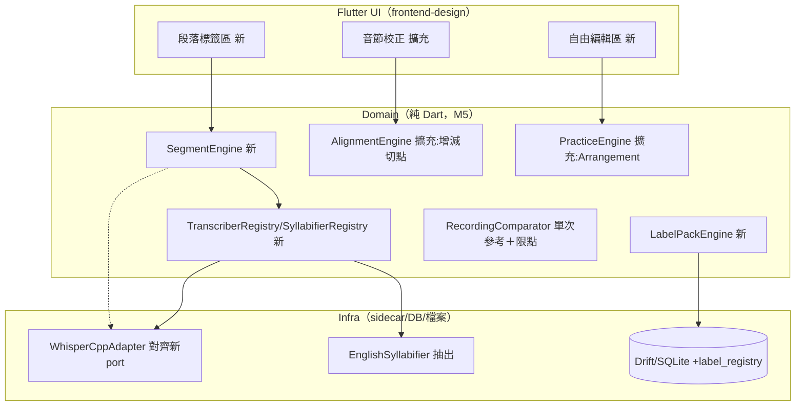
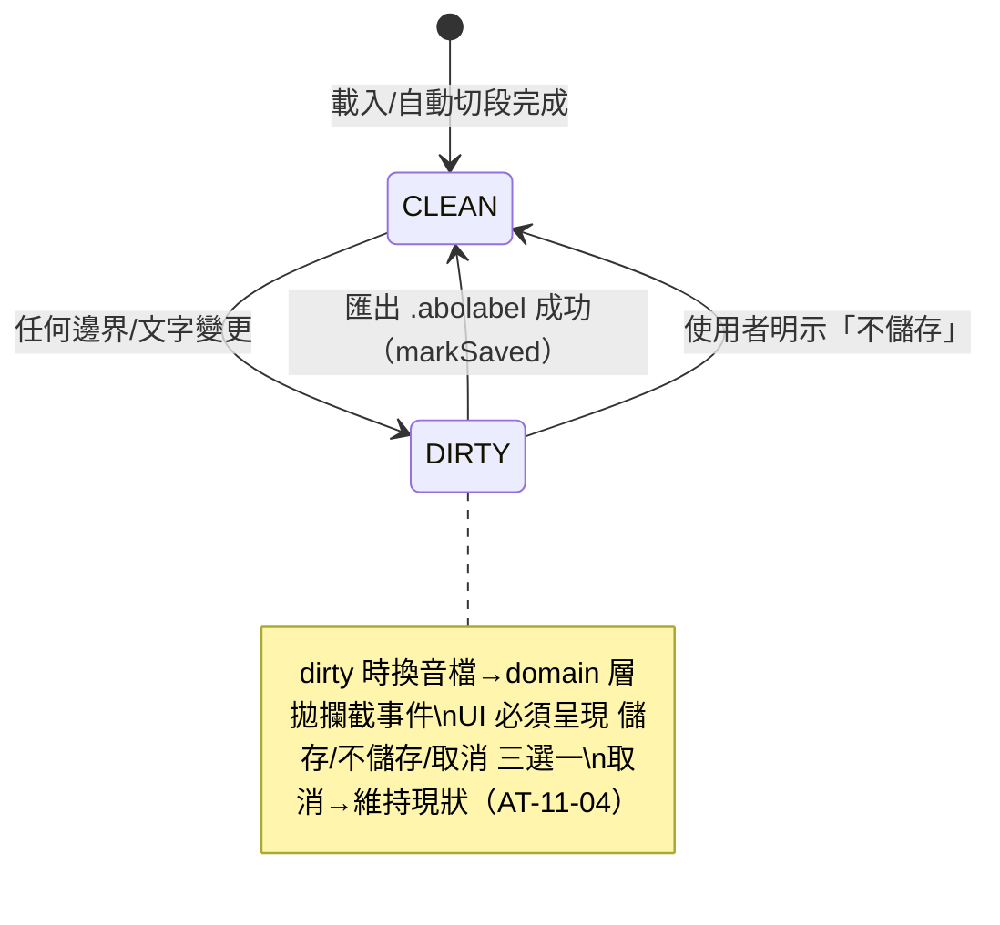
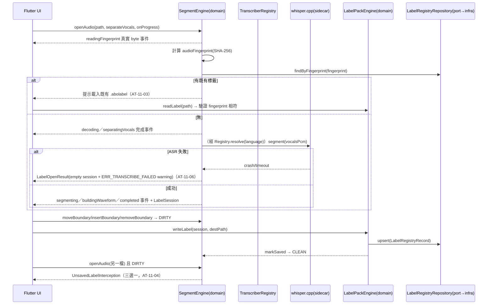
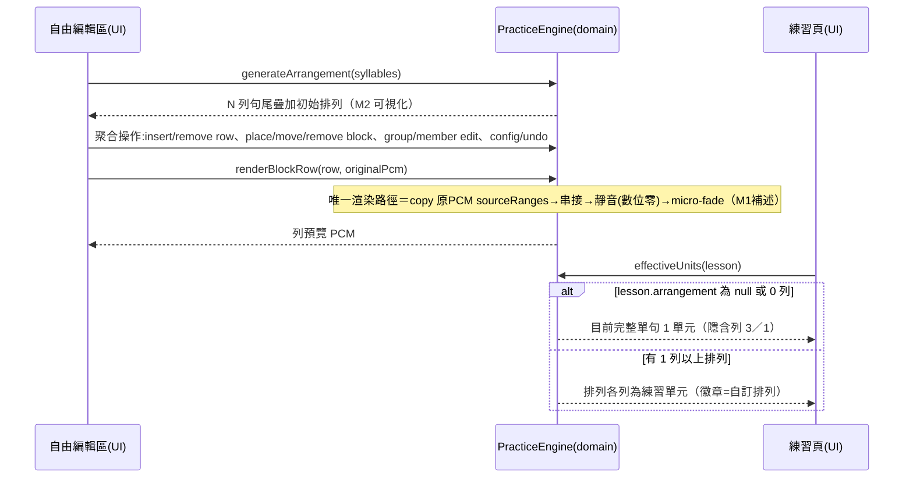

# Syllable Repeater macOS v1.1 — 後端（Domain Layer）技術方案設計（增量）

> 本檔為 **v1 增量設計**：v1 backend-design（`../../syllable-practice-macos-v1_20260704/design/backend-design.md`）之 §1～§6 全部繼續有效；本檔只寫 v1.1 新增與變更，介面編號從 **20** 續編、錯誤碼於 §3.2.8 增補。無伺服器簡化路徑（同 v1）：無 HTTP 介面，「對外介面＝Domain 公開 API」。

## 1. 背景與目標

### 1.1 背景

v1 已交付單句音檔的「匯入對齊→校正→句尾疊加→匯出→比對→進度」全鏈路。v1.1 需求成稿（REQ-10～REQ-21）擴充四個方向：**多句音檔的段落標籤**、**練習自主編排**、**ASR／切分抽層**、**`.abopack v3` 複合封包與四層匯出**。

### 1.2 目標

- REQ-11：段落自動切句＋手動微調＋`.abolabel` 可攜標籤檔（讀寫、指紋比對、未儲存攔截）。
- REQ-12/13：單句分析入口整合；切點增減（合併/拆分/改字）且音節總數即當時值（M11）。
- REQ-15/16：`PracticeArrangement` 積木編排模型與渲染（M1 補述路徑）；自動疊加預設可被覆蓋（M12）。
- REQ-17：`TranscriberEngine`／`Syllabifier` 雙 port＋語言路由 Registry（M13/M14）；v1.1 僅交付英文切分器與 whisper.cpp adapter，行為與 v1 逐位一致（回歸不變性）。
- REQ-18（r7）：單次原音參考比對、背景 isolate 與圖表限點；`RecordingBuffer` 整體移除，但允許目前單元最近一次 PCM 僅存 UI 記憶體供回放，來源與播放 temp 均 finally 清除。
- REQ-21（r6）：`CourseBundle`／`PracticeExportPlan`，`.abopack` schemaVersion 3 與 v1/v2 相容讀取。
- REQ-19/20：顯示模式偏好持久化；譯文編輯入口搬移（Domain 不變，僅前端）。
- REQ-11/12（r5）：以真實 byte／階段事件驅動段落開啟與單句匯入進度，通過實際驗證後才 ready（M15）。
- REQ-14～16（r5）：時間範圍重疊選取、草稿 Lesson 穩定身分、直接拖曳／同列成組與 3／5 設定重置；整組 repeat 語意鎖定。
- REQ-18/19（r5）：macOS 錄音→播放工作階段交接；hidden 模式的所有文字衍生顯示一併遮蔽。

### 1.3 約束

- v1 核心 M1～M10 不可動；v1.1 新增 M11～M15 與 M1/M10 補述（requirement §2.5）。
- 七決策 D1～D7：TTS 撤回（D1）、段落切句跑分離後人聲軌（D2）、雙抽層（D3）、串接白名單（D4）、預設可覆蓋（D5）、暫存例外（D6）、僅本地 ASR（D7）。
- guardrails v1.1 matrix #38～#50：本設計為 #39～#49 的 API 簽名與落點依據。
- Non-scope 10～13：TTS 永不、線上 ASR API 不串、跨 Lesson 拼接不做、標籤單層不巢狀。

### 1.4 參考檔案

- 主需求：`../requirement/requirement.md`（v1.1 定稿 2026-07-12）。
- v1 設計：`../../syllable-practice-macos-v1_20260704/design/backend-design.md`（介面 1–19、錯誤碼 19 個、ER、狀態機）。
- guardrails：`../guardrails/hard-limits-matrix.md`（#38–#50）。

### 1.5 路徑與設定類約定（既有增量）

| 類別 | 值 | 新/既有 |
|---|---|---|
| `.abolabel` 標籤檔 | 使用者自選路徑（file picker），格式 zip+JSON（同 `.abopack` 家族） | 新 |
| 標籤庫索引 | SQLite `label_registry` 表（見 §3.1.2），記音檔指紋→最後已知 `.abolabel` 路徑 | 新 |
| 顯示模式偏好 | `.aboprogress` 的 `progress.transcriptDisplayModes.<lessonId>`（個人層快照欄位） | 既有進度檔新欄 |
| 複合課程封包 | `.abopack v3`：必填 originalAudio；可選 labels、sentenceLesson、arrangement、latestProgress | 既有檔升版；v1/v2 可讀 |
| sidecar 路徑 | 沿用 v1 `SidecarPaths`（dev/.local-tools、release/bundle）；新 ASR 引擎進同一 staging 機制 | 既有 |
| 管理式暫存 | OS temp 下每次啟動建立獨立 session 子目錄；作業子目錄由 finally 清理，切課／結束 session 清預覽與解包快取，下次啟動清理已失效舊 session；使用者選定目的地永不列入清理 | 既有 temp 契約收緊 |

## 2. 技術方案

### 2.1 架構設計（既有增量）

現狀（v1）：Flutter UI → Domain（純 Dart 引擎）→ Infra（sidecar wrapper／Drift）。**本期變更邊界**：



**選型理由（conatus 固定句式）**：因為核心要求 M13「換引擎不改 Domain」、M14「語言查無即拒」，所以把 v1 的 `AnalysisTranscriber` 升級為帶語言自述的 `TranscriberEngine` port＋Registry 路由；因為核心要求 M1「逐 sample 原音」且使用動機要求「積木自由排列」，所以 `PracticeBlock` 型別上只存 `sourceRanges`（與 v1 `PracticeStep` 同手法）——結構上不存在生成音訊的位置。

### 2.2 技術選型（既有增量）

全部沿用 v1（Dart/Drift/SQLite/zip+JSON/Process.start sidecar）。唯一新增決策：**段落切句演算法**＝whisper.cpp 既有 segment 級時間戳直用（v1 parser 已收到但未讀出，成本最低），輔以「相鄰 segment 間靜音 ≥800ms 則視為段落邊界」的合併規則；不引入新 sidecar。`[需與產品確認]` 已列 requirement Q1，屬「允許變動」，實測不佳可換 VAD（語音活動偵測）方案而不動 port。

### 2.3 模組設計（本期涉及）

| 模組 | 職責 | 新/擴充 | 依賴 |
|---|---|---|---|
| `SegmentEngine` | 段落偵測、真實開啟階段事件、Segment 邊界移動/插入/刪除、未儲存 dirty 追蹤 | 擴充 | TranscriberEngine（經 Registry）、FFmpeg（經既有 pipeline）、LabelRegistryRepository（Domain port） |
| `LabelPackEngine` | `.abolabel` 讀寫、指紋比對、schema 驗證 | 新 | AtomicFileIo（既有）、LabelRegistryRepository（Domain port）、Clock |
| `AlignmentEngine` | ＋`removeBoundary`/`insertBoundary`/`updateSyllableText`（v1 已有 `updateSyllableBoundary`） | 擴充 | — |
| `PracticeEngine` | ＋`generateArrangement`/Arrangement 聚合操作/`renderBlock`/`effectiveUnits`（M12 判定）；整組 repeat 與 3／5 重置語意 | 擴充 | — |
| `AudioImportReader` | 逐 chunk 讀取音檔並回報真實 byte 進度；完成格式／時長驗證後才產生 ready source | 新 Domain port＋infra adapter | FileIo／AudioDurationProbe |
| `DraftLessonIdentity` | 分析成功建立一次性穩定 lessonId，保存 `.abopack` 沿用同 id | 新協調契約 | IdGenerator（注入） |
| `TranscriberRegistry`/`SyllabifierRegistry` | 依 language 路由；查無→`ERR_LANGUAGE_UNSUPPORTED` | 新 | port 定義 |
| `RecordingComparator` | 建立不含 repeat／silence 的單次原音參考、pitch／DTW 比對、每條波形限 1000 點 | 擴充 | PracticeEngine、背景 isolate adapter |
| `CourseBundleEngine` | `.abopack v3` 驗證、v1/v2 相容讀取、可選區塊與 portable projection | 新 | AtomicFileIo、ArchiveCodec |
| `PracticeExportPlanner` | 四層選擇轉成 immutable `PracticeExportPlan`；驗證 fingerprint／range／lessonId | 新 | PracticeEngine |
| `ManagedTempSession` | 建立 session／operation 子目錄、清除本次快取與安全清理舊 session；不得接收使用者目的地 | 新 infra 協調器 | AtomicFileIo／dart:io（僅 infra） |
| `EnglishSyllabifier` | 從 `alignment_engine.dart` 抽出 CMUdict＋母音團 fallback，包成 `Syllabifier` 實作 | 抽出重構 | CMUdict loader（既有） |

## 3. 詳細設計

### 3.1 模型設計

#### 3.1.1 領域模型（新增/變更）

**實體**

- **Segment**（擴充）：`{ id, startMs, endMs, text, language, confidence, userAdjusted, disposition: kept|discarded, note? }`；未標記範圍不建 Segment。構造驗證 `startMs < endMs`。
- **LabelSession**（聚合根）：`{ audioFingerprint, audioDurationMs, regions: List<Segment>, dirty }`。行為除既有邊界操作外新增 `markKept(TimeRange, text?)`、`markDiscarded(TimeRange, note?)`、`clearDisposition(id)`。kept／discarded 各自單調互不重疊並全落在音檔內；允許未標記間隙。`keptSegments` 是送往分析的唯一投影。
- **Lesson**（變更）：＋`language: String`（預設 `'en'`；讀舊檔無此欄補 `'en'`，AT-17-04）＋`arrangement: PracticeArrangement?`（null＝無自訂排列，M12 判定鍵）。

**值物件（新增）**

- **LabelOpenWarning**：`{ code: String, message: String }`；只表達可降級、仍有有效 `LabelOpenResult` 的警告。v1.1 目前唯一值為 `ERR_TRANSCRIBE_FAILED`（AT-11-06），不可用來包裝必須阻斷的解碼／格式錯誤。
- **LabelOpenProgress**：`{ stage: enum(readingFingerprint, decoding, separatingVocals, segmenting, buildingWaveform, completed), completedUnits: int, totalUnits: int? }`；只有能量測工作量時才計算比例，未知總量的 sidecar 階段只顯示階段、不虛構百分比；事件必須單調且由實際完成點發出（M15）。
- **AudioImportProgress**：`{ stage: enum(readingBytes, validatingFormat, validatingDuration, ready), bytesRead: int, totalBytes: int? }`；`ready` 必須同時代表非空、格式與時長已驗證。
- **PracticeBlock**：`{ syllables, sourceRanges, repeatN: 1–10（預設 1）, silenceFactor: 0–20／0.5 級距（預設 1.0）, isGrouped }`；每輪＝完整積木原音＋原時長×silenceFactor 數位零，最後一輪保留積木靜音。
- **PracticeRow**：`{ index, blocks, repeatN: 1–10（預設 3）, silenceFactor: 0–20／0.5 級距（預設 1.0） }`；整列靜音基準只加總每個擺放 block 的 `sourceDurationMs` 一次，不納入 block repeat／silence，最後一輪不加整列靜音。
- **PracticeArrangement**（聚合於 Lesson 內）：`{ lessonId: String, rows: List<PracticeRow>, staleFlag: bool, updatedAt }`——**型別上綁定單一 lessonId，block 無跨檔參照欄位**（Non-scope 12／guardrails #47 結構防線）；`staleFlag` 由音節總數變更事件置 true（AT-15-08）。`placeBlock` 入口接收但不持久化 `sourceLessonId`，與排列不符時以 `ArgumentError` 拒絕（使用者 2026-07-13 批准的 DFT-06 實作契約）。
- **DraftLessonIdentity**：`{ lessonId: String }`；分析成功時由注入的 `IdGenerator` 建立一次，此後 editor／arrangement／save 全部沿用。不得在保存時另產新 id；不得以 draft 身分跳過 `PracticeArrangement.lessonId` 比對（#53）。
- **AnalysisAudioTracks**：`{ originalPcm, analysisPcm }`；`originalPcm` 永遠為匯入／選取範圍的原始解碼 PCM，`analysisPcm` 可為 Demucs 人聲軌，只能供 ASR／特徵分析。`AnalysisEvent.decodedPcm` 保持相容但語意固定為 original；新增 `analysisPcm` 明示分析軌。
- **CourseBundle**：`{ schemaVersion: 3, originalAudio, labels?, sentenceLesson?, arrangement?, latestProgress? }`。portable projection 只含 sentenceLesson／arrangement／latestProgress；latestProgress 不含 attempt history、錄音、路徑、TranscriptDisplayMode。
- **PracticeExportPlan**：四層選擇解析後的不可變快照：`audioSourceRef, arrangementSnapshot, unitIndexes, rowOverrides`；所有 ref 綁定 `audioFingerprint`／lessonId／TimeRange，構造時拒絕不一致。
- **TranscriptDisplayMode**：enum `{ transcript, transcriptWithTranslation, translationOnly, hidden }`。
- **ProgressSnapshot 顯示偏好欄**：`.aboprogress` 的 `progress.transcriptDisplayModes` 為 `Map<lessonId, TranscriptDisplayMode>`；無該 Lesson 值時預設 `transcript`。此欄隨進度檔完整驗證、匯出與匯入，絕不寫入 `.abopack`。

**port（Domain 定義，M5/M13）**

```dart
// 伪程式碼——僅表達契約，非可執行程式碼
abstract interface class TranscriberEngine {
  String get engineName;            // 'whisper.cpp'
  Set<String> get supportedLanguages;  // {'en'}
  // 注意：契約中沒有 URL/endpoint 欄位——型別層排除線上 ASR（D7，guardrails #46）
  Future<List<Word>> transcribe(Pcm pcm, {required String language, String? transcript});
  Future<List<Segment>> segment(Pcm pcm, {required String language});  // v1.1 新增能力
}
abstract interface class Syllabifier {
  Set<String> get supportedLanguages;
  SyllabifyResult syllabify(Word word, {required String language}); // 音節數+切分+needsReview
}
abstract interface class LabelRegistryRepository {
  Future<LabelRegistryRecord?> findByFingerprint(String audioFingerprint);
  Future<void> upsert(LabelRegistryRecord record);
}
```

- **TranscriberRegistry / SyllabifierRegistry**：`resolve(language)` 查無→拋 `ERR_LANGUAGE_UNSUPPORTED`（附 `registeredLanguages` 清單）；**兩表皆有該語言才放行建課件**（M14，AT-17-02/03）。
- **LabelRegistryRepository**：Domain 只依賴此 port；`LabelRegistryRecord`＝`{ audioFingerprint, labelPath, segmentCount, updatedAt }`。infra 以 Drift adapter 實作查詢／upsert，Domain 不 import Drift、SQLite 或 `dart:io`（OQ-6，使用者 2026-07-13 批准；M5）。

#### 3.1.2 資料模型（增量）

**修改腳本**：`packages/infra/lib/db/schema/V3__v11_label_registry.sql`

```sql
-- V3：REQ-11 標籤庫索引（重匯入提醒依據）
CREATE TABLE IF NOT EXISTS label_registry (
    audio_fingerprint TEXT PRIMARY KEY,   -- 音檔 SHA-256
    label_path TEXT NOT NULL,             -- .abolabel 最後已知路徑
    segment_count INTEGER NOT NULL,
    updated_at INTEGER NOT NULL           -- epoch ms（UTC）
);
-- 注意：本表無音訊欄位、無錄音欄位（M10 結構防線一致性；db_schema_test 增補斷言）
```

`lesson_registry` 不改（language 存於 pack JSON，registry 只是索引）。**RecordingBuffer 類型、service 與資料表皆不存在**；目前單元最近一次 PCM 只屬 UI 記憶體狀態；`attempt`／`audit_log` schema 仍禁止錄音與路徑欄位。

**檔案格式**

- `.abolabel`（新）：zip 內含 `label.json`——`{ schemaVersion: 1, audioFingerprint, audioDurationMs, language, separateVocals: bool, segments: [{id, startMs, endMs, text, userAdjusted}] }`（`separateVocals`＝當時人聲分離開關，重載不重跑分離——O2 使用者 2026-07-12 定案）；讀取全檔驗證後才套用，損毀→`ERR_LABEL_CORRUPTED` 零副作用（同 v1 pack 手法，AT-07-03 同款）。
- `.abopack` `manifest.json`：現行寫出 **schemaVersion 3**。`originalAudio` 必填；`labels`／`sentenceLesson`／`arrangement`／`latestProgress` 可 null。reader 依 1→legacy Lesson、2→Lesson＋Arrangement、3→CourseBundle 路由；不修改來源檔。v3 內任何音訊 ref 必須對上 originalAudio fingerprint 且 range 在界內。

#### 3.1.3 狀態機（新增）

**LabelSession dirty 狀態機（REQ-11 未儲存攔截，guardrails #48）**



**Arrangement 過期旗標**：音節總數變更（REQ-13 增減）→ `staleFlag=true`；使用者「重新一鍵生成」或明示保留→清旗標。不自動重排（AT-15-08）。

### 3.2 功能設計

> 介面編號續 v1（1–19），自 **20** 起。錯誤以 `DomainException(code, message)` 拋出，新增碼見 §3.2.8 增補表。

#### 3.2.1 段落標籤模組（SegmentEngine / LabelPackEngine）｜REQ-11

**功能時序圖**：



**對外介面**：

##### 介面 20：`SegmentEngine.openAudio`
- **簽名**：`Future<LabelOpenResult> openAudio(String path, {bool separateVocals = true, String language = 'en', void Function(LabelOpenProgress event)? onProgress})`
- **輸入**：

| 欄位 | 型別 | 必填 | 說明 |
|------|------|------|------|
| `path` | `String` | 是 | 音檔路徑（格式/時長驗證沿用 v1 介面 1） |
| `separateVocals` | `bool` | 否（預設 true） | D2：切句預設跑分離後人聲軌；demucs 未就緒降級原音（沿用 v1 降級語意） |
| `language` | `String` | 否（預設 en） | M14：先過雙 Registry 檢查 |
| `onProgress` | `LabelOpenProgress callback?` | 否 | M15：由真實讀取／處理完成點回報；不得由 UI 自製百分比 |

Demucs adapter 先以受管 FFmpeg 轉為 44.1kHz PCM WAV，但不指定 `-ac`：立體聲保留雙聲道，單聲道保持 mono。demucs.cpp 可在內部將 mono 映射到兩通道以符合模型形狀，但這不產生新的立體分離線索（AT-18-10）。

- **輸出（LabelOpenResult）**：

| 欄位 | 型別 | 說明 |
|------|------|------|
| `session` | `LabelSession` | 含 kept／discarded regions；`keptSegments` 為可送分析投影 |
| `existingLabelPath` | `String?` | 非 null＝找到既有標籤檔，UI 需提示 |
| `peaks` | `List<double>` | 全檔波形資料（沿用 v1 peaks 快取） |
| `warning` | `LabelOpenWarning?` | 可降級警告；ASR 失敗時為 `{ code: ERR_TRANSCRIBE_FAILED, message }`，成功時為 null |

- **可降級失敗**：ASR crash／timeout 不拋例外；正常回傳 `LabelOpenResult(session: 空 segments, peaks: 已解碼波形, warning: ERR_TRANSCRIBE_FAILED)`，UI 顯示警告後可全手動切段（OQ-5，使用者 2026-07-13 裁決）。
- **例外**：`ERR_LANGUAGE_UNSUPPORTED`（M14）／`ERR_UNSUPPORTED_FORMAT`／`ERR_FILE_TOO_LONG`／`ERR_DECODE_FAILED`（沿用）；只有無法安全產生工作階段的失敗才拋例外。
- **冪等**：同檔重開＝重算指紋命中索引，冪等。
- **進度契約（M15）**：事件順序只允許 `readingFingerprint→decoding→separatingVocals?→segmenting→buildingWaveform→completed`；讀取可用 `completedUnits/totalUnits` 顯示真實比例；sidecar 不能回報內部比例時只顯示當前階段 indeterminate，不得補假數字。錯誤時停在失敗階段，不送 `completed`。

##### 介面 21：`LabelSession` 聚合操作（Domain 方法，非跨模組介面）
- `moveBoundary(int index, int newMs)`：開區間驗證＋零交越吸附（沿用 v1 介面 5 手法）；違反→`ERR_BOUNDARY_INVALID`。
- `insertBoundary(int atMs)`：距既有邊界 <500ms→`ERR_SEGMENT_TOO_CLOSE`。
- `removeBoundary(int index)`：相鄰段合併（文字以空白串接）；僅剩 1 段時拒絕並沿用 `ERR_BOUNDARY_INVALID`（OQ-4，使用者 2026-07-13 裁決；不新增錯誤碼）。
- `markKept(TimeRange range, {String text = ''})`／`markDiscarded(TimeRange range, {String? note})`：驗證界內與同 disposition 不重疊；跨既有區間時以新 range 取代交集部分，留下未覆蓋部分，結果排序且不可變。
- `clearDisposition(String regionId)`：移除該註記，對應範圍回到未標記；不自動併入相鄰區間。
- 全部操作置 `dirty=true` 並寫 undo 歷史（沿用 v1 undo 手法）。

##### 介面 22：`LabelPackEngine.writeLabel` / 介面 23：`readLabel`
- **簽名**：`Future<String> writeLabel(LabelSession s, String destPath)`；`Future<LabelSession> readLabel(String path, {required String expectedFingerprint})`
- **writeLabel 行為**：寫出 schemaVersion 2 的 kept／discarded／note，temp→原子搬移；成功後透過 `LabelRegistryRepository.upsert` 寫入索引＋`markSaved()`。讀 v1 時既有 segments→kept，其餘→未標記。
- **readLabel 例外**：schema/欄位驗證失敗→`ERR_LABEL_CORRUPTED`（零副作用）；`audioFingerprint ≠ expectedFingerprint`→`ERR_LABEL_FINGERPRINT_MISMATCH`（明確提示非同一音檔）。

#### 3.2.2 切點增減（AlignmentEngine 擴充）｜REQ-13（★M11 防線）

**對外介面**：

##### 介面 24：`AlignmentEngine.removeBoundary`
- **簽名**：`AlignmentResult removeBoundary(AlignmentResult r, int boundaryIndex)`
- **行為**：合併左右音節（文字空白串接、TimeRange 取聯集、`needsReview=true`）；音節總數 −1；僅剩 1 音節時拒絕→`ERR_SYLLABLE_MIN_COUNT`（AT-13-05）。
- **輸出**：新 `AlignmentResult`（不可變資料結構，undo 靠保留舊值——沿用 v1 手法）。

##### 介面 25：`AlignmentEngine.insertBoundary`
- **簽名**：`AlignmentResult insertBoundary(AlignmentResult r, int syllableIndex, int atMs, {required Pcm pcm})`（DFT-10，使用者 2026-07-13 批准；PCM 是計算零交越的必要輸入）
- **行為**：`atMs` 吸附最近零交越（±10ms 窗，沿用 v1 決策）；距該音節兩端或任一既有切點 <50ms→`ERR_BOUNDARY_TOO_CLOSE`（AT-13-06 兩側）；拆分後後半 `text=''`＋`needsReview=true`（AT-13-02）；總數 +1。

##### 介面 26：`AlignmentEngine.updateSyllableText`
- **簽名**：`AlignmentResult updateSyllableText(AlignmentResult r, int index, String newText)`
- **行為**：覆蓋顯示文字；原辨識文字保留於 `originalText` 佐證欄（首次編輯時寫入）；空字串允許暫存並強制 `needsReview=true`（REQ-13 例外條款）。

**M11 樞紐**：上述操作後 `syllables.length` 即為後續 `buildSteps`／統計的唯一輸入——v1 介面 6 `buildSteps(syllables, repeatN)` 簽名**不變**，步數自然＝當時值（AT-13-07）。變更事件同時觸發 Arrangement `staleFlag`（§3.1.3）。

#### 3.2.3 自由編排（PracticeEngine 擴充）｜REQ-15、REQ-16（★M1 補述/M12 防線）

**功能時序圖**：



**對外介面**：

##### 介面 27：`PracticeEngine.generateArrangement`
- **簽名**：`PracticeArrangement generateArrangement(List<Syllable> syllables, {required String lessonId, required DateTime updatedAt})`（DFT-06；排列的單一 Lesson 結構防線所需輸入；時間由呼叫端的 Clock 提供，Domain 不偷讀系統時間）
- **行為**：N＝當時音節總數（M11）；第 i 列預填句尾數來 i 個音節之 blocks（每塊預設 `repeatN=1, silenceFactor=1.0`；每列預設 `repeatN=3, silenceFactor=1.0`）——即 M2 步驟表的可視化（AT-15-01）。`lessonId` 取自分析成功時建立的 `DraftLessonIdentity`，不得要求先保存 pack（AT-15-12）。

##### 介面 28：`PracticeArrangement` 聚合操作
- 所有會改變排列的操作都接收 required `updatedAt`（由呼叫端 Clock 提供）：`insertRow`／`removeRow`／`placeBlock`／`moveBlock`／`removeBlock`／`groupBlocks`／`reorderGroupedSyllable`／`removeGroupedSyllable`／`extractGroupedSyllable`／`moveSingleBlockIntoGroup`／`ungroup`／`setBlockConfig`／`setRowConfig`。成員刪除／抽出後組塊只剩 1 個音節時自動轉為單一積木；不得形成空組塊。成組與拆組後 block 重置 1／1；reset 為 block 1／1、row 3／1。repeat 1–10；silence 0–20 且 `value*2` 必為整數，否則 `ERR_BLOCK_CONFIG_OUT_OF_RANGE`。
- **r9 同列結構防線**：`moveBlock`、`extractGroupedSyllable`、`moveSingleBlockIntoGroup` 的來源列與目標列必須相同；跨列要求須在任何狀態變更前以 `ArgumentError` 拒絕（AT-15-17/18）。來源段落不走拖曳 API，而是由前端選取後呼叫 `placeBlock`；`sourceLessonId` 同一 Lesson 驗證維持不變。既有積木僅能同列排序／成組、組內排序／抽出或插入既有組合。
- **獨立撤銷**：Arrangement 專屬 undo 堆疊，與 AlignmentResult 的校正 undo 完全分離（AT-15-03）。

##### 介面 29：`PracticeEngine.renderBlockRow`
- **簽名**：`Future<Pcm> renderBlockRow(PracticeRow row, Pcm originalPcm)`
- **行為（M1 補述唯一路徑）**：每個 block 先把來源上首尾相接的 `sourceRanges` 合併，再切片；非相鄰接點先實際吸附端點至 ±10ms 最近零交越，找不到才套 ≤10ms micro-fade。接著把「整塊 PCM＋積木靜音」重複 `block.repeatN` 次，最後一次保留積木靜音；row 間隔＝`sum(block.sourceDurationMs) × row.silenceFactor`，只在 row repeats 之間。禁止只檢查零交越卻不調整範圍，也禁止每個相鄰 syllable 都 fade。

##### 介面 30：`PracticeEngine.effectiveUnits`（★M12 判定唯一入口）
- **簽名**：`PracticeUnits effectiveUnits(Lesson lesson, int repeatN)`
- **輸出**：

| 欄位 | 型別 | 說明 |
|------|------|------|
| `mode` | `enum {wholeSentence, custom}` | `lesson.arrangement == null/rows.isEmpty → wholeSentence` |
| `units` | `List<PracticeUnit>` | wholeSentence＝目前 PCM `0..duration` 的隱含列 1 單元；custom＝排列各列 |
| `stale` | `bool` | 排列過期旗標透傳（UI 顯示提示條） |

- **合併匯出**：每個單元先依積木內層＋整列外層渲染；匯出對話框可傳 `ExportUnitOverride(repeatN, silenceFactor)` 暫時取代 row 外層設定，不回寫排列。多單元串接仍沿用 v1 M3：兩單元間靜音＝前一個已渲染單元 totalDurationMs，最後無間隔。刪除排列或列數為 0 → 回落完整單句 1 單元（AT-16-03/05/08）。

#### 3.2.4 雙抽層與語言路由（Registry）｜REQ-17（★M13/M14 防線）

##### 介面 31：`TranscriberRegistry.resolve` / `SyllabifierRegistry.resolve`
- **簽名**：`TranscriberEngine resolve(String language)`；`Syllabifier resolve(String language)`
- **行為**：查無該語言→`ERR_LANGUAGE_UNSUPPORTED`，例外攜帶 `registeredLanguages: Set<String>` 供 UI 顯示清單（AT-17-02）；建課件入口（介面 1 匯入、介面 20 段落）**先雙查再動工**——缺任一即拒（AT-17-03）。
- **v1.1 出廠註冊**：`WhisperCppTranscriberAdapter`（v1 既有類別對齊新 port，`segment()` 補讀 whisper JSON 的 segment 級 offsets——v1 parser 已收到未讀）＋`EnglishSyllabifier`（自 `alignment_engine.dart:148-163` 抽出，行為逐位不變）。
- **回歸不變性**：金標準例句經新路徑仍 11 音節、時間戳 ±1ms（AT-17-01）；抽層效能劣化 ≤5%（對照 Q10 基準 4.689s）。
- **新引擎上架程序（流程契約，寫進 release checklist）**：adapter 實作→M9 授權審查（引擎＋模型檔）→M4 故障注入→金標準回歸（或該語言等價基準）→Registry 註冊。

#### 3.2.5 錄音單次比對（RecordingComparator）｜REQ-18（★M1/M10 防線）

##### 介面 32：`PracticeEngine.renderSinglePassReference`
- **簽名**：`Pcm renderSinglePassReference(PracticeUnit unit, Pcm originalPcm)`。
- **行為**：依 unit 中每個 block 與 sourceRange 的畫面順序各 copy 一次；忽略所有 block／row repeatN 與 silenceFactor。0 列隱含單元直接回傳完整單句原音一次。只接受 `originalPcm`。

##### 介面 33：`RecordingComparator.compare`
- **簽名**：`Future<RecordingComparison> compare(Pcm reference, Pcm recording, {int maxWavePoints = 1000})`。
- **行為**：pitch contour、DTW、正規化在背景 isolate 執行；`maxWavePoints` 1～2000，預設 1000。降採樣保留首尾與每桶 min/max，輸出兩條 wave 均不得超限。App 以 `_compareRunId` 丟棄過期結果。
- **隱私**：RecordingComparator 不接路徑、不持久化；App adapter 的來源錄音 temp 由 `try/finally` 清除。UI 可在 compare 前取得解碼 PCM，但僅能保留目前單元最近一次於記憶體；回放暫存於完成、停止或失敗後 `finally` 清除。切單元、重錄、垃圾桶、離頁與關閉 App 清除記憶體 PCM；RecordingBuffer API 全數刪除。

#### 3.2.6 複合封包與四層匯出｜REQ-21

##### 介面 37：`CourseBundleEngine.writeV3` / `read`
- `writeV3(CourseBundle bundle, String destPath)`：驗證 originalAudio 必填、所有 range/fingerprint 關聯、portable progress 欄位白名單後，以 temp→rename 原子寫入。
- `read(String path)`：schema 1/2 先轉成 `CourseBundle` 相容投影；schema 3 逐區塊驗證。可選區塊缺少不報錯，未知必要版本拒絕。

##### 介面 38：`PracticeExportPlanner.build`
- **輸入**：`AudioSourceChoice`、`ArrangementSourceChoice`、`UnitScopeChoice`、`ExportConfigChoice` 與當前／封包可用資料。
- **輸出**：`PracticeExportPlan`。只有實際存在且 fingerprint／lessonId／range 相容的組合可建立；Demucs、錄音與跨 Lesson 來源在 enum 型別中不存在。
- **渲染**：planner 不處理 PCM；exporter 對 plan 的每個 unit 呼叫 `PracticeEngine`，row override 只取代外層設定且不回寫來源；多單元間隔沿用 M3。

#### 3.2.7 顯示模式偏好｜REQ-19

##### 介面 34：`SettingsService.transcriptDisplayMode`（讀寫）
- **簽名**：`Future<TranscriptDisplayMode> getTranscriptMode(String lessonId)`；`Future<void> setTranscriptMode(String lessonId, TranscriptDisplayMode m)`
- **儲存**：讀寫 `.aboprogress` `progress.transcriptDisplayModes.<lessonId>`（§1.5）；**不進 `.abopack`**（AT-19-04 顯示偏好不隨課件外流）；未存在時預設 `transcript`。匯入／匯出沿用 `ProgressEngine` 的完整驗證與合併入口，不另建 `app_settings` 唯一來源。

#### 3.2.7 真實匯入就緒與草稿 Lesson 身分｜REQ-12、REQ-15（★M15/#53）

##### 介面 35：`AudioImportReader.readAndValidate`
- **簽名**：`Stream<AudioImportEvent> readAndValidate(String path)`。
- **事件**：讀取期間發 `readingBytes(bytesRead, totalBytes?)`；讀完非空後依序發 `validatingFormat`、`validatingDuration`；全部成功才發唯一終態 `ready(AudioReadySource)`。任何失敗發 stream error 且不得先發 ready。
- **實作邊界**：Domain 只定義事件與 port；infra adapter 以 chunked FileIo 讀取並重用既有 format／duration probe。UI 不直接用「已選到 path」判定 ready。
- **競態**：每次選檔有 runId；後選檔使前一 stream 失效，舊事件不得覆蓋新狀態。

##### 介面 36：`DraftLessonIdentity` 建立與沿用
- **建立時機**：`AnalysisPipeline` 成功產出 `AlignmentResult` 後，由 App 協調層透過注入的 `IdGenerator` 建立一次 draft lessonId；分析失敗不建立。
- **沿用**：Editor、Arrangement、`Lesson` 建構與 `.abopack` 保存全部使用同一 id；儲存不得重新產 id。
- **防線**：`generateArrangement` 接受 draft id，但 `placeBlock` 仍驗 `sourceLessonId == arrangement.lessonId`；分析另一檔會建立新的 draft id，舊排列不可注入。

#### 3.2.8 錯誤碼總表增補（三同步：本表→errors.dart→error_messages→測試）

| 錯誤碼（新增） | 觸發模組 | 典型文案（zh-TW） | 語意 |
|--------|----------|-------------------|------|
| `ERR_LANGUAGE_UNSUPPORTED` | Registry | 「不支援「{語言}」：缺少{辨識引擎/音節切分器}。目前支援：{清單}」 | 阻斷建課件（M14） |
| `ERR_LABEL_CORRUPTED` | LabelPackEngine | 「標籤檔損毀，未載入任何內容」 | 阻斷、零副作用 |
| `ERR_LABEL_FINGERPRINT_MISMATCH` | LabelPackEngine | 「此標籤檔屬於另一個音檔」 | 阻斷、可改選 |
| `ERR_SEGMENT_TOO_CLOSE` | SegmentEngine | 「距離相鄰標籤線太近（至少 0.5 秒）」 | UI 拒絕 |
| `ERR_BOUNDARY_TOO_CLOSE` | AlignmentEngine | 「距離相鄰切點太近（至少 50 毫秒）」 | UI 拒絕（AT-13-06） |
| `ERR_SYLLABLE_MIN_COUNT` | AlignmentEngine | 「至少須保留 1 個音節」 | UI 拒絕（AT-13-05） |
| `ERR_BLOCK_CONFIG_OUT_OF_RANGE` | PracticeEngine | 「重複次數須為 1–10；靜音倍數須為 0–20 且以 0.5 為一步」 | 阻斷（AT-15-06） |

v1 既有 19 碼全部沿用不動。

## 4. 穩定性&安全評估（增量）

### 4.1 系統穩定性
沿用 v1（重入鎖、sidecar 降級、逾時）。段落切段與單句分析共用重入鎖語意；匯入讀取與分析各自使用 runId。錄音比對另用 `_compareRunId`，背景 isolate 晚到結果不得覆蓋新錄音；CustomPainter 輸入在 Domain 已限點。

### 4.2 業務穩定性
- `.abolabel` 寫入走 temp→原子搬移；讀取全檔驗證再套用（零副作用）。
- `.abopack v3` 與 `.abolabel v2` 都先完整驗證再套用；寫入皆 temp→rename。錄音 temp 僅在 adapter 生命週期存在並 finally 清除，不設 RecordingBuffer 目錄。

### 4.4 核心防線對照表（v1.1 新增條款逐條；v1 M1~M10 對照表繼續有效）

| 核心條目 | 程式內真實防線 | 對應測試 | 交付後看守（意向初稿） | guardrails |
|----------|----------------|----------|------------------------|-----------|
| M1 補述（原音與分析軌隔離） | `AnalysisAudioTracks` 分欄；Practice／recording reference／pack／export API 只收 originalPcm；渲染先合併相鄰 ranges | AT-12-09、AT-15-09/15、AT-21-07 | CI sample provenance | #42/#57 |
| M3 自訂設定 | block 預設1／1；row 預設3／1；row gap 只算原始長度；override 只取代外層；多單元 M3 間隔維持 | AT-15-04/05/13、AT-16-05/08＋v3 round-trip | CI 邊界與 sample 測試 | #51/#55 |
| M10 錄音最短生命週期 | 無 RecordingBuffer 類型／表／provider；目前單元 PCM 僅存 UI 記憶體；來源與回放 temp finally 清除；比較器不接路徑 | AT-18-02/05/06/08/09、AT-21-08 | CI＋schema 掃描 | #43/#60 |
| M11 總數即當時值 | `buildSteps(syllables,…)` 簽名不變，輸入即當時清單；增減操作回傳新 AlignmentResult | AT-13-07 | CI 單元測試 | #39 |
| M12 排列覆蓋 | `effectiveUnits` 唯一判定入口（0 列→完整單句 1 單元；N 列→N 單元）；一鍵生成仍走 M2 | AT-16-01~04/09 | CI 三態轉換測試 | #40 |
| M13 雙抽層 | port 定義於 Domain；Registry 注入；domain_purity_test 擴充覆蓋新 port 檔 | AT-17-01/06 | CI 依賴方向檢查 | #41 |
| M14 語言拒絕 | `resolve()` 查無即拋；建課件入口先雙查；無英文 fallback 分支 | AT-17-02/03 | CI 單元測試 | #44 |
| D1 TTS 永不 | 分析入口無生成分支；pubspec TTS 黑名單掃描（policy 測試） | AT-12-03 | CI pubspec 掃描 | #45 |
| D7 僅本地 ASR | port 契約無 URL 欄位；Transcriber 鏈路 domain 檔禁網路 import（purity 測試擴充） | 依賴方向檢查 | CI | #46 |
| Non-scope 12 跨檔拼接 | Arrangement 綁單一 lessonId；block 無跨檔參照欄位 | 建構子 assertion 測試 | CI | #47 |
| REQ-11 標籤保護 | LabelSession dirty 狀態機；dirty 換檔拋攔截事件 | AT-11-04 widget 測試 | CI | #48 |
| .abolabel 版本 | schemaVersion 必填＋全檔驗證＋指紋比對 | round-trip/corrupt/mismatch 測試 | CI | #49 |
| M15 真實進度／就緒 | `AudioImportReader` byte event＋`LabelOpenProgress` stage event；ready 只在全部驗證後；UI 無硬編百分比 | AT-11-10、AT-12-06～08 | CI 阻塞階段測試＋程式掃描 | #52 |
| Draft Lesson 身分 | 分析成功建立一次；generate/save 沿用；Arrangement lessonId 驗證不放寬 | AT-15-12＋跨 Lesson 負向測試 | CI | #53 |
| `.abopack v3` | CourseBundle 欄位白名單、portable projection 無顯示偏好／路徑／錄音；v1/v2 相容 reader | AT-21-01～03/08 | CI round-trip＋archive 掃描 | #59 |
| 四層匯出 | PracticeExportPlan 型別綁 fingerprint／lessonId／range；音訊 enum 無 Demucs／錄音；所有渲染回 PracticeEngine | AT-21-04～07 | CI 組合矩陣 | #61 |

**「系統不可接受」新增條目逐條確認**：排列繞過 M1→渲染唯一路徑＋型別排除；Demucs 進播放／匯出→original/analysis 分欄＋API 型別；錄音持久化→無 buffer、無表無欄位＋finally；語言 fallback→resolve 無 fallback；標籤靜默丟棄→dirty 狀態機；四層來源混用→PracticeExportPlan fingerprint／range 驗證。

## 5. 風險評估（增量）

| 風險 | 應對 |
|---|---|
| whisper segment 級切句對歌曲精度不足（副歌重疊、拖長音） | D2 預設走分離後人聲軌；800ms 靜音合併規則可調（允許變動）；手動微調為一等公民兜底；實測不佳換 VAD 不動 port（Q1） |
| `.abopack v3` 選用區塊組合多，舊 App 不能讀新檔 | 新 App 以 v1/v2/v3 fixture 做相容測試；v3 manifest 明示 required/optional；舊 App 明確拒絕高版本，避免錯讀 |
| 抽層重構觸碰 v1 已綠測試 | 回歸不變性測試先行（AT-17-01 金標準 ±1ms）；EnglishSyllabifier 抽出採「先包舊碼再搬移」兩步走 |
| Arrangement undo 與校正 undo 使用者混淆 | 兩區各自獨立撤銷按鈕＋快捷鍵作用域限定（前端設計處理） |
| OS／套件無法提供 sidecar 內部百分比 | 對該階段顯示真實「目前階段＋indeterminate」，不把階段權重偽裝成工作百分比；完成事件到達才前進 |
| 錄音停止後音訊 session 仍停在 record 類別 | 將 stop/deactivate/activatePlayback 寫成可測 coordinator；Finder 真機連播兩次驗收；錯誤不得吞掉 |

## 6. 開放問題

| # | 問題 | 影響 | 待決 |
|---|---|---|---|
| O1 | 段落切句 800ms 靜音合併閾值（Q1） | 切句品質 | 實作時實測定案（允許變動） |
| ~~O2~~ | ~~`.abolabel` 是否記錄人聲分離開關狀態~~ | — | **已定案**（2026-07-12 使用者）：記錄 `separateVocals: bool`（§3.1.2） |
| ~~O3~~ | ~~AI 自動譯文入口是否隨手動譯文搬移~~ | — | **已定案**（2026-07-12 使用者）：一併搬移（F2） |
| ~~O4~~ | ~~暫存 TTL 曝露設定頁？~~ | — | **已定案**（2026-07-12 使用者）：TTL 10 分鐘、不曝露；＋手動逐筆刪除＋切步即清（介面 32/33） |
