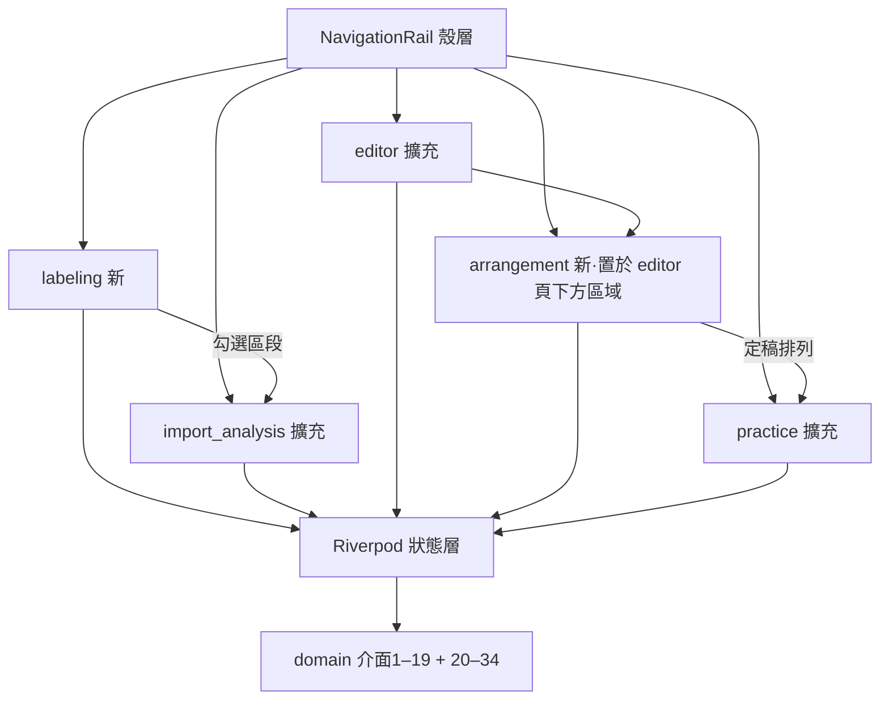

# Syllable Repeater macOS v1.1 — 前端技術方案設計（增量）

## 一、概述

本檔為 **v1 增量設計**：v1 frontend-design（`../../syllable-practice-macos-v1_20260704/design/frontend-design.md`）之架構層次、技術標準、UI Token、功能點 1～8 全部繼續有效；本檔只寫 v1.1 新增與變更（功能點 9 起續編）。後端契約以同目錄 `backend-design.md`（v1.1 增量，介面 20–34）＋v1 backend-design（介面 1–19）為權威。技術堆疊不變：Flutter macOS＋Riverpod＋Material 3＋domain 型別直用（UI 不另定義重複型別）。

## 二、架構說明（增量）

### 1、模組劃分（新增/擴充）

- **labeling（段落標籤，新）**：職責＝多句音檔匯入、全檔波形＋時間軸、自動切句顯示、標籤線滑動/＋/×、區段試聽、`.abolabel` 匯出/載入提示、未儲存攔截、勾選送分析；依賴介面 20–23。
- **arrangement（自由編輯區，新）**：職責＝一鍵生成、列增刪、積木拖曳、圈選組塊、逐塊設定、列預覽、獨立撤銷；依賴介面 27–29。
- **import_analysis（擴充）**：單句雙入口（直接匯入／承接標籤區段）、無音檔防呆、譯文編輯區搬入（REQ-20）。
- **editor（擴充）**：切點選中態＋×刪除、區段內＋新增、文字區塊編輯、雙向黃色高亮＋序號同步；依賴介面 24–26。
- **practice（擴充）**：M12 模式徽章與練習單元來源切換（介面 30）、錄音暫存回聽面板（介面 32–33）、顯示模式四態切換（介面 34）。
- **shell/shared（擴充）**：視窗自適應斷點與捲動兜底（REQ-10）；錯誤碼→文案映射表增補 8 碼。

> 導覽決策：「段落標籤」為 NavigationRail 新頂層項（REQ-11「左側功能區新增」）；「自由編輯區」不是頂層項，是音節校正頁（editor）下方的可捲動區域（REQ-15「在下方新增一個區域」）。

### 2、視窗自適應策略（REQ-10，全域）

- **機制**：殼層以 `LayoutBuilder` 取可用尺寸；各 feature 主畫面最外層統一包 `SingleChildScrollView`（垂直捲動兜底——「看不到必可捲得到」）；寬度斷點 **1280px**：≥1280 雙欄（波形｜文字區塊並排的頁面），<1280 改上下堆疊。
- **波形寬度**：`WaveformCanvas` 已有 `LayoutBuilder`（v1），寬度隨容器伸縮重取樣；高度固定 200 不變。
- **最小視窗**：維持 1100×700（`MainFlutterWindow.swift` 不改；`macos_window_config_test` 既有斷言不動）。
- **重排定稿**：Flutter 佈局天然逐幀；縮放中波形以 peaks 快取直繪（既有），無額外節流需求；驗收以 AT-10-04（10 次快速縮放不崩）為準。

## 三、規範檔案對齊（增量）

- 沿用 v1 全部技術標準與 Token。**UI 參照基準**：labeling 波形參照 editor 頁 `WaveformCanvas`＋`_WaveformSection`；arrangement 積木參照 editor 頁 `_SyllableChipsRow` 的 chip 樣式；對話框參照 export 對話框。
- **新增 Token**：選中高亮黃 `#F5D33B`（雙向高亮專用，與 needsReview 橙 `#E8A13C` 區隔）；組塊邊框色＝主色 `#3B6EF5` 加粗。
- **新增依賴**：無新第三方套件（拖曳用 Flutter 內建 `Draggable`/`DragTarget`；其餘全為既有能力）。

## 四、功能邏輯實作（功能點 9 起）

> 錯誤處理總策略沿用 v1 功能點 8；本檔末「錯誤碼對照增補表」涵蓋 backend-design（v1.1）§3.2.8 新增 8 碼。

### 功能點 9：視窗自適應（shell/shared）｜REQ-10

- **功能概述**：任何 ≥1100×700 尺寸下全部互動元件可見或可捲動到達；斷點 1280 切換並排/堆疊。
- **實作方案**：殼層 `LayoutBuilder`＋各 screen 外層 `SingleChildScrollView`＋`ConstrainedBox(minWidth)`；橫向過寬內容（波形、排列列）各自包 `Scrollbar(child: SingleChildScrollView(scrollDirection: horizontal))`。
- **使用驅動三題**：①動機＝縮小視窗與其他 App 並排仍要能練；②第一眼＝當前頁面主操作不被裁切，0 步（自動）；③阻力點＝縮放中卡頓——以 peaks 快取直繪化解。
- **資料與介面**：無後端介面（純佈局）。

### 功能點 10：段落標籤（labeling，新頁）｜REQ-11

- **功能概述**：匯入整首歌→全檔波形＋時間軸＋自動切句標籤線→手動微調→匯出 `.abolabel`→勾選一段送單句分析。
- **元件結構**：`LabelingScreen` ＝ 匯入列（`DropTarget`+`FilledButton`，參照 import_analysis）＋ `FullTrackWaveform`（新 widget，複用 `WaveformCanvas` 繪製核心＋時間軸刻度）＋ 標籤線互動層（線選中變色、線外緣「×」、間隙點擊浮現「＋」——手勢參照 editor 拖動 hit-test 手法）＋ 區段清單（`ListView`：編號｜文字｜起訖｜試聽鍵｜勾選框）＋ 底部列（匯出標籤｜下一步）。
- **狀態**：`LabelingController(AsyncNotifier)`——`session: LabelSession`（domain 型別直用）、`dirty`、`selectedSegmentIndex`、階段化進度（解碼中/分離中/切段中，沿用 v1 分析事件流樣式）。
- **未儲存攔截（guardrails #48 前端半邊）**：`openAudio` 前查 `dirty`——dirty 時彈 `AlertDialog` 三選一（儲存/不儲存/取消）；取消＝不載入新檔（AT-11-04）。攔截狀態機在 domain（LabelSession），UI 只呈現。
- **使用驅動三題**：①動機＝整首歌想挑一句練，不想開 Audacity；②第一眼＝波形＋自動標籤線已畫好，選段→下一步共 2 步；③阻力點＝長音檔等待——階段化進度＋ASR 失敗仍可全手動（波形先於辨識顯示）。
- **資料與介面**（來源：backend-design.md（v1.1）§3.2.1）：

| 介面 | 簽名 | 輸入欄位 | 輸出欄位 | 來源 |
|---|---|---|---|---|
| 介面 20 | `SegmentEngine.openAudio` | `path: String`(必)、`separateVocals: bool`(預設 true)、`language: String`(預設 en) | `session: LabelSession`、`existingLabelPath: String?`、`peaks: List<double>` | §3.2.1 介面 20 |
| 介面 21 | `LabelSession.moveBoundary/insertBoundary/removeBoundary` | `index/atMs: int` | 更新後 segments（單調遞增不變式） | §3.2.1 介面 21 |
| 介面 22 | `LabelPackEngine.writeLabel` | `session`、`destPath: String`(必) | 寫入路徑 `String` | §3.2.1 介面 22 |
| 介面 23 | `LabelPackEngine.readLabel` | `path: String`(必)、`expectedFingerprint: String`(必) | `LabelSession` | §3.2.1 介面 23 |

- `existingLabelPath != null` → `SnackBar`＋對話框「找到當初的標籤註記檔，是否載入？」（AT-11-03）。

### 功能點 11：單句分析入口整合＋譯文搬移（import_analysis 擴充）｜REQ-12、REQ-20

- **功能概述**：雙入口（直接匯入／labeling 勾選承接）；無音檔防呆；譯文編輯框搬入字稿區域下方。
- **實作方案**：
  - 承接入口：labeling「下一步」→ 以 `pendingSegment` Provider 傳遞（起訖 ms＋文字＋language）→ import_analysis 顯示來源徽章「來自段落標籤：第 N 段」，字稿預填 Segment 文字；分析對象＝該區段原音切片（domain 切片，M1）。
  - 無音檔防呆：無檔且無承接 → 「開始分析」`FilledButton` disabled＋引導文案（AT-12-03；**介面上不存在任何 TTS/生成選項**——D1）。
  - 譯文搬移（REQ-20）：`_lessonTranslationController` 相關欄位與 `_saveLesson`（含 ⌘S）自 `progress_settings_screen.dart:85,168,178-207` 遷至本頁字稿區塊正下方（同一 `Card` 視覺群組）；AI 自動譯文觸發鈕**一併搬入同群組**（F2 定案，2026-07-12 使用者）；設定頁僅移除譯文區塊，其餘（含批次「儲存」按鈕）分毫不動（AT-20-02/03）。
- **使用驅動三題**：①動機＝拿到素材最快開始練；②第一眼＝匯入按鈕或已預填的字稿，1 步到「開始分析」；③阻力點＝不知道為何不能分析——防呆文案直接指路（匯入或去段落標籤）。
- **資料與介面**：沿用 v1 介面 1（analyze）；無新增。承接資料為 UI 層 Provider 傳遞，不新增 domain 介面。

### 功能點 12：切點增減＋雙向高亮（editor 擴充）｜REQ-13、REQ-14

- **功能概述**：切點線點選→變色＋「×」；區段內點擊→「＋」；文字區塊雙擊編輯；波形↔文字雙向黃色高亮；序號即時重排。
- **元件結構**：`WaveformCanvas` 擴充——切點圓點改「圓點內數字」繪製、選中線變色、「×」浮動鈕（`Positioned` 於線頂端外側）、區段內點擊「＋」浮動鈕；`_SyllableChipsRow` 擴充——chip 下方序號、雙擊進入 `TextField` 就地編輯、選中黃色高亮。
- **狀態**：`EditorController` 新增 `selectedSyllableIndex: int?`（**單一共享選中狀態**——波形與 chips 同源，AT-14-05 不錯位）；選中被刪→清空（AT-14-04）。
- **撤銷**：沿用 v1 editor undo 堆疊，新操作型別（刪/增/改字）入同一堆疊依序回復（AT-13-04）。
- **使用驅動三題**：①動機＝自動切錯了要快速修好；②第一眼＝needsReview 橙色塊直接點，刪錯合併 2 步（點線→×）；③阻力點＝改壞回不去——⌘Z 逐步回復＋序號即時重排讓位置永遠可對照。
- **資料與介面**（來源：backend-design.md（v1.1）§3.2.2）：

| 介面 | 簽名 | 輸入欄位 | 輸出欄位 | 來源 |
|---|---|---|---|---|
| 介面 24 | `AlignmentEngine.removeBoundary` | `r: AlignmentResult`、`boundaryIndex: int` | 新 `AlignmentResult`（總數−1） | §3.2.2 介面 24 |
| 介面 25 | `AlignmentEngine.insertBoundary` | `r`、`syllableIndex: int`、`atMs: int` | 新 `AlignmentResult`（總數+1；後半空白+needsReview） | §3.2.2 介面 25 |
| 介面 26 | `AlignmentEngine.updateSyllableText` | `r`、`index: int`、`newText: String`（空字串允許） | 新 `AlignmentResult`（originalText 保留佐證） | §3.2.2 介面 26 |

### 功能點 13：自由編輯區（arrangement，新區域）｜REQ-15

- **功能概述**：一鍵生成 N 列句尾疊加初始排列→列增刪→積木拖曳→圈選組塊→逐塊設定（次數/靜音倍數）→列預覽→獨立撤銷。
- **元件結構**：`ArrangementSection`（editor 頁下方可捲動區域）＝「一鍵生成」`FilledButton.icon` ＋ 過期提示條（`staleFlag` 時 `MaterialBanner`：重新生成/保留）＋ `ListView` 之 `ArrangementRow[]`——每列：左外緣「−」、列間隙左側「＋」、列內 `DragTarget` 接收上方 chips 的 `Draggable`（積木＝參照 `_SyllableChip` 樣式）、組塊以主色粗框包裹、右側播放預覽鍵；點擊積木/組塊→`PopupMenuButton` 式設定浮層（repeatN Stepper 1–10、靜音倍數 Stepper 0–5，就地驗證超界 disabled——錯誤不清空已填值）；區域頂部獨立撤銷 `IconButton`（作用域僅本區，與上方 ⌘Z 分離）。
- **堆疊組塊（F1 定案手勢，2026-07-12 使用者）**：iPhone 主畫面式互動——**長按**積木進入拖曳態（微放大＋陰影，`LongPressDraggable`）；拖曳中懸停於同列另一積木上方 ≥300ms → 目標積木顯示「即將合組」框（主色粗框預覽）→ 放開即合成組塊（如 iPhone App 資料夾）；**點開組塊**（單擊）展開內部橫列，組塊內積木可再滑動排序（同款 `LongPressDraggable` 於組塊內部作用域）；組塊外緣「拆組」鈕＝ungroup。不做跨列堆疊（拖至他列空隙＝移動，拖至他列積木上＝不觸發合組，避免誤操作）。疊錯→本區獨立撤銷回復。
- **使用驅動三題**：①動機＝針對自己卡住的連音自組練習（掌控感，requirement ④人性驅動）；②第一眼＝按「一鍵生成」即出現熟悉的疊加階梯，0 學習成本起步；③阻力點＝排錯/圈錯——獨立撤銷＋設定就地顯示目前值。
- **資料與介面**（來源：backend-design.md（v1.1）§3.2.3）：

| 介面 | 簽名 | 輸入欄位 | 輸出欄位 | 來源 |
|---|---|---|---|---|
| 介面 27 | `PracticeEngine.generateArrangement` | `syllables: List<Syllable>` | `PracticeArrangement`（N 列初始） | §3.2.3 介面 27 |
| 介面 28 | Arrangement 聚合操作 | `insertRow/removeRow/placeBlock/moveBlock/groupBlocks/ungroup/setBlockConfig/undoArrangement` 各參數 | 更新後 Arrangement；`ERR_BLOCK_CONFIG_OUT_OF_RANGE` 超界 | §3.2.3 介面 28 |
| 介面 29 | `PracticeEngine.renderBlockRow` | `row: PracticeRow`、`originalPcm: Pcm` | 預覽 `Pcm`（M1 補述路徑） | §3.2.3 介面 29 |

- 播放中改排列：停止播放（取消渲染），不播混合序列（AT-15-07）。

### 功能點 14：疊加練習頁 M12 模式（practice 擴充）｜REQ-16

- **功能概述**：練習單元來源由 `effectiveUnits` 決定；頁首模式徽章（自動疊加/自訂排列）；刪除排列入口。
- **實作方案**：`PracticeController` 改以介面 30 取單元清單（v1 直呼 `buildSteps` 處全部改經此入口——M12 唯一判定點）；徽章 `Chip` 顯示 `mode`；`stale=true` 時沿用功能點 13 同款提示條；「刪除自訂排列」入口於徽章旁 `IconButton`＋確認對話框→回落自動（AT-16-03）。單元播放/錄音/匯出操作介面與 v1 一致（零學習成本）。
- **資料與介面**（來源：backend-design.md（v1.1）§3.2.3 介面 30）：

| 介面 | 輸入欄位 | 輸出欄位 |
|---|---|---|
| 介面 30 `PracticeEngine.effectiveUnits` | `lesson: Lesson`、`repeatN: int` | `mode: {auto, custom}`、`units: List<PracticeUnit>`、`stale: bool` |

- 合併匯出對話框（v1 功能點 5）不改介面；custom 模式下勾選單元＝排列各列，靜音依塊設定（後端介面 30 語意，AT-16-05 auto 模式分毫不差）。

### 功能點 15：錄音暫存回聽（practice 擴充）｜REQ-18

- **功能概述**：錄音結束顯示「暫存本次錄音以便回聽」勾選（**預設不勾**）；暫存清單面板（時間｜所屬步驟｜播放｜刪除）。
- **實作方案**：`RecordPanel` 擴充——錄音結束列尾 `Checkbox`＋說明 tooltip（「10 分鐘後自動刪除；換一步練習即清；關閉 App 即清空；絕不存入課件」——把 M10 保證講給使用者聽）；勾選才呼叫介面 32（呼叫即同意語意；同步驟重錄＝覆蓋）；暫存清單 `ExpansionTile` 收於練習頁側欄，每筆附**刪除鈕**（手動即刪，O4）；`PracticeController` 於切換步驟時呼叫 `purgeContext(前一步驟)`（O4/AT-18-07）；暫存失敗→`SnackBar`（`ERR_BUFFER_STASH_FAILED` 文案），主流程不擋。
- **使用驅動三題**：①動機＝比對結果怪異想聽自己剛剛錄了什麼；②第一眼＝錄完就在原地看到勾選框，0 額外步驟；③阻力點＝隱私疑慮——tooltip 直接把三保證說清楚。
- **資料與介面**（來源：backend-design.md（v1.1）§3.2.5）：

| 介面 | 輸入欄位 | 輸出欄位 |
|---|---|---|
| 介面 32 `stash` | `recording: Pcm`、`attemptContext: String`、`ttl`(預設 10min，O4) | `RecordingBufferEntry`（同 context 覆蓋） |
| 介面 33 `list/play/delete/purgeContext/purgeExpired/purgeAll` | — | entries／void；`purgeAll` 由 `main.dart` 啟動時呼叫；`purgeContext` 由切步時呼叫 |

### 功能點 16：顯示模式切換（practice 擴充）｜REQ-19

- **功能概述**：練習頁四態切換（字稿/字稿＋譯文/僅譯文/都不顯示）；同課件記住。
- **實作方案**：`SegmentedButton<TranscriptDisplayMode>` 於練習頁文字區上緣；切換即呼叫介面 34 set 並更新顯示；無譯文時含譯文模式顯示引導文案（AT-19-02，不禁用選項）；載入課件時 get 恢復（AT-19-03）。
- **資料與介面**（來源：backend-design.md（v1.1）§3.2.6 介面 34）：`getTranscriptMode(lessonId) → TranscriptDisplayMode`；`setTranscriptMode(lessonId, mode) → void`；不進 `.abopack`（AT-19-04）。

### 錯誤碼對照增補表（v1 19 碼沿用；新增 8 碼處理策略）

| 錯誤碼 | 前端處理策略 |
|---|---|
| `ERR_LANGUAGE_UNSUPPORTED` | `AlertDialog`：顯示不支援語言＋已註冊清單（來自例外 payload）；不建課件 |
| `ERR_LABEL_CORRUPTED` | `SnackBar`＋保留現有標籤狀態不變；可重選檔案 |
| `ERR_LABEL_FINGERPRINT_MISMATCH` | `AlertDialog`：「此標籤檔屬於另一個音檔」＋重選/取消 |
| `ERR_SEGMENT_TOO_CLOSE` | 就地 inline 提示＋「＋」操作回彈；不清空任何狀態 |
| `ERR_BOUNDARY_TOO_CLOSE` | 同上（editor 區） |
| `ERR_SYLLABLE_MIN_COUNT` | 「×」不顯示為主要防線（AT-13-05）；防禦性收到時 `SnackBar` |
| `ERR_BLOCK_CONFIG_OUT_OF_RANGE` | 設定浮層就地驗證（Stepper 超界 disabled）為主；防禦性 `SnackBar` |
| `ERR_BUFFER_STASH_FAILED` | `SnackBar` 告知已依預設刪除；錄音比對主流程照常 |

## 介面對齊自我檢查（定稿前，8 項）

| # | 檢查項 | 結果 |
|---|---|---|
| 1 | 介面涵蓋完整性：backend v1.1 介面 20–34 全數出現於功能點 10/12/13/14/15/16（介面 21/28 為聚合操作、介面 31 Registry 由介面 20／介面 1 內部呼叫，前端不直呼——已標明） | ✅ |
| 2 | 輸入參數逐欄對齊（含預設值與必填） | ✅ |
| 3 | 輸出參數逐欄對齊（LabelOpenResult/effectiveUnits/RecordingBufferEntry 展開至葉欄位） | ✅ |
| 4 | 來源標註（每表附 backend-design §x.x.x 介面 N） | ✅ |
| 5 | 型別一致：UI 直用 domain 型別（v1 原則），無另定義重複 interface | ✅ |
| 6 | 錯誤碼全涵蓋：新增 8 碼逐一有處理策略；v1 19 碼沿用 v1 功能點 8 | ✅ |
| 7 | 新增/變更標註：`.abopack` schemaVersion 2 之 `language`/`arrangement` 欄於功能點 11/13/14 說明影響 | ✅ |
| 8 | 無臆造介面：無 backend 未定義之路徑/欄位；O3（AI 譯文入口搬移）標 `[需與產品確認]` | ✅ |

## 開放問題（前端）

| # | 問題 | 結論 |
|---|---|---|
| ~~F1~~ | ~~圈選手勢~~ | **已定案**（2026-07-12 使用者）：長按拖曳堆疊（iPhone App 式），疊上即成組、組內滑動排序——見功能點 13 |
| ~~F2~~ | ~~AI 自動譯文觸發鈕搬移~~ | **已定案**（2026-07-12 使用者）：一併搬入同群組——見功能點 11 |
