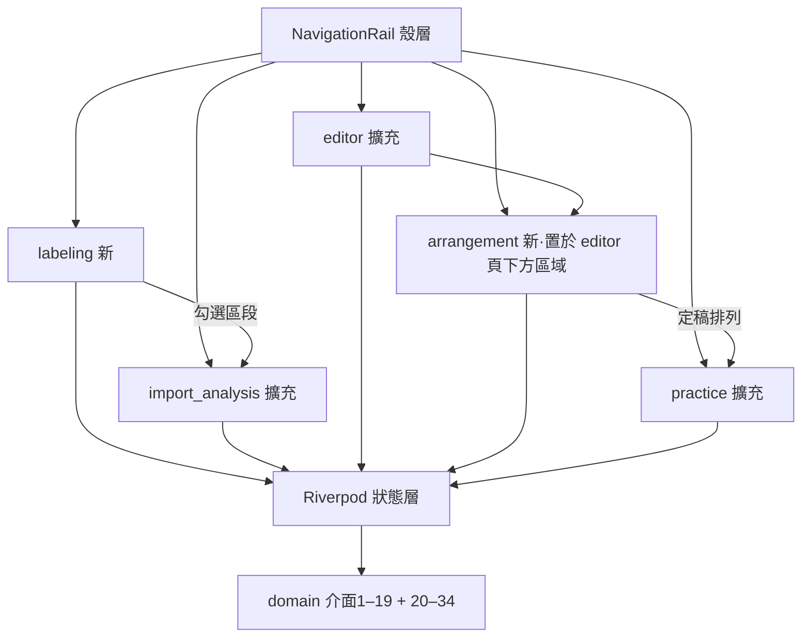

# Syllable Repeater macOS v1.1 — 前端技術方案設計（增量）

## 一、概述

本檔為 **v1 增量設計**：v1 frontend-design（`../../syllable-practice-macos-v1_20260704/design/frontend-design.md`）之架構層次、技術標準、UI Token、功能點 1～8 全部繼續有效；本檔只寫 v1.1 新增與變更（功能點 9 起續編）。後端契約以同目錄 `backend-design.md`（v1.1 增量，介面 20–34）＋v1 backend-design（介面 1–19）為權威。技術堆疊不變：Flutter macOS＋Riverpod＋Material 3＋domain 型別直用（UI 不另定義重複型別）。

## 二、架構說明（增量）

### 1、模組劃分（新增/擴充）

- **labeling（段落標籤，新）**：職責＝多句音檔匯入、真實進度、全檔波形、自動切句、保留／捨棄區間、紅色播放軸、播放／暫停／停止、`.abolabel v2`、勾選送分析；依賴介面 20–23。
- **arrangement（自由編輯區，新）**：職責＝草稿期一鍵生成、列增刪、上方／列內直接拖曳、同列放下成組、雙擊集中設定視窗、列預覽、獨立撤銷；依賴介面 27–29、36。
- **import_analysis（擴充）**：單句雙入口、真實 byte 就緒進度、真實分析階段、開始前空預覽、譯文編輯區；依賴介面 35。
- **editor（擴充）**：切點增減、文字編輯、`SelectedTimeRange` 重疊高亮＋序號同步；依賴介面 24–26。
- **practice（擴充）**：M12 練習單元來源切換（介面 30）、錄音單次參考／背景比對／限點圖（介面 32–33）、顯示模式四態切換。
- **course_bundle／export（擴充）**：課程設定儲存 `.abopack v3`、課程匯入開啟複合封包、匯出四層 selector 產生 `PracticeExportPlan`（介面 37–38）。
- **shell/shared（擴充）**：視窗自適應斷點與捲動兜底（REQ-10）；錯誤碼→文案映射表增補 7 碼。

> 導覽決策：「段落標籤」為 NavigationRail 新頂層項（REQ-11「左側功能區新增」）；「自由編輯區」不是頂層項，是音節校正頁（editor）下方的可捲動區域（REQ-15「在下方新增一個區域」）。

使用者可見名稱固定為：`課程匯入`、`段落標籤`、`單句分析`、`段落校正`、`錄音練習`、`課程設定`；左側導覽與各頁主標題必須一致，舊名稱不得殘留；route enum／provider key 不改名，避免進度與頁面狀態失聯（AT-10-06）。

### 2、視窗自適應策略（REQ-10，全域）

- **機制**：殼層以 `LayoutBuilder` 取可用尺寸；macOS 原生視窗已強制 1100×700，因此全 App 殼層不再建立水平／垂直 `Scrollable`。各 feature 只在內容確實超出時建立自己的單一頁面捲動；自由排列等有界工作區可再有一個明確子捲動。寬度斷點 **1280px**：≥1280 雙欄（波形｜文字區塊並排的頁面），<1280 改上下堆疊。
- **波形寬度**：`WaveformCanvas` 已有 `LayoutBuilder`（v1），寬度隨容器伸縮重取樣；高度固定 200 不變。
- **最小視窗**：維持 1100×700（`MainFlutterWindow.swift` 不改；`macos_window_config_test` 既有斷言不動）。
- **重排定稿**：Flutter 佈局天然逐幀；縮放中波形以 peaks 快取直繪（既有），無額外節流需求；驗收以 AT-10-04（10 次快速縮放不崩）為準。

## 三、規範檔案對齊（增量）

- 沿用 v1 全部技術標準與 Token。**UI 參照基準**：labeling 波形參照 editor 頁 `WaveformCanvas`＋`_WaveformSection`；arrangement 積木參照 editor 頁 `_SyllableChipsRow` 的 chip 樣式；對話框參照 export 對話框。
- **新增 Token**：選中高亮黃 `#F5D33B`（雙向高亮專用，與 needsReview 橙 `#E8A13C` 區隔）；組塊邊框色＝主色 `#3B6EF5` 加粗。
- **新增依賴**：拖曳仍用 Flutter 內建 `Draggable`/`DragTarget`；播放 position stream 沿用既有播放器；錄音比較用 Dart isolate，不新增網路或音訊模型套件。

## 四、功能邏輯實作（功能點 9 起）

> 錯誤處理總策略沿用 v1 功能點 8；本檔末「錯誤碼對照增補表」涵蓋 backend-design（v1.1）§3.2.8 新增 7 碼。

### 功能點 9：視窗自適應（shell/shared）｜REQ-10

- **功能概述**：任何 ≥1100×700 尺寸下全部互動元件可見或可捲動到達；斷點 1280 切換並排/堆疊。
- **實作方案**：殼層 `LayoutBuilder`＋各 screen 外層 `SingleChildScrollView`＋`ConstrainedBox(minWidth)`；橫向過寬內容（波形、排列列）各自包 `Scrollbar(child: SingleChildScrollView(scrollDirection: horizontal))`。
- **使用驅動三題**：①動機＝縮小視窗與其他 App 並排仍要能練；②第一眼＝當前頁面主操作不被裁切，0 步（自動）；③阻力點＝縮放中卡頓——以 peaks 快取直繪化解。
- **資料與介面**：無後端介面（純佈局）。

### 功能點 10：段落標籤（labeling，新頁）｜REQ-11

- **功能概述**：匯入整首歌→全檔波形＋自動切句→框選保留／捨棄→播放驗證→匯出 `.abolabel v2`→只把保留段送單句分析。
- **元件結構**：`LabelingScreen` 為匯入卡、`StagedProgress`、`FullTrackWaveform`、`RegionDispositionToolbar`、區段清單與底部匯出／下一步。`FullTrackWaveform` 接 `playheadMs` 畫紅色虛線；kept 黃、discarded 灰、unmarked 透明。
- **區段播放狀態機**：just_audio clip 的 seek 一律使用相對位置 `0ms`，位置串流才加回區段 `startMs` 供全檔紅色虛線；Controller 以 generation id 隔離舊播放 Future。pause 保留游標並讓 resume 從原處續播；stop 清除游標且下次由區段開頭播放；第 1 至第 N 段與單一全檔段共用同一契約。
- **播放狀態機**：`stopped(startMs) → playing(positionMs) ↔ paused(positionMs) → stopped(startMs)`。播放鍵在 playing 轉暫停，停止鍵獨立常駐；position stream 節流到每秒最多 30 次重繪，停止時 seek 回區段起點，dispose／換檔取消 subscription。
- **狀態**：`LabelingController(AsyncNotifier)`——`session`、`dirty`、`selectedSegmentIndex`、`LabelOpenProgress?`；由 backend 介面 20 `onProgress` 更新。byte 可量測時顯示 determinate；sidecar 內部不可量測時只顯示階段 indeterminate，不自行插值。
- **未儲存攔截（guardrails #48 前端半邊）**：`openAudio` 前查 `dirty`——dirty 時彈 `AlertDialog` 三選一（儲存/不儲存/取消）；取消＝不載入新檔（AT-11-04）。攔截狀態機在 domain（LabelSession），UI 只呈現。
- **使用驅動三題**：①動機＝整首歌想挑一句練，不想開 Audacity；②第一眼＝波形＋自動標籤線已畫好，選段→下一步共 2 步；③阻力點＝長音檔等待——階段化進度＋ASR 失敗時接收正常結果的 `warning`，顯示提示後仍可全手動（波形先於辨識顯示）。
- **資料與介面**（來源：backend-design.md（v1.1）§3.2.1）：

| 介面 | 簽名 | 輸入欄位 | 輸出欄位 | 來源 |
|---|---|---|---|---|
| 介面 20 | `SegmentEngine.openAudio` | `path`、`separateVocals`、`language`、`onProgress: LabelOpenProgress callback?` | `session`、`existingLabelPath`、`peaks`、`warning`；過程事件真實驅動 UI | §3.2.1 介面 20 |
| 介面 21 | `LabelSession` 聚合操作 | move／insert／remove boundary；markKept／markDiscarded／clearDisposition | 更新後 regions；keptSegments 為唯一送分析投影 | §3.2.1 介面 21 |
| 介面 22 | `LabelPackEngine.writeLabel` | `session`、`destPath: String`(必) | 寫入路徑 `String` | §3.2.1 介面 22 |
| 介面 23 | `LabelPackEngine.readLabel` | `path: String`(必)、`expectedFingerprint: String`(必) | `LabelSession` | §3.2.1 介面 23 |

- `existingLabelPath != null` → `SnackBar`＋對話框「找到當初的標籤註記檔，是否載入？」（AT-11-03）。
- `warning.code == ERR_TRANSCRIBE_FAILED` → 顯示「切段失敗，可重試或手動切段」；保留空 session 與波形，進入手動標籤模式（AT-11-06）。

### 功能點 11：單句分析入口整合＋譯文搬移（import_analysis 擴充）｜REQ-12、REQ-20

- **功能概述**：雙入口（直接匯入／labeling 勾選承接）；無音檔防呆；譯文編輯框搬入字稿區域下方。
- **實作方案**：
  - 直接匯入：`AnalysisController.selectAudioPath` 不再收到 path 就設 ready；改訂閱介面 35 `AudioImportReader.readAndValidate`，狀態為 `readingBytes/validatingFormat/validatingDuration/ready/error`。只有 ready 才顯示「音檔已就緒」並啟用開始分析；新選檔以 runId 淘汰舊事件。
  - 承接入口：labeling「下一步」→ `pendingSegment` Provider 傳遞已驗證原音來源、起訖、文字、language；import_analysis 立即 ready，不重做檔案挑選。
  - 進度／預覽：匯入進度用真實 bytes；分析進度只消費 `AnalysisPipeline` 事件。`AnalysisState` 同時保存 `originalPcm` 與 `analysisPcm`；editor、practice、recording reference、save/export provider 只能讀 original，ASR／特徵分析可讀 analysis。尚未開始時結果留白。
  - 無音檔防呆：無檔且無承接，或檔案仍未 ready → 開始分析 disabled＋引導文案；**介面上不存在 TTS/生成選項**。
  - 譯文搬移（REQ-20）：`_lessonTranslationController` 相關欄位與 `_saveLesson`（含 ⌘S）自 `progress_settings_screen.dart:85,168,178-207` 遷至本頁字稿區塊正下方（同一 `Card` 視覺群組）；AI 自動譯文觸發鈕**一併搬入同群組**（F2 定案，2026-07-12 使用者）；設定頁僅移除譯文區塊，其餘（含批次「儲存」按鈕）分毫不動（AT-20-02/03）。
- **使用驅動三題**：①動機＝拿到素材最快開始練；②第一眼＝匯入按鈕或已預填的字稿，1 步到「開始分析」；③阻力點＝不知道為何不能分析——防呆文案直接指路（匯入或去段落標籤）。
- **資料與介面**：分析沿用 v1 介面 1；匯入就緒使用 backend-design §3.2.7 介面 35。承接資料仍由 UI Provider 傳遞。

### 功能點 12：切點增減＋雙向高亮（editor 擴充）｜REQ-13、REQ-14

- **功能概述**：切點線點選→變色＋「×」；區段內點擊→「＋」；文字編輯；時間範圍黃色高亮；真實播放位置紅色虛線軸；序號即時重排。
- **元件結構**：`WaveformCanvas` 擴充——切點圓點改「圓點內數字」繪製、選中線變色、「×」浮動鈕（`Positioned` 於線頂端外側）、區段內點擊「＋」浮動鈕；`_SyllableChipsRow` 擴充——chip 下方序號、雙擊進入 `TextField` 就地編輯、選中黃色高亮。
- **狀態**：`EditorController` 以 `selectedTimeRange: TimeRange?` 作為**單一共享選中狀態**；chips 用半開區間 overlap 判斷全部高亮。為維持既有編輯 API，可另由 range 推導 primary index，但不得以 primary index 決定唯一高亮；選取範圍涵蓋的區段被刪除／失效時清空或重算。
- **繪製一致性**：`_commitSyllableEdit` 成功或失敗都同步清除 `draggingBoundaryIndex`／`draggingPreviewMs`／pending add point，再由新結果重畫；刪除 icon 攔截 pointer，不冒泡觸發父層拖曳預覽。高亮左右端直接由 range 起訖映射，首尾均吸附實際節點線。
- **撤銷**：沿用 v1 editor undo 堆疊，新操作型別（刪/增/改字）入同一堆疊依序回復（AT-13-04）。
- **使用驅動三題**：①動機＝自動切錯了要快速修好；②第一眼＝needsReview 橙色塊直接點，刪錯合併 2 步（點線→×）；③阻力點＝改壞回不去——⌘Z 逐步回復＋序號即時重排讓位置永遠可對照。
- **資料與介面**（來源：backend-design.md（v1.1）§3.2.2）：

| 介面 | 簽名 | 輸入欄位 | 輸出欄位 | 來源 |
|---|---|---|---|---|
| 介面 24 | `AlignmentEngine.removeBoundary` | `r: AlignmentResult`、`boundaryIndex: int` | 新 `AlignmentResult`（總數−1） | §3.2.2 介面 24 |
| 介面 25 | `AlignmentEngine.insertBoundary` | `r`、`syllableIndex: int`、`atMs: int`、`pcm: Pcm`（required；零交越吸附） | 新 `AlignmentResult`（總數+1；後半空白+needsReview） | §3.2.2 介面 25 |
| 介面 26 | `AlignmentEngine.updateSyllableText` | `r`、`index: int`、`newText: String`（空字串允許） | 新 `AlignmentResult`（originalText 保留佐證） | §3.2.2 介面 26 |

### 功能點 13：自由編輯區（arrangement，新區域）｜REQ-15

- **功能概述**：一鍵生成 N 列→列增刪→積木拖曳／成組→積木設定（預設 1／1）→整列設定（預設 3／1）→列預覽→獨立撤銷。
- **元件結構**：`ArrangementSection` 標題列左側放「刪除排列」控制，右側保留獨立撤銷；一鍵生成按鈕只依 `editor.syllables` 與穩定 draft lessonId 啟用，不依賴是否已存 pack。「來源段落」為工作區內固定頂列並可水平捲動；排列列放在有界高度、至少約三列的獨立垂直 `Scrollable`，右側顯示固定捲軸。`ArrangementRow` 每列最右側依序放列設定與整列播放；播放中箭頭換停止方框。
- **選取與本體長按**：移除六點拖曳把手。短按單一積木／組塊／組員只做選取，雙擊頂層開設定；滑鼠在內容本體長按 300ms 後才建立 drag，macOS 三指拖移由系統映射同一路徑。頂層與組內拖曳都只接受相同 rowIndex；跨列 drop 不提交 Domain。選取後顯示垃圾桶並支援 Delete，刪除與同列移動都形成 undo 快照。
- **放置提示**：不顯示大型藍色跨列插入軌。列內拖曳只在目前列顯示精簡同列目標；組塊中央外框亮起代表單一積木加入組合。組內成員可在同列重排、抽出成單一積木或刪除；組塊剩一項時自動降級，不保留空組塊。積木 Chip 不顯示麥克風裝飾；組合仍以外框與背景表達層級。
- **長列定位與手勢隔離**：每列持有定位 key；插入後只用列區 controller 定位並短暫高亮，禁止 `Scrollable.ensureVisible` 改動祖先頁面。全 App 殼層沒有第三層垂直捲動；指標位於列區時，觸控板／滾輪事件只由列區消費；開始拖曳後 `EditorScreen` 外層捲動切為 `NeverScrollableScrollPhysics`，直到 drop／cancel。拖曳上下緣只捲列區，完成後保持列區 offset，避免整頁跑位。
- **來源段落插入模式**：來源段落單擊後寫入 `pendingSourceSyllableIndex`，顯示選取外框與「請點各列插入圖示」提示；每個頂層積木左側及列尾才顯示 compact `IconButton`，空列整列可點，皆呼叫 `placeSyllable` 後立即清狀態。Esc／再次點同一來源取消。來源段落不建立 Draggable，避免和長列垂直捲動搶手勢。
- **切點提交效能**：editor 先以 immutable syllables 更新畫面並清除 dragging transient state，再由可注入的 `ProsodyAnalysisRunner` 在背景 isolate 計算；每次排程遞增 generation，只有 generation 與目前 syllables 快照皆相符時才可回寫 `AsyncValue<Prosody>`。
- **集中設定視窗**：`BlockConfigDialog` 包含 repeat 1–10、silence 0–20／step 0.5、Reset(1/1)、preview、取消／套用。
- **成組／拆組設定**：Domain 回傳的新 group 與拆出 blocks 均為 1／1。
- **整列設定與播放**：列設定 Reset(3/1)。預覽使用 immutable row 快照；播放中改排列或按停止方框即停止。
- **使用驅動三題**：①動機＝針對自己卡住的連音自組練習（掌控感，requirement ④人性驅動）；②第一眼＝按「一鍵生成」即出現熟悉的疊加階梯，0 學習成本起步；③阻力點＝排錯/圈錯——獨立撤銷＋設定就地顯示目前值。
- **資料與介面**（來源：backend-design.md（v1.1）§3.2.3）：

| 介面 | 簽名 | 輸入欄位 | 輸出欄位 | 來源 |
|---|---|---|---|---|
| 介面 27 | `PracticeEngine.generateArrangement` | `syllables: List<Syllable>`、`lessonId: String`、`updatedAt: DateTime`（皆 required） | `PracticeArrangement`（N 列初始，綁單一 Lesson） | §3.2.3 介面 27 |
| 介面 28 | Arrangement 聚合操作 | 增列／刪列／place／move／group／ungroup／刪除頂層積木／刪除或抽出組內成員／單一積木插入組內／set/reset block／row config／undo | 組塊剩一項自動降級單一；group/ungroup 重置 1/1；row 預設 3/1；跨 Lesson 拒絕 | §3.2.3 介面 28 |
| 介面 29 | `PracticeEngine.renderBlockRow` | `row: PracticeRow`、`originalPcm: Pcm` | 預覽 `Pcm`（M1 補述路徑） | §3.2.3 介面 29 |

- 播放中改排列：停止播放（取消渲染），不播混合序列（AT-15-07）。

### 功能點 14：疊加練習頁 M12 模式（practice 擴充）｜REQ-16

- **功能概述**：練習單元來源仍由 `effectiveUnits` 決定；0 列時顯示完整單句 1 單元，N 列時顯示 N 單元。頁首不顯示模式徽章，也不提供刪排列入口；使用者可見「步」統一為「單元」。
- **實作方案**：`PracticeController` 繼續只經介面 30，直接監聽 editor 草稿排列。右上 `×N` 顯示／修改目前列 repeatN，不額外乘一層；0 列使用隱含列 3／1。
- **資料與介面**（來源：backend-design.md（v1.1）§3.2.3 介面 30）：

| 介面 | 輸入欄位 | 輸出欄位 |
|---|---|---|
| 介面 30 `PracticeEngine.effectiveUnits` | `syllables`、`arrangement?`、`fullSentenceRange` | `mode: {wholeSentence, custom}`、`units: List<PracticeUnit>`、`stale: bool` |

- 合併匯出對話框每個單元增加 repeat／silence 控制，初值帶入列設定；修改只形成本次匯出 snapshot 並暫時覆寫整列外層，不回寫自由排列。多單元之間仍依 M3 插入前一個已渲染單元 totalDurationMs。

### 功能點 15：錄音單次比對與限點圖（practice 擴充）｜REQ-18

- **功能概述**：錄音停止後以不含循環／靜音的原音單次參考做比對；重計算在 isolate；圖表每條 ≤1000 點；結果右側垃圾桶可立即清除。畫面不提供跨單元暫存清單，但目前單元最近一次錄音可播放確認。
- **實作方案**：`PracticeController` 先呼叫 `renderSinglePassReference`，再以 `compute`／長生命週期 isolate 比較；`_compareRunId` 防晚到覆蓋。錄音 stop 後先保存解碼 PCM 至 `PracticeUiState.recordedPcm`，不以 comparison 成功為顯示播放鍵的前提；播放中按鈕轉為停止，停止後再播放由 0ms 開始。垃圾桶、切單元、重錄、離頁與 App 關閉會停止播放並清 comparison／recordedPcm；播放暫存與錄音來源 temp 一律 finally。不得建立 RecordingBuffer provider/service/store。
- **使用驅動三題**：①動機＝只錄一次就比對當次模仿；②第一眼＝錄完自動分析，不需要管理暫存；③阻力點＝卡住——重計算離開 UI isolate且圖表限點。
- **資料與介面**（來源：backend-design.md（v1.1）§3.2.5）：

| 介面 | 輸入欄位 | 輸出欄位 |
|---|---|---|
| 介面 32 `renderSinglePassReference` | `PracticeUnit`、`originalPcm` | 無 repeat／silence 的單次參考 PCM |
| 介面 33 `compare` | reference、recording、maxWavePoints=1000 | 限點 `RecordingComparison` |

### 功能點 16：顯示模式切換（practice 擴充）｜REQ-19

- **功能概述**：練習頁四態切換（字稿/字稿＋譯文/僅譯文/都不顯示）；同課件記住。
- **實作方案**：`SegmentedButton<TranscriptDisplayMode>` 於練習頁文字區上緣；切換即呼叫介面 34。建立單一 `PracticeTextVisibility` view-model，供 `_StepNavigator`、`_PracticePlayerBar`、`RecordPanel` 與字稿卡共同消費：hidden 時 navigator label=`#n`、player=`第 n 單元`、錄音 context 只留單元編號；其餘三態沿用既有文字／譯文規則。不得只隱藏字稿 Card 而讓同一答案從其他 widget 洩漏。
- **資料與介面**（來源：backend-design.md（v1.1）§3.2.6 介面 34）：`getTranscriptMode(lessonId) → TranscriptDisplayMode`；`setTranscriptMode(lessonId, mode) → void`；偏好寫入 `.aboprogress` `progress.transcriptDisplayModes` 並隨檔匯出／匯入；不進 `.abopack`（AT-19-04）。

### 功能點 17：課程封包與四層匯出（course_bundle/export）｜REQ-21

- **課程設定**：新增「儲存課程」卡，列出 originalAudio（必有）以及 labels／sentenceLesson／arrangement／latestProgress 的存在狀態；按下開 save dialog，controller 建立 immutable `CourseBundle` 後呼叫介面 37。原「儲存標籤」「匯出進度」維持各自頁面與用途。
- **課程匯入**：開啟 v3 後依區塊分派 provider；只有 labels 時停在段落標籤，不建立假 Lesson；有 sentenceLesson 才啟用段落校正／錄音練習；latestProgress 經既有 merge 流程。
- **四層匯出 UI**：`AudioSourceSelector → ArrangementSourceSelector → UnitScopeSelector → ExportConfigSelector`。每層只列出 planner 回報可用項；前層改變會清掉已不相容的後層值。最後先建 `PracticeExportPlan` 預覽（來源、單元數、估計長度）再允許選目的地。
- **設定覆寫**：逐單元 repeat／silence 控制只寫 dialog-local map；取消或匯出完成即丟棄，不呼叫 arrangement controller。

### 錯誤碼對照增補表（v1 19 碼沿用；新增 7 碼處理策略）

| 錯誤碼 | 前端處理策略 |
|---|---|
| `ERR_LANGUAGE_UNSUPPORTED` | `AlertDialog`：顯示不支援語言＋已註冊清單（來自例外 payload）；不建課件 |
| `ERR_LABEL_CORRUPTED` | `SnackBar`＋保留現有標籤狀態不變；可重選檔案 |
| `ERR_LABEL_FINGERPRINT_MISMATCH` | `AlertDialog`：「此標籤檔屬於另一個音檔」＋重選/取消 |
| `ERR_SEGMENT_TOO_CLOSE` | 就地 inline 提示＋「＋」操作回彈；不清空任何狀態 |
| `ERR_BOUNDARY_INVALID` | 就地提示「至少須保留一個段落」；不清空標籤狀態（AT-11-09，沿用 v1 錯誤碼） |
| `ERR_BOUNDARY_TOO_CLOSE` | 同上（editor 區） |
| `ERR_SYLLABLE_MIN_COUNT` | 「×」不顯示為主要防線（AT-13-05）；防禦性收到時 `SnackBar` |
| `ERR_BLOCK_CONFIG_OUT_OF_RANGE` | 雙擊設定對話框就地驗證 repeat 1–10、silence 0–20／step0.5；超界不可套用且不清草稿值 |

## 介面對齊自我檢查（定稿前，8 項）

| # | 檢查項 | 結果 |
|---|---|---|
| 1 | 介面涵蓋完整性：backend v1.1 介面 20–38 依功能點 10～17 對齊；聚合／Registry／匯入協調介面由對應 controller 消費 | ✅ |
| 2 | 輸入參數逐欄對齊（含預設值與必填） | ✅ |
| 3 | 輸出參數逐欄對齊（LabelOpenResult/effectiveUnits/RecordingComparison/CourseBundle/PracticeExportPlan 展開至葉欄位） | ✅ |
| 4 | 來源標註（每表附 backend-design §x.x.x 介面 N） | ✅ |
| 5 | 型別一致：UI 直用 domain 型別（v1 原則），無另定義重複 interface | ✅ |
| 6 | 錯誤碼全涵蓋：現行新增碼逐一有處理策略；已撤回的 buffer 錯誤碼不得再由 UI 觸發 | ✅ |
| 7 | 新增/變更標註：`.abolabel v2`、`.abopack v3`、original／analysis PCM 分軌與 v1/v2 相容行為均已標註 | ✅ |
| 8 | 無臆造介面：無 backend 未定義之路徑/欄位；O3/F2（AI 譯文入口搬移）已由使用者定案 | ✅ |

## 開放問題（前端）

| # | 問題 | 結論 |
|---|---|---|
| ~~F1~~ | ~~圈選手勢~~ | **2026-07-15 r9 覆蓋舊裁決**：來源段落改點選插入；既有積木本體長按約 300ms 才於同列拖曳／成組，跨列一律取消；macOS 三指拖移由系統映射——見功能點 13 |
| ~~F2~~ | ~~AI 自動譯文觸發鈕搬移~~ | **已定案**（2026-07-12 使用者）：一併搬入同群組——見功能點 11 |
