# Syllable Repeater macOS v1.1 需求檔案

## 一、檔案資訊

### 1.1 基礎資訊

| 項目 | 內容 |
|------|------|
| 檔案名稱 | syllable-practice-macos-v1.1 需求檔案 |
| 專案代號 | syllable-repeater |
| 作者 | Karen（需求方）＋ Claude（整理） |
| 建立日期 | 2026-07-12 |
| 版本 | v1.1（初稿） |
| 上游版本 | [syllable-practice-macos-v1_20260704](../../syllable-practice-macos-v1_20260704/requirement/requirement.md)（已交付凍結；本檔為其增量新輪，v1 的 REQ-01～REQ-09 全數保留不動） |

### 1.2 修訂歷史

| 日期 | 版本 | 修訂內容 | 修訂人 |
|------|------|----------|--------|
| 2026-07-12 | v1.1-draft1 | 初稿：新增 REQ-10～REQ-20 共 11 條需求項；記載七項關鍵決策（見下） | Karen＋Claude |
| 2026-07-12 | v1.1 | **定稿**：使用者審查通過（2026-07-12 明示「定稿」）；11 條 REQ 全數為交付範圍 | Karen |

**本輪需求分析關鍵決策留痕**（避免日後重複翻案，依憲法 C3 引用回對）：

| 編號 | 決策 | 理由 |
|---|---|---|
| D1 | **撤回 TTS 分支**：原提案「無音檔時可寫句子由本地聲音模型生成 TTS 檔進行分析」，經對照 v1 Non-scope 6（TTS／AI 合成示範音＝絕對紅線，永不重新評估）與核心原則 M1（原聲不可替換），使用者於 2026-07-12 明示撤回 | TTS（Text-to-Speech，文字轉語音合成）產生的聲音不是真人原聲，違反本產品「模仿真人原聲韻律」的立身之本 |
| D2 | **段落標籤沿用既有人聲分離**：段落自動切句跑在 demucs.cpp（人聲與伴奏分離工具）分離後的人聲軌上（使用者可關閉分離則跑原軌）；並提供「一邊聽一邊手動滑動、增、減標籤線」作為自動偵測失準時的兜底 | 歌曲類音檔若不先分離人聲，背景音樂會嚴重干擾自動切句；v1 已內建 optional demucs，零額外整合成本 |
| D3 | **ASR＋音節切分器雙抽層**：語音辨識引擎（ASR，Automatic Speech Recognition，把聲音轉成文字與時間戳的技術）與音節切分器（Syllabifier，把單字拆成音節的元件）同時抽換成可插拔架構，現在就打通多語言基礎；v1.1 僅交付英文切分器實作 | 使用者明示「未來會有其他語種練習、聲音模型與時俱進」；架構先打通，語言逐步上架 |
| D4 | **切片串接明文列入 M1 補述**：同一課件內、同一原音檔的多段切片，以任意順序、任意重複次數串接播放／匯出，屬 M1 允許的原聲組合（例：組塊 `rain+itll+rain`） | 串接的每一段都是原音，未生成任何聲音，符合 M1 精神；明文化避免實作時誤判 |
| D5 | **句尾疊加預設可被覆蓋（M12）**：練習播放區預設顯示自動句尾疊加（v1 M2 演算法）；使用者在自由編輯區建立自訂排列後，播放區改顯示使用者版本 | 保留新手「打開就能練」的體驗，同時給進階使用者編排自由 |
| D6 | **錄音暫存例外（M10 補述）**：v1「錄音預設用完即刪」不變；新增使用者主動開啟的暫存回聽——明示同意＋自動清除時限＋App 重啟即清空＋不寫入任何課件／進度檔 | 使用者反映錄音無法先暫存播放，難以排除錄音功能問題；以最小開口解決，不鬆動隱私防線 |
| D7 | **ASR 僅限本地**：可抽換的 ASR 引擎限定為本地 sidecar（獨立外部行程）可執行檔＋本地模型檔；線上 ASR API（如 OpenAI Whisper API、Azure Speech）列為範圍外 | 使用者 2026-07-12 明示「目前只會串接本地 ASR」；維持純本機、單人、自有資料的產品性質 |

---

## 二、整體概述

### 2.1 需求內容清單

v1 的 REQ-01～REQ-09 保留不動；本輪新增 REQ-10～REQ-20。**11 條全數為 v1.1 交付範圍**（使用者 2026-07-12 拍板「全部都要做」）；P0/P1/P2 僅表示動工先後順序，不表示可裁減：

| 序號 | 需求項名稱/ID | 簡要說明 | 所屬模組 | 優先級 |
|------|----------------|----------|----------|--------|
| 1 | REQ-10 視窗自適應與響應式佈局 | App 隨視窗大小自動調整佈局，縮小視窗不遮蔽任何應有的操作畫面 | UI（全域） | P0 |
| 2 | REQ-11 段落標籤與 .abolabel 標籤註記檔 | 匯入多句音檔→波形＋時間軸顯示→自動以句子為單位切段標籤→手動微調→標籤可匯出成 .abolabel 檔；重匯入相同音檔時提醒載入既有標籤檔；未儲存標籤時攔截提示 | SegmentEngine（新）／UI | P0 |
| 3 | REQ-12 匯入與分析改為單句模式 | 「匯入與分析」定位為單句分析：可直接匯入單句音檔，或由段落標籤區勾選一個區段送入；無音檔時提示先匯入（TTS 分支已撤回，見 D1） | AnalysisPipeline／UI | P0 |
| 4 | REQ-13 音節切點增減校正 | 波形上可刪除切點（相鄰音節合併）與新增切點（區段一分為二）；含撤銷；文字區塊可編輯改字 | AlignmentEngine／UI | P0 |
| 5 | REQ-14 波形↔文字雙向高亮與序號同步 | 選波形區段或文字區塊時兩邊同步黃色標記；文字區塊下方顯示排序號；波形切點圓點內顯示區段號；編號隨增減操作即時重排 | UI | P1 |
| 6 | REQ-15 練習內容自由編輯區 | 「一鍵生成」按音節數排出預設長條次區域；可增刪次區域；文字區塊積木式拖曳排列；圈選成組塊；每塊可設重複次數（預設 3）與靜音倍數（預設 2 倍）；區域內獨立撤銷；每列可播放預覽 | PracticeEngine（擴充）／UI | P0 |
| 7 | REQ-16 句尾疊加區顯示自訂排列 | 句尾疊加練習頁的播放單元與匯出，預設為自動句尾疊加；使用者有自訂排列時改用自訂版（M12） | PracticeEngine／UI | P1 |
| 8 | REQ-17 語音辨識模型抽換與多語言基礎 | ASR 引擎與音節切分器雙抽層（port＋adapter，「插座＋插頭」式架構）；每個課件／區段帶語言標記；查無該語言切分器即明確拒絕；v1.1 僅交付英文切分器；僅限本地 ASR（D7） | AnalysisPipeline／AlignmentEngine | P1 |
| 9 | REQ-18 錄音暫存與回聽 | 練習錄音可經使用者明示同意後暫存回聽（協助排除錄音功能問題）；自動清除時限；App 重啟即清空；不進任何檔案（M10 補述） | RecordingComparator／UI | P1 |
| 10 | REQ-19 練習中字稿／譯文顯示切換 | 練習頁可切換四種顯示：字稿／字稿＋譯文／僅譯文／都不顯示；同一課件內記住選擇 | UI | P2 |
| 11 | REQ-20 手動譯文編輯區搬移 | 手動譯文輸入區從「設定」頁搬到「匯入與分析」頁字稿區域附近；設定頁最下方「儲存」按鈕維持現況（經確認為提醒節奏＋Sidecar 逾時的批次儲存，非多餘設計） | UI | P2 |

### 2.2 基本術語定義

v1 全部術語（Lesson、Word、Syllable、Phone、PracticeStep、PracticeGroup、Attempt、Prosody、Pack、Progress、Sidecar、SRS、金標準例句）沿用不變。本輪新增：

| 術語/縮寫 | 含義（含白話說明） |
|-----------|------|
| `Segment` | 段落區段：音檔時間軸上以句子為單位切出的一段（含起訖毫秒、句子文字、語言標記）——白話：整首歌被切成的「一句一句」 |
| `Label` | 標籤：使用者對某個 Segment 的註記（含手動調整過的邊界與文字） |
| `.abolabel` | 標籤註記檔：一個音檔的全部 Segment＋Label 打包成的可攜檔案（zip＋JSON 格式，與 `.abopack`、`.aboprogress` 同家族）——白話：把「切句成果」存成一個小檔案，下次匯入同一首歌可以直接載入，不用重切 |
| `Arrangement`（PracticeArrangement） | 練習排列：使用者在自由編輯區排出的練習內容整體（由多個長條次區域組成） |
| `PracticeBlock` | 練習塊：次區域內的一個單位——單一文字區塊，或多個文字區塊圈選成的組塊；每塊帶重複次數與靜音倍數設定 |
| `TextBlock` | 文字區塊：對應一個音節（或使用者編輯後的文字）的可拖曳積木 |
| `TranscriberEngine` | 語音辨識引擎介面（port）：Domain 層定義的「插座」，任何本地 ASR 引擎（whisper.cpp 或未來新引擎）做成「插頭」（adapter）插上即可用——白話：換辨識引擎不用改主程式 |
| `Syllabifier` | 音節切分器介面（port）：把單字拆成音節的「插座」；v1.1 交付英文實作（EnglishSyllabifier，內含 CMUdict 查詢＋母音團計數兜底） |
| `Registry` | 註冊表：依語言查詢「有哪些辨識引擎／切分器可用」的名冊；查無該語言→明確拒絕，不默默亂切（M14） |
| `RecordingBuffer` | 錄音暫存區：使用者明示同意後，該次錄音的暫存位置（含建立時間與存活時限）；App 重啟即清空 |
| `TranscriptDisplayMode` | 字稿顯示模式：練習頁的四態切換——字稿／字稿＋譯文／僅譯文／都不顯示 |
| `language` 欄位 | 語言標記：每個 Lesson 與 Segment 必帶的語言代碼（如 `en`）；音節切分依此路由 |
| ASR | Automatic Speech Recognition，自動語音辨識：把聲音轉成文字與時間戳的技術 |

**術語鐵則**（承 v1）：音節一律 `Syllable`、單字一律 `Word`；所有練習音訊來自原音切片，不得生成（M1 及其 v1.1 補述，見 2.5）。

**責任物件對應**（同 v1，本專案為本機桌面應用、無伺服器）：前端＝Flutter UI 層；伺服器端＝本機 Domain Layer（純 Dart 領域層）；閘道/中間件＝無；外部系統＝Sidecar 行程（FFmpeg／whisper.cpp／demucs.cpp／未來其他本地 ASR）。

### 2.3 非功能性清單參考

沿用 v1 全案通用約束（授權白名單、零 Python、AI key 加密、sidecar 崩潰隔離），具體指標於各需求項 3.2.6 落實。本輪補充：

| 類別 | 指標/描述 | 驗收方式 |
|------|-----------|----------|
| 合規性（授權） | **每一個新增的 ASR 引擎與模型檔**都必須通過 M9 授權白名單（MIT/BSD/ISC/Apache-2.0/LGPL 動態連結；禁 GPL/AGPL/非商用限定/研究限定） | license-manifest 逐項審查（承 v1 CT-09 機制） |
| 效能 | 視窗縮放時佈局重排不掉幀卡死；段落自動切句 10 分鐘音檔 ≤ 既有對齊管線同級耗時 | 實機操作觀測＋碼表實測 |
| 隱私 | 錄音暫存不落入 `.abopack`／`.aboprogress`／任何持久化檔案；App 重啟即清空 | 檔案系統檢查＋重啟測試 |

**線上服務判定：否**（維持 v1 判準）。v1.1 全部新增功能仍屬純本機、單人、自有資料之桌面應用；ASR 僅限本地（D7），不新增任何網路服務相依。不適用第二層加嚴提問。

### 2.4 範圍外（Non-scope）

v1 Non-scope 1～7、9 全數沿用（手機端、Windows、MFA/CREPE/WORLD 內建、授權防盜欄位、雲端同步、TTS 永不、商用金流、免簽章路線）。本輪修訂與新增：

| 序號 | 明確不做的內容 | 不做的理由 | 何時可能重新評估 |
|------|----------------|-----------|------------------|
| 8（修訂） | **非英文語言的音節切分器「實作」**。v1 原文將「非英文語料的音節切分」整體列為範圍外；v1.1 修訂為：多語言架構（Syllabifier port＋language 路由＋Registry）**在 v1.1 就位**，但中文/日文等具體切分器實作不在本輪交付 | 架構先打通成本低、日後上語言不用動骨架；具體語言切分器各有專業深度，逐語言驗證再上 | 每個新語言：該語言切分器 adapter 完成＋通過 M9 授權審查＋驗收測試通過時 |
| 10 | **任何「使用者匯入音檔」以外的音源進入練習鏈路**（含 TTS、AI 合成、系統生成音）——**永不重新評估** | v1 Non-scope 6 的延伸強化；D1 決策留痕：本輪曾提案 TTS 分支並已撤回 | 永不 |
| 11 | **線上 ASR API 與模型自動下載代管**。ASR 引擎僅限本地 sidecar 可執行檔＋本地模型檔（使用者自行取得放置）；不串 OpenAI Whisper API、Azure Speech 等線上服務；不做 App 內模型自動下載 | D7 使用者明示僅本地；維持純本機隱私性質；自動下載涉及來源信任與體積管理，非本輪重點 | 使用者明確需要線上引擎，且願接受「音檔上傳外部服務」的隱私代價時 |
| 12 | **跨 Lesson（跨音檔）的切片拼接** | M1 補述明定串接僅限「同一 Lesson 內、同一原音檔」；跨音檔拼接音色/響度不連續，且模糊「原聲」邊界 | 出現明確教學場景需求且能定義原聲防線時 |
| 13 | **段落標籤的多層級結構**（如段落→句→子句巢狀） | v1.1 只做單層句子級 Segment；巢狀結構複雜度高、目前無使用情境 | 使用者實際用出「句內再切段」需求時 |

### 2.5 核心維持原則

v1 的 M1～M10 全數沿用；本輪新增兩條補述與 M11～M14：

| 分類 | 條目 | 說明 |
|------|------|------|
| **系統必須維持** | **M1 原聲不可替換**（v1 原文不變）＋**v1.1 補述**：「同一 Lesson 內、同一原音檔的多段 PCM 切片，以任意順序、任意重複次數串接播放／匯出」明文列為 M1 允許的原聲組合（例：組塊 `rain`＋`itll`＋`rain` 三段串接）。仍嚴格禁止：跨 Lesson 拼接（Non-scope 12）、任何生成路徑、TTS、AI 合成（Non-scope 10） | 串接的每一 sample 仍來自原始音檔解碼後的 PCM；「排列自由」不等於「聲音來源自由」 |
| **系統必須維持** | **M2 疊加演算法**（v1 原文不變，配合 M11/M12 解讀）：步驟總數＝音節總數；第 n 步＝句尾數來第 n 個音節→句尾；不做單字邊界吸附 | 仍是預設練習法的核心；M12 允許使用者以自訂排列覆蓋「顯示與播放的內容」，但自動模式的演算法本身不可改 |
| **系統必須維持** | **M3 合併匯出靜音規則**（v1 原文不變）：自動疊加模式下，段落間靜音＝前一步 totalDurationMs。自訂排列模式下，各 PracticeBlock 的靜音＝該塊原時長 × 使用者設定倍數（預設 2 倍） | 兩模式各有明確靜音規則，皆可計算、可驗收；使用者靠靜音跟讀 |
| **系統必須維持** | **M4 崩潰隔離**（v1 原文不變，適用範圍擴大）：任一 sidecar（含未來新增的本地 ASR 引擎）崩潰→回傳失敗＋App 不崩＋保留當前工作狀態 | 新引擎一律走 sidecar 隔離，不進主行程 |
| **系統必須維持** | **M5 Domain 純 Dart**（v1 原文不變）：TranscriberEngine／Syllabifier port 定義於 Domain，不 import sidecar/UI/平台 API | 抽層後仍可 `dart test` 100% 單元測試 |
| **系統必須維持** | **M6 進度合併規則**（v1 原文不變） | — |
| **系統必須維持** | **M7 跨日零懲罰**（v1 原文不變） | — |
| **系統必須維持** | **M8 歸檔可恢復**（v1 原文不變） | — |
| **系統必須維持** | **M9 授權白名單**（v1 原文不變，適用範圍擴大）：每一個新增 ASR 引擎與模型檔上架前必過白名單審查 | 抽換自由不等於授權自由 |
| **系統必須維持** | **M10 隱私防線**（v1 原文不變）＋**v1.1 補述**：錄音「預設用完即刪」不變；新增使用者主動開啟的暫存回聽例外——①該次錄音明示同意才暫存②有自動清除時限③App 重啟即清空④永不寫入 `.abopack`／`.aboprogress`／任何持久化檔案 | 排除錄音問題的最小開口；預設行為零改變 |
| **系統必須維持** | **M11 音節總數即當時值**：使用者以 REQ-13 增減切點後，「當時的音節總數」即為 M2 的步驟總數與後續統計基準；金標準例句的 11 音節僅為未編輯狀態的預設值 | 切點可編輯後，「總數固定 11」改為「總數＝編輯後實際值」；演算法不變，輸入值隨編輯更新 |
| **系統必須維持** | **M12 排列可覆蓋、預設句尾疊加**：練習播放區與匯出的內容——使用者無自訂排列時＝M2 自動句尾疊加；有自訂排列時＝使用者排列。不論何者，音訊皆逐 sample 來自原音切片（M1 補述版本） | 新手零設定可練；進階者自由編排；紅線不動 |
| **系統必須維持** | **M13 ASR 與 Syllabifier 雙抽層契約**：ASR 引擎透過 Domain `TranscriberEngine` port 呼叫；音節切分透過 Domain `Syllabifier` port 呼叫；兩者互不耦合；新引擎/切分器以 adapter 加入，不改動 Domain 程式碼 | 「換插頭不用改插座」；未來多語言與模型演進的基礎 |
| **系統必須維持** | **M14 語言標記與拒絕默默兜底**：每個 Lesson/Segment 必帶 `language` 欄位；Syllabifier 依此路由；查無該語言切分器→明確拒絕建立課件（顯示錯誤與可取得的語言清單），**不得**默默改用英文切分器亂切 | 寧可明確說「不支援」，不可給錯的結果讓使用者練錯 |
| **系統允許變動** | v1 原清單全數沿用；本輪新增：段落自動切句的演算法選型與參數、`.abolabel` 的 JSON schema 版本演進（帶版本號向後相容）、自由編輯區的視覺樣式與拖曳手感、暫存回聽的時限預設值、字稿/譯文顯示模式的預設值、切點增減的操作手勢細節 | 彈性空間，變更不需走核心防線檢查 |
| **系統不可接受** | v1 原清單全數沿用（TTS/音高重算/跨來源拼接進播放匯出路徑；疊加吸附單字邊界；GPL 進主程式；key 個資明文；未經同意保留錄音）；本輪新增： | |
| **系統不可接受** | 自訂排列模式繞過 M1：任何非原音切片的音訊進入排列播放或匯出 | 破壞 M1 補述 |
| **系統不可接受** | 錄音暫存被寫入任何持久化檔案，或未經該次明示同意即暫存 | 破壞 M10 補述 |
| **系統不可接受** | 查無語言切分器時默默 fallback 到英文切分 | 破壞 M14 |
| **系統不可接受** | 新 ASR 引擎/模型未過授權審查即進入發布產物 | 破壞 M9 |
| **系統不可接受** | 未儲存的段落標籤在切換音檔時被靜默丟棄（必須經使用者選擇儲存或明示放棄） | 破壞 REQ-11 資料保護規則 |

---

## 三、REQ-10 視窗自適應與響應式佈局

### 3.1 需求概述

- **目的**：App 介面隨視窗大小自動調整佈局；視窗縮小後不得遮蔽或裁掉任何應有的操作元件（按鈕、波形、文字區塊等一律可見或可捲動到達）。
- **使用動機**：使用者常把視窗縮小與其他 App 並排（如一邊看影片一邊練習）；v1 佈局為固定尺寸排版，縮小後部分按鈕被裁掉、無法操作。最可能放棄點：**想按的按鈕看不到也捲不到**。

### 3.2 業務流程

#### 3.2.1 用例圖

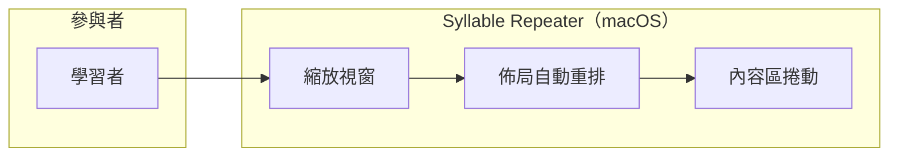

#### 3.2.2 前置條件

- App 已啟動；視窗最小尺寸維持 v1 既定的 1100×700（`MainFlutterWindow.swift` 之 `contentMinSize`）。

#### 3.2.3 觸發事件及重要邏輯

- **觸發事件**：使用者拖曳視窗邊緣改變尺寸，或按 macOS 全螢幕/還原。
- **重要邏輯**：
  1. 前端監聽視窗尺寸變化（Flutter `LayoutBuilder`/`MediaQuery`，即「依可用空間決定怎麼排」的機制）；
  2. 各功能區（左側導覽、匯入與分析、段落標籤、音節校正、練習頁、設定）依可用寬高重排：寬度不足時欄位改為上下堆疊或內容區出現水平/垂直捲軸；
  3. 波形圖等固定高度元件：寬度隨視窗伸縮（波形重取樣重繪），高度低於下限時整個內容區改為可垂直捲動；
  4. 任何互動元件（按鈕、切點、拖曳把手）不得被裁切到不可到達——「看不到」時必可「捲得到」；
  5. 縮放結束後 200ms 內完成重排定稿（過程中允許簡化渲染）。
- **例外**：低於最小尺寸的縮放由 macOS 視窗系統直接阻止（沿用 v1 機制），App 內不處理更小尺寸。

#### 3.2.4 節點描述

| 節點編號 | 節點名稱 | 責任物件 | 動作簡述 |
|----------|----------|----------|----------|
| N1 | 尺寸偵測 | 前端 | LayoutBuilder/MediaQuery 取得新視窗尺寸 |
| N2 | 佈局重排 | 前端 | 依斷點規則重排各功能區 |
| N3 | 波形重繪 | 前端 | 波形依新寬度重取樣繪製 |
| N4 | 捲動兜底 | 前端 | 放不下的內容以捲軸保證可到達 |

#### 3.2.5 後續動作

- 後置條件：任何 ≥1100×700 的視窗尺寸下，全部互動元件可見或可捲動到達；使用者工作狀態（已載入的課件、編輯中內容）不因縮放而丟失。

#### 3.2.6 非功能性清單

| 類別 | 指標/描述 | 實作要求 | 驗收方式 |
|------|-----------|----------|----------|
| 效能 | 縮放過程不卡死；定稿重排 ≤ 200ms | 波形 peaks 快取重用（承 v1） | 實機操作觀測 |

#### 3.2.7 驗收測試情境

| 編號 | 類型 | 情境（帶真實值） | 操作 | 預期結果 |
|------|------|------------------|------|----------|
| AT-10-01 | 正常 | 視窗 1600×1000，載入金標準例句課件 | 拖曳縮至 1100×700 | 匯入按鈕、播放鍵、11 個音節區塊、波形全部可見或可捲動到達，無元件被裁掉 |
| AT-10-02 | 邊界（下限） | 視窗恰為 1100×700 | 檢視每個功能區 | 六大功能區逐一切換，每區操作元件完整可用 |
| AT-10-03 | 邊界（下限外側） | 嘗試拖曳至 1000×600 | 拖曳 | macOS 阻止縮至 1100×700 以下（v1 既有行為不變） |
| AT-10-04 | 亂序 | 3 秒內連續放大縮小 10 次 | 快速拖曳 | 不崩潰、不殘影；停止後 200ms 內定稿 |
| AT-10-05 | 資料保存 | 音節校正進行到一半（已拖 2 個切點未存） | 縮放視窗 | 編輯狀態完整保留，切點位置不變 |

---

## 四、REQ-11 段落標籤與 .abolabel 標籤註記檔

### 3.1 需求概述

- **目的**：左側新增「段落標籤」功能區。使用者匯入多句音檔（如整首歌）後，顯示波形＋時間軸；系統自動以句子為單位切段並標籤；使用者可手動微調（滑動邊界、增、減標籤線）；標籤成果可匯出為 `.abolabel` 檔；重匯入相同音檔時提醒載入既有標籤檔；未儲存就要換音檔時攔截提示。
- **使用動機**：使用者拿到一整首歌，想挑其中一句來練。v1 只能吃單句音檔，使用者得先用外部工具（如 Audacity）自己剪——現在 App 內直接切好、選句、送進分析。最可能放棄點：**自動切句位置不準又難修**——因此手動微調是一等公民，且切好的成果可存檔重用。

### 3.2 業務流程

#### 3.2.1 用例圖

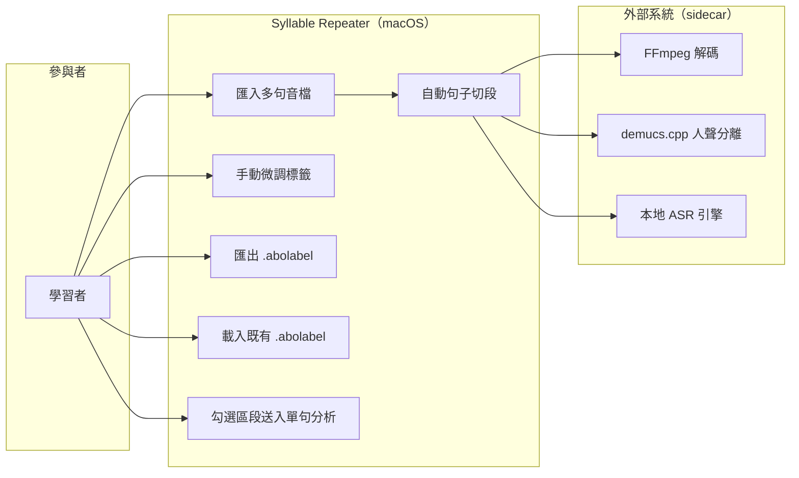

#### 3.2.2 前置條件

- FFmpeg／ASR sidecar 就緒；demucs.cpp 供選用（同 v1 REQ-01）；
- 音檔為受支援格式（mp3/wav/m4a/flac，單檔上限 10 分鐘，承 v1）。

#### 3.2.3 觸發事件及重要邏輯

- **觸發事件**：使用者在「段落標籤」功能區匯入音檔。
- **重要邏輯**：
  1. 前端接收音檔，計算內容雜湊（Content Hash——音檔的「指紋」，同一檔案指紋必相同）；
  2. 查本機標籤庫：若曾有同指紋音檔的 `.abolabel` 紀錄 → 彈出提示「找到當初的標籤註記檔，是否一併載入？」使用者可選載入或重新切段；
  3. FFmpeg 解碼 PCM，前端顯示波形＋時間軸（Audacity 式全檔總覽）；
  4. （預設開啟，可關）demucs.cpp 人聲分離 → 自動切句跑在人聲軌上（D2）；
  5. 本地 ASR 引擎（透過 TranscriberEngine port）產出句子級時間戳與文字 → 組裝 `Segment[]`，每段標起訖毫秒與句子文字；
  6. 前端在波形上畫出各 Segment 邊界線與編號；使用者可：**滑動**邊界線、**點擊間隙「＋」新增**標籤線、**選中後按「×」刪除**標籤線（相鄰段合併）、播放單一區段試聽驗證；
  7. 使用者按「匯出標籤」→ 另存 `.abolabel` 檔（zip＋JSON：含音檔指紋、Segment 清單、schema 版本號）；
  8. **未儲存攔截**：標籤有未儲存變更時，使用者要匯入下一個音檔 → 彈出另存提示，等待使用者選「儲存」或「不儲存」後才繼續（不可靜默丟棄，見 2.5 不可接受清單）；
  9. 使用者勾選一個 Segment 按「下一步」→ 該區段（起訖毫秒＋文字）自動帶入「匯入與分析」功能區，可按「開始分析」（接 REQ-12）。
- **例外**：ASR 失敗 → 波形與時間軸仍可用，使用者可全手動切段（標籤功能不因辨識失敗而癱瘓）；sidecar 崩潰不拖垮 App（M4）。
- **阻力點記載**：長音檔（10 分鐘）自動切段為等待熱點，須顯示階段化進度（解碼中/分離中/切段中）。

#### 3.2.3.1 業務流程圖

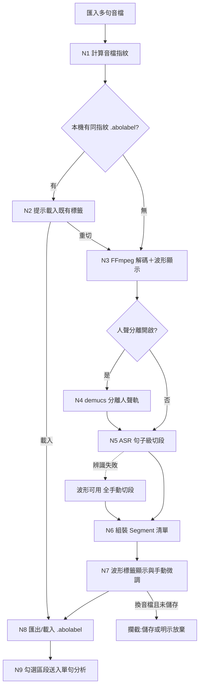

#### 3.2.4 節點描述

| 節點編號 | 節點名稱 | 責任物件 | 動作簡述 |
|----------|----------|----------|----------|
| N1 | 指紋計算 | 伺服器端（Domain） | 計算音檔 Content Hash |
| N2 | 既有標籤提醒 | 前端 | 找到同指紋標籤檔時提示載入 |
| N3 | 解碼與波形 | 外部系統（FFmpeg）＋前端 | 解碼 PCM、繪全檔波形與時間軸 |
| N4 | 人聲分離 | 外部系統（demucs.cpp） | 產出人聲軌供切段（可關閉） |
| N5 | 自動切段 | 外部系統（本地 ASR） | 句子級時間戳與文字 |
| N6 | Segment 組裝 | 伺服器端（Domain：SegmentEngine） | 組裝 Segment[]（起訖 ms、文字、語言標記） |
| N7 | 標籤微調 | 前端 | 滑動邊界、＋新增、×刪除、區段試聽 |
| N8 | 標籤存取 | 伺服器端（Domain）＋前端 | .abolabel 讀寫（zip＋JSON＋schema 版本） |
| N9 | 送入分析 | 前端 | 勾選區段帶入「匯入與分析」 |

#### 3.2.5 後續動作

- 勾選的 Segment（起訖毫秒＋句子文字＋語言標記）交付 REQ-12 單句分析；
- 後置條件：Segment 時間區間單調遞增、互不重疊、全數落在音檔總時長內；`.abolabel` 檔可在重匯入同指紋音檔時完整還原標籤狀態。

#### 3.2.6 非功能性清單

| 類別 | 指標/描述 | 實作要求 | 驗收方式 |
|------|-----------|----------|----------|
| 效能 | 3 分鐘歌曲的解碼＋分離＋自動切段全程 ≤ 5 分鐘（基準機 Intel i5-8259U，承 v1 Q10 基準） | 階段化進度顯示 | 碼表實測 |
| 相容性 | `.abolabel` 帶 schema 版本號，舊版檔案可被新版 App 讀取 | JSON schema 版本欄位 | 版本升級讀取測試 |
| 穩定性 | ASR 失敗時標籤功能仍可全手動使用 | 波形與手動操作不依賴辨識結果 | 故障注入（kill ASR sidecar） |

#### 3.2.7 驗收測試情境

| 編號 | 類型 | 情境（帶真實值） | 操作 | 預期結果 |
|------|------|------------------|------|----------|
| AT-11-01 | 正常 | 匯入 3 分鐘英文歌（含伴奏），人聲分離開啟 | 等待自動切段 | 波形＋時間軸顯示；切出句子級 Segment（如 24 段），各段帶文字與起訖毫秒，邊界線與編號可見 |
| AT-11-02 | 正常 | AT-11-01 完成後，第 5 段邊界原為 42300ms | 滑動至 42800ms；在第 7/8 段間隙按「＋」；選第 12 段按「×」 | 邊界更新為最近零交越吸附值；新增一條標籤線（段數+1）；第 12 段與相鄰段合併（段數−1）；編號即時重排 |
| AT-11-03 | 正常 | 標籤調整完成 | 按「匯出標籤」另存 `song-a.abolabel` | 產出 zip＋JSON 檔；重匯入同一音檔時提示「找到當初的標籤註記檔」，載入後標籤狀態完整還原 |
| AT-11-04 | 資料保存（攔截） | 標籤有未儲存變更 | 直接匯入另一個音檔 B | 彈出另存提示；選「儲存」→ 存檔後才載入 B；選「不儲存」→ 明示放棄後載入 B；關閉提示 → 停留原音檔，不載入 B |
| AT-11-05 | 錯誤輸入 | 匯入 0 byte 的 broken.mp3 | 匯入 | 明確錯誤「無法解碼」，App 不崩 |
| AT-11-06 | 例外 | 自動切段進行中 kill -9 ASR sidecar | 觀察 | App 不崩；提示「切段失敗，可重試或手動切段」；波形與手動標籤功能可用 |
| AT-11-07 | 邊界（時長上限） | 匯入 10 分 00 秒音檔／10 分 01 秒音檔 | 分別匯入 | 前者正常進入切段；後者明確拒絕（超過單檔上限，承 v1） |
| AT-11-08 | 亂序 | 自動切段進行中連按「匯入」3 次 | 快速點擊 | 匯入鈕置灰，僅一個切段任務 |

---

## 五、REQ-12 匯入與分析改為單句模式

### 3.1 需求概述

- **目的**：「匯入與分析」功能區定位為**單句分析**：入口一＝直接在本區「匯入音檔」放入單句音檔（v1 原流程）；入口二＝由「段落標籤」區勾選一個 Segment 帶入。按「開始分析」後走 v1 REQ-01 對齊管線，音節預覽區塊與字稿區域同步顯示辨識結果。
- **使用動機**：多句音檔走段落標籤（REQ-11）、單句素材直接匯入——兩條路都通到同一個分析入口，使用者不需理解內部差異。
- **決策留痕**：原提案含「無音檔時可寫句子由 TTS 生成音檔」分支，已撤回（D1）；無音檔時一律提示先匯入音檔或到段落標籤區選句。

### 3.2 業務流程

#### 3.2.1 用例圖

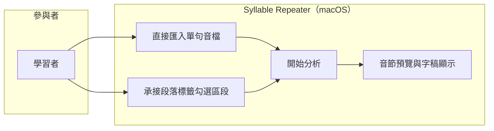

#### 3.2.2 前置條件

- 入口一：受支援格式之單句音檔；入口二：REQ-11 已勾選一個 Segment 按「下一步」。

#### 3.2.3 觸發事件及重要邏輯

- **觸發事件**：使用者按「開始分析」。
- **重要邏輯**：
  1. 入口整合：入口一取整檔為分析對象；入口二取 Segment 的起訖毫秒切出該區段 PCM（**原音切片**，不重新編碼）為分析對象，Segment 的句子文字作為字稿預填；
  2. 走 v1 REQ-01 對齊管線（解碼→可選分離→ASR 詞級時間戳→音節切分），經 TranscriberEngine／Syllabifier port（REQ-17 抽層）；
  3. 分析完成 → **音節預覽區顯示各音節區塊文字**，字稿區域同步顯示相同文字來源（兩處同源，改一處另一處跟著更新）；
  4. 手動譯文輸入區位於字稿區域附近（REQ-20 搬移後位置），可在此時填寫或稍後補；
  5. **無音檔防呆**：未匯入音檔且無承接區段時，「開始分析」置灰，並顯示引導文案「請先匯入音檔，或到『段落標籤』選擇一個區段」。
- **例外**：同 v1 REQ-01（sidecar 失敗回報、可重試、App 不崩）。

#### 3.2.4 節點描述

| 節點編號 | 節點名稱 | 責任物件 | 動作簡述 |
|----------|----------|----------|----------|
| N1 | 入口整合 | 前端＋伺服器端（Domain） | 整檔或 Segment 切片作為分析對象 |
| N2 | 對齊管線 | 伺服器端＋外部系統 | v1 REQ-01 管線（經 port 抽層） |
| N3 | 同源顯示 | 前端 | 音節預覽區塊與字稿區域同步顯示 |
| N4 | 無音檔防呆 | 前端 | 分析鈕置灰＋引導文案 |

#### 3.2.5 後續動作

- `AlignmentResult` 交付 REQ-02（v1 校正）與 REQ-13（切點增減）；
- 後置條件：入口二來的分析對象，其 PCM 逐 sample 等於原音檔該區段（M1）。

#### 3.2.6 非功能性清單

無新增（沿用 v1 REQ-01 效能與穩定性指標）。

#### 3.2.7 驗收測試情境

| 編號 | 類型 | 情境（帶真實值） | 操作 | 預期結果 |
|------|------|------------------|------|----------|
| AT-12-01 | 正常 | 直接匯入金標準例句音檔（3.2 秒） | 開始分析 | 切出 11 音節；音節預覽區 11 個區塊文字與字稿區域文字一致同源 |
| AT-12-02 | 正常 | 從段落標籤勾選第 5 段（42300ms～45100ms，文字 `I don't wanna talk`） | 下一步→開始分析 | 分析對象為該 2.8 秒原音切片；字稿預填 `I don't wanna talk`；音節預覽正確顯示 |
| AT-12-03 | 錯誤輸入（防呆） | 未匯入任何音檔、無承接區段 | 檢視「開始分析」 | 按鈕置灰；顯示引導文案；**不出現任何 TTS／生成選項**（D1 核心不被破壞） |
| AT-12-04 | 資料保存 | AT-12-02 分析完成 | 比對切片 PCM | 逐 sample 等於原音檔 42300ms～45100ms 區間（M1） |
| AT-12-05 | 亂序 | 分析中連按「開始分析」3 次 | 快速點擊 | 按鈕置灰，僅一個分析任務（承 v1 AT-01-05） |

---

## 六、REQ-13 音節切點增減校正

### 3.1 需求概述

- **目的**：在「音節校正」功能區，使用者除了 v1 的拖動切點外，還可以**刪除切點**（相鄰兩音節合併為一）與**新增切點**（一個音節區段一分為二）；文字區塊內容可編輯（如 `I dont` 改為 `I don't`）；全部操作可撤銷。
- **使用動機**：自動切分有時多切或漏切——如把 `I don't` 錯切成 `I`＋`dont` 兩塊，使用者想按一下叉叉把它們合回去；反過來漏切時，在區段內點一下加一條線拆開。最可能放棄點：**合併/拆分後編號亂掉、或後悔了回不去**——因此編號即時重排（REQ-14）與撤銷是配套必需。
- **核心衝擊與化解**：切點增減會改變音節總數 → 依 **M11**，「編輯後的當時總數」即為 M2 疊加步數與統計基準（金標準 11 僅為未編輯預設）。

### 3.2 業務流程

#### 3.2.1 用例圖

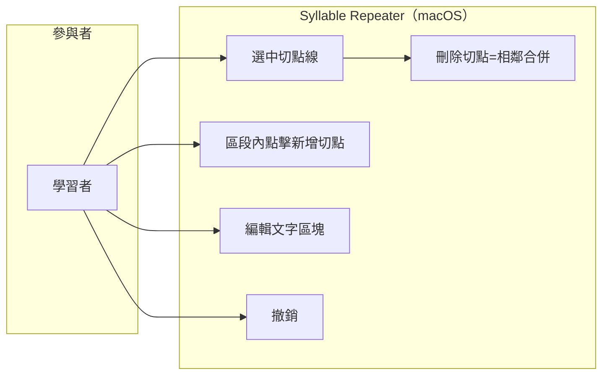

#### 3.2.2 前置條件

- REQ-12 分析完成，工作階段存在合法 `AlignmentResult`（音節清單與波形已顯示）。

#### 3.2.3 觸發事件及重要邏輯

- **觸發事件**：使用者在波形韻律圖上點擊切點垂直線，或在某音節區段內空白處點擊。
- **重要邏輯**：
  1. **選中切點**：點擊垂直線 → 該線變色（選中態），線外側邊緣浮現「×」刪除圖示；此時可（a）滑動改位置（v1 既有拖動）或（b）按「×」刪除；
  2. **刪除切點**：按「×」→ 該切點移除，左右兩音節合併為一個（文字串接，如 `I`＋`dont` → `I dont`；時間區間取聯集）；音節總數 −1；
  3. **新增切點**：在某音節區段內任意處點一下 → 浮現「＋」圖示 → 按下 → 於點擊位置插入一條垂直線（吸附最近零交越，承 v1），該音節一分為二；新產生的後半文字區塊為**空白待填**，標 `needsReview`；音節總數 +1；
  4. **文字編輯**：任何文字區塊皆可雙擊進入編輯（如 `I dont` 改 `I don't`）；編輯後文字覆蓋顯示用字稿，原始辨識文字保留於 `needsReview` 佐證欄供比對；
  5. **撤銷**：左上方既有「撤銷」按鈕（⌘Z）依序回復拖動/刪除/新增/改字操作，每步一筆歷史；
  6. 每次增減後：音節總數、步驟預覽、REQ-14 的編號顯示即時更新（M11）。
- **邊界約束**：切點不足 2 個音節時（僅剩 1 個音節）「×」不再出現（至少保留 1 個音節）；新增切點不得落在距既有切點 <50ms 處（防誤觸產生碎片段）。
- **例外**：文字編輯為空字串時，儲存為空白區塊並強制標 `needsReview`（允許暫存，不阻斷流程）。

#### 3.2.3.1 業務流程圖

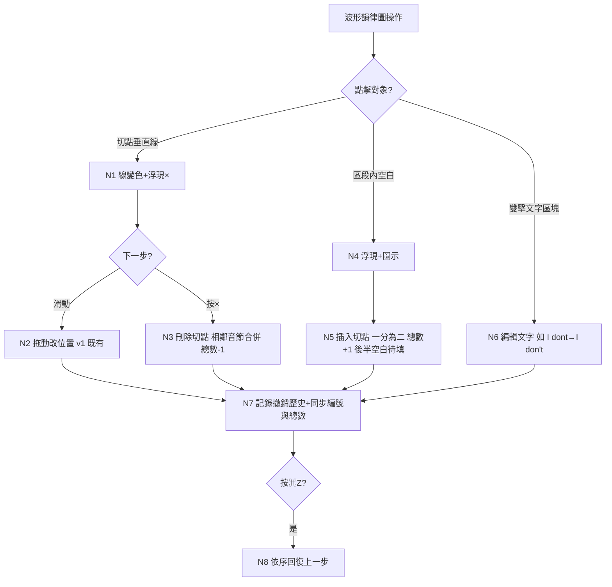

#### 3.2.4 節點描述

| 節點編號 | 節點名稱 | 責任物件 | 動作簡述 |
|----------|----------|----------|----------|
| N1 | 切點選中態 | 前端 | 變色＋浮現「×」 |
| N2 | 拖動校正 | 前端＋伺服器端（Domain） | v1 REQ-02 既有流程 |
| N3 | 刪除合併 | 伺服器端（Domain：AlignmentEngine） | 移除切點、合併音節、驗證區間連續 |
| N4 | 新增引導 | 前端 | 區段內點擊浮現「＋」 |
| N5 | 插入拆分 | 伺服器端（Domain：AlignmentEngine） | 零交越吸附、拆分區段、後半空白＋needsReview |
| N6 | 文字編輯 | 前端＋伺服器端（Domain） | 覆蓋顯示字稿、保留原辨識文字 |
| N7 | 歷史與同步 | 伺服器端（Domain） | undo 歷史；總數/編號即時同步（M11） |
| N8 | 撤銷 | 伺服器端（Domain） | 逐步回復 |

#### 3.2.5 後續動作

- 校正後 `syllables[]` 交付練習（REQ-15/16）、韻律分析、比對——一律使用編輯後的當時值；
- 後置條件：時間區間單調遞增、互不重疊；音節總數 = 編輯後實際值（M11）。

#### 3.2.6 非功能性清單

| 類別 | 指標/描述 | 實作要求 | 驗收方式 |
|------|-----------|----------|----------|
| 效能 | 增減操作回饋 ≤ 100ms；撤銷 ≤ 100ms | 操作皆為記憶體內模型變更 | 實機操作觀測 |

#### 3.2.7 驗收測試情境

| 編號 | 類型 | 情境（帶真實值） | 操作 | 預期結果 |
|------|------|------------------|------|----------|
| AT-13-01 | 正常（刪除） | 音檔切出 `I`(0-420ms)＋`dont`(420-880ms) 兩音節 | 點 420ms 切點線→按「×」 | 合併為 `I dont`(0-880ms)；音節總數 −1；編號重排 |
| AT-13-02 | 正常（新增/後悔藥） | AT-13-01 之後 | 在 `I dont` 區段內點一下→按「＋」 | 於點擊處（零交越吸附）插入切點；拆為兩塊，後半為空白區塊標 needsReview；總數 +1 |
| AT-13-03 | 正常（改字） | AT-13-02 後半空白區塊 | 雙擊輸入 `don't` | 顯示 `don't`；原辨識文字保留於佐證欄 |
| AT-13-04 | 資料保存（撤銷） | 連續做：拖動→刪除→新增→改字 | 按 ⌘Z 四次 | 依序回復：改字→新增→刪除→拖動，狀態與操作前完全一致 |
| AT-13-05 | 邊界（最少音節） | 反覆合併至僅剩 1 個音節 | 點選最後區段 | 「×」不出現，無法再合併 |
| AT-13-06 | 邊界（防碎片，兩側） | 既有切點於 2380ms | 在 2429ms 處嘗試新增／在 2431ms 處嘗試新增 | 前者拒絕（<50ms）；後者成功（≥50ms） |
| AT-13-07 | 核心不被破壞（M11） | 金標準例句 11 音節，刪 1 個切點 | 進入疊加練習 | 步驟總數顯示 10（＝當時值），不再是 11；M2 演算法本身不變（第 n 步仍為句尾往前 n 個） |

---

## 七、REQ-14 波形↔文字雙向高亮與序號同步

### 3.1 需求概述

- **目的**：校正過程中，選中波形韻律圖某區段或文字區域某文字區塊時，**兩邊同時以黃色標記**；每個文字區塊下方顯示排序號；波形切點圓點改為圓點內寫阿拉伯數字（區段號）；全部編號隨 REQ-13 的增減操作即時重排。
- **使用動機**：音節一多（如 communication 5 個），使用者對不上「我在改的是波形上哪一段＝文字上哪一塊」——雙向高亮＋編號讓「現在在校正第幾號」一眼可見。

### 3.2 業務流程

#### 3.2.1 用例圖

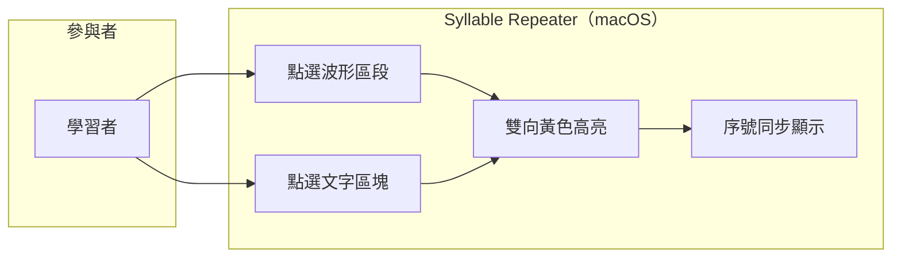

#### 3.2.2 前置條件

- 同 REQ-13（存在 `AlignmentResult`，波形與文字區塊已顯示）。

#### 3.2.3 觸發事件及重要邏輯

- **觸發事件**：使用者點選波形上某音節區段，或點選文字區域某文字區塊。
- **重要邏輯**：
  1. 選中狀態為單一共享狀態（`selectedSyllableIndex`）：點波形第 k 段 → 文字第 k 塊同步黃色高亮；點文字第 k 塊 → 波形第 k 段同步黃色高亮；
  2. 每個文字區塊下方常駐顯示排序號（1 起算）；
  3. 波形上各區段起點圓點改為「圓點內寫阿拉伯數字」＝區段號；
  4. REQ-13 任何增減操作後，兩邊編號即時重排（刪第 3 段 → 原第 4 段變 3 號，依此類推）；
  5. 高亮與選中狀態不影響播放（試聽照常可用）。
- **例外**：無選中時無高亮；選中的區段被刪除時選中狀態清空。

#### 3.2.4 節點描述

| 節點編號 | 節點名稱 | 責任物件 | 動作簡述 |
|----------|----------|----------|----------|
| N1 | 共享選中狀態 | 前端 | selectedSyllableIndex 單一來源 |
| N2 | 波形高亮 | 前端 | 選中區段黃色標記＋圓點編號 |
| N3 | 文字高亮 | 前端 | 選中區塊黃色標記＋下方序號 |
| N4 | 編號重排 | 前端 | 隨增減操作即時更新 |

#### 3.2.5 後續動作

- 後置條件：任意時刻波形編號序列與文字序號序列完全一致（1..N 連續無跳號）。

#### 3.2.6 非功能性清單

| 類別 | 指標/描述 | 實作要求 | 驗收方式 |
|------|-----------|----------|----------|
| 效能 | 高亮切換 ≤ 50ms | 前端狀態變更即繪 | 實機操作觀測 |

#### 3.2.7 驗收測試情境

| 編號 | 類型 | 情境（帶真實值） | 操作 | 預期結果 |
|------|------|------------------|------|----------|
| AT-14-01 | 正常 | 金標準例句 11 音節 | 點波形第 8 段（`ca`） | 波形第 8 段與文字第 8 塊同時黃色高亮；圓點顯示 8、文字下方顯示 8 |
| AT-14-02 | 正常（反向） | 同上 | 點文字第 10 塊（`tion`） | 波形第 10 段同步黃色高亮 |
| AT-14-03 | 正常（重排） | 選中第 5 塊，刪除第 3 段切點 | 觀察 | 編號 1..10 連續重排；原第 5 塊變 4 號且維持選中與高亮對應 |
| AT-14-04 | 邊界 | 選中最後一段（第 11） | 刪除該段切點使其被合併 | 選中狀態清空、無殘留高亮 |
| AT-14-05 | 亂序 | 1 秒內交替點擊波形/文字 10 次 | 快速操作 | 高亮始終兩邊一致，無錯位 |

---

## 八、REQ-15 練習內容自由編輯區

### 3.1 需求概述

- **目的**：音節校正下方新增「練習內容自由編輯區」：按「一鍵生成」依當時音節總數排出等量長條型次區域（第 1 列預設句尾 1 個音節、第 2 列預設句尾 2 個……最後一列預設全部——即句尾疊加的可視化初始排列）；使用者可在次區域間「＋」插入新列、列左側「−」刪除列；把上方文字區塊像積木一樣拖曳進次區域排列；圈選多個相鄰積木設為一個組塊；每個積木/組塊可設重複次數（預設 3 次）與靜音倍數（預設該塊原時長 2 倍）；本區域有**獨立撤銷**；每列右側有播放預覽鍵。
- **使用動機**：自動句尾疊加是固定套路；使用者想針對自己卡住的組合（如 `itll`＋`rain` 的連音）自組練習序列，像排積木一樣自由。最可能放棄點：**排錯了改不動、圈錯了拆不掉**——因此獨立撤銷與逐塊設定是配套必需。
- **紅線**：所有積木播放皆為原音切片串接（M1 補述，D4）；本區僅重排「播放順序與次數」，不產生任何新聲音。

### 3.2 業務流程

#### 3.2.1 用例圖

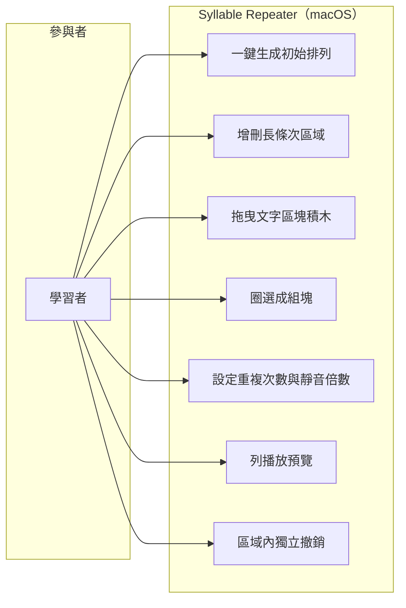

#### 3.2.2 前置條件

- REQ-13 校正完成（或使用者接受自動值）；存在當時音節總數 N 與各音節時間區間。

#### 3.2.3 觸發事件及重要邏輯

- **觸發事件**：使用者按「一鍵生成」。
- **重要邏輯**：
  1. **一鍵生成**：依當時音節總數 N（M11）排出 N 個長條型次區域；第 i 列預填「句尾數來 i 個音節」的文字區塊組（第 1 列＝句尾 1 塊；最後一列＝全部 N 塊）——即 M2 句尾疊加的可視化初始設置；
  2. **列的增刪**：各列間隙左側「＋」→ 於該處插入一個空列；各列左側「−」→ 刪除該列；
  3. **積木拖曳**：上方文字區塊可拖入任一列，一列內可放任意數量、任意順序、可重複放同一塊（如 `[rain, itll, itll, rain]`）；列內積木可再拖動改序（如改為 `[itll, rain, itll, rain]`）；
  4. **圈選組塊**：圈選同列相鄰多個積木 → 設為一個組塊（如 `[itll, rain+itll+rain]`）；組塊視為單一設定單位；圈錯了按本區撤銷回復再重圈（如修正為 `[itll, rain, itll+rain]`）；
  5. **逐塊設定**：點擊積木/組塊 → 顯示設定：重複次數（預設 3，範圍 1–10 承 v1）與靜音倍數（預設 2 倍＝該塊原時長 × 2，範圍 0–5 倍，0 表示無靜音）；例：`itll` 維持 3 次 2 倍；`rain` 改 4 次靜音不變；`itll+rain` 組塊改 4 次 3 倍；
  6. **列播放預覽**：列右側播放鍵 → 依該列積木順序播放：每塊播放「原音切片 × 重複次數」，塊間插入該塊靜音（原時長 × 倍數）；全程原音切片串接（M1 補述）；
  7. **獨立撤銷**：本區域專屬撤銷按鈕，只回復本區操作（與上方校正區的撤銷互不干擾），涵蓋：生成、增刪列、拖曳、圈選、設定變更。
- **例外**：上方校正區的音節總數變更（REQ-13 增減）後，已生成的排列**不自動重排**，顯示「音節已變更，排列可能過期」提示條，由使用者決定重新一鍵生成或保留手動排列。

#### 3.2.3.1 業務流程圖

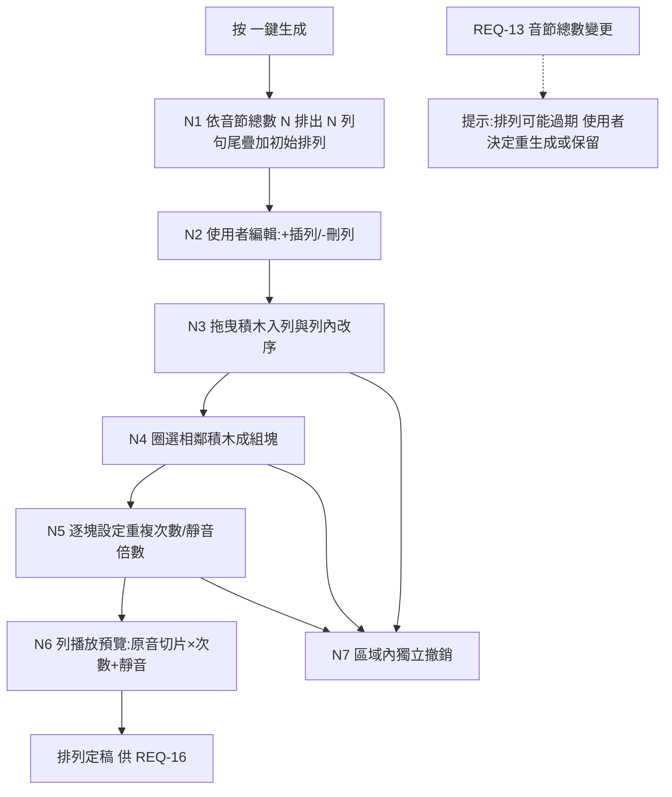

#### 3.2.4 節點描述

| 節點編號 | 節點名稱 | 責任物件 | 動作簡述 |
|----------|----------|----------|----------|
| N1 | 一鍵生成 | 伺服器端（Domain：PracticeEngine 擴充） | 依 N 產生句尾疊加初始 Arrangement |
| N2 | 列管理 | 前端＋伺服器端（Domain） | 插列/刪列，更新 Arrangement |
| N3 | 積木拖曳 | 前端 | 拖入/改序，寫回 PracticeBlock 序列 |
| N4 | 組塊 | 伺服器端（Domain） | 相鄰積木合為一個 PracticeBlock |
| N5 | 塊設定 | 伺服器端（Domain） | repeatN（1–10）與靜音倍數（0–5）驗證與存放 |
| N6 | 列預覽 | 伺服器端（Domain）＋前端 | 原音切片串接渲染＋播放（M1 補述路徑） |
| N7 | 獨立撤銷 | 伺服器端（Domain） | 本區專屬 undo 歷史 |

#### 3.2.5 後續動作

- 定稿的 `PracticeArrangement` 交付 REQ-16 作為練習播放與匯出內容（M12 覆蓋規則）；
- 後置條件：每個 PracticeBlock 的音訊來源均為本 Lesson 原音檔切片（可追溯至 syllables[] 時間區間）。

#### 3.2.6 非功能性清單

| 類別 | 指標/描述 | 實作要求 | 驗收方式 |
|------|-----------|----------|----------|
| 效能 | 拖曳跟手（≥30fps）；列預覽啟動 ≤ 500ms | PCM 切片快取重用 | 實機操作觀測 |

#### 3.2.7 驗收測試情境

| 編號 | 類型 | 情境（帶真實值） | 操作 | 預期結果 |
|------|------|------------------|------|----------|
| AT-15-01 | 正常（一鍵生成） | 音節數 11（金標準例句） | 按「一鍵生成」 | 排出 11 列：第 1 列 `skills`、第 2 列 `tion skills`、…第 11 列全部 11 塊（＝M2 步驟表可視化） |
| AT-15-02 | 正常（插列＋自組） | AT-15-01 後，另一課件音節含 `itll`、`rain` | 第 1、2 列間按「＋」插空列；依序拖入 `rain, itll, itll, rain`；再拖動改為 `itll, rain, itll, rain` | 新列出現於指定位置；列內順序＝最終拖曳結果 |
| AT-15-03 | 正常（圈選與修正） | AT-15-02 之列 | 圈選後三塊成 `[itll, rain+itll+rain]`；按本區撤銷；重圈為 `[itll, rain, itll+rain]` | 第一次圈選生效→撤銷回復→第二次圈選生效；上方校正區撤銷歷史不受影響 |
| AT-15-04 | 正常（逐塊設定） | `itll`（原時長 300ms）、`rain`（350ms）、組塊 `itll+rain`（650ms） | `itll` 不動；`rain` 改 4 次；`itll+rain` 改 4 次＋3 倍 | `itll`＝3 次＋600ms 靜音；`rain`＝4 次＋700ms 靜音；組塊＝4 次＋1950ms 靜音 |
| AT-15-05 | 正常（列預覽） | AT-15-04 之列 | 按列播放鍵 | 播放順序與次數/靜音完全符合設定；全程為原音切片串接，無任何生成音 |
| AT-15-06 | 邊界（設定範圍兩側） | 任一積木 | 重複次數設 0／設 1；設 10／設 11；靜音倍數設 −1／設 0；設 5／設 6 | 0、11、−1、6 拒絕；1、10、0、5 接受 |
| AT-15-07 | 亂序 | 列預覽播放中 | 拖曳該列積木 | 播放停止或以舊排列播完（不得播出半新半舊的混合序列） |
| AT-15-08 | 資料保存（過期提示） | 排列定稿後回 REQ-13 刪 1 個切點 | 回到本區 | 顯示「音節已變更，排列可能過期」；原排列保留，不自動改動 |
| AT-15-09 | 核心不被破壞（M1 補述） | 檢查 AT-15-05 的播放/匯出 PCM | 逐 sample 比對 | 每一段皆可對應回原音檔的某個 syllable 時間區間；靜音段為數位零；無任何非原音 sample |

---

## 九、REQ-16 句尾疊加區顯示自訂排列

### 3.1 需求概述

- **目的**：句尾疊加練習頁的錄音播放練習單元與匯出音檔功能，其內容依 **M12** 決定：使用者無自訂排列 → 顯示 M2 自動句尾疊加（v1 REQ-03 原行為）；使用者在 REQ-15 定稿自訂排列 → 顯示自訂排列的各列作為練習單元。
- **使用動機**：排好的積木要能直接拿來練——每列＝一個練習單元，附播放、錄音、匯出，跟 v1 疊加步驟的操作體驗一致，不用學第二套介面。

### 3.2 業務流程

#### 3.2.1 用例圖

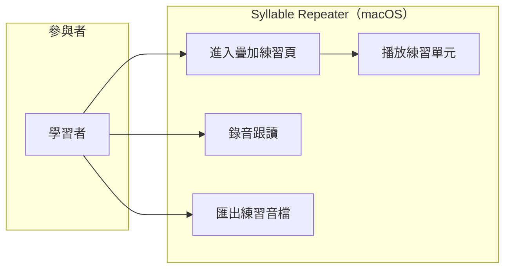

#### 3.2.2 前置條件

- 存在合法 `syllables[]`；有或無 `PracticeArrangement` 皆可進入。

#### 3.2.3 觸發事件及重要邏輯

- **觸發事件**：使用者開啟課件的疊加練習頁。
- **重要邏輯**：
  1. **內容判定（M12）**：查該 Lesson 是否有定稿的自訂排列——無 → `buildSteps`（M2 自動句尾疊加，步數＝當時音節總數 M11）；有 → 以排列各列為練習單元序列；
  2. 每個練習單元：播放（含各塊重複次數與靜音設定）、錄音跟讀（承 v1 REQ-06）、單元匯出 mp3（承 v1 REQ-04）；
  3. **合併匯出靜音規則（M3 雙軌）**：自動模式＝段落間靜音＝前一步 totalDurationMs（v1 原文）；自訂模式＝依各塊靜音倍數設定；
  4. 使用者刪除自訂排列 → 頁面回落自動句尾疊加；
  5. 頁面明示目前模式（「自動疊加」／「自訂排列」徽章），避免使用者搞不清在練哪套。
- **例外**：排列過期（REQ-15 例外情境）時，本頁沿用過期前的排列並顯示同一提示條。

#### 3.2.4 節點描述

| 節點編號 | 節點名稱 | 責任物件 | 動作簡述 |
|----------|----------|----------|----------|
| N1 | 內容判定 | 伺服器端（Domain：PracticeEngine） | M12：無自訂→buildSteps；有→排列各列 |
| N2 | 單元播放 | 伺服器端（Domain）＋前端 | 原音切片×次數＋靜音（M1 補述路徑） |
| N3 | 錄音跟讀 | 前端＋伺服器端 | 承 v1 REQ-06 |
| N4 | 匯出 | 伺服器端（Domain） | 單元/合併匯出（M3 雙軌） |
| N5 | 模式徽章 | 前端 | 顯示自動/自訂 |

#### 3.2.5 後續動作

- 後置條件：播放與匯出內容和來源模式一致；切換模式不影響已存進度資料。

#### 3.2.6 非功能性清單

無新增（沿用 v1 REQ-03/REQ-04 指標）。

#### 3.2.7 驗收測試情境

| 編號 | 類型 | 情境（帶真實值） | 操作 | 預期結果 |
|------|------|------------------|------|----------|
| AT-16-01 | 正常（預設） | 金標準例句課件，無自訂排列 | 開啟疊加練習頁 | 顯示 11 步自動句尾疊加（第 1 步 `skills`…），徽章「自動疊加」——v1 REQ-03 行為分毫不差 |
| AT-16-02 | 正常（覆蓋） | 同課件，REQ-15 定稿 3 列自訂排列 | 開啟疊加練習頁 | 顯示 3 個練習單元＝排列的 3 列，徽章「自訂排列」 |
| AT-16-03 | 正常（回落） | AT-16-02 後刪除自訂排列 | 重新開啟 | 回落 11 步自動疊加 |
| AT-16-04 | 核心不被破壞（M2/M12） | AT-16-01 狀態 | 檢查第 2 步 | 內容為 `tion skills`（純音節疊加，不吸附成 `communication skills`）——自訂功能存在不得改變自動模式行為 |
| AT-16-05 | 核心不被破壞（M3） | 自動模式勾選第 1、2 步合併匯出（第 1 步 totalDurationMs=1260ms） | 匯出 | 兩段間靜音恰為 1260ms（v1 規則不變） |
| AT-16-06 | 資料保存 | 自訂模式練習 2 個單元後切回自動 | 檢查進度 | 已記錄的 Attempt 資料完整保留 |

---

## 十、REQ-17 語音辨識模型抽換與多語言基礎

### 3.1 需求概述

- **目的**：把「聲音→文字時間戳」（ASR）與「單字→音節」（Syllabifier）兩個環節從寫死的 whisper.cpp／CMUdict，抽換為 Domain 層 port（插座）＋infra 層 adapter（插頭）架構，並建立依 `language` 路由的 Registry（名冊）。v1.1 交付：whisper.cpp adapter（既有功能包裝）＋ EnglishSyllabifier（CMUdict＋母音團兜底包裝）；未來新增引擎/語言只加插頭、不改插座。
- **使用動機**：使用者明示「未來會有其他語種練習、聲音模型與時俱進」（D3）；今天不抽層，未來每換一次模型都要動主程式。
- **限制**：僅限本地 ASR（D7，Non-scope 11）；每個新引擎/模型過 M9 授權白名單。

### 3.2 業務流程

#### 3.2.1 用例圖

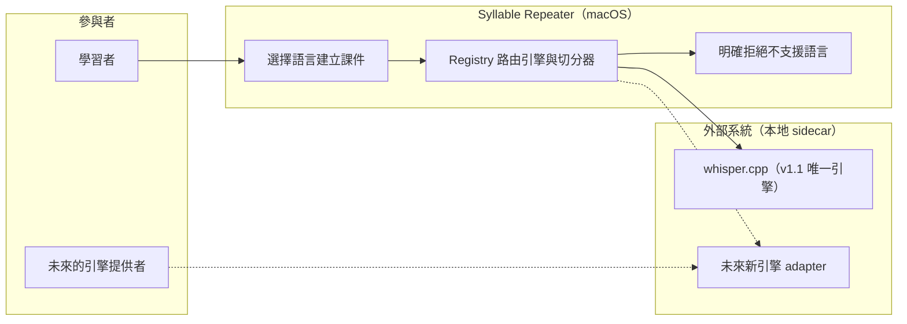

#### 3.2.2 前置條件

- 至少一個 ASR adapter 與一個 Syllabifier adapter 已註冊（v1.1 出廠＝whisper.cpp＋EnglishSyllabifier，各支援 `en`）。

#### 3.2.3 觸發事件及重要邏輯

- **觸發事件**：使用者匯入音檔／建立課件時指定語言（v1.1 預設且僅有 `en`）；或（未來）安裝新引擎後於設定頁註冊。
- **重要邏輯**：
  1. **port 定義（Domain，M5/M13）**：`TranscriberEngine`（輸入：PCM＋語言＋可選字稿；輸出：詞級時間戳 `List<Word>`；自述：引擎名、版本、支援語言清單）；`Syllabifier`（輸入：Word＋語言；輸出：音節切分與計數；自述：支援語言清單）；兩 port 互不依賴；
  2. **Registry 路由（M14）**：建課件時以 `language` 查詢兩個 Registry——**兩者皆有**該語言 → 放行；**缺任一** → 明確拒絕：「不支援 `<語言>`：缺少 <辨識引擎/音節切分器>」並列出目前已註冊的語言清單；**嚴禁**默默改用英文切分器；
  3. **v1.1 交付內容**：whisper.cpp 包裝為 `WhisperCppTranscriberAdapter`（沿用 v1 既有類別對齊新 port）；CMUdict＋母音團兜底包裝為 `EnglishSyllabifier`；行為與 v1 完全一致（回歸不變性）；
  4. **語言標記（M14）**：`Lesson` 與 `Segment` 持久化 `language` 欄位；`.abopack`/`.abolabel` schema 均含此欄；讀取無此欄的 v1 舊檔時預設補 `en`（向後相容）；
  5. **新引擎上架程序**（文件化，供未來執行）：adapter 實作 → M9 授權審查（引擎與模型檔皆查）→ sidecar 隔離驗證（M4 故障注入）→ 金標準例句回歸（英文引擎）或該語言等價基準 → Registry 註冊。
- **例外**：引擎 sidecar 崩潰 → 承 v1 M4（回報失敗、App 不崩、可重試）。

#### 3.2.4 節點描述

| 節點編號 | 節點名稱 | 責任物件 | 動作簡述 |
|----------|----------|----------|----------|
| N1 | port 契約 | 伺服器端（Domain） | TranscriberEngine／Syllabifier 介面定義 |
| N2 | Registry 路由 | 伺服器端（Domain） | 依 language 查引擎與切分器，缺則拒絕 |
| N3 | whisper adapter | 外部系統（sidecar）＋infra | v1 既有功能對齊新 port |
| N4 | EnglishSyllabifier | 伺服器端（Domain/infra） | CMUdict＋母音團兜底包裝 |
| N5 | 語言標記持久化 | 伺服器端（Domain） | Lesson/Segment/.abopack/.abolabel 之 language 欄 |

#### 3.2.5 後續動作

- 後置條件：v1 全部既有流程走新 port 後行為不變（金標準例句仍 11 音節）；新引擎上架不需修改 Domain 程式碼。

#### 3.2.6 非功能性清單

| 類別 | 指標/描述 | 實作要求 | 驗收方式 |
|------|-----------|----------|----------|
| 可維護性 | 新增一個引擎 adapter 不動 Domain 任何檔案 | port/adapter 邊界測試 | 程式碼審查＋依賴方向檢查 |
| 合規性 | 每個引擎與模型檔逐項過 M9 白名單 | license-manifest 擴充條目 | CT-09 機制審查 |
| 效能 | 抽層後對齊管線耗時劣化 ≤ 5%（對照 v1 Q10 基準 4.689s/10s 音檔） | 薄包裝、無多餘拷貝 | benchmark 腳本實測 |

#### 3.2.7 驗收測試情境

| 編號 | 類型 | 情境（帶真實值） | 操作 | 預期結果 |
|------|------|------------------|------|----------|
| AT-17-01 | 正常（回歸不變性） | 金標準例句音檔經新 port 架構分析 | 開始分析 | 仍切出 11 音節、時間戳與 v1 直呼路徑一致（容差 ±1ms） |
| AT-17-02 | 核心不被破壞（M14） | 模擬課件語言標記為 `ja`（日文，無切分器） | 建立課件 | 明確拒絕並顯示「不支援 ja：缺少音節切分器」＋已註冊語言清單（en）；**不產生**任何用英文切分器亂切的課件 |
| AT-17-03 | 邊界（部分支援） | 模擬註冊一個支援 `ja` 的 ASR adapter，但無 ja 切分器 | 建立 ja 課件 | 仍拒絕（缺任一即拒，M13「兩件事」原則） |
| AT-17-04 | 資料保存（向後相容） | 讀取 v1 產的舊 `.abopack`（無 language 欄） | 開啟 | 正常載入，language 預設補 `en` |
| AT-17-05 | 例外（M4） | 分析中 kill -9 引擎 sidecar | 觀察 | App 不崩、回報失敗、可重試（承 v1 AT-01-04） |
| AT-17-06 | 核心不被破壞（M5） | 檢查 Domain 套件依賴 | `dart test` 於無 Flutter 環境執行 | Domain 不 import 任何 sidecar/UI/平台 API，測試 100% 可跑 |

---

## 十一、REQ-18 錄音暫存與回聽

### 3.1 需求概述

- **目的**：練習錄音後，使用者可**明示同意**將該次錄音暫存以便回聽（協助排除「錄了但聽不到」類問題）；暫存有自動清除時限、App 重啟即清空、永不寫入任何持久化檔案（M10 補述，D6）。
- **使用動機**：使用者反映錄音功能無法先暫存錄音檔播放，出問題時無從排除是「沒錄到」還是「播放壞了」。最可能放棄點：**錄音比對結果怪異卻無法聽自己剛剛錄了什麼**。

### 3.2 業務流程

#### 3.2.1 用例圖

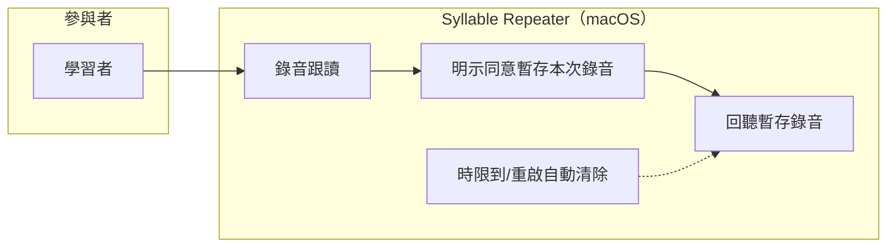

#### 3.2.2 前置條件

- 麥克風權限已授予；正在進行某 PracticeStep／練習單元的錄音跟讀（承 v1 REQ-06）。

#### 3.2.3 觸發事件及重要邏輯

- **觸發事件**：一次錄音結束時。
- **重要邏輯**：
  1. 錄音結束 → 介面提供「暫存本次錄音以便回聽」選項（**預設不勾**——預設行為維持 v1 用完即刪）；
  2. 使用者勾選（＝該次明示同意）→ 錄音 PCM 存入 `RecordingBuffer`（記憶體或 App 暫存目錄，含建立時間與存活時限，預設 30 分鐘、屬「允許變動」項）；
  3. 回聽：練習頁顯示暫存清單（時間＋所屬步驟），點擊播放；可手動逐筆刪除；
  4. **清除三保證（M10 補述）**：①時限到自動刪除②App 退出/重啟即全數清空③任何寫入 `.abopack`／`.aboprogress`／課件資料夾的路徑在程式層禁止；
  5. 比對分析（v1 REQ-06 DTW 疊圖）流程不變——暫存與否不影響 overlayData 的產生與保留規則。
- **例外**：暫存目錄寫入失敗 → 提示「暫存失敗」，錄音照 v1 規則用完即刪，主流程不受阻。

#### 3.2.4 節點描述

| 節點編號 | 節點名稱 | 責任物件 | 動作簡述 |
|----------|----------|----------|----------|
| N1 | 同意選項 | 前端 | 錄音結束顯示暫存選項（預設不勾） |
| N2 | 暫存寫入 | 伺服器端（Domain）＋前端 | RecordingBuffer（TTL＋建立時間） |
| N3 | 回聽播放 | 前端 | 暫存清單＋播放＋逐筆刪除 |
| N4 | 自動清除 | 伺服器端（Domain） | 時限到／App 重啟清空 |

#### 3.2.5 後續動作

- 後置條件：磁碟上不存在超過時限或跨 App 生命週期的錄音檔；`.abopack`/`.aboprogress` 內永無錄音資料。

#### 3.2.6 非功能性清單

| 類別 | 指標/描述 | 實作要求 | 驗收方式 |
|------|-----------|----------|----------|
| 隱私 | 暫存檔不落入任何持久化/課件路徑；重啟即清 | 程式層路徑白名單 | 檔案系統檢查＋重啟測試 |
| 效能 | 回聽啟動 ≤ 200ms | 暫存為已解碼 PCM | 實機操作觀測 |

#### 3.2.7 驗收測試情境

| 編號 | 類型 | 情境（帶真實值） | 操作 | 預期結果 |
|------|------|------------------|------|----------|
| AT-18-01 | 正常 | 對第 3 步錄音 4.1 秒，勾選暫存 | 錄音結束→點暫存清單該筆 | 完整回聽 4.1 秒錄音 |
| AT-18-02 | 核心不被破壞（M10 預設） | 錄音結束**不勾選** | 檢查磁碟與暫存清單 | 錄音即刪，僅保留 overlayData 與參數（v1 行為分毫不差） |
| AT-18-03 | 核心不被破壞（M10 補述③） | AT-18-01 後匯出 `.abopack` 與 `.aboprogress` | 解開檔案檢查 | 兩檔內無任何錄音音訊資料 |
| AT-18-04 | 邊界（時限兩側） | 暫存時限 30 分鐘 | 29 分 59 秒時回聽／30 分 01 秒時回聽 | 前者可播；後者已自動清除，清單顯示空 |
| AT-18-05 | 資料保存（反向：必須不保存） | 暫存 2 筆後結束 App 重啟 | 檢查清單與暫存目錄 | 清單空、目錄無殘留檔案 |
| AT-18-06 | 例外 | 暫存目錄設為不可寫 | 勾選暫存並錄音 | 提示「暫存失敗」；錄音用完即刪；比對主流程正常 |

---

## 十二、REQ-19 練習中字稿／譯文顯示切換

### 3.1 需求概述

- **目的**：練習頁提供四種顯示模式切換：**字稿**／**字稿＋譯文**／**僅譯文**／**都不顯示**；選擇在同一課件內記住，下次開啟沿用。
- **使用動機**：初期看字稿跟讀、進階想遮字憑聽力、背意思時只看譯文——不同階段要不同的「提示量」。

### 3.2 業務流程

#### 3.2.1 用例圖

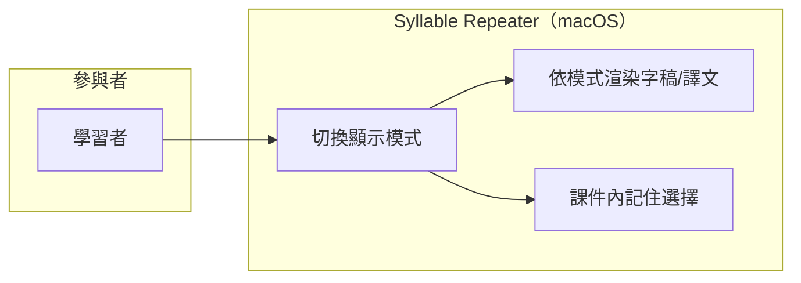

#### 3.2.2 前置條件

- 課件已載入練習頁；譯文可有可無（無譯文時見邏輯 3）。

#### 3.2.3 觸發事件及重要邏輯

- **觸發事件**：使用者點擊練習頁的顯示模式切換器。
- **重要邏輯**：
  1. 四態循環或直選：`字稿`→`字稿＋譯文`→`僅譯文`→`都不顯示`（`TranscriptDisplayMode`）；
  2. 切換即時生效於當前練習單元的文字顯示區；
  3. 課件無譯文時：含譯文的兩個模式顯示「尚無譯文——可在『匯入與分析』填寫」引導（不禁用選項，讓使用者知道去哪補）；
  4. 模式選擇存於該 Lesson 的介面偏好（隨 `.aboprogress` 個人層記憶，不進 `.abopack` 課件本體——課件分享給別人時不強加自己的顯示偏好）；
  5. 預設值＝`字稿`（屬「允許變動」項）。
- **例外**：無。

#### 3.2.4 節點描述

| 節點編號 | 節點名稱 | 責任物件 | 動作簡述 |
|----------|----------|----------|----------|
| N1 | 模式切換器 | 前端 | 四態選擇 UI |
| N2 | 條件渲染 | 前端 | 依模式顯示字稿/譯文/皆無 |
| N3 | 偏好持久化 | 伺服器端（Domain：ProgressEngine） | 隨個人進度檔記住 |

#### 3.2.5 後續動作

- 後置條件：同課件重開後模式沿用上次選擇；換課件各自獨立記憶。

#### 3.2.6 非功能性清單

無新增。

#### 3.2.7 驗收測試情境

| 編號 | 類型 | 情境（帶真實值） | 操作 | 預期結果 |
|------|------|------------------|------|----------|
| AT-19-01 | 正常 | 金標準例句課件含譯文「她有出色的溝通能力」 | 依序切四態 | 字稿→字稿＋譯文→僅譯文→全隱藏，顯示內容逐一正確 |
| AT-19-02 | 邊界（無譯文） | 課件無譯文 | 切到「字稿＋譯文」 | 字稿照常＋顯示「尚無譯文」引導文案，不崩不空白 |
| AT-19-03 | 資料保存 | 選「僅譯文」後關閉課件重開 | 開啟練習頁 | 仍為「僅譯文」 |
| AT-19-04 | 資料保存（隔離） | 同一課件 `.abopack` 分享至另一台機器 | 對方開啟 | 對方看到預設「字稿」（顯示偏好不隨課件外流） |

---

## 十三、REQ-20 手動譯文編輯區搬移

### 3.1 需求概述

- **目的**：把手動譯文輸入區從「設定」頁搬到「匯入與分析」頁的字稿區域附近；設定頁刪除該區塊。設定頁最下方「儲存」按鈕**維持現況**（經查證：該按鈕為「提醒節奏三項＋Sidecar 逾時秒數」的批次儲存，非多餘設計——使用者 2026-07-12 確認不改）。
- **使用動機**：譯文是「製作課件」時填的內容，跟字稿同屬一個工作情境；放在「設定」頁（系統偏好情境）不合直覺，每次填譯文要跳頁。

### 3.2 業務流程

#### 3.2.1 用例圖

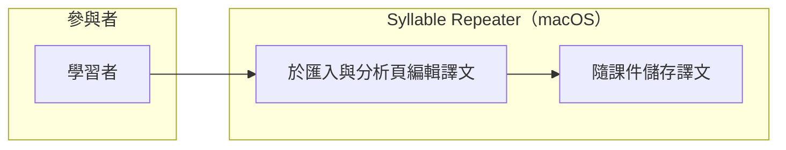

#### 3.2.2 前置條件

- 「匯入與分析」頁已有分析完成的課件草稿（字稿區域有內容）。

#### 3.2.3 觸發事件及重要邏輯

- **觸發事件**：使用者在「匯入與分析」頁字稿區域附近的譯文輸入框輸入文字。
- **重要邏輯**：
  1. 譯文輸入框移至字稿區域正下方（同一視覺群組）；功能承 v1 REQ-07：手動打字**永遠可用**、優先於 AI 自動譯文顯示；
  2. 儲存流程不變（隨課件儲存，含 ⌘S 快捷鍵——v1 既有 `_saveLesson` 完整流程隨遷移保留）；
  3. 設定頁移除譯文區塊；其餘區塊（AI key、封存群組、提醒節奏、Sidecar 逾時、批次「儲存」按鈕）**一律不動**；
  4. AI 自動譯文（使用者自帶 key，v1 REQ-07）觸發入口一併評估移至同一群組（設計階段定案，此處僅要求「手動與自動譯文入口同群組」）。
- **例外**：無課件草稿時譯文框置灰。

#### 3.2.4 節點描述

| 節點編號 | 節點名稱 | 責任物件 | 動作簡述 |
|----------|----------|----------|----------|
| N1 | 譯文輸入框（新位置） | 前端 | 字稿區域下方同群組 |
| N2 | 課件儲存 | 伺服器端（Domain：LessonPackEngine） | v1 既有流程不變 |
| N3 | 設定頁瘦身 | 前端 | 僅移除譯文區塊，其餘不動 |

#### 3.2.5 後續動作

- 後置條件：譯文讀寫行為與 v1 完全一致（僅入口位置改變）；設定頁批次「儲存」行為分毫不差。

#### 3.2.6 非功能性清單

無新增。

#### 3.2.7 驗收測試情境

| 編號 | 類型 | 情境（帶真實值） | 操作 | 預期結果 |
|------|------|------------------|------|----------|
| AT-20-01 | 正常 | 金標準例句分析完成 | 在匯入與分析頁譯文框輸入「她有出色的溝通能力」→ ⌘S 存課件 | `.abopack` 內譯文正確；重開課件譯文顯示 |
| AT-20-02 | 正常（設定頁瘦身） | 開啟設定頁 | 檢視 | 無譯文區塊；AI key／封存群組／提醒節奏／Sidecar 逾時／批次儲存按鈕全數健在 |
| AT-20-03 | 核心不被破壞（批次儲存不動） | 設定頁改「每次分鐘」為 25、Sidecar 逾時為 90 | 按最下方「儲存」 | 兩項一次存入並生效（v1 行為分毫不差） |
| AT-20-04 | 邊界 | 未有課件草稿 | 檢視匯入與分析頁 | 譯文框置灰不可輸入 |
| AT-20-05 | 資料保存（優先權） | 課件已有 AI 自動譯文 | 手動輸入覆蓋 | 手動譯文優先顯示（承 v1 REQ-07 規則） |

---

## 十四、核心驗收總表

2.5 每條「必須維持」對應至少一條帶真實值的「核心不被破壞」情境（新增與補述條款為主；v1 原有條款之總表見 v1 requirement.md 末章，仍然有效）：

| 核心條款 | 不被破壞情境（帶真實值） | 對應測試 |
|---|---|---|
| M1＋v1.1 補述 | 自訂排列 `[itll, rain, itll+rain]` 播放與匯出的每一 sample 可對應回原音檔 syllable 區間；靜音段為數位零；無任何生成音 | AT-15-09 |
| M2（配合 M12 解讀） | 無自訂排列時第 2 步固定為 `tion skills`，不吸附成 `communication skills`；自訂功能的存在不改變自動模式行為 | AT-16-04 |
| M3（雙軌） | 自動模式合併匯出：第 1、2 步間靜音恰為第 1 步 totalDurationMs＝1260ms；自訂模式：`itll+rain`（650ms 原時長）設 3 倍→靜音 1950ms | AT-16-05、AT-15-04 |
| M4（範圍擴大） | 任一 ASR 引擎 sidecar 被 kill -9，App 不崩、可重試 | AT-17-05、AT-11-06 |
| M5 | Domain 於無 Flutter 環境 `dart test` 全數通過；port 定義不 import sidecar/UI | AT-17-06 |
| M9（範圍擴大） | 新引擎/模型上架前逐項過授權白名單；未過審不得進發布產物 | REQ-17 上架程序＋CT-09 審查 |
| M10＋v1.1 補述 | 不勾暫存→錄音即刪（v1 行為）；勾暫存→30 分 01 秒後自動清除、App 重啟清空、`.abopack`/`.aboprogress` 內永無錄音 | AT-18-02～05 |
| M11 | 金標準例句刪 1 切點後，疊加步數顯示 10（當時值），演算法不變 | AT-13-07 |
| M12 | 無排列→11 步自動疊加；有排列→顯示排列各列；刪排列→回落自動 | AT-16-01～03 |
| M13 | 新增引擎 adapter 不修改 Domain 任何檔案（依賴方向檢查） | AT-17-06＋程式碼審查 |
| M14 | 建立 `ja` 課件因缺切分器被明確拒絕；不默默用英文切分器亂切 | AT-17-02、AT-17-03 |
| REQ-11 資料保護 | 未儲存標籤時換音檔必經「儲存/不儲存」明示選擇，不靜默丟棄 | AT-11-04 |
| D1 防回歸 | 無音檔時介面不出現任何 TTS/生成選項 | AT-12-03 |

---

## 十五、待澄清事項

以下事項不阻塞需求成稿，留待 fullstack-design（設計階段）定案，屆時如涉及範圍變動須回頭修訂本檔：

| 編號 | 事項 | 建議傾向 |
|---|---|---|
| Q1 | 段落自動切句的具體演算法（ASR segment 時間戳直用 vs 靜音間隔輔助切分）與參數 | 屬「允許變動」項，設計階段以實測選型 |
| Q2 | `.abolabel` JSON schema 細部欄位與版本策略 | 對齊 `.abopack` 既有慣例（zip＋JSON＋schemaVersion） |
| Q3 | 自由編輯區的拖曳互動細節（吸附、動畫、鍵盤替代操作） | 屬「允許變動」項 |
| Q4 | AI 自動譯文觸發入口是否隨手動譯文一併搬到匯入與分析頁 | 建議一併搬（同群組原則），設計階段定案 |
| Q5 | 錄音暫存時限預設 30 分鐘是否合適 | 屬「允許變動」項，可於設定頁曝露調整 |

