# Syllable Repeater macOS v1.1 需求檔案

## 一、檔案資訊

### 1.1 基礎資訊

| 項目 | 內容 |
|------|------|
| 檔案名稱 | syllable-practice-macos-v1.1 需求檔案 |
| 專案代號 | syllable-repeater |
| 作者 | Karen（需求方）＋ Claude（整理） |
| 建立日期 | 2026-07-12 |
| 版本 | v1.1（初稿） |
| 上游版本 | [syllable-practice-macos-v1_20260704](../../syllable-practice-macos-v1_20260704/requirement/requirement.md)（已交付凍結；本檔為其增量新輪，v1 的 REQ-01～REQ-09 全數保留不動） |

### 1.2 修訂歷史

| 日期 | 版本 | 修訂內容 | 修訂人 |
|------|------|----------|--------|
| 2026-07-12 | v1.1-draft1 | 初稿：新增 REQ-10～REQ-20 共 11 條需求項；記載七項關鍵決策（見下） | Karen＋Claude |
| 2026-07-12 | v1.1 | **定稿**：使用者審查通過（2026-07-12 明示「定稿」）；11 條 REQ 全數為交付範圍 | Karen |
| 2026-07-12 | v1.1-r1 | 設計審查裁決回寫（皆屬 2.5「允許變動」範圍，不觸核心）：①REQ-11 `.abolabel` 增記人聲分離開關狀態（O2）②REQ-18 暫存時限 30→10 分鐘、不開放設定，明確化手動逐筆刪除與「切換練習步驟即自動刪除/覆蓋」（O4）③REQ-15 組塊手勢定案為長按拖曳堆疊（iPhone App 式，疊上即成組、組內可滑動排序）（F1）④REQ-20 AI 自動譯文按鈕確定隨手動譯文一併搬移（F2） | Karen |
| 2026-07-13 | v1.1-r2 | OQ-2 裁決回寫：REQ-19 顯示模式偏好隨 `.aboprogress` 匯出／匯入，作為個人層記憶；不進 `.abopack`、不以 `app_settings` 作唯一儲存來源 | Karen |
| 2026-07-13 | v1.1-r3 | OQ-4／OQ-5 裁決回寫：最後一個 Segment 不可再刪時沿用 `ERR_BOUNDARY_INVALID`；ASR 自動切段失敗時回傳正常 `LabelOpenResult`＋`ERR_TRANSCRIBE_FAILED` 警告，保留空工作階段供手動切段 | Karen |
| 2026-07-13 | v1.1-r4 | OQ-6 裁決回寫：批准新增 Domain `LabelRegistryRepository` port，由 infra Drift adapter 實作 `label_registry` 查詢／upsert，維持 M5 依賴方向 | Karen |
| 2026-07-14 | v1.1-r5 | 使用者實機回饋完整變更包：校正區改為時間範圍重疊高亮；自由排列支援上方積木直接拖入空列、同列放下成組、雙擊開啟集中設定視窗（重複 1–10、靜音預設 5／0–20／0.5 級距、重置與預覽），移除積木旁設定／播放圖示；分析成功即建立穩定草稿 Lesson 身分以修復一鍵生成；練習頁隱藏模式同步隱藏單元文字並統一「單元」用語；段落標籤與匯入分析改顯示真實階段／讀取進度；錄音暫存回聽修正 macOS 音訊生命週期。 | Karen |
| 2026-07-15 | v1.1-r6 | 使用者批准 S9 收尾變更包：段落保留／捨棄區間、兩頁播放紅色虛線軸、段落播放／暫停／停止；原音與人聲分離分析軌隔離；積木預設 1／1、整列預設 3／1與相鄰切片自然接合；錄音比對固定單次原音、移除錄音暫存、圖表限點與可立即刪除；`.abopack` 升 v3 複合封包、課程設定統一儲存、四層匯出資料源；左側功能重新命名。 | Karen |
| 2026-07-15 | v1.1-r7 | S9 實機驗收追補：錄音保留「目前單元最近一次」記憶體 PCM 供播放／停止，比對失敗仍可確認收音，但不恢復 RecordingBuffer；自由排列固定來源工具列、列區獨立捲動、邊緣自動捲動與新增列定位；段落標籤每個區段均完整播放，暫停保留游標並由原處續播。 | Karen |
| 2026-07-15 | v1.1-r8 | S9 段落校正效能與長列操作追補：切點提交先更新畫面、音韻分析改背景執行且舊結果不得倒灌；macOS 移除全 App 多餘捲動，只保留功能頁與自由排列列區兩層；來源積木增加「拿起→放手捲動→指定位置放下」；分析、分離、預覽與解包採 session 暫存生命週期，使用者保存的 `.abopack` 永不自動刪除。 | Karen |
| 2026-07-15 | v1.1-r9 | 自由排列實機操作追補：來源工具列改稱「來源段落」；選取來源後以每個頂層積木左側及列尾的小型插入按鈕放置，空列保留整列放置入口；既有積木只能在同列長按本體左右改序、成組、組內改序或抽出，移除跨列搬移、大型藍色插入軌、六點把手與積木麥克風裝飾。 | Karen |

**本輪需求分析關鍵決策留痕**（避免日後重複翻案，依憲法 C3 引用回對）：

| 編號 | 決策 | 理由 |
|---|---|---|
| D1 | **撤回 TTS 分支**：原提案「無音檔時可寫句子由本地聲音模型生成 TTS 檔進行分析」，經對照 v1 Non-scope 6（TTS／AI 合成示範音＝絕對紅線，永不重新評估）與核心原則 M1（原聲不可替換），使用者於 2026-07-12 明示撤回 | TTS（Text-to-Speech，文字轉語音合成）產生的聲音不是真人原聲，違反本產品「模仿真人原聲韻律」的立身之本 |
| D2 | **段落標籤沿用既有人聲分離**：段落自動切句跑在 demucs.cpp（人聲與伴奏分離工具）分離後的人聲軌上（使用者可關閉分離則跑原軌）；並提供「一邊聽一邊手動滑動、增、減標籤線」作為自動偵測失準時的兜底 | 歌曲類音檔若不先分離人聲，背景音樂會嚴重干擾自動切句；v1 已內建 optional demucs，零額外整合成本 |
| D2a | **人聲分離保留來源聲道**：Demucs 前轉檔不指定 `-ac`；立體聲保留雙聲道，單聲道保持 mono。單聲道只能依頻譜估計分離，不得宣稱或偽裝成具有立體線索 | 強制把 mono 複製為左右聲道不會產生新的空間資訊，反而會誤導品質預期 |
| D3 | **ASR＋音節切分器雙抽層**：語音辨識引擎（ASR，Automatic Speech Recognition，把聲音轉成文字與時間戳的技術）與音節切分器（Syllabifier，把單字拆成音節的元件）同時抽換成可插拔架構，現在就打通多語言基礎；v1.1 僅交付英文切分器實作 | 使用者明示「未來會有其他語種練習、聲音模型與時俱進」；架構先打通，語言逐步上架 |
| D4 | **切片串接明文列入 M1 補述**：同一課件內、同一原音檔的多段切片，以任意順序、任意重複次數串接播放／匯出，屬 M1 允許的原聲組合（例：組塊 `rain+itll+rain`） | 串接的每一段都是原音，未生成任何聲音，符合 M1 精神；明文化避免實作時誤判 |
| D5 | **句尾疊加預設可被覆蓋（M12）**：練習播放區預設顯示自動句尾疊加（v1 M2 演算法）；使用者在自由編輯區建立自訂排列後，播放區改顯示使用者版本 | 保留新手「打開就能練」的體驗，同時給進階使用者編排自由 |
| D6 | **跨單元 RecordingBuffer 已撤回，保留本單元記憶體回放（v1.1-r7）**：不保存 10 分鐘錄音、不提供暫存清單／面板／store；僅在目前單元記憶體保留最近一次 PCM 供播放確認，比對失敗仍可播，切單元、重錄、垃圾桶、離頁或關閉 App 即清除 | 使用者明示需要錄音後播放鍵，但同意不恢復 RecordingBuffer；兼顧確認收音與 M10 最短生命週期 |
| D7 | **ASR 僅限本地**：可抽換的 ASR 引擎限定為本地 sidecar（獨立外部行程）可執行檔＋本地模型檔；線上 ASR API（如 OpenAI Whisper API、Azure Speech）列為範圍外 | 使用者 2026-07-12 明示「目前只會串接本地 ASR」；維持純本機、單人、自有資料的產品性質 |

---

## 二、整體概述

### 2.1 需求內容清單

v1 的 REQ-01～REQ-09 保留不動；本輪新增 REQ-10～REQ-21。**12 條全數為 v1.1 交付範圍**；P0/P1/P2 僅表示動工先後順序，不表示可裁減：

| 序號 | 需求項名稱/ID | 簡要說明 | 所屬模組 | 優先級 |
|------|----------------|----------|----------|--------|
| 1 | REQ-10 視窗自適應與響應式佈局 | App 隨視窗大小自動調整佈局，縮小視窗不遮蔽任何應有的操作畫面 | UI（全域） | P0 |
| 2 | REQ-11 段落標籤與 .abolabel 標籤註記檔 | 匯入多句音檔→真實進度→波形＋時間軸→自動切段→手動保留／捨棄任意區間→播放／暫停／停止與紅色虛線軸→匯出 .abolabel；未儲存時攔截 | SegmentEngine（新）／UI | P0 |
| 3 | REQ-12 匯入與分析改為單句模式 | 直接匯入或承接段落區段；實際讀取／驗證完成後才顯示「音檔已就緒」，分析顯示真實階段進度；開始前結果區留白，開始後只顯示實際辨識結果 | AnalysisPipeline／UI | P0 |
| 4 | REQ-13 音節切點增減校正 | 波形上可刪除切點（相鄰音節合併）與新增切點（區段一分為二）；含撤銷；文字區塊可編輯改字 | AlignmentEngine／UI | P0 |
| 5 | REQ-14 波形↔文字雙向高亮與序號同步 | 選取波形時間範圍時，所有與該範圍重疊的文字積木同步半透明黃色；文字區塊與波形編號隨增減即時重排 | UI | P1 |
| 6 | REQ-15 練習內容自由編輯區 | 一鍵生成排列；積木／組塊預設 1／1、整列預設 3／1；整列包住積木設定；相鄰原音切片以零交越吸附或 ≤10ms micro-fade 自然接合；列預覽播放中可停止 | PracticeEngine（擴充）／UI | P0 |
| 7 | REQ-16 句尾疊加區顯示自訂排列 | 練習頁依 M12 顯示自動或自訂單元；可見用語統一為「單元」；刪除排列入口移回音節校正的自由排列標題左側，練習頁不顯示模式徽章或刪除入口 | PracticeEngine／UI | P1 |
| 8 | REQ-17 語音辨識模型抽換與多語言基礎 | ASR 引擎與音節切分器雙抽層（port＋adapter，「插座＋插頭」式架構）；每個課件／區段帶語言標記；查無該語言切分器即明確拒絕；v1.1 僅交付英文切分器；僅限本地 ASR（D7） | AnalysisPipeline／AlignmentEngine | P1 |
| 9 | REQ-18 錄音單次比對與效能 | 錄一次只比對單元原音一次，不套積木／整列循環與靜音；僅保留目前單元最近一次記憶體 PCM 供播放確認，不建立 RecordingBuffer；比對運算離開 UI isolate、圖表限點；結果可立即刪除且磁碟錄音仍在 finally 清除 | RecordingComparator／UI | P0 |
| 10 | REQ-19 練習中字稿／譯文顯示切換 | 四種顯示模式；選「隱藏」時，導覽積木、播放列與錄音脈絡文字都只保留編號（`#n`／`第 n 單元`），其餘三態維持現況；偏好隨 .aboprogress | UI | P2 |
| 11 | REQ-20 手動譯文編輯區搬移 | 手動譯文輸入區從「設定」頁搬到「匯入與分析」頁字稿區域附近；設定頁最下方「儲存」按鈕維持現況（經確認為提醒節奏＋Sidecar 逾時的批次儲存，非多餘設計） | UI | P2 |
| 12 | REQ-21 `.abopack v3` 複合封包與四層匯出 | 課程設定可把原始音訊、可選段落標籤、可選單句課件、可選自由排列、可選最新進度整併成單檔；匯出依音訊來源／排列來源／單元範圍／設定來源四層選擇 | Pack／Export／UI | P0 |

### 2.2 基本術語定義

v1 全部術語（Lesson、Word、Syllable、Phone、PracticeStep、PracticeGroup、Attempt、Prosody、Pack、Progress、Sidecar、SRS、金標準例句）沿用不變。本輪新增：

| 術語/縮寫 | 含義（含白話說明） |
|-----------|------|
| `Segment` | 段落區段：音檔時間軸上以句子為單位切出的一段（含起訖毫秒、句子文字、語言標記）——白話：整首歌被切成的「一句一句」 |
| `Label` | 標籤：使用者對某個 Segment 的註記（含手動調整過的邊界與文字） |
| `.abolabel` | 標籤註記檔：一個音檔的全部 Segment＋Label 打包成的可攜檔案（zip＋JSON 格式，與 `.abopack`、`.aboprogress` 同家族）——白話：把「切句成果」存成一個小檔案，下次匯入同一首歌可以直接載入，不用重切 |
| `Arrangement`（PracticeArrangement） | 練習排列：使用者在自由編輯區排出的練習內容整體（由多個長條次區域組成） |
| `PracticeBlock` | 練習塊：次區域內的一個單位——單一文字區塊，或多個文字區塊圈選成的組塊；每塊帶重複次數與靜音倍數設定 |
| `TextBlock` | 文字區塊：對應一個音節（或使用者編輯後的文字）的可拖曳積木 |
| `TranscriberEngine` | 語音辨識引擎介面（port）：Domain 層定義的「插座」，任何本地 ASR 引擎（whisper.cpp 或未來新引擎）做成「插頭」（adapter）插上即可用——白話：換辨識引擎不用改主程式 |
| `Syllabifier` | 音節切分器介面（port）：把單字拆成音節的「插座」；v1.1 交付英文實作（EnglishSyllabifier，內含 CMUdict 查詢＋母音團計數兜底） |
| `Registry` | 註冊表：依語言查詢「有哪些辨識引擎／切分器可用」的名冊；查無該語言→明確拒絕，不默默亂切（M14） |
| `TranscriptDisplayMode` | 字稿顯示模式：練習頁的四態切換——字稿／字稿＋譯文／僅譯文／都不顯示 |
| `SelectedTimeRange` | 校正區目前選取的波形時間範圍；所有與範圍有交集的音節積木都屬同一次選取並同步高亮，不再只靠單一 index 判定 |
| `DraftLessonIdentity` | 分析成功後立即建立、整個草稿生命週期不變的 Lesson 身分；一鍵生成與保存後的正式 Lesson 沿用同一 id，避免尚未存成 `.abopack` 時功能被誤鎖 |
| `AudioReadiness` | 匯入音檔的就緒狀態；只有實際位元組讀取、格式與時長驗證成功後才是 ready，選到路徑本身不算已就緒 |
| `language` 欄位 | 語言標記：每個 Lesson 與 Segment 必帶的語言代碼（如 `en`）；音節切分依此路由 |
| ASR | Automatic Speech Recognition，自動語音辨識：把聲音轉成文字與時間戳的技術 |

**術語鐵則**（承 v1）：音節一律 `Syllable`、單字一律 `Word`；所有練習音訊來自原音切片，不得生成（M1 及其 v1.1 補述，見 2.5）。

**責任物件對應**（同 v1，本專案為本機桌面應用、無伺服器）：前端＝Flutter UI 層；伺服器端＝本機 Domain Layer（純 Dart 領域層）；閘道/中間件＝無；外部系統＝Sidecar 行程（FFmpeg／whisper.cpp／demucs.cpp／未來其他本地 ASR）。

### 2.3 非功能性清單參考

沿用 v1 全案通用約束（授權白名單、零 Python、AI key 加密、sidecar 崩潰隔離），具體指標於各需求項 3.2.6 落實。本輪補充：

| 類別 | 指標/描述 | 驗收方式 |
|------|-----------|----------|
| 合規性（授權） | **每一個新增的 ASR 引擎與模型檔**都必須通過 M9 授權白名單（MIT/BSD/ISC/Apache-2.0/LGPL 動態連結；禁 GPL/AGPL/非商用限定/研究限定） | license-manifest 逐項審查（承 v1 CT-09 機制） |
| 效能 | 視窗縮放時佈局重排不掉幀卡死；段落自動切句 10 分鐘音檔 ≤ 既有對齊管線同級耗時 | 實機操作觀測＋碼表實測 |
| 隱私 | 錄音只存在本次比對工作所需的記憶體／temp；成功、失敗、取消皆由 `finally` 清除，不提供暫存回聽、不落入任何持久化檔案 | 檔案系統檢查＋故障注入測試 |
| 儲存衛生 | 每次 App 執行使用獨立 session 暫存目錄；Whisper／Demucs／預覽／解包的作業中介檔成功、失敗、取消皆清除，切換課程或結束 session 清快取；不得自動刪除使用者選定路徑的 `.abopack`／`.abolabel`／匯出音檔 | 20 檔壓力測試＋失敗注入＋重啟後檔案系統檢查 |

**線上服務判定：否**（維持 v1 判準）。v1.1 全部新增功能仍屬純本機、單人、自有資料之桌面應用；ASR 僅限本地（D7），不新增任何網路服務相依。不適用第二層加嚴提問。

### 2.4 範圍外（Non-scope）

v1 Non-scope 1～7、9 全數沿用（手機端、Windows、MFA/CREPE/WORLD 內建、授權防盜欄位、雲端同步、TTS 永不、商用金流、免簽章路線）。本輪修訂與新增：

| 序號 | 明確不做的內容 | 不做的理由 | 何時可能重新評估 |
|------|----------------|-----------|------------------|
| 8（修訂） | **非英文語言的音節切分器「實作」**。v1 原文將「非英文語料的音節切分」整體列為範圍外；v1.1 修訂為：多語言架構（Syllabifier port＋language 路由＋Registry）**在 v1.1 就位**，但中文/日文等具體切分器實作不在本輪交付 | 架構先打通成本低、日後上語言不用動骨架；具體語言切分器各有專業深度，逐語言驗證再上 | 每個新語言：該語言切分器 adapter 完成＋通過 M9 授權審查＋驗收測試通過時 |
| 10 | **任何「使用者匯入音檔」以外的音源進入練習鏈路**（含 TTS、AI 合成、系統生成音）——**永不重新評估** | v1 Non-scope 6 的延伸強化；D1 決策留痕：本輪曾提案 TTS 分支並已撤回 | 永不 |
| 11 | **線上 ASR API 與模型自動下載代管**。ASR 引擎僅限本地 sidecar 可執行檔＋本地模型檔（使用者自行取得放置）；不串 OpenAI Whisper API、Azure Speech 等線上服務；不做 App 內模型自動下載 | D7 使用者明示僅本地；維持純本機隱私性質；自動下載涉及來源信任與體積管理，非本輪重點 | 使用者明確需要線上引擎，且願接受「音檔上傳外部服務」的隱私代價時 |
| 12 | **跨 Lesson（跨音檔）的切片拼接** | M1 補述明定串接僅限「同一 Lesson 內、同一原音檔」；跨音檔拼接音色/響度不連續，且模糊「原聲」邊界 | 出現明確教學場景需求且能定義原聲防線時 |
| 13 | **段落標籤的多層級結構**（如段落→句→子句巢狀） | v1.1 只做單層句子級 Segment；巢狀結構複雜度高、目前無使用情境 | 使用者實際用出「句內再切段」需求時 |

### 2.5 核心維持原則

v1 的 M1～M10 全數沿用；本輪新增兩條補述與 M11～M15：

| 分類 | 條目 | 說明 |
|------|------|------|
| **系統必須維持** | **M1 原聲不可替換**（v1 原文不變）＋**v1.1 補述**：「同一 Lesson 內、同一原音檔的多段 PCM 切片，以任意順序、任意重複次數串接播放／匯出」明文列為 M1 允許的原聲組合。`originalPcm` 與供辨識的人聲分離 `analysisPcm` 必須為不同欄位；播放、錄音參考音、封包單句音訊與匯出只能取 `originalPcm`。相鄰切片可零交越吸附或做 ≤10ms micro-fade，禁止把 Demucs 軌、跨 Lesson、TTS 或生成音帶入 | 分析可使用較乾淨的人聲軌，但學習者聽到與匯出的每一 sample 仍可追溯至原始音檔（允許的 micro-fade 除外） |
| **系統必須維持** | **M2 疊加演算法**（v1 原文不變，配合 M11/M12 解讀）：步驟總數＝音節總數；第 n 步＝句尾數來第 n 個音節→句尾；不做單字邊界吸附 | 仍是預設練習法的核心；M12 允許使用者以自訂排列覆蓋「顯示與播放的內容」，但自動模式的演算法本身不可改 |
| **系統必須維持** | **M3 靜音與合併匯出規則**（v1.1-r6）：PracticeBlock／組塊預設重複 1、靜音 1 倍，最後一輪仍保留積木靜音；PracticeRow 預設重複 3、靜音 1 倍，整列靜音基準只加總列內每個擺放積木的原始音訊長度一次，不納入積木 repeat／silence，最後一輪不保留整列靜音。多單元合併時，單元之間另插入前一個已渲染單元 totalDurationMs，最後單元後不插入 | 四種播放／匯出路徑使用同一 `PracticeEngine` 計算，舊 pack 的明示設定值照原值載入，不強制改寫 |
| **系統必須維持** | **M15 真實進度與就緒語意**：任何顯示的匯入／解碼／分離／切段／分析進度，都必須由已完成的真實工作量或真實階段事件推進；不得用定時器或硬編 15%／35% 等假百分比。音檔只有在位元組讀取、格式與時長驗證成功後才可顯示「已就緒」並開放分析 | 進度與就緒會直接影響使用者是否能安全進下一步，錯報等同功能錯誤 |
| **系統必須維持** | **M4 崩潰隔離**（v1 原文不變，適用範圍擴大）：任一 sidecar（含未來新增的本地 ASR 引擎）崩潰→回傳失敗＋App 不崩＋保留當前工作狀態 | 新引擎一律走 sidecar 隔離，不進主行程 |
| **系統必須維持** | **M5 Domain 純 Dart**（v1 原文不變）：TranscriberEngine／Syllabifier port 定義於 Domain，不 import sidecar/UI/平台 API | 抽層後仍可 `dart test` 100% 單元測試 |
| **系統必須維持** | **M6 進度合併規則**（v1 原文不變） | — |
| **系統必須維持** | **M7 跨日零懲罰**（v1 原文不變） | — |
| **系統必須維持** | **M8 歸檔可恢復**（v1 原文不變） | — |
| **系統必須維持** | **M9 授權白名單**（v1 原文不變，適用範圍擴大）：每一個新增 ASR 引擎與模型檔上架前必過白名單審查 | 抽換自由不等於授權自由 |
| **系統必須維持** | **M10 隱私防線**（v1 原文不變，v1.1-r7 定案）：移除跨單元錄音暫存清單與 RecordingBuffer；來源錄音與播放用 temp 在成功、失敗、取消、停止皆由 `finally` 清除。僅允許目前單元最近一次 PCM 暫存於 UI 記憶體供播放確認，並在切單元、重錄、垃圾桶、離頁或關閉 App 時清除；資料模型、DB、`.abopack`、`.aboprogress` 不得含錄音音訊或路徑欄位 | 兼顧使用者確認收音與最短資料生命週期；不恢復跨單元持久暫存 |
| **系統必須維持** | **M11 音節總數即當時值**：使用者以 REQ-13 增減切點後，「當時的音節總數」即為 M2 的步驟總數與後續統計基準；金標準例句的 11 音節僅為未編輯狀態的預設值 | 切點可編輯後，「總數固定 11」改為「總數＝編輯後實際值」；演算法不變，輸入值隨編輯更新 |
| **系統必須維持** | **M12 排列覆蓋規則**：自由排列 0 列時＝目前選取完整單句 1 單元（隱含列預設 3／1）；有 N 列時＝N 個單元並即時連動。一鍵生成本身仍以 M2 產生 N 列句尾疊加。練習頁右上次數就是目前單元的整列 repeat，不再乘第三層 | 零排列仍可練整句；建立排列後完全尊重使用者列數與設定 |
| **系統必須維持** | **M13 ASR 與 Syllabifier 雙抽層契約**：ASR 引擎透過 Domain `TranscriberEngine` port 呼叫；音節切分透過 Domain `Syllabifier` port 呼叫；兩者互不耦合；新引擎/切分器以 adapter 加入，不改動 Domain 程式碼 | 「換插頭不用改插座」；未來多語言與模型演進的基礎 |
| **系統必須維持** | **M14 語言標記與拒絕默默兜底**：每個 Lesson/Segment 必帶 `language` 欄位；Syllabifier 依此路由；查無該語言切分器→明確拒絕建立課件（顯示錯誤與可取得的語言清單），**不得**默默改用英文切分器亂切 | 寧可明確說「不支援」，不可給錯的結果讓使用者練錯 |
| **系統允許變動** | v1 原清單全數沿用；本輪新增：段落自動切句的演算法選型與參數、`.abolabel` 的 JSON schema 版本演進（帶版本號向後相容）、自由編輯區的視覺樣式、字稿/譯文顯示模式的預設值、切點增減的操作手勢細節；**自訂積木設定的顯示位置已定案為雙擊對話框，不再屬可自由變動項** | 其餘彈性空間不影響核心；已拍板互動不得退回積木旁常駐按鈕 |
| **系統不可接受** | v1 原清單全數沿用（TTS/音高重算/跨來源拼接進播放匯出路徑；疊加吸附單字邊界；GPL 進主程式；key 個資明文；未經同意保留錄音）；本輪新增： | |
| **系統不可接受** | 自訂排列模式繞過 M1：任何非原音切片的音訊進入排列播放或匯出 | 破壞 M1 補述 |
| **系統不可接受** | 錄音被寫入任何持久化檔案、RecordingBuffer 功能回流，或比對成功／失敗／取消後 temp 未由 `finally` 清除 | 破壞 M10 |
| **系統不可接受** | 查無語言切分器時默默 fallback 到英文切分 | 破壞 M14 |
| **系統不可接受** | 新 ASR 引擎/模型未過授權審查即進入發布產物 | 破壞 M9 |
| **系統不可接受** | 未儲存的段落標籤在切換音檔時被靜默丟棄（必須經使用者選擇儲存或明示放棄） | 破壞 REQ-11 資料保護規則 |
| **系統不可接受** | 以假百分比、純時間動畫或「已選路徑」冒充真實匯入／分析進度與音檔已就緒 | 破壞 M15，會誤導使用者提前操作 |

---

## 三、REQ-10 視窗自適應與響應式佈局

### 3.1 需求概述

- **目的**：App 介面隨視窗大小自動調整佈局；視窗縮小後不得遮蔽或裁掉任何應有的操作元件（按鈕、波形、文字區塊等一律可見或可捲動到達）。
- **使用動機**：使用者常把視窗縮小與其他 App 並排（如一邊看影片一邊練習）；v1 佈局為固定尺寸排版，縮小後部分按鈕被裁掉、無法操作。最可能放棄點：**想按的按鈕看不到也捲不到**。

### 3.2 業務流程

#### 3.2.1 用例圖

#### 3.2.2 前置條件

- App 已啟動；視窗最小尺寸維持 v1 既定的 1100×700（`MainFlutterWindow.swift` 之 `contentMinSize`）。

#### 3.2.3 觸發事件及重要邏輯

- **觸發事件**：使用者拖曳視窗邊緣改變尺寸，或按 macOS 全螢幕/還原。
- **重要邏輯**：
  1. 前端監聽視窗尺寸變化（Flutter `LayoutBuilder`/`MediaQuery`，即「依可用空間決定怎麼排」的機制）；
  2. 各功能區（左側導覽、匯入與分析、段落標籤、音節校正、練習頁、設定）依可用寬高重排：寬度不足時欄位改為上下堆疊或內容區出現水平/垂直捲軸；
  3. 波形圖等固定高度元件：寬度隨視窗伸縮（波形重取樣重繪），高度低於下限時整個內容區改為可垂直捲動；
  4. 任何互動元件（按鈕、切點、拖曳把手）不得被裁切到不可到達——「看不到」時必可「捲得到」；
  5. 縮放結束後 200ms 內完成重排定稿（過程中允許簡化渲染）；
  6. 左側功能名稱固定為：`課程匯入`、`段落標籤`、`單句分析`、`段落校正`、`錄音練習`、`課程設定`。只改使用者可見名稱，不改既有 route id、資料識別或進度鍵。
- **例外**：低於最小尺寸的縮放由 macOS 視窗系統直接阻止（沿用 v1 機制），App 內不處理更小尺寸。

#### 3.2.4 節點描述

| 節點編號 | 節點名稱 | 責任物件 | 動作簡述 |
|----------|----------|----------|----------|
| N1 | 尺寸偵測 | 前端 | LayoutBuilder/MediaQuery 取得新視窗尺寸 |
| N2 | 佈局重排 | 前端 | 依斷點規則重排各功能區 |
| N3 | 波形重繪 | 前端 | 波形依新寬度重取樣繪製 |
| N4 | 捲動兜底 | 前端 | 放不下的內容以捲軸保證可到達 |

#### 3.2.5 後續動作

- 後置條件：任何 ≥1100×700 的視窗尺寸下，全部互動元件可見或可捲動到達；使用者工作狀態（已載入的課件、編輯中內容）不因縮放而丟失。

#### 3.2.6 非功能性清單

| 類別 | 指標/描述 | 實作要求 | 驗收方式 |
|------|-----------|----------|----------|
| 效能 | 縮放過程不卡死；定稿重排 ≤ 200ms | 波形 peaks 快取重用（承 v1） | 實機操作觀測 |

#### 3.2.7 驗收測試情境

| 編號 | 類型 | 情境（帶真實值） | 操作 | 預期結果 |
|------|------|------------------|------|----------|
| AT-10-01 | 正常 | 視窗 1600×1000，載入金標準例句課件 | 拖曳縮至 1100×700 | 匯入按鈕、播放鍵、11 個音節區塊、波形全部可見或可捲動到達，無元件被裁掉 |
| AT-10-02 | 邊界（下限） | 視窗恰為 1100×700 | 檢視每個功能區 | 六大功能區逐一切換，每區操作元件完整可用 |
| AT-10-03 | 邊界（下限外側） | 嘗試拖曳至 1000×600 | 拖曳 | macOS 阻止縮至 1100×700 以下（v1 既有行為不變） |
| AT-10-04 | 亂序 | 3 秒內連續放大縮小 10 次 | 快速拖曳 | 不崩潰、不殘影；停止後 200ms 內定稿 |
| AT-10-05 | 資料保存 | 音節校正進行到一半（已拖 2 個切點未存） | 縮放視窗 | 編輯狀態完整保留，切點位置不變 |
| AT-10-06 | 導覽命名 | 開啟 App | 逐一檢查左側六項、切換並核對各頁主標題 | 依序顯示「課程匯入、段落標籤、單句分析、段落校正、錄音練習、課程設定」；校正頁主標題亦為「段落校正」，舊名稱不再出現；各頁 route 與既有工作狀態不變 |
| AT-10-07 | 儲存衛生 | 連續分析 20 個音檔，期間包含 Whisper／Demucs 成功與失敗，並開啟兩個 App session | 每項作業結束、切換課程、關閉後重啟 App，再檢查 session 暫存根目錄與使用者保存目錄 | 成功、失敗、取消的中介檔皆清除；仍執行中的另一個 session 不被誤刪；重啟後清除未鎖定舊 session；使用者選定路徑的 `.abopack`、`.abolabel` 與匯出音檔內容不變 |

---

## 四、REQ-11 段落標籤與 .abolabel 標籤註記檔

### 3.1 需求概述

- **目的**：左側新增「段落標籤」功能區。使用者匯入多句音檔（如整首歌）後，顯示波形＋時間軸；系統自動以句子為單位切段並標籤；使用者可手動微調（滑動邊界、增、減標籤線）；標籤成果可匯出為 `.abolabel` 檔；重匯入相同音檔時提醒載入既有標籤檔；未儲存就要換音檔時攔截提示。
- **使用動機**：使用者拿到一整首歌，想挑其中一句來練。v1 只能吃單句音檔，使用者得先用外部工具（如 Audacity）自己剪——現在 App 內直接切好、選句、送進分析。最可能放棄點：**自動切句位置不準又難修**——因此手動微調是一等公民，且切好的成果可存檔重用。

### 3.2 業務流程

#### 3.2.1 用例圖

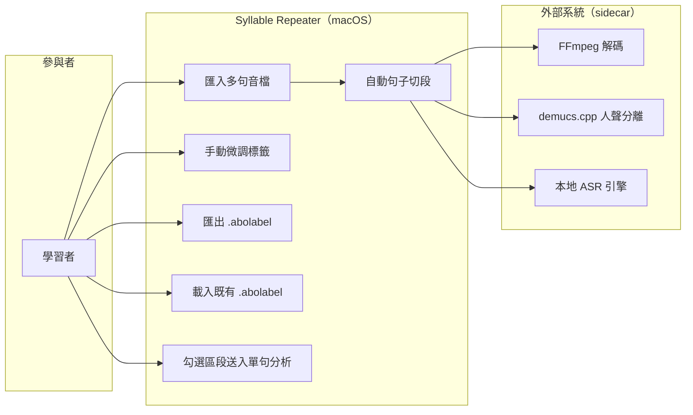

#### 3.2.2 前置條件

- FFmpeg／ASR sidecar 就緒；demucs.cpp 供選用（同 v1 REQ-01）；
- 音檔為受支援格式（mp3/wav/m4a/flac，單檔上限 10 分鐘，承 v1）。

#### 3.2.3 觸發事件及重要邏輯

- **觸發事件**：使用者在「段落標籤」功能區匯入音檔。
- **重要邏輯**：
  1. 本頁只保留波形匯入卡內的「瀏覽」入口；頁首重複的「選擇音檔」按鈕刪除。前端接收音檔後，計算內容雜湊（Content Hash——音檔的「指紋」，同一檔案指紋必相同）；
  2. 查本機標籤庫：若曾有同指紋音檔的 `.abolabel` 紀錄 → 彈出提示「找到當初的標籤註記檔，是否一併載入？」使用者可選載入或重新切段；
  3. FFmpeg 解碼 PCM，前端顯示波形＋時間軸（Audacity 式全檔總覽）；
  4. （預設開啟，可關）demucs.cpp 人聲分離 → 自動切句跑在人聲軌上（D2）；
  5. 本地 ASR 引擎（透過 TranscriberEngine port）產出句子級時間戳與文字 → 組裝 `Segment[]`，每段標起訖毫秒與句子文字；
  6. 前端在波形上畫出各 Segment 邊界線與編號；使用者可自由框選時間區間並標記為「保留」或「捨棄」。保留區間才列入最終 Segment 與可送往單句分析的清單；捨棄區間以灰色顯示並保留註記，不能被當作句子。未標記區間保持中性，不自動刪除；區間可含前導／中段／尾端無聲、狀聲詞或其他不練內容，保留區間只需單調、互不重疊，不要求覆蓋全音檔；
  7. 區段試聽提供播放、暫停／繼續、停止三態：播放中播放鍵轉為暫停鍵；停止鍵永遠獨立可見，停止後位置歸回該區段起點，只能再由播放鍵從頭開始。全檔波形上以紅色虛線軸顯示真實播放位置，播放／拖曳時移動，暫停時停住，停止時回到區段起點；
  8. 使用者按「匯出標籤」→ 另存 `.abolabel` v2（zip＋JSON：含音檔指紋、保留 Segment、捨棄區間與註記、schema 版本號、當時人聲分離開關狀態）；讀取 v1 檔時把既有 Segment 視為保留區間、其餘視為未標記，維持向後相容；
  9. **未儲存攔截**：標籤有未儲存變更時，使用者要匯入下一個音檔 → 彈出另存提示，等待使用者選「儲存」或「不儲存」後才繼續（不可靜默丟棄，見 2.5 不可接受清單）；
  10. 使用者勾選一個「保留」Segment 按「下一步」→ 該區段（起訖毫秒＋文字）自動帶入「單句分析」功能區並就緒；捨棄或未標記區間不得送出；
  11. **真實進度**：匯入／開啟流程以「讀取與指紋→解碼→可選人聲分離→自動切段→波形與工作階段完成」的實際事件更新進度條；每一階段只有在真實完成後才前進，停在某階段時不得靠動畫自行增加百分比（M15）。
- **例外**：ASR 失敗 → 回傳正常結果＋`ERR_TRANSCRIBE_FAILED` 警告（不拋例外），波形與時間軸仍可用，空工作階段供使用者全手動切段；標籤功能不因辨識失敗而癱瘓，sidecar 崩潰不拖垮 App（M4）。
- **阻力點記載**：長音檔（10 分鐘）自動切段為等待熱點，須顯示階段化進度（解碼中/分離中/切段中）。

#### 3.2.3.1 業務流程圖

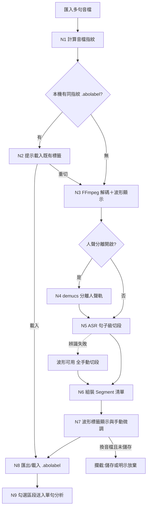

#### 3.2.4 節點描述

| 節點編號 | 節點名稱 | 責任物件 | 動作簡述 |
|----------|----------|----------|----------|
| N1 | 指紋計算 | 伺服器端（Domain） | 計算音檔 Content Hash |
| N2 | 既有標籤提醒 | 前端 | 找到同指紋標籤檔時提示載入 |
| N3 | 解碼與波形 | 外部系統（FFmpeg）＋前端 | 解碼 PCM、繪全檔波形與時間軸 |
| N4 | 人聲分離 | 外部系統（demucs.cpp） | 產出人聲軌供切段（可關閉） |
| N5 | 自動切段 | 外部系統（本地 ASR） | 句子級時間戳與文字 |
| N6 | Segment 組裝 | 伺服器端（Domain：SegmentEngine） | 組裝 Segment[]（起訖 ms、文字、語言標記） |
| N7 | 標籤微調 | 前端＋Domain | 自由框選、標記保留／捨棄、滑動邊界、紅色播放軸與播放／暫停／停止 |
| N8 | 標籤存取 | 伺服器端（Domain）＋前端 | `.abolabel` v2 讀寫；保留、捨棄、未標記語意與 v1 相容 |
| N9 | 送入分析 | 前端 | 只允許保留區段帶入「單句分析」 |

#### 3.2.5 後續動作

- 勾選的 Segment（起訖毫秒＋句子文字＋語言標記）交付 REQ-12 單句分析；
- 後置條件：保留與捨棄區間皆落在音檔時長內且各自不可重疊；最終 Segment 只由保留區間組成，可有未標記間隙；`.abolabel` 可完整還原三態與播放起點。

#### 3.2.6 非功能性清單

| 類別 | 指標/描述 | 實作要求 | 驗收方式 |
|------|-----------|----------|----------|
| 效能 | 3 分鐘歌曲的解碼＋分離＋自動切段全程 ≤ 5 分鐘（基準機 Intel i5-8259U，承 v1 Q10 基準） | 真實階段事件驅動進度條；不顯示假百分比 | 碼表實測＋事件測試 |
| 相容性 | `.abolabel` 帶 schema 版本號，舊版檔案可被新版 App 讀取 | JSON schema 版本欄位 | 版本升級讀取測試 |
| 穩定性 | ASR 失敗時標籤功能仍可全手動使用 | 波形與手動操作不依賴辨識結果 | 故障注入（kill ASR sidecar） |

#### 3.2.7 驗收測試情境

| 編號 | 類型 | 情境（帶真實值） | 操作 | 預期結果 |
|------|------|------------------|------|----------|
| AT-11-01 | 正常 | 匯入 3 分鐘英文歌（含伴奏），人聲分離開啟 | 等待自動切段 | 波形＋時間軸顯示；切出句子級 Segment（如 24 段），各段帶文字與起訖毫秒，邊界線與編號可見 |
| AT-11-02 | 正常 | AT-11-01 完成後，第 5 段邊界原為 42300ms | 滑動至 42800ms；在第 7/8 段間隙按「＋」；選第 12 段按「×」 | 邊界更新為最近零交越吸附值；新增一條標籤線（段數+1）；第 12 段與相鄰段合併（段數−1）；編號即時重排 |
| AT-11-03 | 正常 | 標籤調整完成 | 按「匯出標籤」另存 `song-a.abolabel` | 產出 zip＋JSON 檔；重匯入同一音檔時提示「找到當初的標籤註記檔」，載入後標籤狀態完整還原 |
| AT-11-04 | 資料保存（攔截） | 標籤有未儲存變更 | 直接匯入另一個音檔 B | 彈出另存提示；選「儲存」→ 存檔後才載入 B；選「不儲存」→ 明示放棄後載入 B；關閉提示 → 停留原音檔，不載入 B |
| AT-11-05 | 錯誤輸入 | 匯入 0 byte 的 broken.mp3 | 匯入 | 明確錯誤「無法解碼」，App 不崩 |
| AT-11-06 | 例外 | 自動切段進行中 kill -9 ASR sidecar | 觀察 | App 不崩；`openAudio` 正常回傳空工作階段＋`ERR_TRANSCRIBE_FAILED` 警告；提示「切段失敗，可重試或手動切段」；波形與手動標籤功能可用 |
| AT-11-07 | 邊界（時長上限） | 匯入 10 分 00 秒音檔／10 分 01 秒音檔 | 分別匯入 | 前者正常進入切段；後者明確拒絕（超過單檔上限，承 v1） |
| AT-11-08 | 亂序 | 自動切段進行中連按「匯入」3 次 | 快速點擊 | 匯入鈕置灰，僅一個切段任務 |
| AT-11-09 | 邊界（最小段數） | 標籤工作階段只剩 1 段 | 再按一次「刪除標籤線」 | 操作被拒，回傳既有 `ERR_BOUNDARY_INVALID`；唯一段落與 dirty 狀態不變 |
| AT-11-10 | 真實進度（M15） | 匯入 3 分鐘歌曲，人聲分離開啟 | 觀察開啟流程 | 進度依讀取／解碼／分離／切段／完成事件單調前進；sidecar 停在分離時進度也停在分離，不會自行跳到切段或 100% |
| AT-11-11 | 介面去重 | 開啟段落標籤頁 | 檢視可選檔入口 | 頁首沒有「選擇音檔」按鈕，只保留匯入卡內「瀏覽」；拖放仍可用 |
| AT-11-12 | 保留／捨棄 | 音檔依序為 2 秒無聲、句1、3 秒無聲、句2、句3、狀聲詞、2 秒無聲、句4 | 框選四句為保留，其餘無聲與狀聲詞為捨棄 | 最終清單恰為 4 段；捨棄區間灰色且保留註記；只有四個保留段可送往單句分析 |
| AT-11-13 | 標籤相容 | 將 AT-11-12 匯出 `.abolabel` v2，再讀取既有 v1 標籤檔 | 重開 | v2 完整還原保留／捨棄；v1 既有 Segment 全視為保留且未覆蓋處為未標記，不臆測捨棄 |
| AT-11-14 | 播放控制 | 第 2 保留段為 12.0～15.2 秒 | 播放 0.8 秒→暫停→繼續→停止→再播放 | 紅色虛線軸依真實位置移動；暫停停住；繼續由暫停位置往後；停止回 12.0 秒；再播放從 12.0 秒開始 |
| AT-11-15 | 邊界 | 框選 0ms 起始與音檔結尾各一段，並建立兩段間 500ms 未標記間隙 | 儲存與重載 | 邊界合法、間隙不被自動合併或捨棄，段落順序與註記不變 |
| AT-11-16 | 全區段完整播放 | 已標籤第 1 至第 N 段，另有一份僅含全檔單一區段的音檔 | 逐段播放至自然結束 | 每一段皆播放恰為 `endMs-startMs`，不限首、中、末段；全檔單一區段亦完整播放到音檔尾端 |

---

## 五、REQ-12 匯入與分析改為單句模式

### 3.1 需求概述

- **目的**：「匯入與分析」功能區定位為**單句分析**：入口一＝直接在本區「匯入音檔」放入單句音檔（v1 原流程）；入口二＝由「段落標籤」區勾選一個 Segment 帶入。按「開始分析」後走 v1 REQ-01 對齊管線，音節預覽區塊與字稿區域同步顯示辨識結果。
- **使用動機**：多句音檔走段落標籤（REQ-11）、單句素材直接匯入——兩條路都通到同一個分析入口，使用者不需理解內部差異。
- **決策留痕**：原提案含「無音檔時可寫句子由 TTS 生成音檔」分支，已撤回（D1）；無音檔時一律提示先匯入音檔或到段落標籤區選句。

### 3.2 業務流程

#### 3.2.1 用例圖

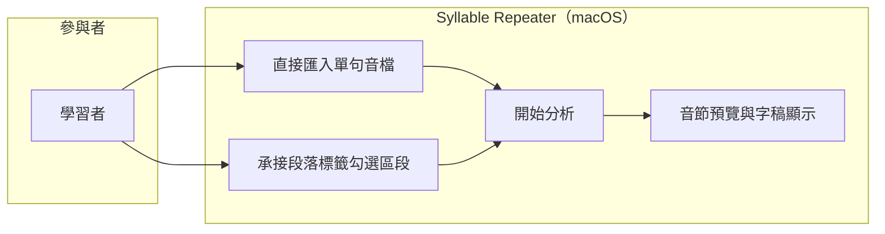

#### 3.2.2 前置條件

- 入口一：受支援格式之單句音檔；入口二：REQ-11 已勾選一個 Segment 按「下一步」。

#### 3.2.3 觸發事件及重要邏輯

- **觸發事件**：使用者按「開始分析」。
- **重要邏輯**：
  1. **入口與就緒整合**：入口一選檔後先實際讀取位元組並驗證非空、格式與時長；完成前顯示真實讀取進度且「開始分析」不可用，全部成功後才顯示「音檔已就緒」。入口二取 Segment 的起訖毫秒切出該區段 PCM（**原音切片**，不重新編碼），因前一頁已完成解碼與合法性驗證，承接後立即顯示「音檔已就緒」；Segment 文字作為字稿預填；
  2. 走 v1 REQ-01 對齊管線（解碼→可選分離→ASR 詞級時間戳→音節切分），經 TranscriberEngine／Syllabifier port（REQ-17 抽層）；
  3. 分析期間依既有 `AnalysisPipeline` 的真實階段事件顯示進度；分析完成 → **結果預覽只顯示本次實際辨識出的音節區塊文字**，字稿區域同步顯示相同文字來源（兩處同源，改一處另一處跟著更新）；
  4. 手動譯文輸入區位於字稿區域附近（REQ-20 搬移後位置），可在此時填寫或稍後補；
  5. **無音檔防呆**：未匯入音檔且無承接區段時，「開始分析」置灰，並顯示引導文案「請先匯入音檔，或到『段落標籤』選擇一個區段」；
  6. **預覽空態**：使用者尚未按「開始分析」前，結果預覽內容留白，不顯示「11 音節預覽」等硬編文字；失敗時顯示實際錯誤，不保留上一次或示範結果。
- **例外**：同 v1 REQ-01（sidecar 失敗回報、可重試、App 不崩）。

#### 3.2.4 節點描述

| 節點編號 | 節點名稱 | 責任物件 | 動作簡述 |
|----------|----------|----------|----------|
| N1 | 入口整合 | 前端＋伺服器端（Domain） | 整檔或 Segment 切片作為分析對象 |
| N2 | 對齊管線 | 伺服器端＋外部系統 | v1 REQ-01 管線（經 port 抽層） |
| N3 | 同源顯示 | 前端 | 音節預覽區塊與字稿區域同步顯示 |
| N4 | 無音檔防呆 | 前端 | 分析鈕置灰＋引導文案 |

#### 3.2.5 後續動作

- `AlignmentResult` 交付 REQ-02（v1 校正）與 REQ-13（切點增減）；
- 後置條件：入口二來的分析對象，其 PCM 逐 sample 等於原音檔該區段（M1）。

#### 3.2.6 非功能性清單

無新增（沿用 v1 REQ-01 效能與穩定性指標）。

#### 3.2.7 驗收測試情境

| 編號 | 類型 | 情境（帶真實值） | 操作 | 預期結果 |
|------|------|------------------|------|----------|
| AT-12-01 | 正常 | 直接匯入金標準例句音檔（3.2 秒） | 開始分析 | 切出 11 音節；音節預覽區 11 個區塊文字與字稿區域文字一致同源 |
| AT-12-02 | 正常 | 從段落標籤勾選第 5 段（42300ms～45100ms，文字 `I don't wanna talk`） | 下一步→開始分析 | 分析對象為該 2.8 秒原音切片；字稿預填 `I don't wanna talk`；音節預覽正確顯示 |
| AT-12-03 | 錯誤輸入（防呆） | 未匯入任何音檔、無承接區段 | 檢視「開始分析」 | 按鈕置灰；顯示引導文案；**不出現任何 TTS／生成選項**（D1 核心不被破壞） |
| AT-12-04 | 資料保存 | AT-12-02 分析完成 | 比對切片 PCM | 逐 sample 等於原音檔 42300ms～45100ms 區間（M1） |
| AT-12-05 | 亂序 | 分析中連按「開始分析」3 次 | 快速點擊 | 按鈕置灰，僅一個分析任務（承 v1 AT-01-05） |
| AT-12-06 | 真實匯入（M15） | 選擇 20MB mp3 | 觀察選檔後狀態 | 位元組尚未讀完時顯示真實讀取進度且不可分析；格式／時長驗證成功後才顯示「音檔已就緒」並啟用開始分析 |
| AT-12-07 | 承接就緒 | 段落標籤已完成並送出第 5 段 | 切到匯入與分析頁 | 立即顯示「音檔已就緒」，不再要求重選檔或重做匯入驗證 |
| AT-12-08 | 預覽誠實 | 尚未開始分析／分析完成但只辨識 8 音節 | 觀察結果預覽 | 前者內容留白；後者只顯示實際 8 音節與實際文字，不顯示硬編的 11 音節或錯誤示範文字 |
| AT-12-09 | 核心不被破壞（M1 軌道隔離） | `originalPcm` 為含伴奏原音，Demucs 產生不同的 `analysisPcm` | 開啟人聲分離完成分析，再播放／保存／匯出／錄音比對參考音 | 辨識與波形分析可讀 `analysisPcm`；四個輸出路徑逐 sample 只讀 `originalPcm`，不得出現 Demucs 人聲軌 |

---

## 六、REQ-13 音節切點增減校正

### 3.1 需求概述

- **目的**：在「音節校正」功能區，使用者除了 v1 的拖動切點外，還可以**刪除切點**（相鄰兩音節合併為一）與**新增切點**（一個音節區段一分為二）；文字區塊內容可編輯（如 `I dont` 改為 `I don't`）；全部操作可撤銷。
- **使用動機**：自動切分有時多切或漏切——如把 `I don't` 錯切成 `I`＋`dont` 兩塊，使用者想按一下叉叉把它們合回去；反過來漏切時，在區段內點一下加一條線拆開。最可能放棄點：**合併/拆分後編號亂掉、或後悔了回不去**——因此編號即時重排（REQ-14）與撤銷是配套必需。
- **核心衝擊與化解**：切點增減會改變音節總數 → 依 **M11**，「編輯後的當時總數」即為 M2 疊加步數與統計基準（金標準 11 僅為未編輯預設）。

### 3.2 業務流程

#### 3.2.1 用例圖

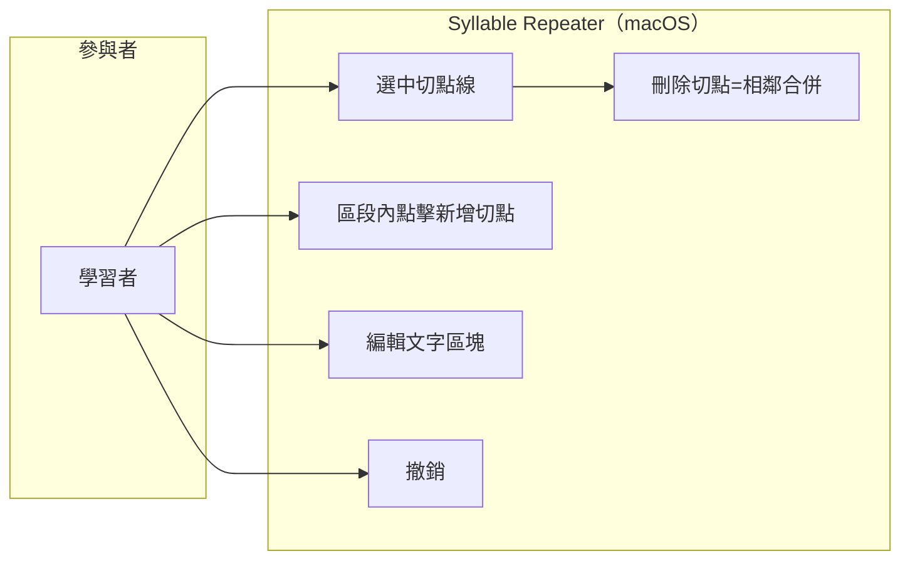

#### 3.2.2 前置條件

- REQ-12 分析完成，工作階段存在合法 `AlignmentResult`（音節清單與波形已顯示）。

#### 3.2.3 觸發事件及重要邏輯

- **觸發事件**：使用者在波形韻律圖上點擊切點垂直線，或在某音節區段內空白處點擊。
- **重要邏輯**：
  1. **選中切點**：點擊垂直線 → 該線變色（選中態），線外側邊緣浮現「×」刪除圖示；此時可（a）滑動改位置（v1 既有拖動）或（b）按「×」刪除；
  2. **刪除切點**：按「×」→ 該切點移除，左右兩音節合併為一個（文字串接，如 `I`＋`dont` → `I dont`；時間區間取聯集）；音節總數 −1；
  3. **新增切點**：在某音節區段內任意處點一下 → 浮現「＋」圖示 → 按下 → 於點擊位置插入一條垂直線（吸附最近零交越，承 v1），該音節一分為二；新產生的後半文字區塊為**空白待填**，標 `needsReview`；音節總數 +1；
  4. **文字編輯**：任何文字區塊皆可雙擊進入編輯（如 `I dont` 改 `I don't`）；編輯後文字覆蓋顯示用字稿，原始辨識文字保留於 `needsReview` 佐證欄供比對；
  5. **撤銷**：左上方既有「撤銷」按鈕（⌘Z）依序回復拖動/刪除/新增/改字操作，每步一筆歷史；
  6. 每次增減後：音節總數、步驟預覽、REQ-14 的編號顯示即時更新（M11）。
- **邊界約束**：切點不足 2 個音節時（僅剩 1 個音節）「×」不再出現（至少保留 1 個音節）；新增切點不得落在距既有切點 <50ms 處（防誤觸產生碎片段）。
- **例外**：文字編輯為空字串時，儲存為空白區塊並強制標 `needsReview`（允許暫存，不阻斷流程）。

#### 3.2.3.1 業務流程圖

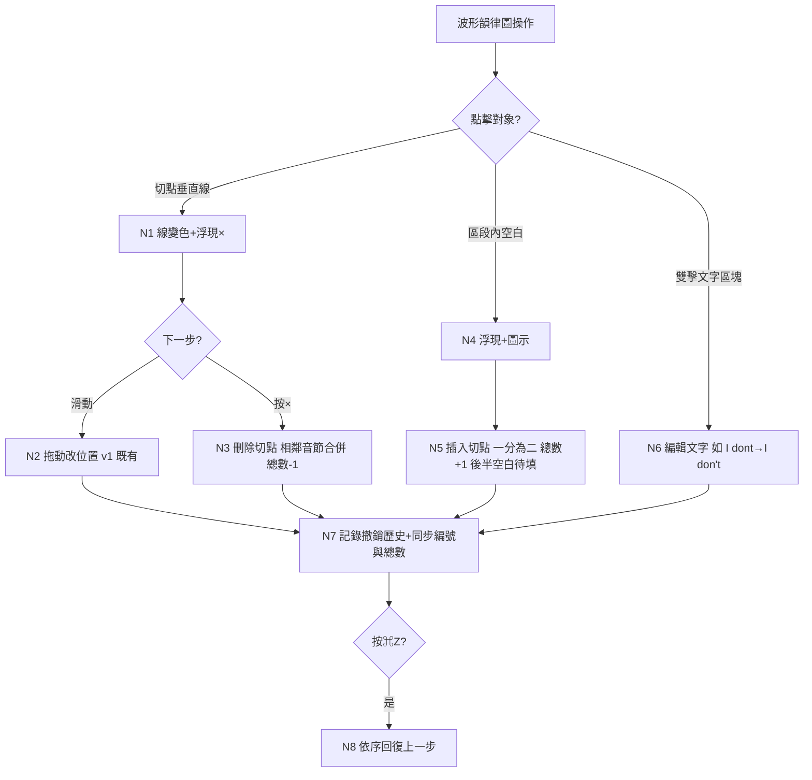

#### 3.2.4 節點描述

| 節點編號 | 節點名稱 | 責任物件 | 動作簡述 |
|----------|----------|----------|----------|
| N1 | 切點選中態 | 前端 | 變色＋浮現「×」 |
| N2 | 拖動校正 | 前端＋伺服器端（Domain） | v1 REQ-02 既有流程 |
| N3 | 刪除合併 | 伺服器端（Domain：AlignmentEngine） | 移除切點、合併音節、驗證區間連續 |
| N4 | 新增引導 | 前端 | 區段內點擊浮現「＋」 |
| N5 | 插入拆分 | 伺服器端（Domain：AlignmentEngine） | 零交越吸附、拆分區段、後半空白＋needsReview |
| N6 | 文字編輯 | 前端＋伺服器端（Domain） | 覆蓋顯示字稿、保留原辨識文字 |
| N7 | 歷史與同步 | 伺服器端（Domain） | undo 歷史；總數/編號即時同步（M11） |
| N8 | 撤銷 | 伺服器端（Domain） | 逐步回復 |

#### 3.2.5 後續動作

- 校正後 `syllables[]` 交付練習（REQ-15/16）、韻律分析、比對——一律使用編輯後的當時值；
- 後置條件：時間區間單調遞增、互不重疊；音節總數 = 編輯後實際值（M11）。

#### 3.2.6 非功能性清單

| 類別 | 指標/描述 | 實作要求 | 驗收方式 |
|------|-----------|----------|----------|
| 效能 | 增減操作回饋 ≤ 100ms；撤銷 ≤ 100ms | 操作皆為記憶體內模型變更 | 實機操作觀測 |

#### 3.2.7 驗收測試情境

| 編號 | 類型 | 情境（帶真實值） | 操作 | 預期結果 |
|------|------|------------------|------|----------|
| AT-13-01 | 正常（刪除） | 音檔切出 `I`(0-420ms)＋`dont`(420-880ms) 兩音節 | 點 420ms 切點線→按「×」 | 合併為 `I dont`(0-880ms)；音節總數 −1；編號重排 |
| AT-13-02 | 正常（新增/後悔藥） | AT-13-01 之後 | 在 `I dont` 區段內點一下→按「＋」 | 於點擊處（零交越吸附）插入切點；拆為兩塊，後半為空白區塊標 needsReview；總數 +1 |
| AT-13-03 | 正常（改字） | AT-13-02 後半空白區塊 | 雙擊輸入 `don't` | 顯示 `don't`；原辨識文字保留於佐證欄 |
| AT-13-04 | 資料保存（撤銷） | 連續做：拖動→刪除→新增→改字 | 按 ⌘Z 四次 | 依序回復：改字→新增→刪除→拖動，狀態與操作前完全一致 |
| AT-13-05 | 邊界（最少音節） | 反覆合併至僅剩 1 個音節 | 點選最後區段 | 「×」不出現，無法再合併 |
| AT-13-06 | 邊界（防碎片，兩側） | 既有切點於 2380ms | 在 2429ms 處嘗試新增／在 2431ms 處嘗試新增 | 前者拒絕（<50ms）；後者成功（≥50ms） |
| AT-13-07 | 核心不被破壞（M11） | 金標準例句 11 音節，刪 1 個切點 | 進入疊加練習 | 步驟總數顯示 10（＝當時值），不再是 11；M2 演算法本身不變（第 n 步仍為句尾往前 n 個） |
| AT-13-08 | 即時繪製 | 點選 2380ms 原切點後刪除，再於 2600ms 新增 | 連續操作並錄影逐幀檢查 | 每次模型提交後舊粉色切點與拖曳預覽於下一幀清除；畫面只保留目前切點，不殘影、不延遲一陣子 |
| AT-13-09 | 效能／亂序 | 10 秒、48kHz PCM；快速連續刪除、插入、撤銷三次，前一次音韻分析尚未完成 | 觀察狀態與 UI heartbeat | 每次切點模型提交於下一幀可見；音韻分析在背景執行；只有最後一代結果可回寫，較早完成或較晚完成的舊結果都不得覆蓋最新音節狀態 |

---

## 七、REQ-14 波形↔文字雙向高亮與序號同步

### 3.1 需求概述

- **目的**：校正過程中，選取波形上的一段時間範圍時，**所有與該時間範圍有重疊的音節區段與文字積木都同步以半透明黃色標記**；點文字積木則把選取範圍設為該積木區間。每個文字區塊下方顯示排序號；波形切點圓點內顯示區段號；全部編號隨 REQ-13 的增減操作即時重排。
- **使用動機**：音節一多（如 communication 5 個），使用者對不上「我在改的是波形上哪一段＝文字上哪一塊」——雙向高亮＋編號讓「現在在校正第幾號」一眼可見。

### 3.2 業務流程

#### 3.2.1 用例圖

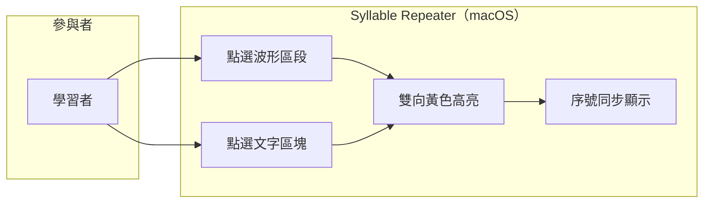

#### 3.2.2 前置條件

- 同 REQ-13（存在 `AlignmentResult`，波形與文字區塊已顯示）。

#### 3.2.3 觸發事件及重要邏輯

- **觸發事件**：使用者點選波形上某音節區段，或點選文字區域某文字區塊。
- **重要邏輯**：
  1. 選中狀態為單一共享時間範圍（`SelectedTimeRange(startMs, endMs)`）；任一音節只要符合 `syllable.startMs < selected.endMs && syllable.endMs > selected.startMs` 就同步半透明黃色高亮。不得只高亮範圍內第一個 index；
  2. 點文字第 k 塊 → `SelectedTimeRange` 設為第 k 塊完整區間；點波形單一區段仍可得到單塊高亮；拖曳／選取跨越多個音節時，高亮全部重疊積木；
  3. 每個文字區塊下方常駐顯示排序號（1 起算）；
  4. 波形上各區段起點圓點改為「圓點內寫阿拉伯數字」＝區段號；
  5. REQ-13 任何增減操作後，兩邊編號即時重排（刪第 3 段 → 原第 4 段變 3 號，依此類推）；
  6. 高亮與選中狀態不影響播放（試聽照常可用）；波形另以紅色虛線軸顯示真實播放位置，語意與 REQ-11 相同，不可拿選取邊界充當播放軸。
- **例外**：無選中時無高亮；選中的區段被刪除時選中狀態清空。

#### 3.2.4 節點描述

| 節點編號 | 節點名稱 | 責任物件 | 動作簡述 |
|----------|----------|----------|----------|
| N1 | 共享選中狀態 | 前端 | SelectedTimeRange 單一來源 |
| N2 | 波形高亮 | 前端 | 選中時間範圍半透明黃色＋圓點編號 |
| N3 | 文字高亮 | 前端 | 所有與範圍重疊的區塊半透明黃色＋下方序號 |
| N4 | 編號重排 | 前端 | 隨增減操作即時更新 |

#### 3.2.5 後續動作

- 後置條件：任意時刻波形編號序列與文字序號序列完全一致（1..N 連續無跳號）。

#### 3.2.6 非功能性清單

| 類別 | 指標/描述 | 實作要求 | 驗收方式 |
|------|-----------|----------|----------|
| 效能 | 高亮切換 ≤ 50ms | 前端狀態變更即繪 | 實機操作觀測 |

#### 3.2.7 驗收測試情境

| 編號 | 類型 | 情境（帶真實值） | 操作 | 預期結果 |
|------|------|------------------|------|----------|
| AT-14-01 | 正常 | 金標準例句 11 音節 | 點波形第 8 段（`ca`） | 波形第 8 段與文字第 8 塊同時黃色高亮；圓點顯示 8、文字下方顯示 8 |
| AT-14-02 | 正常（反向） | 同上 | 點文字第 10 塊（`tion`） | 波形第 10 段同步黃色高亮 |
| AT-14-03 | 正常（重排） | 選中第 5 塊，刪除第 3 段切點 | 觀察 | 編號 1..10 連續重排；原第 5 塊變 4 號且維持選中與高亮對應 |
| AT-14-04 | 邊界 | 選中最後一段（第 11） | 刪除該段切點使其被合併 | 選中狀態清空、無殘留高亮 |
| AT-14-05 | 亂序 | 1 秒內交替點擊波形/文字 10 次 | 快速操作 | 高亮始終兩邊一致，無錯位 |
| AT-14-06 | 多塊重疊 | 波形選取範圍自 `think` 中段跨到 `rain` 中段，重疊 `think`、`it'll`、`rain` 三段 | 完成選取 | 三個文字積木與三段波形全部為同一半透明黃色；前後未重疊積木不變色，不得只亮第一塊 |
| AT-14-07 | 播放軸 | 選取第 1 音節 `upb`，其起點為 138ms，結尾為 431ms | 從句首播放至 500ms | 半透明黃色嚴格吸附 138～431ms 節點線；紅色虛線軸由 0 移至 500ms，兩者互不取代；最後一段也能於其區間內新增切點並完整播放到音檔尾端 |

---

## 八、REQ-15 練習內容自由編輯區

### 3.1 需求概述

- **目的**：音節校正下方新增「練習內容自由編輯區」：按「一鍵生成」依當時音節總數排出等量列；可增刪列；把上方文字積木以觸控板直接拖曳進任一列（含空列）；同列積木放到另一積木上即成組，組塊視為一個完整重複單位；**雙擊積木／組塊才開啟集中設定視窗**，單一積木與組塊皆預設重複 1、靜音 1 倍。每列另有外層設定，預設重複 3、靜音 1 倍；積木右側不常駐設定或播放圖示，只保留列設定與整列預覽；本區有獨立撤銷。
- **使用動機**：自動句尾疊加是固定套路；使用者想針對自己卡住的組合（如 `itll`＋`rain` 的連音）自組練習序列，像排積木一樣自由。最可能放棄點：**排錯了改不動、圈錯了拆不掉**——因此獨立撤銷與逐塊設定是配套必需。
- **紅線**：所有積木播放皆為原音切片串接（M1 補述，D4）；本區僅重排「播放順序與次數」，不產生任何新聲音。

### 3.2 業務流程

#### 3.2.1 用例圖

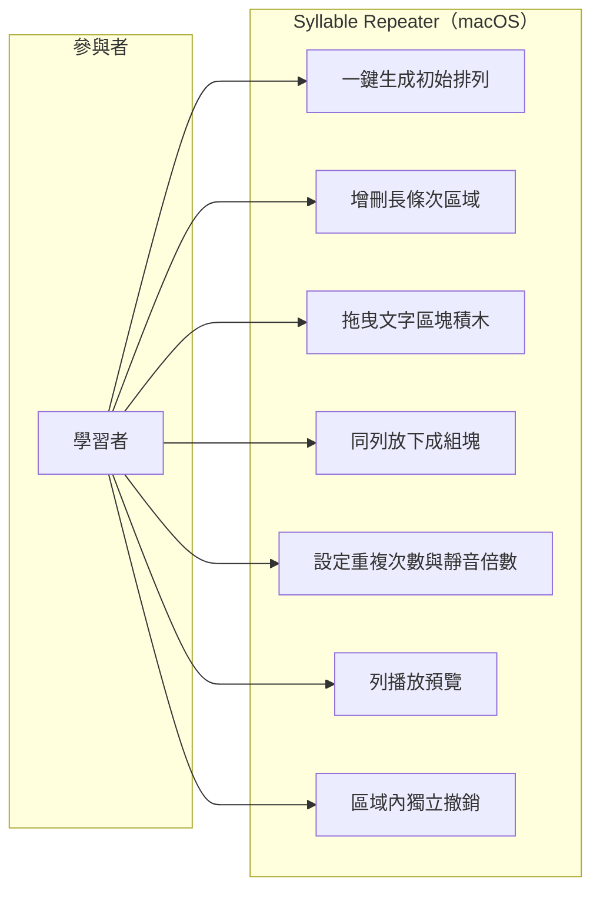

#### 3.2.2 前置條件

- REQ-13 校正完成（或使用者接受自動值）；存在當時音節總數 N 與各音節時間區間。

#### 3.2.3 觸發事件及重要邏輯

- **觸發事件**：使用者按「一鍵生成」。
- **重要邏輯**：
  1. **一鍵生成**：依當時音節總數 N（M11）排出 N 個長條型次區域；第 i 列預填「句尾數來 i 個音節」的文字區塊組（第 1 列＝句尾 1 塊；最後一列＝全部 N 塊）——即 M2 句尾疊加的可視化初始設置；
  2. **列的增刪**：各列間隙左側「＋」→ 於該處插入一個空列；各列左側「−」→ 刪除該列；
  3. **來源段落點選插入**：工作區頂端為「來源段落」。選取一段後，每列的每個頂層積木／組合左側顯示小型插入按鈕，列尾另顯示追加按鈕；空列顯示整列「點此放下積木」。點按後插入並清除來源選取，因此來源可成為任一列第一個、中間或最後積木；Esc 或再次點同一來源取消。來源不以拖曳跨越長列，避免與列區捲動搶手勢；
  4. **同列長按本體改序／成組**：單一積木、整個組合與組內成員皆以積木本體長按約 300ms 啟動拖曳；短按選取、雙擊開設定。macOS 已啟用三指拖移時，由系統轉成相同拖曳事件。既有積木只能在原列左右改序、把單一積木放到同列另一積木／組合成組、組內改序或抽出成同列單一積木；拖到其他列一律取消且資料不變。成組後 `sourceRanges` 依畫面順序串接，若原設定不同則統一重置 1／1；拆組後各子塊也回到 1／1；
  5. **集中設定視窗**：雙擊積木／組塊才開啟對話框；內容含重複次數 1–10（預設 1）、靜音倍數 0–20（預設 1、0.5 級距、0 表示無靜音）、播放此積木／組塊預覽、`重置`（回到 1／1）、取消與套用。設定不得直接顯示在積木右側；積木旁的設定與單塊播放圖示一律移除；
  6. **積木內層播放與自然接合**：每個單一／組合積木以「完整積木原音＋完整積木原時長 × silenceFactor 的數位零」為一輪，再依 repeatN 逐輪重複；最後一輪仍保留積木靜音。先合併來源上相鄰的 `sourceRanges` 再切片，避免在同一句連續音節間反覆截斷；非相鄰切片的接點先於 ±10ms 找最近零交越並實際調整切點，找不到時只允許 ≤10ms micro-fade。不得 crossfade 混入另一來源、不得改音高或合成；
  7. **獨立撤銷**：本區域專屬撤銷按鈕，只回復本區操作（與上方校正區的撤銷互不干擾），涵蓋：生成、增刪列、拖曳、成組／拆組、設定變更；
  8. **草稿身分**：分析成功時即產生穩定 `DraftLessonIdentity`；一鍵生成使用此 id，因此尚未儲存 `.abopack` 也必須可按。正式存檔沿用同一 id，不重新換 id；跨 Lesson 注入防線照舊；
  9. **整列外層設定**：每列有重複次數 1–10（預設 3）與靜音倍數 0–20（預設 1、0.5 級距）。先完整渲染列內各積木設定，再由整列包住；整列靜音基準＝列內每個擺放積木的原始音訊長度各算一次（組合積木算其音節總長，不納入積木 repeat／silence）。整列每次重複之間插入「基準 × 整列 silenceFactor」，最後一次後不插入；
  10. **列控制**：列設定按鈕位於最右播放鍵左側；預覽播放中，播放箭頭改成停止方框，按下立即停止。列預覽、練習與未覆寫的匯出共用同一列快照與渲染規則。
- **例外**：上方校正區的音節總數變更（REQ-13 增減）後，已生成的排列**不自動重排**，顯示「音節已變更，排列可能過期」提示條，由使用者決定重新一鍵生成或保留手動排列。

#### 3.2.3.1 業務流程圖

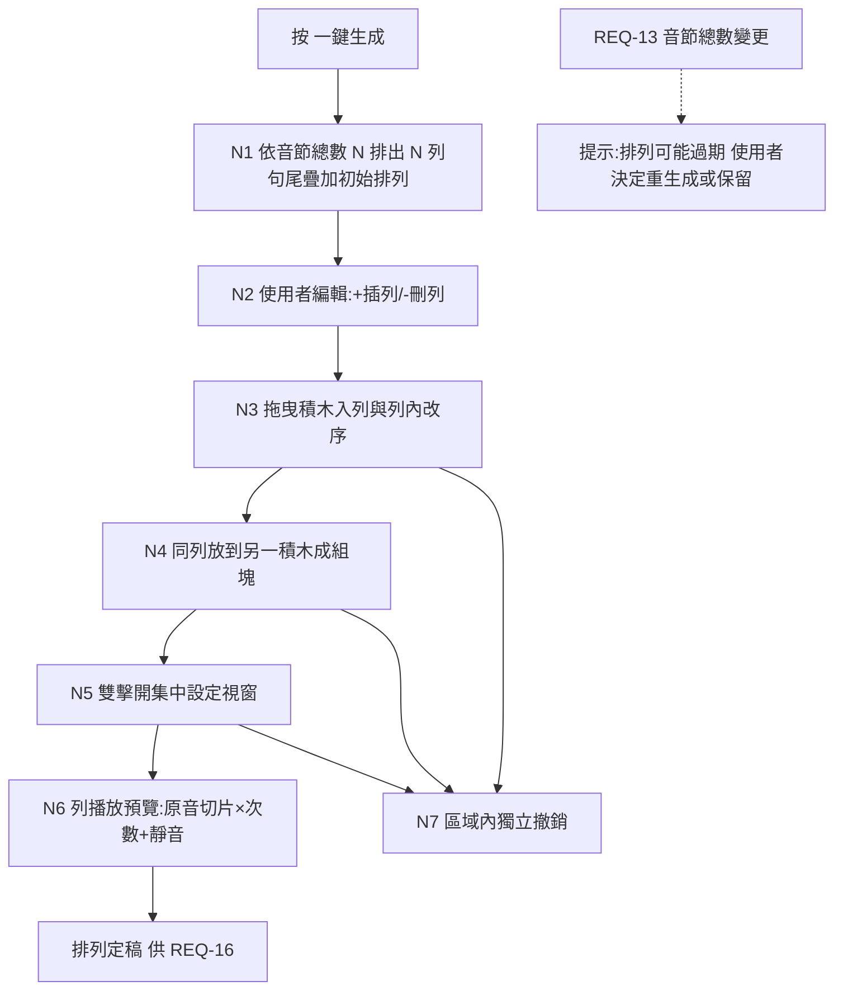

#### 3.2.4 節點描述

| 節點編號 | 節點名稱 | 責任物件 | 動作簡述 |
|----------|----------|----------|----------|
| N1 | 一鍵生成 | 伺服器端（Domain：PracticeEngine 擴充） | 依 N 產生句尾疊加初始 Arrangement |
| N2 | 列管理 | 前端＋伺服器端（Domain） | 插列/刪列，更新 Arrangement |
| N3 | 來源插入／積木拖曳 | 前端 | 來源段落以按鈕插入任一列位置；既有積木本體長按後只在同列改序 |
| N4 | 組塊 | 伺服器端（Domain） | 同列目標積木與拖入積木合為一個 PracticeBlock；跨列移動由 Domain 拒絕 |
| N5 | 塊設定 | 伺服器端（Domain） | repeatN（1–10）與靜音倍數（0–20、0.5 級距）驗證、重置與存放 |
| N6 | 列預覽 | 伺服器端（Domain）＋前端 | 先套積木內層，再套整列外層；原音切片串接渲染＋播放（M1 補述路徑） |
| N8 | 列設定 | 伺服器端（Domain）＋前端 | 設定整列 repeat／silence；播放中提供停止方框 |
| N7 | 獨立撤銷 | 伺服器端（Domain） | 本區專屬 undo 歷史 |

#### 3.2.5 後續動作

- 定稿的 `PracticeArrangement` 交付 REQ-16 作為練習播放與匯出內容（M12 覆蓋規則）；
- 後置條件：每個 PracticeBlock 的音訊來源均為本 Lesson 原音檔切片（可追溯至 syllables[] 時間區間）。

#### 3.2.6 非功能性清單

| 類別 | 指標/描述 | 實作要求 | 驗收方式 |
|------|-----------|----------|----------|
| 效能 | 拖曳跟手（≥30fps）；列預覽啟動 ≤ 500ms | PCM 切片快取重用 | 實機操作觀測 |

#### 3.2.7 驗收測試情境

| 編號 | 類型 | 情境（帶真實值） | 操作 | 預期結果 |
|------|------|------------------|------|----------|
| AT-15-01 | 正常（一鍵生成） | 音節數 11（金標準例句） | 按「一鍵生成」 | 排出 11 列：第 1 列 `skills`、第 2 列 `tion skills`、…第 11 列全部 11 塊（＝M2 步驟表可視化） |
| AT-15-02 | 正常（插列＋自組） | AT-15-01 後，另一課件音節含 `itll`、`rain` | 第 1、2 列間按「＋」插空列；依序拖入 `rain, itll, itll, rain`；再拖動改為 `itll, rain, itll, rain` | 新列出現於指定位置；列內順序＝最終拖曳結果 |
| AT-15-03 | 正常（圈選與修正） | AT-15-02 之列 | 圈選後三塊成 `[itll, rain+itll+rain]`；按本區撤銷；重圈為 `[itll, rain, itll+rain]` | 第一次圈選生效→撤銷回復→第二次圈選生效；上方校正區撤銷歷史不受影響 |
| AT-15-04 | 正常（雙擊集中設定） | `itll`（300ms）、`rain`（350ms）、組塊 `itll+rain`（650ms） | 雙擊組塊，改為 4 次＋3 倍後套用；再開啟按「重置」 | 套用後整組＝`[650ms 原音＋1950ms 靜音]×4`；重置後＝`650ms 原音＋650ms 靜音`（1／1）；積木右側全程沒有設定／單塊播放圖示 |
| AT-15-05 | 正常（列預覽） | `rain` 1500ms 設 3／2、`think` 2000ms 設 2／3；整列設 3／1 | 按列播放鍵 | 內層＝`(1500+3000)×3+(2000+6000)×2＝29500ms`；整列靜音＝`(1500+2000)×1＝3500ms`；總長＝`29500×3＋3500×2＝95500ms`，最後無整列靜音 |
| AT-15-06 | 邊界（設定範圍兩側） | 任一積木 | 重複設 0／1、10／11；靜音設 −0.5／0、19.5／20、20.5；輸入 5.25 | 重複 0/11 拒絕、1/10 接受；靜音 −0.5/20.5/5.25 拒絕，0/19.5/20 接受 |
| AT-15-07 | 亂序 | 列預覽播放中 | 拖曳該列積木 | 播放停止或以舊排列播完（不得播出半新半舊的混合序列） |
| AT-15-08 | 資料保存（過期提示） | 排列定稿後回 REQ-13 刪 1 個切點 | 回到本區 | 顯示「音節已變更，排列可能過期」；原排列保留，不自動改動 |
| AT-15-09 | 核心不被破壞（M1 補述） | 檢查 AT-15-05 的播放/匯出 PCM | 逐 sample 比對 | 每一段皆可對應回原音檔的某個 syllable 時間區間；靜音段為數位零；無任何非原音 sample |
| AT-15-10 | 來源放入空列 | 新增空白第 1 列；來源段落有 `oon` | 點選 `oon`，再點空列「點此放下積木」 | 空列立即出現 `oon`，來源選取隨即清除；不需持續按住或拖過列區 |
| AT-15-11 | 整組重複 | 同列有 `aftern`、`oon`，兩者設定不同 | 把 `oon` 放到 `aftern` 成組，設定 3 次後預覽 | 成組設定先重置為 1／1；音訊順序為 `[afternoon＋整組 1 倍靜音]×3`；拆組後兩塊各自為 1／1 |
| AT-15-12 | 草稿一鍵生成 | 單句分析已成功但尚未儲存 `.abopack` | 按「一鍵生成排列」 | 按鈕可用並產生 N 列；草稿存檔後 Lesson id 不變，既有排列仍掛在同一 Lesson |
| AT-15-13 | 整列設定 | 同列為單一積木 `rain` 加組合積木 `rain+think`；原始長度依序 1500ms、3500ms；兩積木皆 1／1 | 整列設 3／1並預覽 | 積木內層＝`(1500+1500)+(3500+3500)=10000ms`；整列間隔＝`(1500+3500)×1＝5000ms`，不納入積木 repeat／silence；總長 `10000×3+5000×2=40000ms` |
| AT-15-14 | 播放停止 | 任一列播放中 | 觀察最右控制並按下 | 播放箭頭改為停止方框；按下後停止，且不留下半新半舊播放工作 |
| AT-15-15 | 自然接合 | 同一句連續 `rain` 0～1500ms、`think` 1500～3500ms 組成一列；1500ms 不是零交越 | 預覽整列並逐 sample 檢查接點 | 兩相鄰範圍先合併成 0～3500ms，一次切片，不在 1500ms 做截斷或 fade；非相鄰接點才吸附 ±10ms 或套 ≤10ms micro-fade，主觀無明顯爆音／斷裂 |
| AT-15-16 | 長列手勢隔離 | 1100×700 視窗已有 8 列，排列區位於外層頁面捲動容器內 | 在第 5～8 列捲動、拖曳並靠近上下緣 | 指標位於排列列區時只捲排列列區；拖曳期間外層頁面鎖住；邊緣自動捲動只作用於列區；放下後視野不跳走 |
| AT-15-17 | 單一／整組操作 | 同列依序為 `rain`、`[think+about]`、`skills`，下一列另有 `today` | 選取後刪除；或在積木本體長按後於原列左右移動／放到同列目標成組；再嘗試拖到下一列 | 可只刪 `rain`、只刪整組、同列改序或成組；畫面沒有六點把手與大型藍色跨列插入軌；跨列操作取消且兩列資料不變；刪除與同列變更可 undo |
| AT-15-18 | 組內成員操作 | 組塊為 `[rain+think+about]`，同列另有 `skills` | 短按 `think` 後刪除；或在 `think` 本體長按後移到 `about` 後、抽出為同列單一積木；把 `skills` 長按後放入組合 | 操作只影響選取成員且全程不需六點把手；組塊剩一項自動轉為單一積木；不產生空組塊，音節與來源範圍順序一致；不得抽到另一列 |
| AT-15-19 | 兩層捲動與末列穩定 | macOS 1100×700，段落校正頁位於最上方，自由排列有 8 列且含高列組塊 | 指標停在列區捲至最大位置並放開，等待觸控板慣性結束 | 全 App 不存在第三層垂直 Scrollable；段落校正頁 offset 不變；最後一列完整留在列區 viewport 內，不跳回倒數第二列 |
| AT-15-20 | 來源段落按鈕插入 | 來源段落有 `rain`，自由排列共 20 列；第 20 列依序為 `think`、組合 `[about+it]` | 點 `rain`，放開觸控板捲至第 20 列，依序測試第一個積木左側、組合左側、列尾插入按鈕與 Esc | `rain` 可成為第一個、插在單一／組合之前或追加列尾；每次插入後來源選取清除；插入按鈕只在選取來源時出現；Esc／再點來源取消；不啟動列內拖曳或影響捲動 |

---

## 九、REQ-16 句尾疊加區顯示自訂排列

### 3.1 需求概述

- **目的**：句尾疊加練習頁的錄音播放練習單元與匯出音檔功能，其內容依 **M12** 決定：自由排列不存在任何一列 → 顯示 1 個「目前選取完整單句」練習單元；自由排列有 1 列以上 → 每列一個練習單元並即時連動。一鍵生成仍依 M2 產生 N 列句尾疊加排列，因此生成後仍是 N 個單元。使用者可見用語統一由「步」改為「單元」，但內部既有進度識別須維持相容。
- **使用動機**：排好的積木要能直接拿來練——每列＝一個練習單元，附播放、錄音、匯出，跟 v1 疊加步驟的操作體驗一致，不用學第二套介面。

### 3.2 業務流程

#### 3.2.1 用例圖

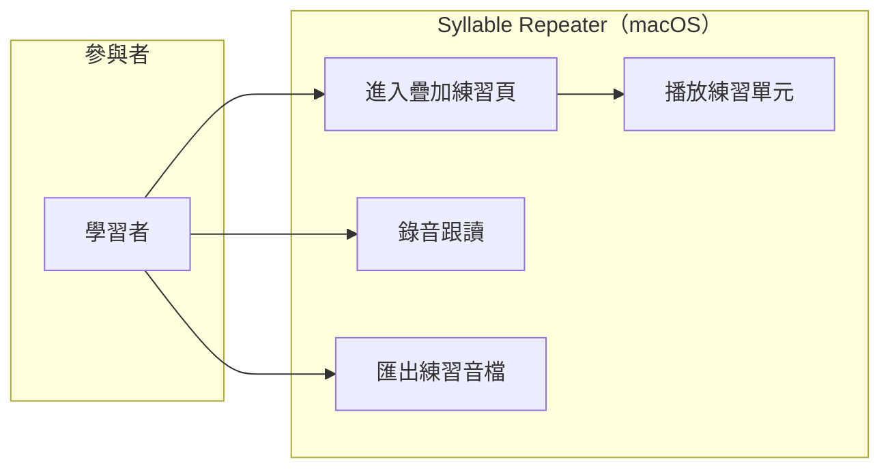

#### 3.2.2 前置條件

- 存在合法 `syllables[]`；有或無 `PracticeArrangement` 皆可進入。

#### 3.2.3 觸發事件及重要邏輯

- **觸發事件**：使用者開啟課件的疊加練習頁。
- **重要邏輯**：
  1. **內容判定（M12）**：排列為 null 或列數為 0 → 建立 1 個完整單句單元，原音範圍由目前單句 PCM 的 `0..duration` 取得，視為隱含列 3／1；排列有 1 列以上 → 以各列為練習單元序列，列數、順序、積木與設定即時一對一連動；
  2. 每個練習單元：播放（先積木內層、再整列外層）、錄音跟讀（承 v1 REQ-06）、單元匯出 mp3（承 v1 REQ-04）；練習頁右上 `×N` 顯示目前單元的整列 repeatN，加減即更新該列，不再額外乘第三層；
  3. **合併匯出靜音規則（M3）**：單元內依積木／整列設定；多個勾選單元合併時，單元之間仍插入「前一個已渲染單元 totalDurationMs」的數位零，最後單元後不插入；
  4. 使用者在「音節校正→自由排列」刪除全部列或整份排列 → 練習頁立即回到 1 個完整單句單元；練習頁不提供刪除入口；
  5. 練習頁不顯示模式徽章或多餘輔助文字；內容本身仍由 Domain 的 M12 唯一入口決定；
  6. **匯出逐單元最後調整**：匯出對話框為每個單元提供 repeatN／silenceFactor，初始帶入該列設定（完整單句為 3／1）。變更值只在本次匯出快照中暫時覆寫整列外層，不再包覆另一層、不回寫排列；積木內層不變；最後一次單元重複後不加該層靜音。
- **例外**：排列過期（REQ-15 例外情境）時，本頁沿用過期前的排列並顯示同一提示條。

#### 3.2.4 節點描述

| 節點編號 | 節點名稱 | 責任物件 | 動作簡述 |
|----------|----------|----------|----------|
| N1 | 內容判定 | 伺服器端（Domain：PracticeEngine） | M12：0 列→完整單句 1 單元；1 列以上→排列各列 |
| N2 | 單元播放 | 伺服器端（Domain）＋前端 | 原音切片×次數＋靜音（M1 補述路徑） |
| N3 | 錄音跟讀 | 前端＋伺服器端 | 承 v1 REQ-06 |
| N4 | 匯出 | 伺服器端（Domain） | 每單元可暫時覆寫整列設定；合併維持 M3 間隔 |
| N5 | 模式呈現 | 前端 | 不顯示模式徽章；可見步驟文字統一為「單元」 |

#### 3.2.5 後續動作

- 後置條件：播放與匯出內容和來源模式一致；切換模式不影響已存進度資料。

#### 3.2.6 非功能性清單

無新增（沿用 v1 REQ-03/REQ-04 指標）。

#### 3.2.7 驗收測試情境

| 編號 | 類型 | 情境（帶真實值） | 操作 | 預期結果 |
|------|------|------------------|------|----------|
| AT-16-01 | 正常（0 列） | 金標準例句課件，無自訂排列 | 開啟疊加練習頁 | 顯示 1 個完整單句單元，內容為使用者選取的整句；預設整列設定 3／1；不顯示模式徽章 |
| AT-16-02 | 正常（覆蓋） | 同課件，REQ-15 定稿 3 列自訂排列 | 開啟疊加練習頁 | 顯示 3 個練習單元＝排列 3 列；無「自訂排列」徽章與「每列沿用各積木設定」文字 |
| AT-16-03 | 正常（回落） | AT-16-02 後刪除全部排列列 | 重新開啟 | 回落 1 個完整單句單元，不自動生成句尾疊加列 |
| AT-16-04 | 核心不被破壞（M2/M12） | 金標準 11 音節按「一鍵生成排列」 | 檢查第 2 列／單元 | 共 11 列／單元；第 2 個內容為 `tion skills`（純音節疊加，不吸附成 `communication skills`） |
| AT-16-05 | 核心不被破壞（M3） | 勾選第 1、2 單元合併匯出；第 1 個已渲染 totalDurationMs=1260ms | 匯出 | 兩個單元間靜音恰為 1260ms；最後單元後無 M3 間隔 |
| AT-16-06 | 資料保存 | 自訂模式練習 2 個單元後切回自動 | 檢查進度 | 已記錄的 Attempt 資料完整保留 |
| AT-16-07 | 控制位置 | 有自訂排列 | 比較音節校正與練習頁 | 刪除排列控制只在「自由排列」標題左側；練習頁無刪除控制；可見「第 n 步」全部為「第 n 單元」 |
| AT-16-08 | 匯出逐單元覆寫 | 某列內層總長 29500ms、原始音節總長 3500ms、列設定 3／1 | 匯出對話框把該單元改為 2／1 | 本次匯出長度＝`29500×2＋3500＝62500ms`；不是把 95500ms 再重複兩次；關閉後排列仍是 3／1 |
| AT-16-09 | 練習列設定連動 | 3 列設定依序 2／1、3／3、4／2 | 切換練習單元並按右上加減 | `×N` 依目前列顯示；修改後自由排列相同列同步，其他列不變；0 列完整單句則調整隱含列狀態 |
| AT-16-11 | 自由排列長列操作 | 1100×700 視窗已有 5 列以上 | 捲動列區並從頂端來源積木選取 | 來源積木工具列固定於自由排列工作區頂端且可水平捲動；列區獨立垂直捲動，至少約三列高度 |
| AT-16-12 | 拖曳與新增列定位 | 在原第 5 列前新增一列，或把既有積木拖往遠端列 | 新增／拖曳靠近列區上下緣 | 新列自動捲至可見並短暫標示；靠近邊緣持續自動捲動，放下或離開邊緣立即停止 |

---

## 十、REQ-17 語音辨識模型抽換與多語言基礎

### 3.1 需求概述

- **目的**：把「聲音→文字時間戳」（ASR）與「單字→音節」（Syllabifier）兩個環節從寫死的 whisper.cpp／CMUdict，抽換為 Domain 層 port（插座）＋infra 層 adapter（插頭）架構，並建立依 `language` 路由的 Registry（名冊）。v1.1 交付：whisper.cpp adapter（既有功能包裝）＋ EnglishSyllabifier（CMUdict＋母音團兜底包裝）；未來新增引擎/語言只加插頭、不改插座。
- **使用動機**：使用者明示「未來會有其他語種練習、聲音模型與時俱進」（D3）；今天不抽層，未來每換一次模型都要動主程式。
- **限制**：僅限本地 ASR（D7，Non-scope 11）；每個新引擎/模型過 M9 授權白名單。

### 3.2 業務流程

#### 3.2.1 用例圖

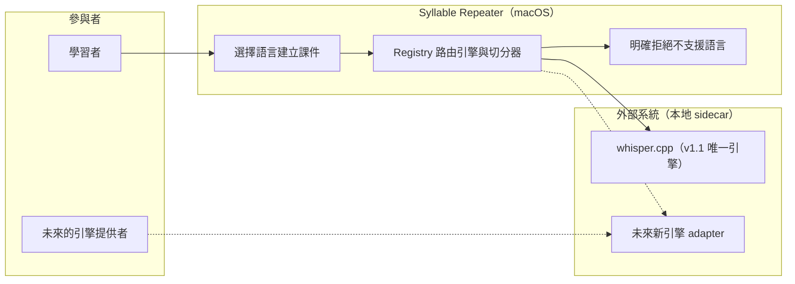

#### 3.2.2 前置條件

- 至少一個 ASR adapter 與一個 Syllabifier adapter 已註冊（v1.1 出廠＝whisper.cpp＋EnglishSyllabifier，各支援 `en`）。

#### 3.2.3 觸發事件及重要邏輯

- **觸發事件**：使用者匯入音檔／建立課件時指定語言（v1.1 預設且僅有 `en`）；或（未來）安裝新引擎後於設定頁註冊。
- **重要邏輯**：
  1. **port 定義（Domain，M5/M13）**：`TranscriberEngine`（輸入：PCM＋語言＋可選字稿；輸出：詞級時間戳 `List<Word>`；自述：引擎名、版本、支援語言清單）；`Syllabifier`（輸入：Word＋語言；輸出：音節切分與計數；自述：支援語言清單）；兩 port 互不依賴；
  2. **Registry 路由（M14）**：建課件時以 `language` 查詢兩個 Registry——**兩者皆有**該語言 → 放行；**缺任一** → 明確拒絕：「不支援 `<語言>`：缺少 <辨識引擎/音節切分器>」並列出目前已註冊的語言清單；**嚴禁**默默改用英文切分器；
  3. **v1.1 交付內容**：whisper.cpp 包裝為 `WhisperCppTranscriberAdapter`（沿用 v1 既有類別對齊新 port）；CMUdict＋母音團兜底包裝為 `EnglishSyllabifier`；行為與 v1 完全一致（回歸不變性）；
  4. **語言標記（M14）**：`Lesson` 與 `Segment` 持久化 `language` 欄位；`.abopack`/`.abolabel` schema 均含此欄；讀取無此欄的 v1 舊檔時預設補 `en`（向後相容）；
  5. **新引擎上架程序**（文件化，供未來執行）：adapter 實作 → M9 授權審查（引擎與模型檔皆查）→ sidecar 隔離驗證（M4 故障注入）→ 金標準例句回歸（英文引擎）或該語言等價基準 → Registry 註冊。
- **例外**：引擎 sidecar 崩潰 → 承 v1 M4（回報失敗、App 不崩、可重試）。

#### 3.2.4 節點描述

| 節點編號 | 節點名稱 | 責任物件 | 動作簡述 |
|----------|----------|----------|----------|
| N1 | port 契約 | 伺服器端（Domain） | TranscriberEngine／Syllabifier 介面定義 |
| N2 | Registry 路由 | 伺服器端（Domain） | 依 language 查引擎與切分器，缺則拒絕 |
| N3 | whisper adapter | 外部系統（sidecar）＋infra | v1 既有功能對齊新 port |
| N4 | EnglishSyllabifier | 伺服器端（Domain/infra） | CMUdict＋母音團兜底包裝 |
| N5 | 語言標記持久化 | 伺服器端（Domain） | Lesson/Segment/.abopack/.abolabel 之 language 欄 |

#### 3.2.5 後續動作

- 後置條件：v1 全部既有流程走新 port 後行為不變（金標準例句仍 11 音節）；新引擎上架不需修改 Domain 程式碼。

#### 3.2.6 非功能性清單

| 類別 | 指標/描述 | 實作要求 | 驗收方式 |
|------|-----------|----------|----------|
| 可維護性 | 新增一個引擎 adapter 不動 Domain 任何檔案 | port/adapter 邊界測試 | 程式碼審查＋依賴方向檢查 |
| 合規性 | 每個引擎與模型檔逐項過 M9 白名單 | license-manifest 擴充條目 | CT-09 機制審查 |
| 效能 | 抽層後對齊管線耗時劣化 ≤ 5%（對照 v1 Q10 基準 4.689s/10s 音檔） | 薄包裝、無多餘拷貝 | benchmark 腳本實測 |

#### 3.2.7 驗收測試情境

| 編號 | 類型 | 情境（帶真實值） | 操作 | 預期結果 |
|------|------|------------------|------|----------|
| AT-17-01 | 正常（回歸不變性） | 金標準例句音檔經新 port 架構分析 | 開始分析 | 仍切出 11 音節、時間戳與 v1 直呼路徑一致（容差 ±1ms） |
| AT-17-02 | 核心不被破壞（M14） | 模擬課件語言標記為 `ja`（日文，無切分器） | 建立課件 | 明確拒絕並顯示「不支援 ja：缺少音節切分器」＋已註冊語言清單（en）；**不產生**任何用英文切分器亂切的課件 |
| AT-17-03 | 邊界（部分支援） | 模擬註冊一個支援 `ja` 的 ASR adapter，但無 ja 切分器 | 建立 ja 課件 | 仍拒絕（缺任一即拒，M13「兩件事」原則） |
| AT-17-04 | 資料保存（向後相容） | 讀取 v1 產的舊 `.abopack`（無 language 欄） | 開啟 | 正常載入，language 預設補 `en` |
| AT-17-05 | 例外（M4） | 分析中 kill -9 引擎 sidecar | 觀察 | App 不崩、回報失敗、可重試（承 v1 AT-01-04） |
| AT-17-06 | 核心不被破壞（M5） | 檢查 Domain 套件依賴 | `dart test` 於無 Flutter 環境執行 | Domain 不 import 任何 sidecar/UI/平台 API，測試 100% 可跑 |

---

## 十一、REQ-18 錄音單次比對與效能

### 3.1 需求概述

- **目的**：使用者每次只錄一遍目前單元的原音內容；比對參考音也只取各積木／組塊的原始內容一次，不套積木 repeat／silence、整列 repeat／silence或匯出覆寫。比對完成後顯示限點圖表與評分，使用者可立即刪除；不再提供錄音暫存回聽。
- **使用動機**：循環後的參考音會迫使使用者錄多遍且扭曲評分；數十萬個波形點與同步 DTW／自相關在 UI isolate 執行會造成畫面近似當機。

### 3.2 業務流程

#### 3.2.1 用例圖

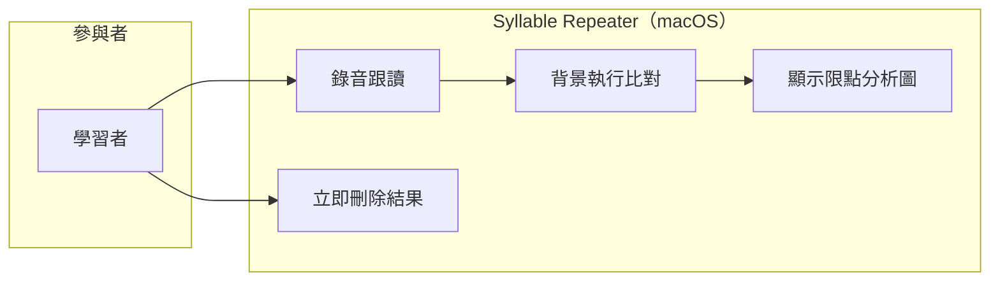

#### 3.2.2 前置條件

- 麥克風權限已授予；正在進行某 PracticeStep／練習單元的錄音跟讀（承 v1 REQ-06）。

#### 3.2.3 觸發事件及重要邏輯

- **觸發事件**：一次錄音停止時。
- **重要邏輯**：
  1. `RecordingComparator` 由目前單元建立 `singlePassReferencePcm`：依畫面順序串接每個 PracticeBlock 的 `sourceRanges` 一次；組合積木內每段一次；不插任何積木／整列靜音、不套任何 repeat；0 列隱含單元則取完整單句原音一次；
  2. 參考音只可取 M1 的 `originalPcm`，不得取 Demucs `analysisPcm`；使用者只需錄一遍對應內容；
  3. pitch contour、DTW、波形正規化等重計算必須在背景 isolate 執行，不阻塞 UI isolate；重複點擊以世代編號取消舊結果，避免過期結果覆蓋；
  4. 傳回 UI 的參考波形與錄音波形各最多 1000 點，採保留首尾與極值的降採樣；不得把每個 PCM sample 都交給 CustomPainter；
  5. 分析結果右側顯示垃圾桶；按下立即清除 comparison、recordedPcm 與播放狀態，可立即重錄；切換單元、重錄、離頁與關閉 App 同樣清除；
  6. 移除「暫存本次錄音」、跨單元錄音清單與 RecordingBuffer service/provider/store／啟動清掃；但保留目前單元最近一次解碼 PCM 於 `PracticeUiState` 記憶體供播放／停止，即使比對失敗仍可確認收音。按播放才建立一次性 WAV，播放完成、停止或失敗皆由 `finally` 刪除；來源錄音 temp 無論成功、失敗或取消亦由 `finally` 刪除（M10）。
- **例外**：背景 isolate 失敗或錄音 WAV 格式不符 → 顯示實際錯誤、畫面恢復可操作，temp 仍清除；不得把不支援格式誤報成「音檔不可播放」。

#### 3.2.4 節點描述

| 節點編號 | 節點名稱 | 責任物件 | 動作簡述 |
|----------|----------|----------|----------|
| N1 | 單次參考音 | Domain | 只串接每個來源範圍一次，不套任何設定 |
| N2 | 背景比對 | Domain＋前端協調 | isolate 執行 pitch／DTW／正規化，世代編號防競態 |
| N3 | 限點結果 | Domain＋前端 | 每條波形最多 1000 點，圖表只畫降採樣結果 |
| N4 | 本單元回放與立即刪除 | 前端 | 記憶體 PCM 可播放／停止；垃圾桶與生命週期事件清除結果；來源與回放 temp 一律 finally 清除 |

#### 3.2.5 後續動作

- 後置條件：比對完成後磁碟無來源錄音 temp；回放完成／停止後無回放 temp；切單元、重錄、垃圾桶、離頁或關閉 App 後記憶體無錄音 PCM；`.abopack`、`.aboprogress`、DB schema 永無錄音資料或路徑欄位。

#### 3.2.6 非功能性清單

| 類別 | 指標/描述 | 實作要求 | 驗收方式 |
|------|-----------|----------|----------|
| 隱私 | 錄音 temp 成功／失敗／取消皆刪除 | `try/finally`＋schema 無路徑欄位 | 故障注入＋檔案系統檢查 |
| 效能 | 10 秒 48kHz 錄音分析期間 UI 仍可互動；每條圖表 ≤1000 點 | isolate＋限點 | widget 心跳測試＋模型測試 |

#### 3.2.7 驗收測試情境

| 編號 | 類型 | 情境（帶真實值） | 操作 | 預期結果 |
|------|------|------------------|------|----------|
| AT-18-01 | 單次比對 | 列含 `rain` 3／2、組塊 `rain+think` 2／3，整列 4／2 | 錄一次並建立參考音 | 參考音恰為 `rain + rain + think` 各來源一次，沒有積木／整列重複與靜音；使用者只錄一次 |
| AT-18-02 | 核心不被破壞（M10） | 正常比對、比較器拋錯、使用者取消三種流程 | 分別檢查 temp、DB、pack、progress | 三種流程 temp 均清空；資料結構無錄音或路徑欄位 |
| AT-18-03 | 效能 | 10 秒、48kHz mono 錄音（480000 samples） | 停止錄音並持續點擊頁面按鈕 | UI 心跳不中斷；比對在背景完成；兩條波形各 ≤1000 點；不出現近似當機 |
| AT-18-04 | 降採樣 | 波形含首點、尾點與中間尖峰 ±1.0 | 產生圖表資料 | 點數 ≤1000，保留首尾與尖峰，不因均勻抽樣漏掉最大／最小值 |
| AT-18-05 | 立即刪除 | 已出現比對圖與評分 | 按右側垃圾桶 | 圖表、評分、recordedPcm 與播放狀態立即清除；不必等待 10 分鐘或切換單元，可直接重錄 |
| AT-18-06 | 功能移除 | 開啟錄音練習與檢查啟動流程 | 搜尋畫面與依賴 | 沒有暫存勾選／回聽面板；不建立 RecordingBuffer provider/service/store，不執行啟動清掃 |
| AT-18-07 | WAV 相容 | macOS 錄音器回傳非 PCM 16-bit mono WAV | 停止錄音 | 先轉成比較器支援的 PCM 格式或由錄音 adapter 直接產生支援格式；若仍失敗，錯誤明確指出錄音格式，不誤導使用者重選課程音檔 |
| AT-18-08 | 本單元記憶體回放 | 錄音擷取成功但 DTW 比對失敗 | 按「播放錄音」再停止 | 仍可播放目前單元最近一次 PCM；播放中顯示停止；停止後再播放從 0ms 開始；來源與回放 temp 皆不殘留 |
| AT-18-09 | 生命週期清除 | 已有錄音 PCM、分析圖與分數 | 切單元、重錄、垃圾桶、切離錄音練習頁 | PCM、圖表、分數與回放狀態立即清除；晚到比對結果不得復活；不建立 RecordingBuffer |

---

## 十二、REQ-19 練習中字稿／譯文顯示切換

### 3.1 需求概述

- **目的**：練習頁提供四種顯示模式切換：**字稿**／**字稿＋譯文**／**僅譯文**／**都不顯示**；選擇在同一課件內記住，下次開啟沿用。
- **使用動機**：初期看字稿跟讀、進階想遮字憑聽力、背意思時只看譯文——不同階段要不同的「提示量」。

### 3.2 業務流程

#### 3.2.1 用例圖

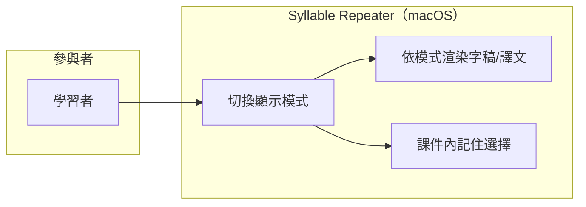

#### 3.2.2 前置條件

- 課件已載入練習頁；譯文可有可無（無譯文時見邏輯 3）。

#### 3.2.3 觸發事件及重要邏輯

- **觸發事件**：使用者點擊練習頁的顯示模式切換器。
- **重要邏輯**：
  1. 四態循環或直選：`字稿`→`字稿＋譯文`→`僅譯文`→`都不顯示`（`TranscriptDisplayMode`）；
  2. 切換即時生效於所有會洩漏當前文字答案的練習元件：上方單元導覽積木、主播放列、錄音比對脈絡文字與字稿／譯文卡；
  3. 課件無譯文時：含譯文的兩個模式顯示「尚無譯文——可在『匯入與分析』填寫」引導（不禁用選項，讓使用者知道去哪補）；
  4. 模式選擇存於該 Lesson 的介面偏好（隨 `.aboprogress` 個人層記憶，不進 `.abopack` 課件本體——課件分享給別人時不強加自己的顯示偏好）；
  5. 預設值＝`字稿`（屬「允許變動」項）；
  6. `hidden` 時：單元導覽只顯示 `#n`，主播放列只顯示 `第 n 單元`，錄音區只保留單元編號，不顯示音節／句子內容；`transcript`、`transcriptWithTranslation`、`translationOnly` 三態保持既有顯示規則。
- **例外**：無。

#### 3.2.4 節點描述

| 節點編號 | 節點名稱 | 責任物件 | 動作簡述 |
|----------|----------|----------|----------|
| N1 | 模式切換器 | 前端 | 四態選擇 UI |
| N2 | 條件渲染 | 前端 | 依模式顯示字稿/譯文/皆無 |
| N3 | 偏好持久化 | 伺服器端（Domain：ProgressEngine） | 隨個人進度檔記住 |

#### 3.2.5 後續動作

- 後置條件：同課件重開後模式沿用上次選擇；換課件各自獨立記憶。

#### 3.2.6 非功能性清單

無新增。

#### 3.2.7 驗收測試情境

| 編號 | 類型 | 情境（帶真實值） | 操作 | 預期結果 |
|------|------|------------------|------|----------|
| AT-19-01 | 正常 | 金標準例句課件含譯文「她有出色的溝通能力」 | 依序切四態 | 字稿→字稿＋譯文→僅譯文→全隱藏，顯示內容逐一正確 |
| AT-19-02 | 邊界（無譯文） | 課件無譯文 | 切到「字稿＋譯文」 | 字稿照常＋顯示「尚無譯文」引導文案，不崩不空白 |
| AT-19-03 | 資料保存 | 選「僅譯文」後關閉課件重開 | 開啟練習頁 | 仍為「僅譯文」 |
| AT-19-04 | 資料保存（隔離） | 同一課件 `.abopack` 分享至另一台機器 | 對方開啟 | 對方看到預設「字稿」（顯示偏好不隨課件外流） |
| AT-19-05 | 隱藏完整性 | 第 3 單元文字為 `this afternoon`，且已有錄音比對圖 | 選「隱藏」 | 上方只顯示 `#1…#n`；播放器與錄音區顯示 `第 3 單元`，畫面任何位置都不出現 `this afternoon`；切回其餘三態後內容依原規則恢復 |

---

## 十三、REQ-20 手動譯文編輯區搬移

### 3.1 需求概述

- **目的**：把手動譯文輸入區從「設定」頁搬到「匯入與分析」頁的字稿區域附近；設定頁刪除該區塊。設定頁最下方「儲存」按鈕**維持現況**（經查證：該按鈕為「提醒節奏三項＋Sidecar 逾時秒數」的批次儲存，非多餘設計——使用者 2026-07-12 確認不改）。
- **使用動機**：譯文是「製作課件」時填的內容，跟字稿同屬一個工作情境；放在「設定」頁（系統偏好情境）不合直覺，每次填譯文要跳頁。

### 3.2 業務流程

#### 3.2.1 用例圖

#### 3.2.2 前置條件

- 「匯入與分析」頁已有分析完成的課件草稿（字稿區域有內容）。

#### 3.2.3 觸發事件及重要邏輯

- **觸發事件**：使用者在「匯入與分析」頁字稿區域附近的譯文輸入框輸入文字。
- **重要邏輯**：
  1. 譯文輸入框移至字稿區域正下方（同一視覺群組）；功能承 v1 REQ-07：手動打字**永遠可用**、優先於 AI 自動譯文顯示；
  2. 儲存流程不變（隨課件儲存，含 ⌘S 快捷鍵——v1 既有 `_saveLesson` 完整流程隨遷移保留）；
  3. 設定頁移除譯文區塊；其餘區塊（AI key、封存群組、提醒節奏、Sidecar 逾時、批次「儲存」按鈕）**一律不動**；
  4. AI 自動譯文（使用者自帶 key，v1 REQ-07）觸發入口**一併搬移至同一群組**（v1.1-r1/F2 使用者定案）。
- **例外**：無課件草稿時譯文框置灰。

#### 3.2.4 節點描述

| 節點編號 | 節點名稱 | 責任物件 | 動作簡述 |
|----------|----------|----------|----------|
| N1 | 譯文輸入框（新位置） | 前端 | 字稿區域下方同群組 |
| N2 | 課件儲存 | 伺服器端（Domain：LessonPackEngine） | v1 既有流程不變 |
| N3 | 設定頁瘦身 | 前端 | 僅移除譯文區塊，其餘不動 |

#### 3.2.5 後續動作

- 後置條件：譯文讀寫行為與 v1 完全一致（僅入口位置改變）；設定頁批次「儲存」行為分毫不差。

#### 3.2.6 非功能性清單

無新增。

#### 3.2.7 驗收測試情境

| 編號 | 類型 | 情境（帶真實值） | 操作 | 預期結果 |
|------|------|------------------|------|----------|
| AT-20-01 | 正常 | 金標準例句分析完成 | 在匯入與分析頁譯文框輸入「她有出色的溝通能力」→ ⌘S 存課件 | `.abopack` 內譯文正確；重開課件譯文顯示 |
| AT-20-02 | 正常（設定頁瘦身） | 開啟設定頁 | 檢視 | 無譯文區塊；AI key／封存群組／提醒節奏／Sidecar 逾時／批次儲存按鈕全數健在 |
| AT-20-03 | 核心不被破壞（批次儲存不動） | 設定頁改「每次分鐘」為 25、Sidecar 逾時為 90 | 按最下方「儲存」 | 兩項一次存入並生效（v1 行為分毫不差） |
| AT-20-04 | 邊界 | 未有課件草稿 | 檢視匯入與分析頁 | 譯文框置灰不可輸入 |
| AT-20-05 | 資料保存（優先權） | 課件已有 AI 自動譯文 | 手動輸入覆蓋 | 手動譯文優先顯示（承 v1 REQ-07 規則） |

---

## 十四、REQ-21 `.abopack v3` 複合封包與四層匯出

### 3.1 需求概述

- **目的**：在「課程設定」提供單一「儲存課程」入口，把同一原始音訊及目前存在的標籤、單句課件、自由排列與最新進度整併為一個 `.abopack v3`。課程匯入頁可直接開啟。匯出練習音檔則依四層明示選擇資料源，避免畫面排列、封包排列與匯出設定混在一起。
- **範圍界線**：本輪只建立未來手機可讀的資料契約，不實作手機 App。顯示設定不進 `.abopack v3`；既有 `.aboprogress` 的顯示模式欄仍只屬個人進度檔。

### 3.2 業務流程

#### 3.2.1 複合封包內容

`.abopack v3` 為 zip＋`manifest.json`，同一封包至少包含原始音訊與來源指紋；其餘依當下資料存在與否選擇性包含：

| 區塊 | 必填 | 用途 | 內容 |
|---|---|---|---|
| `originalAudio` | 是 | 本機 | 使用者匯入的完整原始音訊、檔名、fingerprint；不得以 Demucs 人聲軌替代 |
| `labels` | 否 | 本機 | `.abolabel v2` 等價資料：保留 Segment、捨棄區間、註記與語言 |
| `sentenceLesson` | 否 | 本機＋未來手機 | 從原始音訊擷取的單句原音、原始範圍、lessonId、課程名、原始音訊名、原文、譯文、words／syllables |
| `arrangement` | 否 | 本機＋未來手機 | 自由排列的列、單一／組合積木、來源範圍、各積木與整列 repeat／silence；列數即練習單元數 |
| `latestProgress` | 否 | 本機＋未來手機 | 最新完成單元、最新難度、interval stage、next due、updatedAt、可選最新分數摘要；不含完整 attempt history、錄音、路徑、顯示偏好 |

封包允許「原始音訊＋標籤但無單句課件」、「原始音訊＋單句課件但無標籤」、「原始音訊＋單句課件＋排列但無進度」等組合。缺少某選用區塊不是損壞；只有 manifest／必填原始音訊／fingerprint 不一致才拒絕。v1/v2 `.abopack` 仍可讀；保存為 v3 後不降版。

#### 3.2.2 課程匯入與儲存

1. 「儲存課程」移至課程設定，顯示即將封包的現有區塊與缺少區塊；使用者選目的地後以 temp→rename 原子寫入；
2. 「儲存標籤」與「匯出進度」保留為獨立功能，前者方便只交換標籤，後者方便合併個人進度；
3. 課程匯入開啟 v3 後：有標籤就還原段落工作；有單句課件就可直接進段落校正／錄音練習；有排列就還原列；有最新進度就以既有 updatedAt 新者覆寫規則合併；只有標籤時不可假造單句課件；
4. 封包的 portable 區塊以明確版本與穩定 id／range／fingerprint 關聯，不以本機絕對路徑關聯。

#### 3.2.3 四層匯出

匯出對話框依序選擇四層；後一層只顯示與前層相容且實際存在的選項：

1. **音訊來源**：`目前工作階段的單句原音`／`完整原始音訊中的已標記保留段`／`v3 封包保存的單句原音`。三者必須同 fingerprint，且使用的 range 落在該原始音訊內；人聲分離軌、錄音與跨 Lesson 音訊永不列入；
2. **排列來源**：`完整單句`／`目前尚未儲存的自由排列`／`v3 封包保存的自由排列`。若選完整原始音訊的保留段且多段匯出，每段可視為一個完整單句單元；不存在的排列不顯示；
3. **單元範圍**：`全部單元`／`勾選單元`／`目前單元`；保持來源排列順序，空選擇不可匯出；
4. **設定來源**：`沿用所選排列設定`／`本次逐單元覆寫整列 repeat／silence`。覆寫只替換整列外層設定，不新增第五層、不回寫排列；積木內層保持來源值。

所有組合最後皆轉成同一個 `PracticeExportPlan` 快照，再由 `PracticeEngine` 唯一路徑渲染。畫面預覽、練習、單元匯出與合併匯出不得各自重寫靜音公式。

### 3.3 驗收測試情境

| 編號 | 類型 | 情境（帶真實值） | 操作 | 預期結果 |
|---|---|---|---|---|
| AT-21-01 | v3 標籤型封包 | 原始 `song.m4a` 有 4 個保留 Segment 與 3 個捨棄區間，尚無單句課件／進度 | 課程設定→儲存課程→課程匯入重開 | v3 含 originalAudio＋labels；重開還原 4 段與捨棄註記；不假造 Lesson、Arrangement、Progress |
| AT-21-02 | v3 手機可攜資料 | 單句 `rain will stop`，來源 42300～45100ms，2 列排列，最新完成第 1 單元且難度普通 | 儲存並解開 manifest | portable 區塊含單句原音、課程名／原檔名／原文／譯文、2 列完整設定、最新進度；無完整原音、labels 的本機絕對路徑、顯示模式、錄音或 attempt history |
| AT-21-03 | 向後相容 | 依序開啟 v1、v2、v3 `.abopack` | 課程匯入 | 三者皆可讀；v1/v2 缺少新區塊時使用既有預設，不改寫來源檔；v3 缺選用區塊不視為損壞 |
| AT-21-04 | 四層－目前草稿 | 目前單句有尚未儲存的 3 列排列；v3 另存有 2 列舊排列 | 選目前單句原音→目前排列→目前單元→沿用設定 | 只匯出目前選中的草稿列與現行積木／整列設定；不誤用 v3 舊排列 |
| AT-21-05 | 四層－v3 保存版 | 畫面草稿已改動但尚未存，v3 保存排列有 2 列 | 選 v3 單句原音→v3 排列→全部→沿用設定 | 匯出恰為 v3 的 2 列快照；畫面未存修改不混入 |
| AT-21-06 | 四層－保留段 | 完整原音有 4 個保留段，無自由排列 | 選完整原音保留段→完整單句→勾選第 2、4 段→本次覆寫 2／1 | 只輸出第 2、4 段，各段原音重複 2 次，中間依規則加靜音；不含無聲／狀聲詞捨棄段，覆寫不寫回標籤或 pack |
| AT-21-07 | M1 拒絕 | v3 單句 fingerprint A，畫面排列來源 fingerprint B，另有人聲分離 PCM | 嘗試組合匯出 | 不相容排列不顯示或被明確拒絕；Demucs／錄音永不成為音訊來源；不產出檔案 |
| AT-21-08 | 原子與隱私 | v3 寫入中模擬磁碟失敗；最新進度含顯示模式與錄音 temp 路徑 | 儲存課程 | 目的地無半成品；manifest 排除顯示模式、錄音與路徑；錯誤可重試 |

---

## 十五、核心驗收總表

2.5 每條「必須維持」對應至少一條帶真實值的「核心不被破壞」情境（新增與補述條款為主；v1 原有條款之總表見 v1 requirement.md 末章，仍然有效）：

| 核心條款 | 不被破壞情境（帶真實值） | 對應測試 |
|---|---|---|
| M1＋v1.1 補述 | Demucs 開啟時，分析可用 `analysisPcm`，但播放、錄音參考、封包與四層匯出只取 `originalPcm`；自訂排列 sample 可追溯原音 | AT-12-09、AT-15-09、AT-21-07 |
| M2（配合 M12 解讀） | 0 列是完整單句 1 單元；按一鍵生成後仍為 11 列句尾疊加，第 2 列固定 `tion skills`，不吸附成單字 | AT-16-04 |
| M3（自訂設定＋合併間隔） | 積木預設 1／1、整列預設 3／1；整列靜音只以原始長度總和計算且最後一次不保留；多單元合併間隔仍等於前一個已渲染單元 totalDurationMs | AT-15-04～06、AT-15-13、AT-16-05/08 |
| M4（範圍擴大） | 任一 ASR 引擎 sidecar 被 kill -9，App 不崩、可重試 | AT-17-05、AT-11-06 |
| M5 | Domain 於無 Flutter 環境 `dart test` 全數通過；port 定義不 import sidecar/UI | AT-17-06 |
| M9（範圍擴大） | 新引擎/模型上架前逐項過授權白名單；未過審不得進發布產物 | REQ-17 上架程序＋CT-09 審查 |
| M10＋v1.1 補述 | RecordingBuffer 已移除；錄音在成功／失敗／取消皆 finally 清除，pack／progress／DB 無錄音與路徑欄位 | AT-18-02、AT-18-05/06、AT-21-08 |
| M11 | 金標準例句刪 1 切點後，疊加步數顯示 10（當時值），演算法不變 | AT-13-07 |
| M12 | 0 列→完整單句 1 單元；有 N 列→N 個單元並連動；一鍵生成仍依 M2 產生音節數等量列 | AT-16-01～04、AT-16-09 |
| M13 | 新增引擎 adapter 不修改 Domain 任何檔案（依賴方向檢查） | AT-17-06＋程式碼審查 |
| M14 | 建立 `ja` 課件因缺切分器被明確拒絕；不默默用英文切分器亂切 | AT-17-02、AT-17-03 |
| M15 | 20MB 音檔只有在真實讀完並通過格式／時長驗證後才顯示就緒；分析與切段只依真實階段事件前進，sidecar 停住時進度不得自行增加 | AT-11-10、AT-12-06～08 |
| REQ-11 資料保護 | 未儲存標籤時換音檔必經「儲存/不儲存」明示選擇，不靜默丟棄 | AT-11-04 |
| D1 防回歸 | 無音檔時介面不出現任何 TTS/生成選項 | AT-12-03 |

---

## 十六、待澄清事項

以下事項不阻塞需求成稿，留待 fullstack-design（設計階段）定案，屆時如涉及範圍變動須回頭修訂本檔：

| 編號 | 事項 | 建議傾向 |
|---|---|---|
| Q1 | 段落自動切句的具體演算法（ASR segment 時間戳直用 vs 靜音間隔輔助切分）與參數 | 屬「允許變動」項，設計階段以實測選型 |
| Q2 | `.abolabel` JSON schema 細部欄位與版本策略 | 對齊 `.abopack` 既有慣例（zip＋JSON＋schemaVersion） |
| Q3 | 自由編輯區的拖曳互動細節（吸附、動畫、鍵盤替代操作） | 屬「允許變動」項 |
| Q4 | AI 自動譯文觸發入口是否隨手動譯文一併搬到匯入與分析頁 | 建議一併搬（同群組原則），設計階段定案 |
| ~~Q5~~ | ~~錄音暫存時限預設 30 分鐘是否合適~~ | **已撤回**（2026-07-15 使用者 r7）：RecordingBuffer 整體移除；僅保留目前單元記憶體 PCM，來源與回放 temp 均 finally 清除 |
