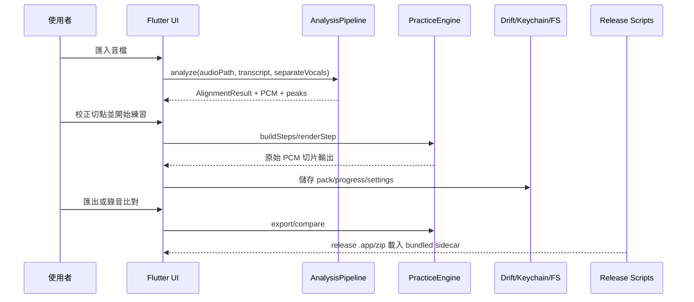

// AI-Generate
# 應用層歸檔（Application Archive）

## 1. 歸檔資訊

| 欄位 | 內容 |
|------|------|
| 需求目錄 | `spec-syllable-repeater/requirements/syllable-practice-macos-v1_20260704/` |
| 歸檔時間 | 2026-07-11 23:30 |
| 對照/回寫知識庫 | `spec-syllable-repeater/knowledge/application/application-overview.md` |

## 2. 應用邊界與參與者

- **使用者/角色**：單人學習者/製作者，使用自己的音檔、字稿、錄音與可選 AI key。
- **系統邊界**：Flutter macOS App、純 Dart Domain、Infra adapters、SQLite/Drift、local file system、macOS Keychain、local sidecar executables；唯一遠端相依為使用者自帶 key 的 OpenAI Responses API。
- **非目標範圍**：手機端、Windows、批次匯入、雲端同步、伺服器、TTS/AI 合成音訊、金流、Apple notarization、Apple Silicon/universal binary。

## 3. 主業務流程（文字描述）

### 3.1 正常路徑

1. 使用者從匯入分析頁拖入或選取音檔，可貼上字稿並勾選是否嘗試人聲分離。
2. UI 呼叫 `AnalysisController.start`，controller 透過 `InfraAnalysisRunner` 組裝 FFmpeg、demucs、whisper、CMUdict 與 Domain `AnalysisPipeline`。
3. Pipeline 依序解碼、可選分離、轉寫、音節切分與 waveform peaks 計算；每個階段回報 `AnalysisEvent`，UI 顯示進度與可重試 checkpoint。
4. 分析完成後，App 跳到校正頁，使用者可拖動音節邊界；Domain 驗證開區間並做零交越吸附，前端提供 undo 與錯誤提示。
5. 使用者進入練習頁，`PracticeEngine.buildSteps` 產生句尾疊加步驟，播放與匯出都只能經 `renderStep` 切原始 PCM。
6. 使用者可匯出單步或合併 mp3；合併段落靜音由 `renderMergedExport` 依 sample 數插入，FFmpeg 只負責編碼。
7. 使用者可錄音比對；錄音檔由 `RecordingComparator` 的 finally/cancel 路徑刪除，只留下 overlay 與差異數值。
8. 使用者可保存 `.abopack`、匯入/匯出 `.aboprogress`、設定 reminder/SRS；AI key 只存 Keychain，AI 翻譯失敗不阻斷手動譯文。
9. 發布時，Release build 從 bundled sidecar 路徑載入 FFmpeg/whisper/demucs/model/cmudict，打包成未簽章 zip，使用者以右鍵開啟或 `xattr -cr` 略過 Gatekeeper。

### 3.2 例外與回退

| 場景 | 應用層行為 | 後端/Infra 規則 |
|------|------------|-----------------|
| sidecar timeout/crash/exit 非 0 | 顯示階段失敗與可重試入口，不清空已完成結果 | `SidecarRunner` 映射 `ERR_SIDECAR_*` 或模組語意碼 |
| demucs 缺件或失敗 | UI 可提示 demucs 未就緒；pipeline 降級使用原音 | `vocalSeparator: null` 或錯誤降級，不讓 App 崩潰 |
| 音檔格式/長度不合 | UI 就地顯示錯誤 | FFmpeg/ffprobe 前置驗證，>10 分鐘拒絕 |
| 邊界拖動越界 | 邊界回彈並顯示錯誤 | `ERR_BOUNDARY_INVALID`，Domain 不接受閉端/越界 |
| AI key 未設或 provider 失敗 | 手動譯文仍可使用；錯誤不洩 key | `AIService` allowlist/rate limit/prompt guard |
| release sidecar 缺件 | release build 或 zip 腳本 fail-closed | Xcode build phase、`make_release_zip.py` 檢查必要檔 |

## 4. 呼叫鏈與資料流

### 4.1 前端 → 後端

| 步驟 | 前端動作（頁面/狀態） | 請求介面（URL 或語意） | 關鍵請求欄位 | 關鍵回應欄位 | 後續前端行為 |
|------|------------------------|------------------------|--------------|--------------|--------------|
| 1 | 匯入音檔 | `AnalysisRunner.run` | audioPath、transcript、separateVocals | `AnalysisEvent` stream | 顯示階段進度 |
| 2 | 分析完成 | `AnalysisEvent.done` | `AlignmentResult`、`Pcm`、peaks | syllables/words/source/confidence | 切到 editor |
| 3 | 拖動切點 | `AlignmentEngine.updateSyllableBoundary` | boundaryIndex、newPositionMs、pcm | updated syllables | 重繪波形與 chips |
| 4 | 播放練習 | `PracticeEngine.renderStep` | step、pcm、repeatN | rendered PCM/WAV path | 播放控制列狀態 |
| 5 | 匯出 mp3 | `PracticeExporter.exportStep/exportMerged` | steps、destPath | exported path / gaps | 顯示完成或錯誤 |
| 6 | 錄音比對 | `RecordingComparator.compare` | step、recordingPath | rhythmDelta、intonationDelta、overlay | 顯示差異疊圖 |
| 7 | 儲存/開啟 pack | `LessonPackEngine.write/read` | lesson、audio bytes | decoded lesson | 課件庫更新 |
| 8 | SRS/進度 | `ProgressEngine` + repository | group/attempt/settings/snapshot | persisted state / merge summary | 設定頁與課件庫更新 |
| 9 | AI 翻譯 | `AIService.translate` → OpenAI HTTPS | text、targetLang、Keychain credential | `Translation(source=ai)` | manual translation 優先 |

### 4.2 後端 → 資料 / 外部依賴

| 步驟 | 後端邏輯單元 | 讀寫的表/快取 | 外部系統 | 說明 |
|------|--------------|---------------|----------|------|
| 1 | `FfmpegDecoder` / `FfprobeDurationProbe` | temp WAV/PCM | LGPL shared FFmpeg/ffprobe | 解碼、探測時長 |
| 2 | `WhisperCppTranscriber` | temp 16k WAV/JSON | whisper.cpp + small.en | 詞級時間戳 |
| 3 | `DemucsCppVocalSeparator` | temp out dir | demucs.cpp + htdemucs | 可選人聲分離 |
| 4 | `FileWaveformPeaksCache` | waveform JSON cache | local FS | waveform peaks 快取 |
| 5 | `DriftProgressRepository` | 6 張 SQLite 表 | SQLite/Drift | SRS、attempt、settings、audit |
| 6 | `KeychainSecureStore` | 無 DB 寫入 | macOS Keychain | AI key |
| 7 | `OpenAiResponsesClient` | audit metadata only | OpenAI Responses API | 可選文字翻譯 |
| 8 | release staging/build | `sidecar-manifest.json` | bundled sidecar files | 發布時由 `.app` Resources 載入 |

## 5. 非功能與執行約束（應用視角）

- **鑑權/工作階段**：無帳號系統；所有資料在本機。AI provider credential 由 Keychain 管理。
- **冪等與重試**：分析失敗保留 checkpoint；進度匯入以全檔驗證與 transaction 套用；zip/build 腳本缺件 fail-closed。
- **限流/降級**：AIService 有本機 rate limit、host allowlist、prompt injection guard；demucs 可降級原音；pitch 抽不到時 `pitchAvailable=false`。
- **與知識庫約束的對齊**：`frontend-project.md` 已記錄無自家 REST API；`backend-project.md` 記錄 M1-M10；`backend-external-dependency.md` 記錄 release sidecar license/linking 約束。

## 6. Mermaid 序列圖

這個流程凸顯三個應用層核心：匯入分析只產時間軸與 PCM，不改音訊；練習與匯出只由 `PracticeEngine` 切原始 PCM；發布 `.app` 必須使用 bundled LGPL/shared sidecars，而不是開發機 `/usr/local/bin/ffmpeg`。

## 7. 開放問題（應用層）

| 編號 | 問題 | 影響範圍 |
|------|------|----------|
| A-001 | 使用者端尚未實測未簽章 zip 解壓、略過 Gatekeeper、完整 GUI 跑 REQ-01→08 | 發布體驗/AT-09-03 最終驗收 |
| A-002 | 目前 v1 僅 x86_64；Apple Silicon 為 Non-scope | M 系列 Mac 使用者需 Rosetta 或未來版本補 universal/arm64 |
