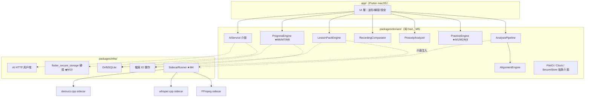
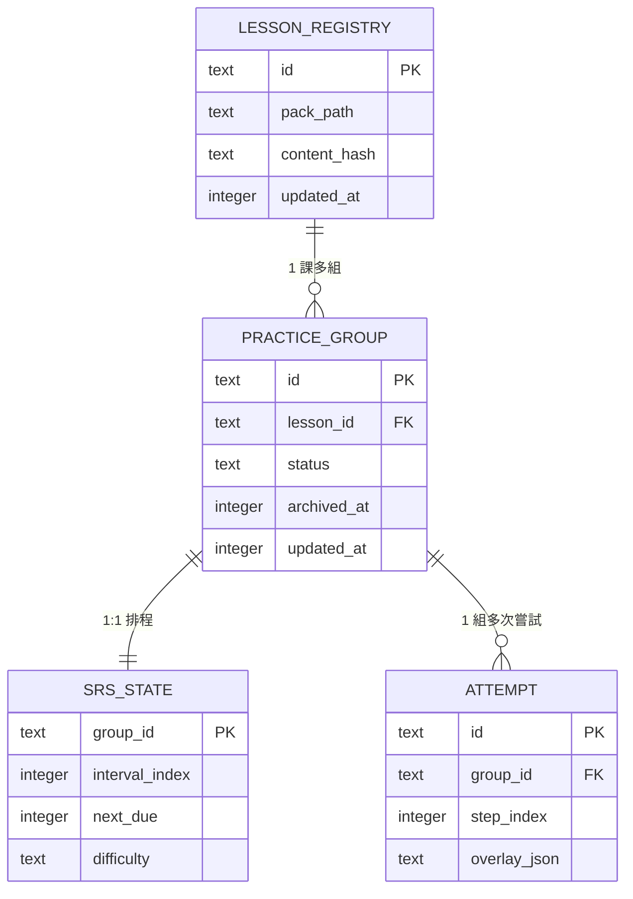
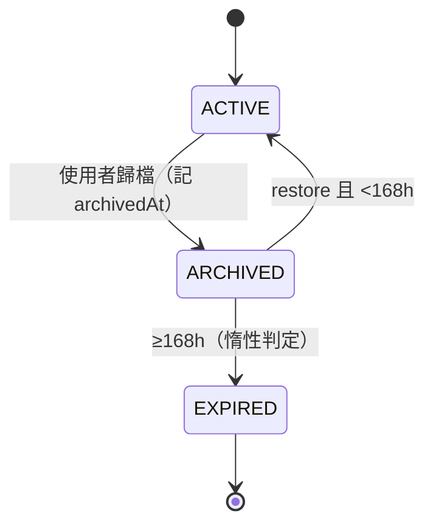
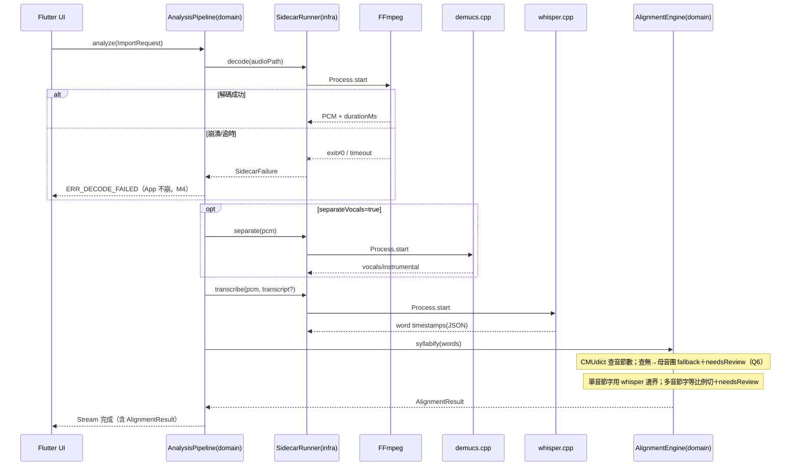
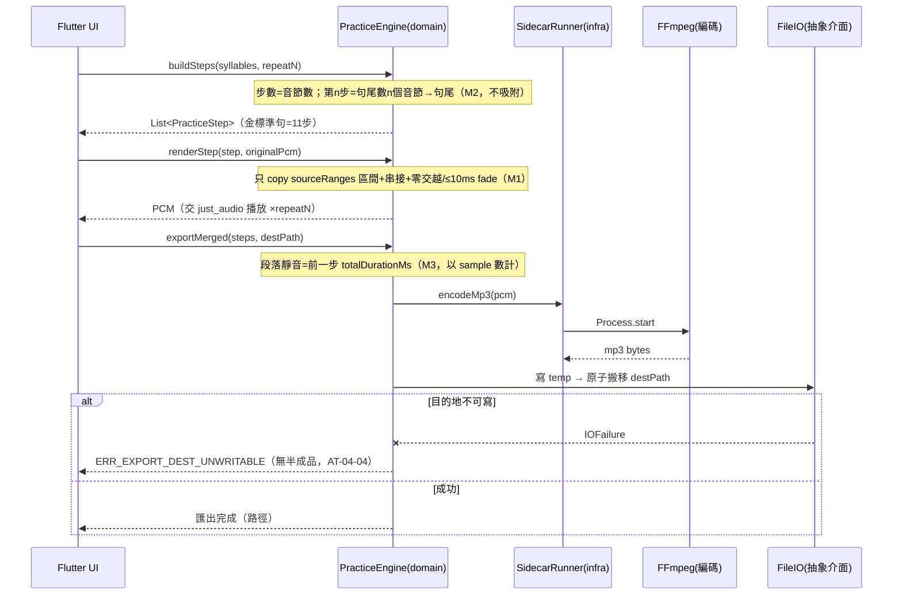
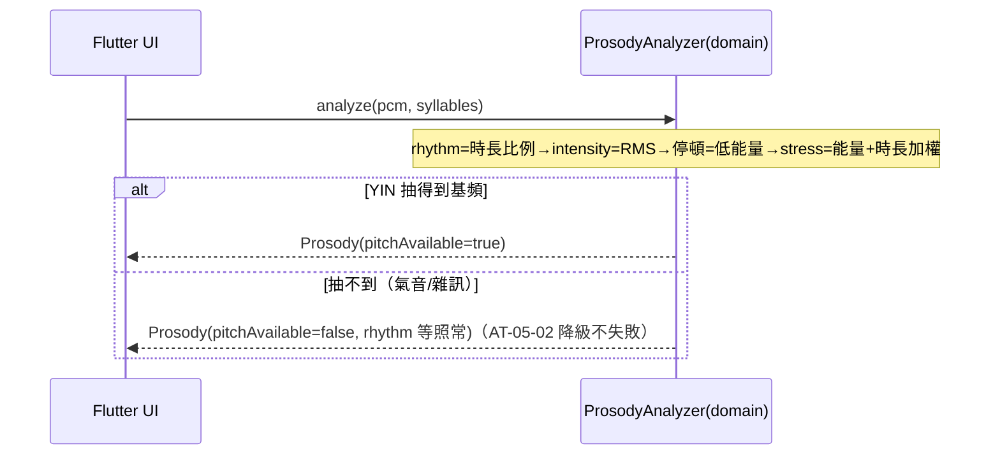
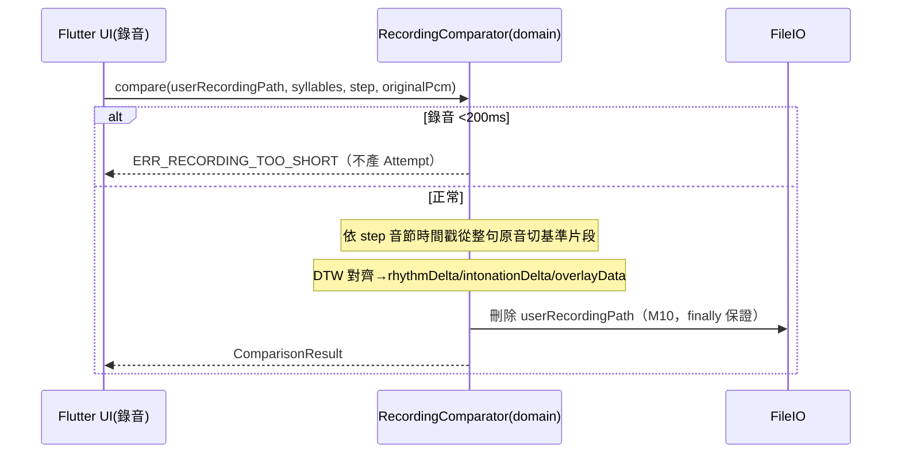
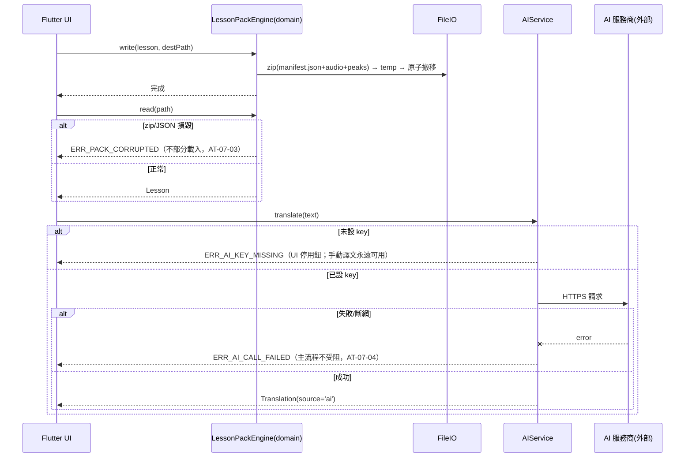
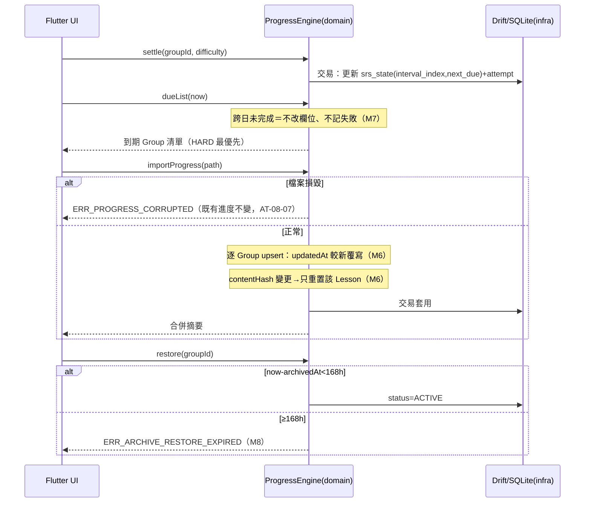

# Syllable Repeater macOS v1 — 後端（Domain Layer）技術方案設計

> 本專案為**純本機、單人、無獨立後端**之桌面應用，依 fullstack-design「無伺服器端專案簡化路徑」撰寫：聚焦資料模型、核心規則防線（逐條對應需求成稿 2.5 M1–M10）、本機儲存與備份設計。**「後端」在本專案 = Domain Layer（純 Dart 領域層）**；「對外介面」= Domain 公開 API（無 HTTP 介面），為前端設計（frontend-design.md）的唯一權威契約來源。
>
> 主需求（唯一指定）：`spec-syllable-repeater/requirements/syllable-practice-macos-v1_20260704/requirement/requirement.md`（v1.3，附錄 A 十題已定案；Q10 已於 2026-07-07 實測鎖定）。

---

## 1. 背景與目標

### 1.1 背景

**業務場景**：
- 語言學習者想以「句尾疊加法」模仿一段原音（台詞/歌曲/例句）：從句尾最後一個音節開始，逐音節往前累加跟讀，直到整句（REQ-03）。
- 使用者需要匯入音檔後自動取得音節級時間軸（REQ-01/02），並可匯出練習音檔離線跟讀（REQ-04）、比對自己錄音（REQ-06）、以 SRS 排程複習（REQ-08）。

**目前問題**：
- 市面工具無「純音節句尾疊加＋保證原聲」組合；手動剪輯每句成本極高。

**業務/技術價值**：
- 一次製作、反覆練習、可攜（`.abopack`/`.aboprogress` 檔案交換）；架構同時保住「自用→商用、桌面→手機」的演進路線（REQ-09）。

### 1.2 目標

1. **功能目標**：實作 REQ-01～REQ-09 全部 P0/P1 需求項（見需求成稿 2.1）。
2. **效能目標**：10 秒音檔完整對齊管線 ≤ 60 秒（基準機 Intel i5-8259U；2026-07-07 實測 10,000ms 音檔＝4.689s，Q10 已鎖定）；播放啟動 ≤ 300ms；錄音停止→疊圖 ≤ 2 秒。
3. **品質目標**：M1–M10 核心維持原則零違反（§4.4 防線對照表）；Domain Layer 單元測試涵蓋全部公開行為（需求成稿 §6 對應）；資料寫入中斷不損毀既有資料。
4. **業務目標**：金標準例句 `She has excellent communication skills`＝**11 音節→10 切點→11 步**全鏈路通過（需求成稿末章 CT-01/CT-02）。

### 1.3 約束

- **技術約束**：
  - **§0.1 原聲不可替換（M1）**：練習音訊逐 sample 來自原檔 PCM 切片串接；僅允許零交越吸附或 ≤10ms micro-fade；分析模組只讀不寫音訊。
  - Domain 純 Dart（M5）：不 import Flutter/sidecar/平台 API；檔案 IO 走抽象介面注入（保 Phase 2 PWA/商店 App 雙路徑）。
  - Sidecar 全 C++/原生、零 Python，以 `Process.start()` 隔離（M4）；晶片 **Intel x86_64 優先**（開發機 i5-8259U），Apple Silicon 後續。
  - 授權白名單（M9）：MIT/BSD/ISC/Apache-2.0/LGPL（動態連結）；禁 GPL/AGPL/非商用限定。
  - **發布方式（Non-scope 9）**：使用者無 Apple Developer 帳號，v1 不做 Apple 簽章／notarization；發布產物為未簽章 macOS `.app`，隨附略過 Gatekeeper 之操作說明（`xattr -cr` 或右鍵開啟）。
- **業務約束**：跨日零懲罰（M7）、歸檔 168 小時內可恢復（M8）、錄音用完即刪＋key 加密（M10）、`.abopack` 不做防盜（Non-scope 4）。

### 1.4 參考檔案

- 主需求：`../requirement/requirement.md`（v1.1）
- 原始材料：`PLAN3.0.md`（專案根目錄；金標準音節數以需求成稿修正值 11 為準）
- 專案記憶卡：`spec-syllable-repeater/memory/decision_金標準例句音節數修正為11.md`、`decision_平台順序macOS優先與手機雙路徑.md`

### 1.5 路徑與設定類約定（新專案）

| 類別 | 約定 |
|------|------|
| HTTP 介面路徑 | **無 HTTP 介面**（本機單人應用）；「對外介面」= Domain 公開 API（§3.2） |
| 依賴外部系統 URL | 僅 AIService（使用者自帶 key）；base URL 依服務商而定，收於 `AiProviderConfig`（§3.2.7），不寫死於程式碼 |
| 程式碼儲存庫結構 | Dart workspace 單一儲存庫：`packages/domain/`（純 Dart）、`packages/infra/`（sidecar/檔案 IO/secure storage 轉接器）、`app/`（Flutter macOS） |
| 設定檔案路徑 | 應用設定存 SQLite `app_settings` 表（§3.1.2）；無 yml/properties |
| 本機資料根目錄 | `~/Library/Application Support/SyllableRepeater/`：`db/app.db`（SQLite）、`packs/`（使用者選擇外亦可任意路徑）、`temp/`（渲染/錄音暫存，App 啟動時清空） |
| sidecar 二進位路徑 | App bundle 內 `Contents/Resources/sidecar/{ffmpeg,whisper,demucs}`（x86_64；FFmpeg 為 LGPL 動態連結 dylib＋CLI） |
| 課件/進度檔 | `.abopack` / `.aboprogress`＝zip+JSON，路徑由使用者選擇；內部 JSON 一律相對引用，**不含絕對路徑**（平台中立，M5/REQ-09） |

---

## 2. 技術方案

### 2.1 架構設計（新專案）

- **架構模式**：三層——Flutter UI → **Domain Layer（純 Dart，深模組）** → Infra 轉接層（sidecar 執行器、檔案 IO、secure storage）。依賴方向單向向下；Domain 對 Infra 只認**介面**（由 app 啟動時注入實作）。
- **設計思想**：DDD＋Deep Modules（PLAN3.0 §0）：核心複雜度收進模組內部，對外窄介面；錯誤處理只在系統邊界（使用者輸入、sidecar、檔案 IO），Domain 內部互信。
- **選型理由**：Domain 純 Dart 是 M5 的直接落地，同時是 TDD 施力點與 Phase 2 手機/Web 雙路徑的前提；sidecar 行程隔離是 M4 的落地。
- **核心與外部分離**：M1/M2/M3 等核心規則全部落在 `packages/domain/`，不依賴任何可更換外部（UI、sidecar 廠牌、AI 服務商、儲存引擎）——換 FFmpeg 版本、換 AI 服務商、換 UI 樣式，核心演算法與測試不動。



### 2.2 技術選型（新專案）

- **UI/App**：Flutter + Dart（BSD）；波形＝CustomPainter；播放＝just_audio（MIT）。
- **資料儲存**：SQLite via **Drift**（MIT）——進度/SRS/設定；課件與進度交換檔＝zip+JSON（`archive` 套件，MIT）。
- **快取**：無外部快取；PCM 與 waveform peaks 於記憶體/暫存目錄快取。
- **訊息佇列/定時任務**：無（單機）；SRS 到期於 App 啟動與前景時計算。
- **HTTP 用戶端**：`http`（BSD）僅供 AIService；Domain 只見 `AiClient` 介面。
- **Sidecar**：FFmpeg（**LGPL build，動態連結**）、whisper.cpp（MIT）、demucs.cpp（MIT）；x86_64 先行。
- **音節數**：CMUdict＋規則（permissive）；查無字→母音團計數 fallback＋needsReview（Q6）。
- **音高**：YIN/autocorrelation 自寫（v1）；WORLD C++（mBSD）留待 v1.5，介面隔離於 ProsodyAnalyzer 內部。
- **key 儲存**：flutter_secure_storage（MIT，macOS Keychain）。

### 2.3 模組設計（新專案，首期全量）

1. **AnalysisPipeline**（domain）：編排解碼→（可選）分離→辨識→音節切分；對 UI 回報階段化進度。
2. **AlignmentEngine**（domain）：CMUdict 音節數查詢、等比例切分、邊界校正驗證、零交越吸附。
3. **PracticeEngine**（domain，★最嚴格 TDD）：buildSteps / renderStep / exportStep / exportMerged；M1/M2/M3 防線所在。
4. **ProsodyAnalyzer**（domain）：rhythm/intensity/stress/pitch（YIN 可降級）；只讀。
5. **RecordingComparator**（domain）：DTW 比對、overlayData 產出、錄音即刪。
6. **LessonPackEngine**（domain）：`.abopack` 讀寫與結構驗證。
7. **ProgressEngine**（domain）：結算、SRS、upsert、content hash 局部重置、歸檔/恢復。
8. **AIService**（domain 介面＋infra 實作）：key 管理、翻譯；不生成音訊。
9. **SidecarRunner**（infra）：`Process.start()` 包裝、逾時、exit code 邊界、崩潰隔離（M4）。

模組依賴：AnalysisPipeline→AlignmentEngine；其餘模組互不依賴（經 Lesson/資料結構解耦）。

---

## 3. 詳細設計

### 3.1 模型設計

#### 3.1.1 領域模型

**實體（Entity）**

- **Lesson**：一個音檔製作後的完整課件。屬性：`id: String`（UUID）、`title: String`、`audioRelPath: String`（pack 內相對路徑）、`contentHash: String`（原音＋syllables 之 SHA-256，M6 局部重置依據）、`words: List<Word>`、`syllables: List<Syllable>`、`translations: List<Translation>`、`prosody: Prosody?`、`practiceConfig: PracticeConfig`、`updatedAt: DateTime`。行為：`recomputeContentHash()`。唯一標識：`id`。
- **PracticeGroup**：進度/SRS 結算最小單位（限單一 Lesson 內）。屬性：`id`、`profileId`、`courseId`、`lessonId`、`name`、`stepRange`、`status: GroupStatus`、`archivedAt: DateTime?`、`updatedAt`。行為：`archive()` / `restore(now)`（M8 168h 驗證）。同步鍵：`profileId+courseId+lessonId+id`。
- **Attempt**：一次錄音嘗試的**參數與 overlay 快照**（不含音訊，M10）。屬性：`id`、`groupId`、`stepIndex`、`rhythmDelta: double`、`intonationDelta: double`、`overlayJson: String`、`createdAt`。

**值物件（Value Object）**

- **Word**：`{ text: String, startMs: int, endMs: int, index: int }`。
- **Syllable**：`{ text: String, startMs: int, endMs: int, wordIndex: int, needsReview: bool }`；構造驗證 `startMs < endMs`。
- **PracticeStep**：`{ index: int（1 起算）, syllables: List<Syllable>, sourceRanges: List<TimeRange>, totalDurationMs: int }`——**只存原音檔時間區間**（M1）；`totalDurationMs = 片段長總和 × repeatN`。
- **TimeRange**：`{ startMs: int, endMs: int }`，構造驗證非負且 start<end。
- **Prosody**：`{ rhythm: List<double>, intensity: List<double>, stress: List<double>, pitchContour: List<double>?, pitchAvailable: bool }`。
- **ComparisonResult**：`{ rhythmDelta, intonationDelta, overlayData, score? }`。
- **AlignmentResult**：`{ words, syllables, source: String, confidence: double, needsReview: bool }`。
- **Translation**：`{ text: String, source: 'manual'|'ai', modelName: String?, createdAt }`；`manual` 永遠覆蓋 `ai`。

**聚合根（Aggregate Root）**

- **Lesson 聚合**：邊界＝Lesson＋Word/Syllable/Translation/Prosody/PracticeConfig；對外方法：`updateSyllableBoundary()`（不變式：時間區間單調遞增、互不重疊、開區間約束——REQ-02）。
- **PracticeGroup 聚合**：邊界＝PracticeGroup＋Attempt＋SrsState；對外方法：`settle(difficulty)`、`archive()`、`restore(now)`。

**領域服務（Domain Service）**

即 §2.3 之引擎模組；方法契約詳見 §3.2 各介面。

#### 3.1.2 資料模型（SQLite / Drift）

> 本機單人應用：無授權語句需求；腳本由 Drift schema 產生，等效 SQL 如下，存放 `packages/infra/lib/db/schema/`（新專案約定）。

**建表腳本**：`packages/infra/lib/db/schema/V1__create_all.sql`

```sql
CREATE TABLE lesson_registry (
    id TEXT PRIMARY KEY,                 -- Lesson UUID
    pack_path TEXT NOT NULL,             -- .abopack 最後已知路徑
    title TEXT NOT NULL,
    content_hash TEXT NOT NULL,          -- M6 局部重置依據
    updated_at INTEGER NOT NULL          -- epoch ms（UTC）
);

CREATE TABLE practice_group (
    id TEXT PRIMARY KEY,
    profile_id TEXT NOT NULL,
    course_id TEXT NOT NULL,
    lesson_id TEXT NOT NULL REFERENCES lesson_registry(id),
    name TEXT NOT NULL,
    config_json TEXT NOT NULL,           -- stepRange、repeatN 等
    status TEXT NOT NULL DEFAULT 'ACTIVE',  -- ACTIVE|ARCHIVED|EXPIRED（§3.1.3）
    archived_at INTEGER,                 -- M8 168h 起算點
    updated_at INTEGER NOT NULL          -- M6 upsert 比較鍵
);
CREATE INDEX idx_pg_sync_key ON practice_group(profile_id, course_id, lesson_id);
CREATE INDEX idx_pg_status ON practice_group(status);

CREATE TABLE srs_state (
    group_id TEXT PRIMARY KEY REFERENCES practice_group(id),
    interval_index INTEGER NOT NULL DEFAULT 0,  -- 指向間隔序列 0/1/3/7/14/30（天）
    next_due INTEGER NOT NULL,                  -- epoch ms
    difficulty TEXT NOT NULL DEFAULT 'NORMAL',  -- HARD|NORMAL|EASY
    updated_at INTEGER NOT NULL
);
CREATE INDEX idx_srs_due ON srs_state(next_due);

CREATE TABLE attempt (
    id TEXT PRIMARY KEY,
    group_id TEXT NOT NULL REFERENCES practice_group(id),
    step_index INTEGER NOT NULL,
    rhythm_delta REAL NOT NULL,
    intonation_delta REAL NOT NULL,
    overlay_json TEXT NOT NULL,          -- M10：只存快照，絕不存音訊
    created_at INTEGER NOT NULL
);
CREATE INDEX idx_attempt_group ON attempt(group_id, created_at);

CREATE TABLE app_settings (
    key TEXT PRIMARY KEY,                -- 如 reminder.minutes / reminder.failCap / reminder.dailySessions
    value TEXT NOT NULL
);
```

**修改腳本**：`packages/infra/lib/db/schema/V2__alter_placeholder.sql`

```sql
-- V2：#22 Audit Log（使用者 2026-07-06 核准）
CREATE TABLE IF NOT EXISTS audit_log (
    id TEXT PRIMARY KEY,
    occurred_at INTEGER NOT NULL,         -- epoch ms（UTC）
    actor TEXT NOT NULL,                  -- local-user / system
    action TEXT NOT NULL,                 -- reminder_config_changed 等
    target_type TEXT NOT NULL,
    target_id TEXT,
    metadata_json TEXT NOT NULL           -- 僅存非敏感摘要，禁止 key/audio/path
);
CREATE INDEX IF NOT EXISTS idx_audit_log_time ON audit_log(occurred_at);
CREATE INDEX IF NOT EXISTS idx_audit_log_action ON audit_log(action);
```

#### 表關係圖



**關係說明**：`lesson_registry ||--o{ practice_group`＝一課多組；attempt 只掛 group（M10：無音訊欄位，設計上不可能存錄音）。

**檔案儲存（zip+JSON，平台中立）**：
- `.abopack`：`manifest.json`（schemaVersion、lesson JSON、每筆 AI/分析結果附 `source/modelName/analyzerVersion/confidence/needsReview`）＋ `audio/original.*`＋（可選）`audio/vocals.wav`、`audio/instrumental.wav`＋`waveform/peaks.json`＋`passive_practice.m4a`。
- `.aboprogress`：`progress.json`（groups＋srs＋attempts 快照＋歸檔狀態；**無錄音**）。

#### 3.1.3 狀態機

**PracticeGroup 歸檔狀態機（M8）**

- 狀態：`ACTIVE`（可練/可排程）、`ARCHIVED`（已歸檔，168h 內可恢復）、`EXPIRED`（超過 168h，不可恢復）。
- 轉換規則：`ACTIVE→ARCHIVED`（使用者歸檔，記 `archivedAt`）；`ARCHIVED→ACTIVE`（`now - archivedAt < 168h`，恢復後可重新排程）；`ARCHIVED→EXPIRED`（`now - archivedAt ≥ 168h`，惰性判定於讀取時）；`EXPIRED→ACTIVE` **不允許**（不可逆）。
- 驗證：`restore()` 內以注入之 `Clock` 判定 168h（不含）；非法轉換拋 `ERR_ARCHIVE_RESTORE_EXPIRED`。
- 日誌：轉換寫入 attempt 同層之操作紀錄（updated_at 更新）。



**SRS 難度調檔（非狀態機，規則表）**：間隔序列 `[0,1,3,7,14,30]` 天；`HARD`→interval_index 減 1（下限 0）且列最高優先；`NORMAL`→+1（上限 5，之後維持 30 天）；`EASY`→+2（同上限）或列最低頻。跨日未完成：**不改任何欄位**（M7），到期項永遠只是「可練」，無 OVERDUE 狀態。

### 3.2 功能設計

> **對外介面＝Domain 公開 API**（Dart 方法，無 HTTP）。前端（frontend-design.md）逐欄位對齊以本節為權威。錯誤以 `DomainException(code, message)` 拋出；**錯誤碼總表見 §3.2.8**。長任務以 `Stream<Progress>` 回報階段。

#### 3.2.1 對齊模組（AnalysisPipeline / AlignmentEngine）｜REQ-01、REQ-02

**功能時序圖**：



**對外介面**：

##### 介面 1：`AnalysisPipeline.analyze`
- **簽名**：`Stream<AnalysisEvent> analyze(ImportRequest req)`
- **輸入參數**：

| 欄位 | 型別 | 必填 | 說明 |
|------|------|------|------|
| `audioPath` | `String` | 是 | 音檔絕對路徑；格式 mp3/wav/m4a/flac（Q8） |
| `transcript` | `String?` | 否 | 字稿；null 時 whisper 產轉寫草稿 |
| `separateVocals` | `bool` | 是 | 是否先跑 demucs 人聲分離（預設 false） |

- **輸出參數**（`AnalysisEvent`，串流事件）：

| 欄位 | 型別 | 說明 |
|------|------|------|
| `stage` | `enum AnalysisStage` | `decoding / separating / transcribing / syllabifying / done` |
| `progress` | `double` | 0.0–1.0 該階段進度 |
| `result` | `AlignmentResult?` | 僅 `done` 事件非 null |
| `result.words[]` | `List<Word>` | text/startMs/endMs/index |
| `result.syllables[]` | `List<Syllable>` | text/startMs/endMs/wordIndex/needsReview |
| `result.source` | `String` | 如 `whisper.cpp-v1.5+cmudict` |
| `result.confidence` | `double` | 整體信心 0–1 |
| `result.needsReview` | `bool` | 任一音節需覆核即 true |

- **介面說明**：金標準例句必產出 11 個 Syllable（CT-02 前置）；階段化進度供 UI 顯示（阻力點對策）。單檔 >10 分鐘拋 `ERR_FILE_TOO_LONG`；格式不符拋 `ERR_UNSUPPORTED_FORMAT`。

##### 介面 2：`AlignmentEngine.updateSyllableBoundary`
- **簽名**：`Syllables updateSyllableBoundary(Syllables current, BoundaryEdit edit)`
- **輸入參數**：

| 欄位 | 型別 | 必填 | 說明 |
|------|------|------|------|
| `boundaryIndex` | `int` | 是 | 第 n 條邊界（0 起算，共音節數-1 條） |
| `newPositionMs` | `int` | 是 | 拖動後位置 |
| `pcmRef` | `PcmHandle` | 是 | 供零交越吸附取樣 |

- **輸出參數**：

| 欄位 | 型別 | 說明 |
|------|------|------|
| `syllables` | `List<Syllable>` | 更新後全列；被改音節 `needsReview=false` |
| `snappedMs` | `int` | 吸附零交越後實際落點 |

- **介面說明**：開區間驗證 `前一音節 startMs < newPositionMs < 後一音節 endMs`，違反拋 `ERR_BOUNDARY_INVALID`（UI 回彈，AT-02-02/05）。撤銷由 UI 以回傳值堆疊實作（Domain 無狀態）。

**依賴介面（sidecar 契約，infra 層）**：

| 提供方 | 呼叫形式 | 輸入 | 輸出 | 例外處理 |
|--------|----------|------|------|----------|
| FFmpeg | `ffmpeg -i <in> -f s16le -ar 44100 -ac 1 -` | 音檔路徑 | stdout PCM（16-bit/44.1kHz/mono）＋時長 | exit≠0 或逾時（可設定，預設 120s）→`SidecarFailure`；**保留已完成階段結果**（M4） |
| demucs.cpp | `demucs --two-stems=vocals <wav>` | 解碼後 wav | vocals.wav / instrumental.wav | 同上；失敗可跳過分離改用原音（降級） |
| whisper.cpp | `whisper -m <model> -oj <wav>` | wav（＋可選字稿走對齊模式） | 詞級時間戳 JSON | 同上；`kill -9` 場景＝AT-01-04 |

**冪等**：系統冪等＝分析中鎖定重入（同一 `audioPath` 進行中拒絕第二次，AT-01-05）；業務冪等＝無（重跑分析覆蓋草稿）。

**例外處理**：重試＝sidecar 失敗可整階段重試；阻斷＝格式/長度驗證失敗；丢棄＝無。

**程式碼檔案設定**：`app_settings` 表——`sidecar.timeoutSec`（int，預設 120）。**動態設定**：無。**資料庫**：無（分析結果在記憶體，儲存走 §3.2.5）。**快取**：PCM 與 peaks 存 `temp/`，App 啟動清空。**定時任務/訊息佇列**：無。

#### 3.2.2 PracticeEngine｜REQ-03、REQ-04（★M1/M2/M3 防線）

**功能時序圖**：



**對外介面**：

##### 介面 3：`PracticeEngine.buildSteps`
- **簽名**：`List<PracticeStep> buildSteps(List<Syllable> syllables, int repeatN)`
- **輸入參數**：

| 欄位 | 型別 | 必填 | 說明 |
|------|------|------|------|
| `syllables` | `List<Syllable>` | 是 | 校正後音節列（時間區間單調遞增） |
| `repeatN` | `int` | 是 | 1–10 含兩端（Q4）；越界拋 `ERR_REPEATN_OUT_OF_RANGE` |

- **輸出參數**（每個 `PracticeStep`）：

| 欄位 | 型別 | 說明 |
|------|------|------|
| `index` | `int` | 1 起算；總數＝音節總數（M2） |
| `syllables[]` | `List<Syllable>` | 該步涵蓋之音節（句尾倒數 n 個） |
| `sourceRanges[]` | `List<TimeRange>` | **僅原音檔 [startMs,endMs]**（M1；相鄰音節區間可合併為連續段） |
| `totalDurationMs` | `int` | 片段長總和 × repeatN（M3 靜音依據） |

##### 介面 4：`PracticeEngine.renderStep`
- **簽名**：`Pcm renderStep(PracticeStep step, Pcm originalPcm)`
- **輸入/輸出**：輸入＝step＋原音 PCM handle；輸出＝PCM bytes（16-bit/44.1kHz/mono）。
- **介面說明**：**唯一合法實作＝copy 區間→串接→零交越吸附或 ≤10ms micro-fade**。CI 常駐回歸測試：輸出與原 PCM 對應區間逐 sample 相等（端點 fade 除外）＝CT-01。任何生成路徑＝bug。

##### 介面 5：`PracticeEngine.exportStep` / 介面 6：`exportMerged`
- **簽名**：`Future<ExportResult> exportStep(PracticeStep step, String destPath)`；`Future<ExportResult> exportMerged(List<PracticeStep> steps, String destPath)`
- **輸入參數**：

| 欄位 | 型別 | 必填 | 說明 |
|------|------|------|------|
| `steps` | `List<PracticeStep>` | 是 | 依 index 升冪；至少 1 步（單步合併＝AT-04-03） |
| `destPath` | `String` | 是 | 目的 mp3 路徑 |

- **輸出參數**：

| 欄位 | 型別 | 說明 |
|------|------|------|
| `path` | `String` | 實際寫入路徑 |
| `totalDurationMs` | `int` | 檔案總長（Σ步長＋Σ靜音） |
| `silenceGapsMs[]` | `List<int>` | 各段靜音長度（驗收核對用，容差 ±20ms，Q5） |

- **介面說明**：靜音＝前一步 `totalDurationMs`，以 **sample 數**插入（M3）；末步後無靜音；寫檔＝temp→原子搬移。

**依賴介面**：FFmpeg 編碼（PCM→mp3，libmp3lame LGPL）。**冪等**：匯出進行中同 destPath 重入拒絕（AT-04-05）。**例外處理**：阻斷＝destPath 不可寫/磁碟滿；重試＝使用者手動；丢棄＝無。**設定**：`app_settings`——`practice.repeatN.default=3`。**資料庫/快取/定時/訊息**：無。

#### 3.2.3 ProsodyAnalyzer｜REQ-05

**功能時序圖**：



**對外介面**：

##### 介面 7：`ProsodyAnalyzer.analyze`
- **簽名**：`Prosody analyze(Pcm pcm, List<Syllable> syllables)`
- **輸出參數**：

| 欄位 | 型別 | 說明 |
|------|------|------|
| `rhythm[]` | `List<double>` | 每音節時長比例，長度＝音節數 |
| `intensity[]` | `List<double>` | RMS 能量曲線（固定取樣窗） |
| `stress[]` | `List<double>` | 每音節重音權重，長度＝音節數 |
| `pitchContour[]` | `List<double>?` | 基頻曲線；`pitchAvailable=false` 時 null |
| `pitchAvailable` | `bool` | YIN 是否成功 |

- **介面說明**：**只讀不寫音訊**（§0.1）；0 長度區間音節跳過並於對應位置填 NaN 標記（AT-05-03）。YIN 演算法封在模組內部，v1.5 換 WORLD 不動介面。

**依賴介面/冪等/例外/設定/資料庫等**：無（純計算；重算冪等）。

#### 3.2.4 RecordingComparator｜REQ-06（★M10 防線之一）

**功能時序圖**：



**對外介面**：

##### 介面 8：`RecordingComparator.compare`
- **簽名**：`Future<ComparisonResult> compare(String userRecordingPath, List<Syllable> syllables, PracticeStep step, Pcm originalPcm)`
- **輸入參數**：

| 欄位 | 型別 | 必填 | 說明 |
|------|------|------|------|
| `userRecordingPath` | `String` | 是 | 暫存錄音檔（temp/）；**比對後由本方法刪除** |
| `syllables` | `List<Syllable>` | 是 | 整句音節時間戳 |
| `step` | `PracticeStep` | 是 | 比對目標步 |
| `originalPcm` | `Pcm` | 是 | 整句原音（基準從此切出） |

- **輸出參數**：

| 欄位 | 型別 | 說明 |
|------|------|------|
| `rhythmDelta` | `double` | 節奏差異（0=完全一致） |
| `intonationDelta` | `double` | 語調差異 |
| `overlayData` | `OverlayData` | 雙波形/音高疊圖資料＋差異區段 `List<TimeRange>` |
| `score` | `double?` | 可選綜合分 |

- **介面說明**：刪檔在 `finally` 區塊執行——**即使比對失敗錄音也刪**（M10/CT-10）；Attempt 持久化由呼叫端交 ProgressEngine。

**冪等**：無（每次錄音獨立）。**例外**：阻斷＝過短錄音；丢棄＝比對失敗時該次結果（錄音仍刪）。**設定/資料庫等**：無。

#### 3.2.5 LessonPackEngine｜REQ-07（含 AIService）

**功能時序圖**：



**對外介面**：

##### 介面 9：`LessonPackEngine.write` / 介面 10：`read`
- **簽名**：`Future<void> write(Lesson lesson, String destPath)`；`Future<Lesson> read(String path)`
- **輸入/輸出欄位**：Lesson 全欄位見 §3.1.1；`write` 前重算 `contentHash`。
- **介面說明**：round-trip 等價保證（AT-07-01：音訊位元級一致、JSON 欄位一致）；`manifest.json` 含 `schemaVersion:1`（前向相容依據）；**不含授權/防盜欄位、不含絕對路徑、不含任何 key**（CT-10）。

##### 介面 11：`AIService.configure` / 介面 12：`translate`
- **簽名**：`Future<void> configure(String apiKey, AiProviderConfig cfg)`；`Future<Translation> translate(String text, String targetLang)`
- **輸入參數（translate）**：

| 欄位 | 型別 | 必填 | 說明 |
|------|------|------|------|
| `text` | `String` | 是 | 原文 |
| `targetLang` | `String` | 是 | 如 `zh-TW` |

- **輸出參數**：`Translation { text, source:'ai', modelName, createdAt }`。
- **介面說明**：key 只進 SecureStore 介面（macOS Keychain），Domain/pack/DB/log 均不落 key（M10）；**本服務不得觸碰音訊**（§0.1）。服務商可換（`AiProviderConfig` 隔離），換商不動核心。

**依賴介面**：AI 服務商 HTTPS API（使用者自帶 key；base URL/model 收於 config；失敗不阻斷主流程）。**冪等**：translate 重呼叫覆蓋前次 ai 譯文；manual 永遠勝出（AT-07-06，以 `source` 優先序實作）。**設定**：SecureStore key `ai.apiKey`；`app_settings`——`ai.provider`、`ai.model`。

#### 3.2.6 ProgressEngine｜REQ-08（★M6/M7/M8 防線）

**功能時序圖**：



**對外介面**：

##### 介面 13：`ProgressEngine.settle`
- **簽名**：`Future<SrsState> settle(String groupId, Difficulty difficulty, {Attempt? attempt})`
- **輸入**：`difficulty ∈ {HARD, NORMAL, EASY}`；可附本次 Attempt（overlay 快照）。
- **輸出**：更新後 `SrsState { groupId, intervalIndex, nextDue, difficulty }`（間隔規則見 §3.1.3）。

##### 介面 14：`ProgressEngine.dueList`
- **簽名**：`Future<List<DueGroup>> dueList(DateTime now)`
- **輸出參數**：

| 欄位 | 型別 | 說明 |
|------|------|------|
| `groupId` | `String` | — |
| `lessonTitle` | `String` | 顯示用 |
| `nextDue` | `DateTime` | ≤ now 即列出 |
| `priority` | `int` | HARD 最高；同級依 nextDue 早者先 |

##### 介面 15：`ProgressEngine.exportProgress` / 介面 16：`importProgress`
- **簽名**：`Future<String> exportProgress(String destPath)`；`Future<MergeSummary> importProgress(String path)`
- **輸出（MergeSummary）**：

| 欄位 | 型別 | 說明 |
|------|------|------|
| `applied` | `int` | 覆寫筆數（incoming 較新） |
| `skipped` | `int` | 保留本機筆數（local 較新） |
| `resetLessons[]` | `List<String>` | 因 contentHash 變更被重置的 lessonId（僅該課，M6/CT-06） |

##### 介面 17：`ProgressEngine.archive` / 介面 18：`restore`
- **簽名**：`Future<void> archive(String groupId)`；`Future<void> restore(String groupId)`——狀態機見 §3.1.3。

##### 介面 19：`ProgressEngine.reminderConfig`（讀寫）
- 設定三參數（Q9）：`minutesPerSession=15`／`failCapPerSession=5`／`dailySessions=2`，均存 `app_settings`，UI 可調（非硬編碼）；優先序 ①→②→③。

**冪等**：importProgress 重複匯入同檔＝冪等（updatedAt 相等不覆寫）。**例外**：阻斷＝檔案損毀（先全檔驗證再交易套用）；重試＝IO 失敗可重試；丢棄＝無。**資料庫**：§3.1.2 全部表。**設定**：Q9 三參數＋`srs.intervals=[0,1,3,7,14,30]`（可設定但預設固定）。

#### 3.2.8 錯誤碼總表（前端對齊權威）

| 錯誤碼 | 觸發模組 | 典型文案（zh-TW） | 語意 |
|--------|----------|-------------------|------|
| `ERR_UNSUPPORTED_FORMAT` | AnalysisPipeline | 「不支援的音檔格式（支援 mp3/wav/m4a/flac）」 | 阻斷 |
| `ERR_FILE_TOO_LONG` | AnalysisPipeline | 「音檔超過 10 分鐘上限」 | 阻斷 |
| `ERR_DECODE_FAILED` | AnalysisPipeline | 「無法解碼，檔案可能損毀」 | 阻斷、可重試 |
| `ERR_SIDECAR_CRASHED` | SidecarRunner | 「分析引擎異常結束，可重試」 | 可重試；已完成階段保留（M4） |
| `ERR_SIDECAR_TIMEOUT` | SidecarRunner | 「分析逾時，可重試或調高逾時設定」 | 可重試 |
| `ERR_ANALYSIS_IN_PROGRESS` | AnalysisPipeline | 「分析進行中」 | 重入拒絕（AT-01-05） |
| `ERR_BOUNDARY_INVALID` | AlignmentEngine | 「不可跨越相鄰音節」 | UI 回彈（AT-02-02） |
| `ERR_REPEATN_OUT_OF_RANGE` | PracticeEngine | 「重複次數須為 1–10」 | 阻斷（AT-03-04） |
| `ERR_EXPORT_DEST_UNWRITABLE` | PracticeEngine | 「目的地無法寫入」 | 阻斷、無半成品（AT-04-04） |
| `ERR_EXPORT_IN_PROGRESS` | PracticeEngine | 「匯出進行中」 | 重入拒絕（AT-04-05） |
| `ERR_RECORDING_TOO_SHORT` | RecordingComparator | 「錄音過短，請重錄（至少 0.2 秒）」 | 阻斷、不產 Attempt |
| `ERR_MIC_PERMISSION_DENIED` | UI/平台層 | 「請至系統設定開啟麥克風權限」 | 引導設定（AT-06-05） |
| `ERR_PACK_CORRUPTED` | LessonPackEngine | 「課件損毀，無法開啟」 | 阻斷、不部分載入 |
| `ERR_PROGRESS_CORRUPTED` | ProgressEngine | 「進度檔損毀，未套用任何變更」 | 阻斷、既有資料不變 |
| `ERR_AI_KEY_MISSING` | AIService | 「尚未設定 AI 金鑰（手動輸入譯文不受影響）」 | 功能停用不阻斷 |
| `ERR_AI_CALL_FAILED` | AIService | 「翻譯服務暫時無法使用」 | 不阻斷主流程 |
| `ERR_ARCHIVE_RESTORE_EXPIRED` | ProgressEngine | 「已超過 7 日（168 小時）恢復期限」 | 阻斷（M8） |

---

## 4. 穩定性&安全評估

> 本機單人應用：無限流/熔断之流量問題；本章以**資料完整性防線**為主（簡化路徑），並保留降級語意。

### 4.1 系統穩定性

#### 4.1.1 限流
無（單機單人）。等效保護：分析/匯出之**重入鎖**（`ERR_ANALYSIS_IN_PROGRESS`/`ERR_EXPORT_IN_PROGRESS`）防重複觸發耗盡資源。

#### 4.1.2 降級熔断（本機語意）
- **sidecar 降級**：demucs 失敗→可跳過分離用原音續跑；whisper 失敗→回報可重試，已解碼結果保留（M4）。
- **pitch 降級**：YIN 失敗→`pitchAvailable=false`，rhythm/intensity/stress 照常（AT-05-02）。
- **AI 降級**：未設 key 或呼叫失敗→翻譯鈕停用/提示，手動譯文路徑永遠可用。
- **逾時**：sidecar 統一逾時（預設 120s，可設定）；逾時即殺行程回收。

### 4.2 業務穩定性（資料完整性防線）

#### 4.2.1 日誌監控告警（本機版）
- **日誌**：Domain 事件與 sidecar exit code 寫本機 log（`~/Library/Logs/SyllableRepeater/`，保留 14 天輪替）；不含個資與 key。
- **寫入防線**：SQLite 全程交易；`.abopack`/`.aboprogress`/mp3 一律 **temp→原子搬移**，中斷不留半成品（AT-08-08）。
- **匯入防線**：progress/pack 先**全檔結構驗證**再交易套用，損毀零副作用。

#### 4.2.2 核對告警（本機版）
- **§0.1 位元級核對**：CI 常駐 renderStep 逐 sample 回歸測試（CT-01）——這是本專案的「資料一致性核對」。
- **靜音長度核對**：exportMerged 回傳 `silenceGapsMs[]`，測試以解碼實測比對（±20ms，CT-03）。

### 4.4 核心防線對照表（強制，2.5 逐條）

| 核心條目 | 程式內真實防線（模組/檢查/約束） | 對應測試 | 交付後由什麼看守（意向初稿，ops-monitoring 細化） |
|----------|----------------------------------|----------|----------------------------------|
| M1 原聲不可替換 | `renderStep` 唯一實作路徑＝copy+串接；`PracticeStep.sourceRanges` 型別上只存 TimeRange；分析模組無寫音訊 API | CT-01、AT-03-02 | CI 位元級回歸測試常駐；發版 checklist 人工覆核無生成路徑 |
| M2 疊加演算法 | `buildSteps` 純函式：步數＝音節數、句尾倒數、不吸附 | CT-02、AT-03-01/03/07 | CI 單元測試（11 步/5 步金標準） |
| M3 靜音規則 | `exportMerged` 以 sample 數插靜音；回傳 `silenceGapsMs[]` 供核對 | CT-03、AT-04-02/06 | CI 解碼實測測試 |
| M4 崩潰隔離 | SidecarRunner：`Process.start` 隔離＋逾時＋exit code 邊界；階段結果保留 | CT-04、AT-01-04 | CI 故障注入測試（kill -9） |
| M5 Domain 純 Dart | `packages/domain/pubspec.yaml` 依賴白名單；CI 檢查禁 flutter/sidecar import | CT-05、AT-09-01/02 | CI 依賴檢查每次建置執行 |
| M6 進度合併/局部重置 | `importProgress`：updatedAt 比較＋contentHash 分課重置，交易內完成 | CT-06、AT-08-03/04 | CI 單元測試；匯入後 MergeSummary 顯示給使用者核對 |
| M7 跨日零懲罰 | schema 無 OVERDUE/失敗欄位（結構上不可能記罰）；dueList 純查詢不寫 | CT-07、AT-08-02 | CI 單元測試 |
| M8 歸檔 168h | 狀態機 `restore()` Clock 注入驗證；EXPIRED 不可逆 | CT-08、AT-08-05/06 | CI 邊界測試（167h/169h） |
| M9 授權白名單 | 依賴清單審查（`dart pub deps` 掃描＋sidecar 授權清單檔）；FFmpeg 用 LGPL build 動態連結 | CT-09、AT-09-05 | 發版 checklist：授權掃描報告人工簽核 |
| M10 隱私防線 | key 只經 SecureStore 介面（Keychain）；compare `finally` 刪錄音；attempt/pack schema 無音訊/key 欄位 | CT-10、AT-06-04、AT-07-05 | CI 測試（刪檔斷言＋pack 內容掃描）；巡檢項：temp/ 目錄無殘留錄音 |

**「系統不可接受」逐條確認**：合成音訊→型別與唯一實作路徑阻擋（M1 防線）；單字吸附→buildSteps 無 word 邊界參數，演算法上不可能；GPL 進主程式→授權掃描擋發版；key/個資明文→schema 無欄位＋SecureStore 唯一通道；未經同意留錄音→compare finally 刪檔＋schema 無音訊欄位。

---

## 5. 風險評估

### 5.1 技術風險

1. **Intel 效能風險**：whisper/demucs 在 i5-8259U 上偏慢；Q10 已於 2026-07-07 用 10,000ms benchmark 音檔量測完整 `AnalysisPipeline`，small.en `--no-gpu` 路徑 4.689s 通過 60 秒目標。**應對**：whisper 用 small.en 模型起步；demucs 設為可選勾選；階段化進度顯示；未來更換模型/晶片/sidecar 版本需重跑 `packages/infra/bin/benchmark_alignment_pipeline.dart`。
2. **whisper 時間戳精度風險**：詞邊界誤差影響切點聽感。**應對**：優先級明示「原聲＞切點準」（§0.1）；needsReview＋手動校正（REQ-02）兜底；MFA 外掛留作進階路徑。
3. **demucs.cpp 成熟度風險**：C++ 移植版模型相容性待驗。**應對**：S1c 才接入；失敗可跳過分離（降級）；模型檔隨附版本鎖定。
4. **YIN 強健性風險**：耳語/雜訊抽不到基頻。**應對**：pitchAvailable 降級設計（AT-05-02）；v1.5 評估 WORLD，介面已隔離。
5. **檔案損毀風險**：zip 中斷、SQLite 損毀。**應對**：原子寫入、全檔驗證再套用、SQLite 交易；`.aboprogress` 可作進度備份（使用者手動匯出）。
6. **LGPL 合規風險**：FFmpeg 必須動態連結且可替換。**應對**：dylib 隨附＋授權告知文件；發版 checklist 核對（M9）。
7. **未簽章分發風險**：其他 Mac 首次執行會有 Gatekeeper「未識別開發者」警告；若分享給非技術親友可能卡在此步。**應對**：隨附一頁式操作說明（`xattr -cr` 指令或右鍵開啟步驟截圖）；目前僅供自用/親友小範圍測試，非公開分發，風險可接受（Non-scope 9）。
8. **demucs.cpp 授權待驗風險**：sevagh/demucs.cpp 之 LICENSE 檔內容未於選型時逐字核對（僅查得原始 Demucs 為 MIT，C++ 移植版授權需回原始出處確認）。**應對**：S1c 動工前必須直接開啟該 repo 的 LICENSE 檔核實是否落於白名單內，核對結果記入 OQ-2 決策。

### 5.2 業務風險

1. **音節切分不符聽感**：等比例切是估計。**應對**：needsReview 醒目標示＋一鍵試聽＋拖動校正＋undo（REQ-02 阻力點對策）。
2. **等待流失**：分析慢使用者放棄。**應對**：階段化進度、可先練已完成課件。
3. **SRS 參數不合口味**：**應對**：Q9 三參數全部可調（app_settings）。

## 6. 開放問題

1. **whisper.cpp 模型檔選擇（base.en vs small.en）**？
   - **影響**：體積（base 142MB／small 466MB，官方數字）與精度/速度權衡；影響 Q10 實測；量化版（Q5_1，57MB/182MB）亦可一併實測。
   - **待決策**：S1a 以金標準例句實測後由使用者拍板。
2. **demucs.cpp 具體移植版本選定**？
   - **影響**：S1c 排程與模型體積；候選為 [sevagh/demucs.cpp](https://github.com/sevagh/demucs.cpp)（C++17 port，僅依賴 Eigen）。
   - **待決策**：S1c 前**必須直接核對該 repo LICENSE 檔**（選型時未能自動確認授權條款，需人工開啟核實是否落於 M9 白名單），並做品質評估。
3. **原 OQ-4（Apple Developer 帳號）已解決**：使用者於 2026-07-04 在四個選項中拍板「v1 免簽章＋使用者自行略過 Gatekeeper」，見 requirement.md v1.2 修訂歷史；正式簽章／notarization 延後至取得帳號後再評估。

---

*檔案編寫規範自檢：章節 §1–§6 完整；介面 1–19 均含欄位表；資料模型含建表/修改腳本與 ER 圖；狀態機含 stateDiagram；§1.5 新專案路徑約定已固化；無 HTTP 介面已明示；UTF-8 zh-TW。*
