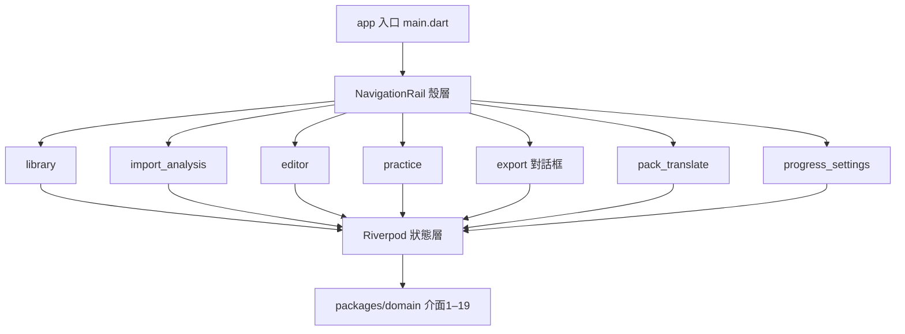
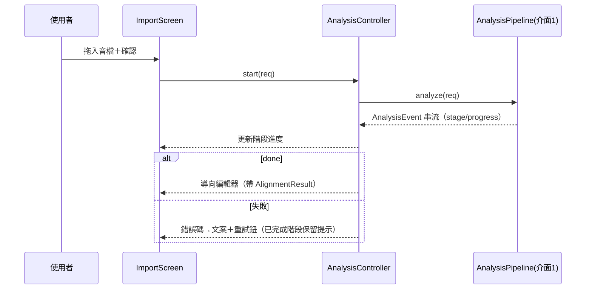

# Syllable Repeater macOS v1 — 前端（Flutter UI 層）技術方案設計

> 主需求：`../requirement/requirement.md`（v1.1）。後端契約權威來源：`./backend-design.md`（同需求目錄，已定稿）——本專案**無 HTTP 介面**，「介面依賴」一律對齊 backend-design.md §3.2 之 **Domain 公開 API（介面 1–19）**與 §3.2.8 錯誤碼總表；型別以 **Dart class/record** 表達（本專案無 TypeScript，欄位級對齊規則不變）。

---

## 一、概述

- **功能概述**：macOS 桌面 App 的完整 UI 層——課件庫/今日到期、匯入分析、波形音節校正、句尾疊加練習（播放/錄音比對）、匯出、譯文與課件儲存、SRS 進度與設定。涵蓋需求 REQ-01～REQ-09 的全部前端節點（需求成稿各 3.2.4 表中責任物件＝「前端」者）。
- **功能定位**：新專案首發版本；UI 只做展示、互動與呼叫 Domain API，**不含任何業務規則**（M1/M2/M3 等核心全在 Domain，換 UI 不動核心）。
- **架構定位**：三層架構最上層（backend-design.md §2.1）；經 Riverpod Provider 注入 Domain 服務；平台能力（麥克風、檔案對話框）走 UI/Infra，不進 Domain。

## 二、架構說明

### 1、模組劃分

- **library（課件庫/首頁）**：職責＝課件清單＋今日到期清單；輸入＝`ProgressEngine.dueList`、`lesson_registry`；輸出＝導向練習/編輯；邊界＝不觸碰 SRS 規則計算。
- **import_analysis（匯入分析）**：職責＝拖入音檔、階段化進度、結果預覽；輸入＝`AnalysisPipeline.analyze` 事件流；輸出＝AlignmentResult 交編輯器。
- **editor（波形校正編輯器）**：職責＝波形渲染（CustomPainter）、邊界拖動、試聽、undo；輸入/輸出＝`AlignmentEngine.updateSyllableBoundary`；含韻律疊圖顯示。
- **practice（疊加練習）**：職責＝步驟導航、播放 ×N、錄音、比對疊圖、結算；依賴 `buildSteps/renderStep/compare/settle`。
- **export（匯出）**：職責＝步驟勾選、路徑選擇、進度與完成回饋；依賴 `exportStep/exportMerged`。
- **pack_translate（課件與譯文）**：職責＝儲存/開啟 `.abopack`、譯文編輯（手動優先）；依賴 `write/read/translate`。
- **progress_settings（進度與設定）**：職責＝歸檔/恢復、進度匯入匯出、提醒三參數、AI key、sidecar 逾時；依賴 `archive/restore/import/exportProgress/reminderConfig/configure`。
- **shared**：波形繪製元件、播放控制、錯誤提示、設計 Token。

### 2、架構層次

- **UI 層**：Flutter Widget（各 feature 之 `*_screen.dart` 與子元件）。
- **狀態層**：**Riverpod**（`AsyncNotifier`/`Notifier`）——每 feature 一個 controller；播放/錄音等硬體狀態收在 practice controller。
- **服務層**：直接使用 Domain API（backend-design.md 介面 1–19），經 Provider 注入；無另設 API 包裝層（Domain 介面已窄）。
- **型別層**：直接複用 `packages/domain/` 匯出的領域型別（Syllable、PracticeStep、Prosody…），**UI 不另定義重複型別**（單一真相，避免欄位漂移）。

### 3、模組化設計原則

- **單一檔案職責**：一 screen 一檔；波形畫布、步驟清單、疊圖各自獨立 widget。
- **元件隔離**：元件間經 controller 狀態通信，不互相直接呼叫。
- **服務層分離**：所有 Domain 呼叫在 controller，Widget 內零業務呼叫。
- **工具模組化**：毫秒↔顯示格式、檔案對話框、錯誤碼→文案映射收於 `shared/`。

## 三、規範檔案對齊

> 新專案：無既有 `frontend-project.md` 與現有頁面可參照（`[新專案，無 UI 參照頁面]`）；本節即為首版規範基準，交付後由 code-knowledge-init 回寫 `frontend-project.md`。

### 1、技術標準（tech）

- **技術堆疊**：Flutter（macOS desktop target，Intel x86_64 優先）＋ Dart；狀態管理 **Riverpod**（編譯期安全、易測試、與純 Dart Domain 天然相容）；播放 just_audio；錄音 record 套件（MIT）`[授權白名單內]`；波形 CustomPainter 自繪。
- **路由**：桌面殼層 NavigationRail＋各 feature 內 Navigator push（無 deep-link 需求，不引入 go_router，化繁為簡）。
- **狀態管理**：feature-scoped Notifier；跨頁共享僅「目前開啟之 Lesson」與「設定」兩個 Provider。
- **HTTP**：無（AI 呼叫封在 Domain AIService 之後）。

### 2、專案結構（structure）

- `app/lib/main.dart`：組裝 ProviderScope、注入 infra 實作。
- `app/lib/shell/`：NavigationRail 殼層。
- `app/lib/features/{library,import_analysis,editor,practice,export,pack_translate,progress_settings}/`：各含 `*_screen.dart`、`*_controller.dart`、`widgets/`。
- `app/lib/shared/{waveform/,player/,error/,tokens.dart}`。
- 邏輯組織：輕量顯示邏輯留元件；跨元件邏輯進 controller；純計算一律在 Domain（不得在 UI 重算業務規則）。

### 3、UI 元件與風格對齊

- **UI 元件庫**：Flutter Material 3（內建，無第三方 UI 庫——桌面工具型應用，減依賴）。
- **主題與設計 Token**（`shared/tokens.dart` 固化）：主色 `#3B6EF5`；needsReview 警示色 `#E8A13C`；差異標色 `#D94F4F`；圓角 8；間距階 4/8/16/24；深淺色跟隨系統。
- **本次使用的 UI 元件清單**：

| 場景 | 元件 | 使用方式 | 參照頁面 |
|------|------|----------|----------|
| 清單（課件/到期/步驟） | `ListView`+`ListTile`/`Card` | 到期清單置頂、priority 排序 | [新專案，無參照] |
| 匯入 | `DropTarget`（desktop_drop，MIT）+`FilledButton` | 拖放＋選檔雙入口 | 同上 |
| 波形/疊圖 | 自繪 `CustomPaint` | peaks 快取、邊界線可拖 hit-test | 同上 |
| 表單（設定/譯文） | `TextField`+`Form` | 就地驗證、錯誤不清空已填值 | 同上 |
| 對話框（匯出/確認） | `AlertDialog`/`Dialog` | 匯出勾選＋進度 | 同上 |
| 訊息提示 | `SnackBar`＋就地 inline 錯誤 | 錯誤碼→文案映射表 | 同上 |
| 載入態 | 階段化 `LinearProgressIndicator`＋文字 | 分析/匯出長任務 | 同上 |
| 空態 | 自定 `EmptyState` widget | 首頁無課件時顯示匯入引導 | 同上 |

- **版面設定**：桌面雙欄——左 NavigationRail＋清單、右主工作區（波形/練習）；最小視窗 1100×700。

## 四、功能邏輯實作

> 錯誤處理總策略見「功能點 8」末之**錯誤碼對照表**（涵蓋 backend-design.md §3.2.8 全部 19 碼）；各功能點不重複列全表。

### 功能點 1：課件庫與今日到期（library）

#### 1.1 功能概述
- **功能描述**：首頁顯示今日到期複習清單（置頂）＋全部課件；點擊進練習或編輯。
- **實作位置**：`features/library/library_screen.dart`
- **關聯需求**：REQ-08（3.1 使用動機：「隔三天回來，一打開就看到今天該複習哪幾組」）

#### 1.2 資料與介面
- **介面依賴**：
  - `ProgressEngine.dueList` — **來源：backend-design.md §3.2.6 介面 14**
    - 呼叫時機：screen 掛載與回前景時
    - 輸入參數欄位表：

      | 欄位 | 型別 | 必填 | 說明 |
      |------|------|------|------|
      | `now` | `DateTime` | 是 | 目前時間（注入 Clock 取得） |

    - 輸出參數欄位表：

      | 欄位路徑 | 型別 | 說明 | 標記 |
      |----------|------|------|------|
      | `[].groupId` | `String` | 練習組 ID | — |
      | `[].lessonTitle` | `String` | 顯示標題 | — |
      | `[].nextDue` | `DateTime` | 到期時間 | — |
      | `[].priority` | `int` | HARD 最高，排序鍵 | — |

- **使用驅動檢查**：①動機＝看今天該練什麼；②第一眼＝到期清單置頂，主任務 1 步（點卡片即進練習）；③阻力點＝逾期罪惡感——UI **不顯示「逾期 N 天」字樣**（M7 跨日零懲罰的介面落地），只顯示「可練」。

#### 1.3 程式碼複用分析
- 可複用：`shared/EmptyState`、`shared/error/`；領域型別 `DueGroup`。

#### 1.4 實作方案
- **元件結構**：`LibraryScreen`＝`DueListSection`＋`LessonGridSection`。
- **狀態**：`{ due: AsyncValue<List<DueGroup>>, lessons: AsyncValue<List<LessonMeta>> }`，存 `LibraryController`。
- **生命周期**：掛載載入；視窗回前景重查 dueList；卸載無需清理。
- **邊界情況**：無課件→EmptyState＋匯入引導；到期清單空→顯示「今日無到期」。
- **錯誤處理**：DB 讀取失敗→inline 重試鈕。

### 功能點 2：匯入與分析（import_analysis）

#### 2.1 功能概述
- **功能描述**：拖入/選擇音檔（可貼字稿、勾人聲分離），顯示階段化進度，完成後交編輯器。
- **實作位置**：`features/import_analysis/`
- **關聯需求**：REQ-01（AT-01-01…07；節點 N1/N8）

#### 2.2 資料與介面
- **介面依賴**：
  - `AnalysisPipeline.analyze` — **來源：backend-design.md §3.2.1 介面 1**
    - 呼叫時機：使用者確認匯入後；**進行中鎖定匯入按鈕**（防重入，對應 `ERR_ANALYSIS_IN_PROGRESS`）
    - 輸入參數欄位表：

      | 欄位 | 型別 | 必填 | 說明 |
      |------|------|------|------|
      | `audioPath` | `String` | 是 | mp3/wav/m4a/flac，≤10 分鐘（Q8） |
      | `transcript` | `String?` | 否 | 多行 TextField；空＝whisper 轉寫草稿 |
      | `separateVocals` | `bool` | 是 | Checkbox，預設 false |

    - 輸出參數欄位表（`AnalysisEvent` 串流）：

      | 欄位路徑 | 型別 | 說明 | 標記 |
      |----------|------|------|------|
      | `stage` | `AnalysisStage` | decoding/separating/transcribing/syllabifying/done → 進度文案 | — |
      | `progress` | `double` | 0–1，進度條 | — |
      | `result` | `AlignmentResult?` | done 時非 null | — |
      | `result.words[].text/startMs/endMs/index` | 見型別 | 詞列 | — |
      | `result.syllables[].text/startMs/endMs/wordIndex/needsReview` | 見型別 | 音節列（金標準句＝11 筆） | — |
      | `result.source` | `String` | 顯示於課件中繼資料 | — |
      | `result.confidence` | `double` | 低於 0.5 顯示提醒 | — |
      | `result.needsReview` | `bool` | true→完成頁提示「有音節待校正」 | — |

- **使用驅動檢查**：①動機＝一分鐘內開始練；②第一眼＝大拖放區＋「選擇音檔」，主任務 2 步（拖入→確認）；③阻力點＝等待黑箱——**階段化進度文案**（「解碼中…／辨識中…」）＋可取消。

#### 2.4 實作方案
- **元件結構**：`ImportScreen`＝`DropZone`＋`TranscriptField`＋`OptionsRow`＋`StagedProgress`。
- **狀態**：`AsyncNotifier<AnalysisState>`；`state ∈ {idle, running(stage,progress), done(result), failed(code)}`。
- **互動流程**：

- **輸入驗證**：副檔名與時長在選檔後即前置檢查（與 Domain 驗證雙保險，錯誤就地顯示、字稿不清空）。
- **邊界情況**：0 byte 檔→`ERR_DECODE_FAILED` 文案；分析中連點→按鈕置灰（AT-01-05）。

### 功能點 3：波形校正編輯器（editor）

#### 3.1 功能概述
- **功能描述**：CustomPainter 波形＋音節邊界線＋文字標籤＋韻律疊圖；拖動校正、單音節試聽、⌘Z 撤銷。
- **實作位置**：`features/editor/`
- **關聯需求**：REQ-02（AT-02-01…05）、REQ-05 顯示（AT-05-01/02）

#### 3.2 資料與介面
- **介面依賴**：
  - `AlignmentEngine.updateSyllableBoundary` — **來源：backend-design.md §3.2.1 介面 2**
    - 輸入參數欄位表：

      | 欄位 | 型別 | 必填 | 說明 |
      |------|------|------|------|
      | `boundaryIndex` | `int` | 是 | 拖動之邊界序號（hit-test 得出） |
      | `newPositionMs` | `int` | 是 | 放開時像素→毫秒換算值 |
      | `pcmRef` | `PcmHandle` | 是 | 目前課件 PCM |

    - 輸出參數欄位表：

      | 欄位路徑 | 型別 | 說明 | 標記 |
      |----------|------|------|------|
      | `syllables[]` | `List<Syllable>` | 更新後全列（重繪依據） | — |
      | `snappedMs` | `int` | 零交越吸附實際落點（拖動釋放後顯示） | — |

  - `ProsodyAnalyzer.analyze` — **來源：backend-design.md §3.2.3 介面 7**（輸出欄位表同該節：`rhythm[]/intensity[]/stress[]/pitchContour[]?/pitchAvailable`；`pitchAvailable=false` 時顯示「音高不可用」徽章而非錯誤）
  - 試聽單音節：以單音節構造之 `PracticeStep` 呼叫 `PracticeEngine.renderStep` — **來源：backend-design.md §3.2.2 介面 4**（保證試聽也是原聲切片，M1）

- **使用驅動檢查**：①動機＝聽到破碎接點想立刻修好；②第一眼＝needsReview 音節以警示色（`#E8A13C`）標出，主任務 3 步（點音節→拖→放開自動吸附存回）；③阻力點＝改壞回不去——**⌘Z 撤銷堆疊（UI 持有回傳值歷史）＋拖動中即時毫秒顯示＋放開即可試聽**。

#### 3.4 實作方案
- **元件結構**：`EditorScreen`＝`WaveformCanvas`（CustomPaint，含邊界 hit-test 與拖動手勢）＋`SyllableChipsRow`＋`ProsodyOverlayToggle`。
- **狀態**：`{ syllables, undoStack: List<List<Syllable>>, prosody: AsyncValue<Prosody>, playingSyllable: int? }`。
- **核心邏輯**：拖動中僅本地預覽線；`onPanEnd` 才呼叫介面 2；`ERR_BOUNDARY_INVALID` →回彈動畫＋SnackBar（AT-02-02/05）；連續快速拖動以放開時最終值送出（AT-02-03）。
- **效能**：peaks 預算快取（`waveform/peaks.json`）；拖動只重繪邊界層（RepaintBoundary 分層），目標 ≥30fps；試聽啟動 ≤200ms（PCM 常駐）。
- **邊界情況**：pitch 不可用→隱藏音高曲線、顯示徽章；0 長度音節（損毀資料）→該格灰化。

### 功能點 4：句尾疊加練習（practice）

#### 4.1 功能概述
- **功能描述**：步驟清單（金標準句＝11 步）、單步播放 ×N、錄音比對疊圖、難度結算。
- **實作位置**：`features/practice/`
- **關聯需求**：REQ-03（AT-03-01…07）、REQ-06（AT-06-01…05）、REQ-08 結算（AT-08-01）

#### 4.2 資料與介面
- **介面依賴**：
  - `PracticeEngine.buildSteps` — **來源：backend-design.md §3.2.2 介面 3**
    - 輸入欄位表：

      | 欄位 | 型別 | 必填 | 說明 |
      |------|------|------|------|
      | `syllables` | `List<Syllable>` | 是 | 目前課件音節列 |
      | `repeatN` | `int` | 是 | Stepper 控件 1–10、預設 3（Q4）；越界由控件擋＋`ERR_REPEATN_OUT_OF_RANGE` 雙保險 |

    - 輸出欄位表（每 `PracticeStep`）：

      | 欄位路徑 | 型別 | 說明 | 標記 |
      |----------|------|------|------|
      | `index` | `int` | 步驟導航序號 | — |
      | `syllables[]` | `List<Syllable>` | 顯示該步文字（如第 3 步 `ca tion skills`） | — |
      | `sourceRanges[]` | `List<TimeRange>` | UI 不使用其內容，僅透傳 renderStep | — |
      | `totalDurationMs` | `int` | 步長顯示 | — |

  - `PracticeEngine.renderStep` — **來源：backend-design.md §3.2.2 介面 4**（輸入 step＋PCM；輸出 PCM bytes 交 just_audio；播放 ×repeatN 由 UI 迴圈或預串接控制）
  - `RecordingComparator.compare` — **來源：backend-design.md §3.2.4 介面 8**
    - 輸入欄位表：`userRecordingPath: String（temp/ 錄音，比對後 Domain 刪除）`、`syllables`、`step`、`originalPcm`（皆必填）
    - 輸出欄位表：

      | 欄位路徑 | 型別 | 說明 | 標記 |
      |----------|------|------|------|
      | `rhythmDelta` | `double` | 節奏差異數值＋文字化等級 | — |
      | `intonationDelta` | `double` | 語調差異 | — |
      | `overlayData.userWave/refWave/userPitch/refPitch` | 曲線陣列 | 雙波形/音高疊圖資料 | — |
      | `overlayData.diffRanges[]` | `List<TimeRange>` | 差異區段→標 `#D94F4F` | — |
      | `score` | `double?` | 可選，null 不顯示 | — |

  - `ProgressEngine.settle` — **來源：backend-design.md §3.2.6 介面 13**（輸入 `groupId`、`difficulty ∈ HARD/NORMAL/EASY` 三鈕、可選 `attempt`；輸出 `SrsState{intervalIndex,nextDue,difficulty}` → 顯示「下次：7/8」）

- **使用驅動檢查**：①動機＝跟不上整句、想從句尾一小口一小口練；②第一眼＝第 1 步（句尾音節）大播放鍵即點即聽，主任務 1 步；③阻力點＝**聲音不是原聲/接點破碎**＝信任崩潰——全部播放經 renderStep（M1）；次阻力＝錄音後只給分數不知差在哪——疊圖差異區段標色定位。

#### 4.4 實作方案
- **元件結構**：`PracticeScreen`＝`StepNavigator`（清單＋上一步/下一步）＋`PlayerBar`（播放×N、repeatN Stepper）＋`RecordPanel`（錄音鈕＋電平表）＋`OverlayChart`（疊圖）＋`SettleBar`（困難/普通/輕鬆）。
- **狀態**：`{ steps, currentIndex, playState, recordState, comparison: AsyncValue<ComparisonResult>? }`。
- **生命周期**：掛載 buildSteps；repeatN 變更→重建（sourceRanges 不變，AT-03-06）；**卸載/切步時停止播放與錄音並丟棄暫存**（AT-06-03）。
- **核心邏輯**：播放中按下一步→先 stop 再切（AT-03-05 無聲音重疊）；錄音中「播放原音」置灰（防串音）；錄音 <0.2s→`ERR_RECORDING_TOO_SHORT` 就地提示不產 Attempt。
- **邊界情況**：麥克風權限拒絕→`ERR_MIC_PERMISSION_DENIED` 對話框＋「開啟系統設定」按鈕（AT-06-05）。

### 功能點 5：匯出（export 對話框）

#### 5.1 功能概述
- **功能描述**：勾選步驟→選路徑→匯出單步/合併 mp3；完成顯示「在 Finder 顯示」。
- **實作位置**：`features/export/export_dialog.dart`
- **關聯需求**：REQ-04（AT-04-01…06）

#### 5.2 資料與介面
- **介面依賴**：
  - `PracticeEngine.exportStep` — **來源：backend-design.md §3.2.2 介面 5**；`exportMerged` — **來源：同節介面 6**
    - 輸入欄位表：`steps: List<PracticeStep>（勾選，index 升冪，≥1）`、`destPath: String（macOS 存檔對話框）`（皆必填）
    - 輸出欄位表：

      | 欄位路徑 | 型別 | 說明 | 標記 |
      |----------|------|------|------|
      | `path` | `String` | 完成後「在 Finder 顯示」 | — |
      | `totalDurationMs` | `int` | 完成摘要顯示總長 | — |
      | `silenceGapsMs[]` | `List<int>` | 進階資訊摺疊顯示（核對用，±20ms，Q5） | — |

- **使用驅動檢查**：①動機＝把今天練的丟進手機邊走邊跟讀；②第一眼＝步驟勾選清單＋「匯出」，主任務 3 步（勾→選路徑→匯出）；③阻力點＝匯出中不知死活——進度列＋完成即顯示路徑。
- **實作要點**：未勾選→匯出鈕置灰；匯出中再按→置灰＋提示（`ERR_EXPORT_IN_PROGRESS`，AT-04-05）；`ERR_EXPORT_DEST_UNWRITABLE`→就地錯誤、勾選狀態保留。

### 功能點 6：課件儲存/開啟與譯文（pack_translate）

#### 6.1 功能概述
- **功能描述**：儲存/開啟 `.abopack`；譯文欄手動輸入（永遠可用）＋「自動翻譯」（需 key）。
- **實作位置**：`features/pack_translate/`
- **關聯需求**：REQ-07（AT-07-01…06）

#### 6.2 資料與介面
- **介面依賴**：
  - `LessonPackEngine.write` — **來源：backend-design.md §3.2.5 介面 9**；`read` — **同節介面 10**（輸入/輸出＝Lesson 全欄位，見 backend §3.1.1；UI 直接複用領域型別）
  - `AIService.translate` — **來源：backend-design.md §3.2.5 介面 12**
    - 輸入欄位表：`text: String（必填）`、`targetLang: String（必填，預設 zh-TW）`
    - 輸出欄位表：`Translation{ text, source:'ai', modelName, createdAt }`
- **使用驅動檢查**：①動機＝花時間校正好的課件要能存檔換機；②第一眼＝⌘S 即存，1 步；③阻力點＝**沒設 key 被擋**——自動翻譯鈕停用時顯示 tooltip「未設定 AI 金鑰」，**手動譯文輸入框永遠可編輯**。
- **實作要點**：手動輸入即標 `source='manual'` 並覆蓋 ai 值；自動翻譯回應到達時若使用者已手動輸入→**丟棄 ai 結果**（AT-07-06，以 controller 內 manual 旗標判定）；`ERR_PACK_CORRUPTED`→錯誤頁不部分渲染。

### 功能點 7：進度、SRS 與設定（progress_settings）

#### 7.1 功能概述
- **功能描述**：Group 歸檔/恢復、進度匯入匯出、提醒三參數、AI key 設定、sidecar 逾時。
- **實作位置**：`features/progress_settings/`
- **關聯需求**：REQ-08（AT-08-02…08）、REQ-07 key 管理（AT-07-05）

#### 7.2 資料與介面
- **介面依賴**（皆來源 backend-design.md §3.2.6 / §3.2.5）：
  - `archive`（介面 17）／`restore`（介面 18）：輸入 `groupId: String`；restore 失敗碼 `ERR_ARCHIVE_RESTORE_EXPIRED` → 顯示「已超過 7 日（168 小時）」且按鈕轉為不可用（EXPIRED 不可逆）
  - `exportProgress`（介面 15）：輸入 `destPath`；輸出寫入路徑
  - `importProgress`（介面 16）：輸入 `path`；輸出欄位表：

    | 欄位路徑 | 型別 | 說明 | 標記 |
    |----------|------|------|------|
    | `applied` | `int` | 覆寫筆數（合併摘要對話框） | — |
    | `skipped` | `int` | 本機較新保留筆數 | — |
    | `resetLessons[]` | `List<String>` | 因內容變更被重置之課件→列名提示（M6 透明化） |
  - `reminderConfig`（介面 19）：三參數 Slider/欄位，預設 15/5/2（Q9），存回即生效
  - `AIService.configure`（介面 11）：key 輸入框（obscure）；**UI 不保存 key 任何副本**，送 Domain 即清空欄位
- **使用驅動檢查**：①動機＝管理複習節奏與備份；②第一眼＝歸檔區塊顯示每個 ARCHIVED Group 的「剩餘可恢復時間」倒數；③阻力點＝誤歸檔——歸檔前確認對話框＋168h 倒數可見。
- **邊界情況**：`ERR_PROGRESS_CORRUPTED`→提示「未套用任何變更」（既有進度不變，AT-08-07）。

### 功能點 8：全域錯誤處理（shared/error）

**錯誤碼對照表**（逐一涵蓋 backend-design.md §3.2.8 全部 19 碼）：

| 錯誤碼 | 前端處理策略 |
|--------|--------------|
| `ERR_UNSUPPORTED_FORMAT` | 匯入區就地錯誤，選檔器過濾四格式雙保險 |
| `ERR_FILE_TOO_LONG` | 就地錯誤「超過 10 分鐘上限」 |
| `ERR_DECODE_FAILED` | 就地錯誤＋重試鈕；可再次匯入（FFmpeg 解碼階段） |
| `ERR_TRANSCRIBE_FAILED` | SnackBar＋「重試辨識階段」；已解碼 PCM 之 checkpoint 保留（whisper 階段） |
| `ERR_SEPARATE_FAILED` | SnackBar＋「跳過分離改用原音」按鈕；解碼 PCM 保留（demucs 階段） |
| `ERR_SIDECAR_CRASHED` | SnackBar＋「重試此階段」；已完成階段結果保留提示 |
| `ERR_SIDECAR_TIMEOUT` | 同上＋連結至設定調高逾時 |
| `ERR_ANALYSIS_IN_PROGRESS` | 匯入鈕置灰（正常情況 UI 已防，此為兜底忽略） |
| `ERR_BOUNDARY_INVALID` | 邊界回彈動畫＋SnackBar「不可跨越相鄰音節」 |
| `ERR_REPEATN_OUT_OF_RANGE` | Stepper 已限 1–10；兜底就地提示 |
| `ERR_EXPORT_DEST_UNWRITABLE` | 對話框內就地錯誤；勾選保留、可換路徑重試 |
| `ERR_EXPORT_IN_PROGRESS` | 匯出鈕置灰＋提示 |
| `ERR_RECORDING_TOO_SHORT` | 錄音面板就地提示「請重錄（至少 0.2 秒）」 |
| `ERR_MIC_PERMISSION_DENIED` | 對話框＋「開啟系統設定」深連結 |
| `ERR_PACK_CORRUPTED` | 整頁錯誤態「課件損毀」，不部分渲染 |
| `ERR_PROGRESS_CORRUPTED` | 對話框「未套用任何變更」 |
| `ERR_AI_KEY_MISSING` | 翻譯鈕停用＋tooltip；不彈錯誤（非阻斷） |
| `ERR_AI_CALL_FAILED` | SnackBar「翻譯服務暫時無法使用」；手動路徑不受影響 |
| `ERR_ARCHIVE_RESTORE_EXPIRED` | 恢復鈕轉不可用＋說明文案 |

**通則**：錯誤一律就地顯示、**絕不清空使用者已填資料**（需求 3.2.7「錯誤輸入」情境對齊）；未知例外→通用錯誤對話框＋log 路徑提示。

---

## 介面對齊自我檢查（定稿前，8 項）

| # | 檢查項 | 結果 |
|---|--------|------|
| 1 | 介面涵蓋完整性 | ✅ backend §3.2 介面 1–19 全數對應（介面 4 於功能點 3/4 複用；介面 9/10 於功能點 6） |
| 2 | 輸入參數欄位逐一對齊 | ✅ 各欄位表與 backend 一致；條件行為（repeatN 範圍、transcript 可空）已註明 |
| 3 | 輸出參數欄位逐一對齊 | ✅ 巢狀（overlayData、result.syllables）展開至葉子 |
| 4 | 來源標註 | ✅ 每介面標 `來源：backend-design.md §3.2.x 介面N` |
| 5 | 型別與後端一致 | ✅ UI 直接複用 domain 套件型別，無重複定義、無映射（Dart 取代 TS，規則等效） |
| 6 | 錯誤碼全涵蓋 | ✅ 19/19 碼有處理策略（功能點 8） |
| 7 | 新增/變更欄位標註 | ✅ 全為新專案首建，無 [變更]；無修改既有介面 |
| 8 | 無臆造介面 | ✅ 無 backend 未定義之介面；無 [需後端設計補充] 項 |

*對照 requirement.md 複核：頁面/流程/互動未超出 REQ-01～09 範圍；Non-scope（手機端、Windows、防盜、金流）零涉入；UTF-8 zh-TW。*
