# 語音/歌曲/台詞模仿練習系統（Syllable Repeater）macOS v1 需求規格說明書

---

## 一、檔案資訊

### 1.1 基礎資訊

| 專案 | 說明 |
|------|------|
| **檔案名稱** | 語音/歌曲/台詞模仿練習系統（Syllable Repeater）macOS v1 需求規格說明書 |
| **作者** | Karen（需求方）／AI 協作整理 |
| **建立日期** | 2026-07-04 |
| **原始材料** | `PLAN3.0.md`（所有規格已與使用者逐項確認） |

### 1.2 修訂歷史

| 版本 | 修訂日期 | 修訂人 | 複核日期 | 複核人 | 修改內容簡述 |
|------|----------|--------|----------|--------|--------------|
| 1.0 | 2026-07-04 | AI（依 PLAN3.0 整理） | — | — | 初稿。三項關鍵調整：① 平台順序由「Windows v1、macOS 後」改為 **macOS v1 優先**；② 新增手機端未來兼容約束（PWA 或 App Store/Play Store 原生 App 雙路徑保留）；③ 金標準例句 `She has excellent communication skills` 音節數由 PLAN3.0 原文之 15 **修正為 11**（she 1 + has 1 + ex·cel·lent 3 + com·mu·ni·ca·tion 5 + skills 1 = 11 音節 → 10 切點 → 11 步），使用者於 2026-07-04 明示修正，全文以 11 為準 |
| 1.1 | 2026-07-04 | AI | 2026-07-04 | Karen（需求方） | 使用者核可附錄 A 全部 10 題，以各題「建議預設」為定案值（Q9、Q10 維持待實測/待產品定，見附錄 A 註記）；成稿定稿，交付 fullstack-design |
| 1.2 | 2026-07-04 | AI | 2026-07-04 | Karen（需求方） | S8/REQ-09 簽章計畫由「Developer ID 簽章＋notarization」改為「v1 免簽章＋使用者自行略過 Gatekeeper」；原因：使用者無 Apple Developer 帳號。使用者於四個選項（免簽章略過 Gatekeeper／免費 Apple ID Personal Team ad-hoc 簽章／桌面版走 Flutter Web PWA／延後至取得帳號後再付費申請）中選定「免簽章＋略過 Gatekeeper」 |

> 數據修正留痕（憲法 C3）：PLAN3.0 §3.3、S1a、§6、§7 原文寫「15 音節/15 步/14 切點」，經逐字核對音節拆分後確認原文有誤，以使用者修正值 11 音節/11 步/10 切點取代。

---

## 二、整體概述

### 2.1 需求內容清單

| 序號 | 需求項名稱/ID | 簡要說明 | 所屬模組 | 優先級 |
|------|----------------|----------|----------|--------|
| 1 | REQ-01 音檔匯入與自動音節對齊 | 匯入音檔→解碼→（可選）人聲分離→whisper.cpp 詞級時間戳→CMUdict 切音節→產出 AlignmentResult | AlignmentEngine / AnalysisPipeline | P0 |
| 2 | REQ-02 波形顯示與音節邊界手動校正 | 波形＋音節邊界線顯示，多音節字內部邊界可拖動校正並存回 | UI / AlignmentEngine | P0 |
| 3 | REQ-03 句尾疊加練習 | 依音節由句尾往前逐步疊加，每步以原音切片重複播放 N 次（§0.1 原聲鐵則） | PracticeEngine | P0 |
| 4 | REQ-04 練習音訊匯出 | 單步匯出 mp3；勾選多步合併匯出，段落間靜音＝前一步總時長 | PracticeEngine | P0 |
| 5 | REQ-05 韻律分析與視覺化 | rhythm / intensity / stress 自研 DSP，pitch（YIN）可降級 | ProsodyAnalyzer | P1 |
| 6 | REQ-06 錄音比對與差異疊圖 | 使用者錄音 vs 原音切片，DTW 產 rhythm/intonation 差異疊圖；錄音預設用完即刪 | RecordingComparator | P1 |
| 7 | REQ-07 課件封裝與譯文 | `.abopack` 讀寫；譯文自動（使用者自帶 AI key，可選）＋手動打字覆蓋（永遠可用） | LessonPackEngine / AIService | P1 |
| 8 | REQ-08 練習進度與 SRS | `.aboprogress` upsert、SRS 間隔排程、提醒優先序、跨日不罰、字典歸檔 | ProgressEngine | P1 |
| 9 | REQ-09 跨平台兼容性架構約束 | macOS v1 優先；Domain 純 Dart 跨平台；未來手機端保留 PWA 與商店 App 雙路徑 | 全域（公共） | P0 |

### 2.2 基本術語定義

| 術語/縮寫 | 含義 |
|-----------|------|
| `Lesson` | 一個音檔經製作後的完整課件（= 一個 `.abopack`） |
| `Word` | 原文的一個單字（she / has / excellent / communication / skills） |
| `Syllable` | 音節，疊加練習的最小單位（ex / cel / lent 各為一個） |
| `Phone` | 音素，whisper/對齊中間產物，比音節更細 |
| `PracticeStep` | 句尾疊加的一步（第 n 步 = 從句尾數第 n 個音節 → 句尾） |
| `PracticeGroup` | 進度 / SRS 結算的最小單位，限定在單一 Lesson 內 |
| `Attempt` | 使用者對某 `PracticeStep` 的一次錄音嘗試 |
| `Prosody` | 韻律分析結果：rhythm / intensity / stress / pitch contour |
| `Pack` | `.abopack` 課件檔（zip + JSON + 音訊） |
| `Progress` | `.aboprogress` 個人進度檔（zip + JSON） |
| Sidecar | 以 `Process.start()` 啟動的獨立外部行程（FFmpeg / whisper.cpp / demucs.cpp），崩潰不拖垮 App |
| SRS | Spaced Repetition System，間隔重複複習排程 |
| 金標準例句 | `She has excellent communication skills`，共 **11 音節**（she 1、has 1、ex·cel·lent 3、com·mu·ni·ca·tion 5、skills 1）→ 10 切點 → 11 步 |

**術語鐵則**（承 PLAN3.0 §1）：音節一律 `Syllable`、單字一律 `Word`，不混用；疊加單位是 `Syllable`，純音節逐個疊加，不做單字邊界吸附；所有練習音訊來自原音切片，不得生成。

**責任物件對應說明**（本專案為本機桌面應用，無伺服器）：

| 標準責任物件 | 本專案對應 |
|---|---|
| 前端 | Flutter UI 層（波形繪製、互動、播放控制） |
| 伺服器端 | 本機 Domain Layer（純 Dart 領域層：LessonPackEngine、AlignmentEngine、PracticeEngine 等） |
| 閘道/中間件 | 無 |
| 外部系統 | Sidecar 行程（FFmpeg / whisper.cpp / demucs.cpp）、使用者自帶 key 的 AI 服務商 |

### 2.3 非功能性清單參考

參照標準類別表（效能／可用性／安全性／可維護性／相容性／合規性），具體指標於各需求項 3.2.6 落實。全案通用約束：

| 類別 | 指標/描述 | 驗收方式 |
|------|-----------|----------|
| 合規性（授權） | 主程式僅允許 MIT / BSD / ISC / Apache-2.0 / LGPL（動態連結）；禁止 GPL / AGPL / CC BY-NC / 研究用途限定模型 | 依賴清單審查（見末章 CT-09） |
| 體積 | 主程式零 Python；MFA / CREPE / WORLD 一律外掛化（使用者另行下載） | release build 依賴與體積檢查 |
| 安全性 | AI key 以 flutter_secure_storage 本機加密；任何檔案不得出現 key / 密碼 / 個資 | 程式碼與 commit 審查 |
| 穩定性 | Sidecar 崩潰只回傳失敗，App 不崩、保留工作狀態 | 故障注入測試（kill sidecar） |

> **線上服務判定：否**。四條判準（對外服務／多使用者／部署 server／處理他人資料）皆未命中——純本機、單人、自有資料之桌面應用，不適用第二層加嚴提問與完整版監測。惟 AIService 呼叫外部 AI 服務商屬「外部相依」，已於 2.5「允許變動」與 REQ-07 處理（未設 key 或服務商掛掉，主流程不受阻）。

### 2.4 範圍外（Non-scope）

| 序號 | 明確不做的內容 | 不做的理由 | 何時可能重新評估 |
|------|----------------|-----------|------------------|
| 1 | 手機端（iOS/Android）實作 | Phase 2 範圍；v1 先把桌面製作端與練習核心做穩 | 桌面 v1 驗收（末章）全數通過後 |
| 2 | Windows 桌面版 | 使用者 2026-07-04 指示改為 macOS 優先；Windows 延後（Q2 定案：macOS v1 發布後評估時程） | macOS v1 發布後 |
| 3 | MFA / CREPE / WORLD 內建主程式 | 重 Python/體積大；PLAN3.0 已定案外掛化 | 使用者對切點精度不滿意且願意另行下載時（外掛，仍不進主程式） |
| 4 | `.abopack` 授權/防盜欄位 | 音檔來源由使用者自負責（PLAN3.0 §3.6 定案） | 商用化且有內容授權需求時 |
| 5 | 雲端帳號系統／伺服器同步 | 同步僅靠 `.abopack` / `.aboprogress` 檔案交換 | 多裝置自動同步成為明確痛點時 |
| 6 | TTS／AI 合成示範音 | §0.1 最高約束之絕對紅線，**永不重新評估** | 永不 |
| 7 | 商用金流／訂閱 | 自用與商用同一套碼，營運方不碰金流（PLAN3.0 §2 定案） | — |
| 8 | 非英文語料的音節切分 | CMUdict 僅涵蓋英文；查無字以母音團計數 fallback＋needsReview 兜底（Q6 定案），完整非英文支援仍屬範圍外 | 多語言需求確認時 |
| 9 | Apple 官方簽章與 notarization | 使用者無 Apple Developer 帳號；v1 以免簽章＋使用者自行略過 Gatekeeper（`xattr -cr` 或右鍵開啟）取代 | 取得 Developer ID 帳號，或需要向非親友的陌生使用者分發時 |

### 2.5 核心維持原則

| 分類 | 條目 | 說明 |
|------|------|------|
| **系統必須維持** | **M1 原聲不可替換**：每個 `PracticeStep` 播放/匯出的音訊，逐 sample 來自原始音檔解碼後的 PCM 切片串接（僅允許切點吸附零交越或 ≤10ms micro-fade 之不改變發音內容的收尾處理） | §0.1 最高約束，凌駕精度/效能/功能；「是不是原聲」＞「切點準不準」 |
| **系統必須維持** | **M2 疊加演算法**：步驟總數＝音節總數；第 n 步＝句尾數來第 n 個音節→句尾；純音節逐個疊加、不做單字邊界吸附（金標準例句＝11 音節→10 切點→11 步） | 產品核心玩法，錯了整個練習法失效 |
| **系統必須維持** | **M3 合併匯出靜音規則**：段落間靜音長度＝前一步 `totalDurationMs`（＝片段長 × repeatN） | 使用者靠靜音跟讀，長度錯即不可用 |
| **系統必須維持** | **M4 崩潰隔離**：任一 sidecar 崩潰→回傳失敗＋App 不崩＋保留當前工作狀態 | 架構鐵則 |
| **系統必須維持** | **M5 Domain 純 Dart**：Domain Layer 不 import sidecar/UI/平台 API，可在無 Flutter 環境以 `dart test` 100% 單元測試 | TDD 施力點，亦是手機端/Web 兼容的前提 |
| **系統必須維持** | **M6 進度合併規則**：依 `updatedAt` 較新覆寫；Lesson 之 Content Hash 變更只重置該 Lesson，不波及整個 Course | 進度資料完整性 |
| **系統必須維持** | **M7 跨日零懲罰**：跨日未完成不催、不記失敗、不累積債；該次靜默作廢，`PracticeGroup` 仍可在未來被叫出 | 產品心理學定案 |
| **系統必須維持** | **M8 歸檔可恢復**：字典歸檔不滿 7 日（定案：168 小時，不含）可恢復，恢復後可重新排程，不影響本機課件與進度 | 資料防呆 |
| **系統必須維持** | **M9 授權白名單**：主程式零 GPL/AGPL/非商用限定、零 Python；FFmpeg 必須 LGPL build 動態連結 | 商用紅線 |
| **系統必須維持** | **M10 隱私防線**：AI key 加密儲存；使用者錄音預設用完即刪（僅保留 overlayData 與參數） | 安全與隱私 |
| **系統允許變動** | UI 配色/波形樣式、pitch 演算法選型（YIN→WORLD C++）、翻譯/AI 服務商、切點微調（±數十 ms 內仍為原聲連續片段）、提醒文案與預設值、匯出格式之擴充、手機端最終通路（PWA vs 商店 App） | 彈性空間，變更不需走核心防線檢查 |
| **系統不可接受** | 任何 TTS、音高重算、音節替換、跨來源拼接、AI 合成音訊進入練習播放或匯出路徑（含分析模組寫入音訊） | §0.1 絕對紅線 |
| **系統不可接受** | 疊加時做單字邊界吸附（如第 2 步輸出 `communication skills` 而非 `tion skills`） | 破壞 M2 |
| **系統不可接受** | GPL / AGPL / 非商用限定授權碼或模型進入主程式 | 破壞 M9 |
| **系統不可接受** | API key、密碼、個資以明文出現在任何檔案、設定、commit | 憲法 C6 |
| **系統不可接受** | 未經使用者明示同意而保留錄音檔 | 破壞 M10 |

---

## 三、REQ-01 音檔匯入與自動音節對齊

### 3.1 需求概述

- **目的**：使用者匯入一段音檔（可附字稿）後，系統自動產出詞級與音節級時間戳（`AlignmentResult`），作為疊加練習、匯出、比對的唯一時間軸基礎。
- **使用動機**：使用者拿到一段喜歡的台詞/歌曲片段，想在一分鐘內看到「波形＋音節格子」並直接開始練。第一眼期待看到：波形上已畫好音節邊界與文字。最可能放棄點：**分析等待過久**或**音節數明顯錯誤**（如金標準例句切不出 11 個音節）——因此多音節字須標 `needsReview` 讓使用者知道哪裡是估計值，而非默默給錯。

### 3.2 業務流程

#### 3.2.1 用例圖

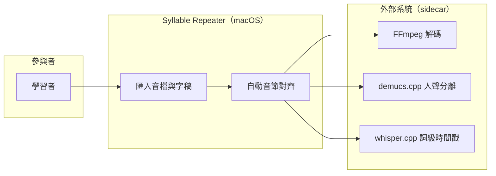

#### 3.2.2 前置條件

- App 已啟動，FFmpeg / whisper.cpp sidecar 可執行檔就緒（demucs.cpp 供含背景音樂之音檔選用）；
- 音檔為受支援格式（定案：mp3/wav/m4a/flac，單檔上限 10 分鐘）；
- 英文語料（CMUdict 範圍）。

#### 3.2.3 觸發事件及重要邏輯

- **觸發事件**：使用者在主視窗拖入音檔（或點「匯入」選檔），可選擇同時貼上字稿（transcript）。
- **重要邏輯**：
  1. 前端接收檔案路徑與可選字稿，顯示「分析中」進度狀態（頁面操作：匯入按鈕置灰防重複提交）；
  2. Domain 呼叫 FFmpeg sidecar 解碼為 PCM 並取得總時長（資料互動：`Process.start`，stdout/exit code 判定成敗）；
  3. （分支）音檔含背景音樂且使用者勾選「人聲分離」→ demucs.cpp 分離出 vocals / instrumental，後續對齊以 vocals 為輸入；
  4. whisper.cpp 產出詞級時間戳（有字稿走對齊、無字稿產轉寫草稿供確認）；
  5. Domain 以 CMUdict 查每個 Word 的英文音節數；查無單字時走 fallback（定案：母音團計數法並強制標 needsReview）；
  6. 單音節單字（she/has/skills）直接採 whisper 邊界；多音節單字（ex·cel·lent、com·mu·ni·ca·tion）於字內**等比例切**音節並標 `needsReview`；
  7. 組裝 `AlignmentResult { words[], syllables[], source, confidence, needsReview }` 回傳；
  8. 前端繪製波形（CustomPainter）＋音節邊界線＋文字標籤（資料展示：needsReview 音節以醒目色標示；空態＝顯示匯入引導）。
- **例外**：任一 sidecar 崩潰或逾時→該階段回報失敗、已完成階段結果保留、App 不崩（M4）；使用者可重試該階段。
- **阻力點記載**：步驟 2–4 為等待熱點，須顯示階段化進度（解碼中/分離中/辨識中），不可整段黑箱。

#### 3.2.3.1 業務流程圖

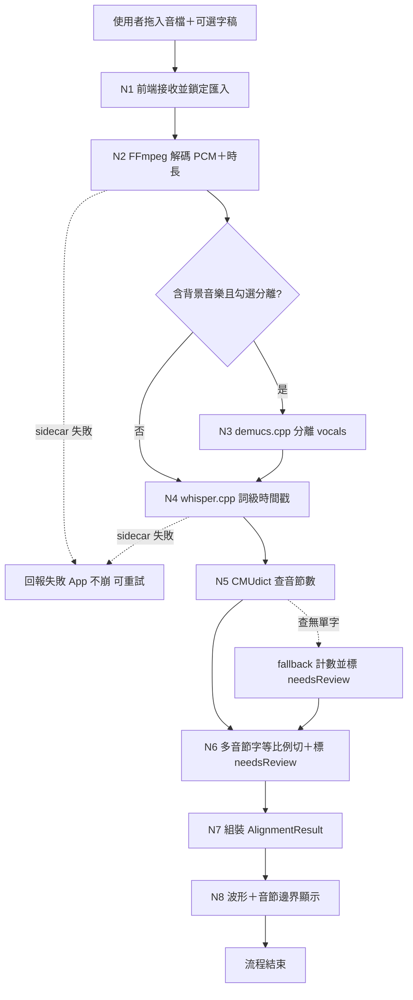

#### 3.2.4 節點描述

| 節點編號 | 節點名稱 | 責任物件 | 動作簡述 |
|----------|----------|----------|----------|
| N1 | 接收匯入 | 前端 | 取得檔案路徑與字稿，鎖定匯入按鈕，顯示階段進度 |
| N2 | 解碼 | 外部系統（FFmpeg sidecar） | 解碼 PCM、回報總時長 |
| N3 | 人聲分離（可選） | 外部系統（demucs.cpp sidecar） | 產出 vocals / instrumental |
| N4 | 語音辨識 | 外部系統（whisper.cpp sidecar） | 詞級時間戳（含無字稿轉寫草稿） |
| N5 | 音節數查詢 | 伺服器端（Domain：AlignmentEngine） | CMUdict 查音節數，查無走 fallback |
| N6 | 音節切分 | 伺服器端（Domain：AlignmentEngine） | 單音節字用 whisper 邊界；多音節字等比例切＋needsReview |
| N7 | 結果組裝 | 伺服器端（Domain：AlignmentEngine） | 回傳 AlignmentResult |
| N8 | 波形顯示 | 前端 | CustomPainter 畫波形、邊界線、文字、needsReview 標色 |

#### 3.2.5 後續動作

- Lesson 草稿（原音 PCM 參照、words、syllables、needsReview 旗標）持有於工作階段中，供 REQ-02 校正與 REQ-03 疊加使用；
- 後置條件：`syllables[]` 每個元素具 `{ text, startMs, endMs, wordIndex }` 且時間區間單調遞增、互不重疊。

#### 3.2.6 非功能性清單

| 類別 | 指標/描述 | 實作要求 | 驗收方式 |
|------|-----------|----------|----------|
| 效能 | 10 秒內音檔的完整對齊管線 ≤ 60 秒（基準機＝Intel i5-8259U；S1a 實測後鎖定） | sidecar 逾時上限可設定 | 碼表實測 |
| 穩定性 | sidecar 崩潰不拖垮 App（M4） | `Process.start` 隔離、exit code 邊界處理 | kill -9 sidecar 故障注入 |

#### 3.2.7 驗收測試情境

| 編號 | 類型 | 情境（帶真實值） | 操作 | 預期結果 |
|------|------|------------------|------|----------|
| AT-01-01 | 正常 | 匯入金標準例句音檔（3.2 秒，附字稿 `She has excellent communication skills`） | 拖入並確認 | 列出 **11 個 Syllable** 與時間戳（she/has/skills 各 1、excellent 3、communication 5）；excellent 與 communication 的內部音節標 `needsReview` |
| AT-01-02 | 正常 | 同上但不附字稿 | 拖入 | whisper.cpp 產轉寫草稿供確認後，同樣切出 11 音節 |
| AT-01-03 | 錯誤輸入 | 匯入 0 byte 的 `broken.mp3` | 拖入 | 明確錯誤提示「無法解碼」，App 不崩，可再次匯入 |
| AT-01-04 | 例外 | 對齊進行中以 `kill -9` 終止 whisper.cpp 行程 | 觀察 | App 不崩；顯示「辨識失敗，可重試」；N2 解碼結果保留 |
| AT-01-05 | 亂序 | 分析進行中連按「匯入」3 次 | 快速點擊 | 匯入按鈕置灰，僅存在 1 個分析任務 |
| AT-01-06 | 資料保存 | AT-01-01 完成後 | 檢視工作階段 | syllables 時間區間單調遞增且互不重疊，可交付 REQ-02 |
| AT-01-07 | 邊界 | 字稿含 CMUdict 查無的自造字 `blorptastic` | 拖入 | 走 fallback 計數、該字全部音節標 needsReview，不中斷流程 |

---

## 四、REQ-02 波形顯示與音節邊界手動校正

### 3.1 需求概述

- **目的**：使用者在波形上直接拖動音節邊界（尤其多音節字的等比例估計邊界），把切點修到聽感乾淨，存回 `syllables[]`。
- **使用動機**：自動切出的 `com·mu·ni·ca·tion` 內部邊界是估計值，使用者播放後聽到破碎接點，想「拖一下就修好、立刻重聽驗證」。第一眼期待：needsReview 音節有醒目標色可直接點。最可能放棄點：**拖動不精準、無法立即試聽、改壞了回不去**——故需支援拖動即時預覽與撤銷。

### 3.2 業務流程

#### 3.2.1 用例圖

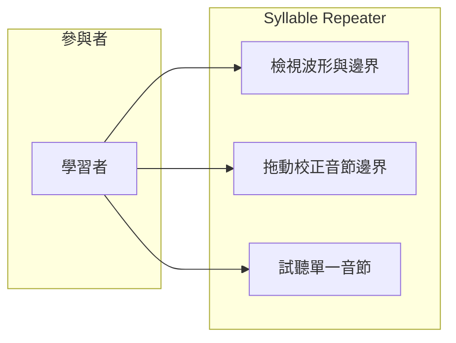

#### 3.2.2 前置條件

- REQ-01 已完成，工作階段中存在合法的 `AlignmentResult`。

#### 3.2.3 觸發事件及重要邏輯

- **觸發事件**：使用者在波形上按住某條音節邊界線並拖動。
- **重要邏輯**：
  1. 前端以 CustomPainter 顯示波形、邊界線、音節文字；needsReview 邊界以警示色顯示（資料展示）；
  2. 使用者拖動邊界線，拖動中即時顯示新位置毫秒值（頁面操作）；
  3. 邊界約束驗證（Domain）：新位置必須落在相鄰兩音節邊界之間（開區間），即 `前一音節 startMs < 新值 < 後一音節 endMs`；違反則拒絕並回彈；
  4. 放開後切點吸附最近零交越點（§0.1 允許之收尾處理）；
  5. 存回 `syllables[]`，該音節 `needsReview` 清除，並記錄一步可撤銷歷史；
  6. 使用者可點單一音節試聽驗證（播放該區間原音切片）。
- **例外**：撤銷（⌘Z）回復上一次邊界值。

#### 3.2.4 節點描述

| 節點編號 | 節點名稱 | 責任物件 | 動作簡述 |
|----------|----------|----------|----------|
| N1 | 波形與邊界渲染 | 前端 | 畫波形、邊界線、needsReview 標色 |
| N2 | 拖動互動 | 前端 | 即時顯示毫秒值、送出新邊界值 |
| N3 | 邊界約束驗證 | 伺服器端（Domain：AlignmentEngine） | 驗證不跨相鄰音節，違反回彈 |
| N4 | 零交越吸附 | 伺服器端（Domain） | 吸附最近零交越點 |
| N5 | 存回與撤銷歷史 | 伺服器端（Domain） | 更新 syllables、清 needsReview、記錄 undo |
| N6 | 試聽 | 前端 | 播放該音節原音切片 |

#### 3.2.5 後續動作

- `syllables[]` 更新完成，後續 REQ-03 疊加、REQ-05 分析、REQ-06 比對一律使用校正後時間戳；
- 後置條件：時間區間仍單調遞增、互不重疊；被校正音節 `needsReview=false`。

#### 3.2.6 非功能性清單

| 類別 | 指標/描述 | 實作要求 | 驗收方式 |
|------|-----------|----------|----------|
| 效能 | 拖動渲染 ≥ 30 fps；試聽啟動 ≤ 200ms | 波形 peaks 預算快取 | 實機操作觀測 |

#### 3.2.7 驗收測試情境

| 編號 | 類型 | 情境（帶真實值） | 操作 | 預期結果 |
|------|------|------------------|------|----------|
| AT-02-01 | 正常 | `ca`/`tion` 邊界原為 2380ms | 拖至 2440ms 放開 | 吸附最近零交越點後存回（2440±10ms 內），needsReview 清除，試聽接點無爆音 |
| AT-02-02 | 錯誤輸入 | 同上邊界，前一音節 `ni` 起點為 2100ms | 嘗試拖至 2050ms（越過 `ni` 起點） | 拒絕並回彈至 2380ms，提示不可跨越相鄰音節 |
| AT-02-03 | 亂序 | 連續快速拖動同一邊界 5 次 | 快速操作 | 僅最終位置生效，無殘留中間狀態，undo 依序可回復 |
| AT-02-04 | 資料保存 | 完成 AT-02-01 後按 ⌘Z | 撤銷 | 邊界回復 2380ms，needsReview 恢復原值 |
| AT-02-05 | 邊界 | 拖至恰等於後一音節 endMs（閉端） | 放開 | 拒絕（開區間規則：必須嚴格小於） |

---

## 五、REQ-03 句尾疊加練習

### 3.1 需求概述

- **目的**：依 `PracticeEngine` 由句尾往前逐音節疊加產生練習步驟，每步以**原音切片串接**重複播放 N 次，讓使用者以「倒序累加」方式模仿整句。
- **使用動機**：使用者想跟讀但整句太快，期望「先只聽最後一個音節，跟得上再加一個」。第一眼期待：打開課件立即看到第 1 步（句尾音節）的播放鍵。最可能放棄點：**播出來的聲音不是原聲或接點破碎**——這正是 M1 的存在理由。

### 3.2 業務流程

#### 3.2.1 用例圖

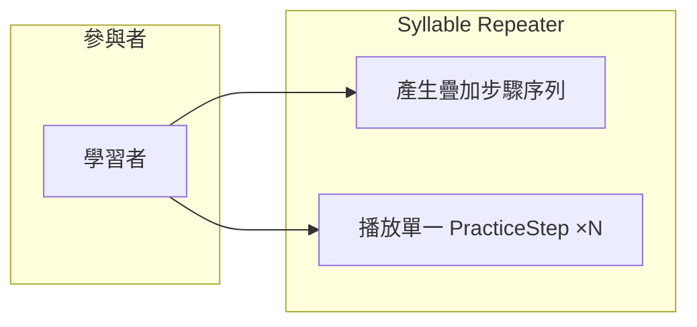

#### 3.2.2 前置條件

- 存在校正完成（或使用者接受自動值）的 `syllables[]`；
- 原音 PCM 可讀。

#### 3.2.3 觸發事件及重要邏輯

- **觸發事件**：使用者開啟課件的「疊加練習」頁，或調整 repeatN 後按「重建步驟」。
- **重要邏輯**：
  1. `buildSteps(syllables, repeatN)` 產生 `PracticeStep[]`：步驟總數＝音節總數；第 n 步＝從句尾數第 n 個音節→句尾之全部音節；
  2. 每個 `PracticeStep` 僅記 `sourceRanges[]`（原音檔上的 `[startMs, endMs]` 區間清單）與 `totalDurationMs`（＝步驟片段長 × repeatN）；
  3. `renderStep(step, originalPcm)`：**只允許** copy 原 PCM 區間 → 串接 → 零交越/≤10ms micro-fade 收尾；任何生成路徑視為 bug（M1）；
  4. 播放該步音訊，重複 repeatN 次（定案：範圍 1–10 含兩端、預設 3）；
  5. 前端顯示目前步驟之音節文字（如第 3 步顯示 `ca tion skills`）與步驟導航（上一步/下一步）。
- **金標準例句步驟表（11 音節 → 10 切點 → 11 步）**：

| step | 內容 |
|---|---|
| 1 | skills |
| 2 | tion skills |
| 3 | ca tion skills |
| 4 | ni ca tion skills |
| 5 | mu ni ca tion skills |
| 6 | com mu ni ca tion skills |
| 7 | lent com mu ni ca tion skills |
| 8 | cel lent com mu ni ca tion skills |
| 9 | ex cel lent com mu ni ca tion skills |
| 10 | has ex cel lent com mu ni ca tion skills |
| 11 | she has ex cel lent com mu ni ca tion skills |

- 對照例：`thank you very much`（5 音節）→ much / ry much / ve ry much / you ve ry much / thank you ve ry much。

#### 3.2.3.1 業務流程圖

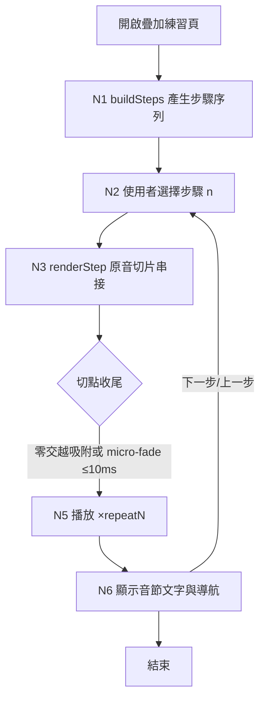

#### 3.2.4 節點描述

| 節點編號 | 節點名稱 | 責任物件 | 動作簡述 |
|----------|----------|----------|----------|
| N1 | 步驟建構 | 伺服器端（Domain：PracticeEngine） | buildSteps：句尾倒數疊加、步數＝音節數 |
| N2 | 步驟選擇 | 前端 | 步驟清單/導航互動 |
| N3 | 切片串接 | 伺服器端（Domain：PracticeEngine） | renderStep：僅 copy 原 PCM 區間＋串接 |
| N4 | 切點收尾 | 伺服器端（Domain） | 零交越吸附或 ≤10ms micro-fade |
| N5 | 播放 | 前端（just_audio） | 重複播放 repeatN 次 |
| N6 | 文字與導航顯示 | 前端 | 顯示該步音節文字、上一步/下一步 |

#### 3.2.5 後續動作

- 該步播放完成，使用者可進入 REQ-06 錄音比對或 REQ-04 匯出；
- 後置條件：`PracticeStep[]` 常駐工作階段；`sourceRanges[]` 僅含原音檔時間區間，無任何衍生音訊資料。

#### 3.2.6 非功能性清單

| 類別 | 指標/描述 | 實作要求 | 驗收方式 |
|------|-----------|----------|----------|
| 正確性 | renderStep 輸出逐 sample 等於原音切片串接（收尾處理除外） | §0.1 回歸測試常駐 CI | 位元級比對測試 |
| 效能 | 按下播放至出聲 ≤ 300ms | PCM 常駐記憶體或分段快取 | 實測 |

#### 3.2.7 驗收測試情境

| 編號 | 類型 | 情境（帶真實值） | 操作 | 預期結果 |
|------|------|------------------|------|----------|
| AT-03-01 | 正常 | 金標準例句，repeatN=3 | 開啟疊加練習 | 產生 **11 步**；第 1 步 `skills`、第 2 步 `tion skills`、第 11 步整句 |
| AT-03-02 | 正常（核心） | 第 1 步，skills 原音區間 [2650, 3150]ms，repeatN=1 | renderStep 後與原 PCM 比對 | 輸出逐 sample 等於原檔 [2650, 3150]ms 區間（僅允許端點 ≤10ms fade 差異） |
| AT-03-03 | 邊界（不吸附） | 第 2 步 | 播放 | 內容為 `tion skills`（communication 的最後一音節＋skills），**不得**輸出整字 `communication skills` |
| AT-03-04 | 錯誤輸入 | repeatN 輸入 0 | 重建步驟 | 拒絕並提示範圍（下限 1），維持原步驟 |
| AT-03-05 | 亂序 | 播放中連按「下一步」4 次 | 快速點擊 | 停止當前播放、切至最終目標步，無聲音重疊 |
| AT-03-06 | 資料保存 | 調整 repeatN 3→5 後重建 | 檢查 | totalDurationMs 隨之更新（＝片段長 ×5），sourceRanges 不變 |
| AT-03-07 | 邊界 | 5 音節句 `thank you very much` | 開啟 | 恰 5 步：much / ry much / ve ry much / you ve ry much / thank you ve ry much |

---

## 六、REQ-04 練習音訊匯出

### 3.1 需求概述

- **目的**：把練習步驟匯出為 mp3——單步匯出，或勾選多步合併匯出（段落間插入靜音供跟讀），讓使用者離開 App（通勤、走路）也能練。
- **使用動機**：使用者想把「今天練的那幾步」丟進手機播放器邊走邊跟讀。第一眼期待：勾選步驟→一鍵匯出。最可能放棄點：**靜音長度不對**——太短跟不完、太長空等；因此靜音＝前一步總時長是硬規則（M3）。

### 3.2 業務流程

#### 3.2.1 用例圖

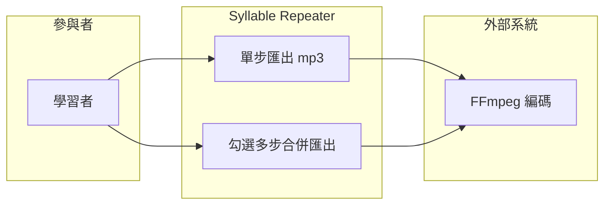

#### 3.2.2 前置條件

- REQ-03 之 `PracticeStep[]` 已建構；FFmpeg sidecar 可用；目的資料夾可寫。

#### 3.2.3 觸發事件及重要邏輯

- **觸發事件**：使用者在步驟清單勾選一或多步後按「匯出」。
- **重要邏輯**：
  1. 前端收集勾選步驟與匯出路徑（頁面操作：未勾選任何步驟時匯出鈕置灰）；
  2. 單步：`exportStep(step)`→renderStep 之 PCM 交 FFmpeg 編碼 mp3；
  3. 合併：`exportMerged(selectedSteps[])`→依步驟順序串接，**段落間靜音長度＝前一步 totalDurationMs（＝片段長 × repeatN）**；
  4. 範例（PLAN3.0 原值，N=3、much 單次 0.4s）：`[much×3]=1.2s → 靜音1.2s → [ry much×3]=1.8s → 靜音1.8s → [ve ry much×3] → …`；
  5. 寫檔完成後顯示路徑與「在 Finder 顯示」；
  6. 例外：目的地不可寫/磁碟滿→明確錯誤，不產生半成品檔（先寫暫存再原子搬移）。
- **靜音容差**（定案）：±20ms。

#### 3.2.4 節點描述

| 節點編號 | 節點名稱 | 責任物件 | 動作簡述 |
|----------|----------|----------|----------|
| N1 | 勾選與路徑 | 前端 | 收集步驟勾選、目的路徑 |
| N2 | 音訊組裝 | 伺服器端（Domain：PracticeEngine） | renderStep＋依規則插入靜音 |
| N3 | mp3 編碼 | 外部系統（FFmpeg sidecar） | PCM→mp3 |
| N4 | 原子寫檔 | 伺服器端（Domain） | 暫存→搬移，失敗不留半成品 |
| N5 | 完成回饋 | 前端 | 顯示路徑、Finder 連結 |

#### 3.2.5 後續動作

- 目的資料夾產生 mp3 檔；後置條件：合併檔中每段靜音長度＝其前一步 totalDurationMs（容差內）；練習內容音訊仍逐 sample 來自原音（M1 貫穿匯出路徑）。

#### 3.2.6 非功能性清單

| 類別 | 指標/描述 | 實作要求 | 驗收方式 |
|------|-----------|----------|----------|
| 正確性 | 靜音長度規則（M3） | 以 sample 數計算靜音，不以壓縮後時間估 | 解碼實測量測 |

#### 3.2.7 驗收測試情境

| 編號 | 類型 | 情境（帶真實值） | 操作 | 預期結果 |
|------|------|------------------|------|----------|
| AT-04-01 | 正常 | 金標準例句勾選第 3 步（`ca tion skills`），N=3 | 匯出單步 | 產生可播 mp3，內容＝該步切片 ×3 |
| AT-04-02 | 正常 | `thank you very much` 勾選全部 5 步，N=3，much 單次 0.4s | 合併匯出 | `[much×3]=1.2s→靜音1.2s→[ry much×3]=1.8s→靜音1.8s→…`，每段靜音＝前一步總時長（±容差） |
| AT-04-03 | 邊界 | 只勾選 1 步做合併匯出 | 匯出 | 成功，檔案僅含該步、無尾端靜音 |
| AT-04-04 | 錯誤輸入 | 目的地為唯讀資料夾 | 匯出 | 明確錯誤提示，無半成品檔殘留 |
| AT-04-05 | 亂序 | 匯出進行中再按一次「匯出」 | 快速點擊 | 第二次被拒或排隊，不產生交錯寫入 |
| AT-04-06 | 資料保存 | AT-04-02 產出檔 | 以播放器實測 | 總長＝Σ(各步×N)＋Σ(靜音)，與計算值誤差在容差內 |

---

## 七、REQ-05 韻律分析與視覺化

### 3.1 需求概述

- **目的**：以自研輕量 DSP 對原音（依音節時間戳）產出 `Prosody { rhythm, intensity[], stress[], pitchContour?, pitchAvailable }`，在波形旁顯示音高曲線與重音標記。
- **使用動機**：使用者跟讀後覺得「怪但說不出哪裡怪」，想一眼看到原音的節奏長短與重音落點。第一眼期待：波形上疊出音高曲線與每音節重音強度。最可能放棄點：**因某段抽不到音高而整個分析失敗**——因此 pitch 必須可降級（pitchAvailable=false）而 rhythm 照常回傳。

### 3.2 業務流程

#### 3.2.1 用例圖

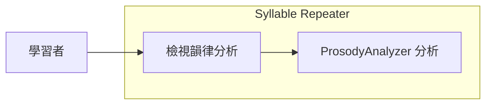

#### 3.2.2 前置條件

- `syllables[]` 就緒；原音（或 vocals）PCM 可讀。

#### 3.2.3 觸發事件及重要邏輯

- **觸發事件**：課件完成對齊後自動觸發，或使用者按「重新分析」。
- **重要邏輯**：
  1. rhythm：以 syllables 時間戳計算各音節時長比例；
  2. intensity：RMS 能量曲線（自寫 DSP）；
  3. 停頓：低能量區間偵測；
  4. stress：音節能量＋時長加權；
  5. pitchContour：YIN / autocorrelation；抽不到時 `pitchAvailable=false`，其餘結果照常回傳（降級不失敗）；
  6. 前端疊圖：波形＋音高曲線＋音節邊界線＋重音標記。
- **§0.1 約束**：本模組**只讀音訊，永不生成音訊**。

#### 3.2.3.1 業務流程圖

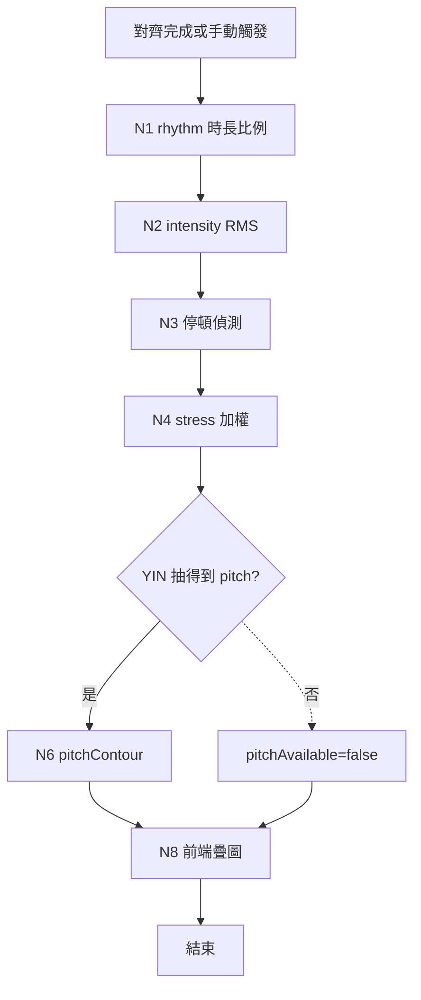

#### 3.2.4 節點描述

| 節點編號 | 節點名稱 | 責任物件 | 動作簡述 |
|----------|----------|----------|----------|
| N1–N4 | rhythm/intensity/停頓/stress | 伺服器端（Domain：ProsodyAnalyzer） | 自研 DSP 計算 |
| N5–N7 | pitch 抽取與降級 | 伺服器端（Domain：ProsodyAnalyzer） | YIN；失敗設 pitchAvailable=false |
| N8 | 疊圖渲染 | 前端 | 波形＋音高曲線＋邊界線＋重音 |

#### 3.2.5 後續動作

- `Prosody` 結果掛入 Lesson（含 `analyzerVersion / confidence`），供顯示與 `.abopack` 封裝；後置條件：無任何音訊被寫入或修改。

#### 3.2.6 非功能性清單

| 類別 | 指標/描述 | 實作要求 | 驗收方式 |
|------|-----------|----------|----------|
| 可維護性 | pitch 演算法可替換（YIN→WORLD） | 介面隔離於 ProsodyAnalyzer 內部 | 架構審查 |

#### 3.2.7 驗收測試情境

| 編號 | 類型 | 情境（帶真實值） | 操作 | 預期結果 |
|------|------|------------------|------|----------|
| AT-05-01 | 正常 | 金標準例句 11 音節 | 分析 | rhythm 含 11 個時長比例；顯示波形＋音高曲線＋11 條邊界線 |
| AT-05-02 | 降級 | 幾乎純氣音之耳語錄音（YIN 抽不到） | 分析 | `pitchAvailable=false`，rhythm/intensity/stress 照常回傳，UI 顯示「音高不可用」而非錯誤 |
| AT-05-03 | 錯誤輸入 | 對 0 長度區間音節（資料損毀）分析 | 分析 | 該音節標記無效並跳過，整體不失敗 |
| AT-05-04 | 資料保存 | 分析完成後檢查音檔 | 比對 hash | 原音檔 hash 不變（只讀不寫） |

---

## 八、REQ-06 錄音比對與差異疊圖

### 3.1 需求概述

- **目的**：使用者對某 `PracticeStep` 錄音後，系統以 DTW 比對「使用者錄音 vs 從整句原音切出的對應片段」，產出 rhythm / intonation 差異疊圖；錄音預設用完即刪，僅保留 `overlayData` 與參數。
- **使用動機**：使用者最在乎「我的節奏和語調跟原音差在哪」。第一眼期待：錄完立刻看到雙波形疊圖、差異區段標色。最可能放棄點：**只給抽象分數不給位置**——必須標出「差在哪一段」。

### 3.2 業務流程

#### 3.2.1 用例圖

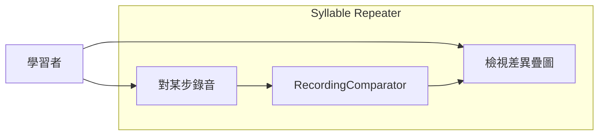

#### 3.2.2 前置條件

- 麥克風權限已授予（macOS 隱私權限）；目標 `PracticeStep` 已選定。

#### 3.2.3 觸發事件及重要邏輯

- **觸發事件**：使用者在某步按「錄音」，跟讀後按「停止」。
- **重要邏輯**：
  1. 前端錄音（顯示電平表；頁面操作：錄音中「播放原音」鈕置灰避免串音）；
  2. Domain 依該步音節時間戳**從整句原音**切出對應比對基準片段；
  3. DTW 對齊使用者錄音與基準片段；
  4. 產出 `ComparisonResult { rhythmDelta, intonationDelta, overlayData, score? }`；
  5. 前端畫雙波形/音高疊圖，差異區段標色；
  6. **錄音檔立即刪除**（預設）；overlayData＋參數保留為 `Attempt` 記錄；
  7. 例外：錄音長度過短（<0.2s）→提示重錄，不進比對。
- **§0.1 約束**：比對只讀，不生成音訊。

#### 3.2.3.1 業務流程圖

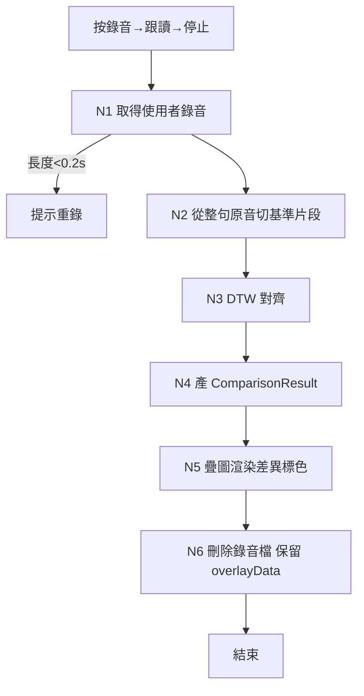

#### 3.2.4 節點描述

| 節點編號 | 節點名稱 | 責任物件 | 動作簡述 |
|----------|----------|----------|----------|
| N1 | 錄音 | 前端 | 麥克風擷取、電平顯示 |
| N2 | 基準切片 | 伺服器端（Domain：RecordingComparator） | 依音節時間戳從整句原音切對應片段 |
| N3 | DTW 比對 | 伺服器端（Domain：RecordingComparator） | 時間對齊、差異計算 |
| N4 | 結果組裝 | 伺服器端（Domain） | rhythmDelta / intonationDelta / overlayData |
| N5 | 疊圖顯示 | 前端 | 雙波形/音高疊圖、差異標色 |
| N6 | 錄音清除 | 伺服器端（Domain） | 刪除錄音檔，Attempt 只留參數與 overlay 快照 |

#### 3.2.5 後續動作

- `Attempt` 記錄（參數＋overlay 快照，無音訊）寫入進度資料，供 REQ-08 結算；後置條件：磁碟上不存在該次錄音檔。

#### 3.2.6 非功能性清單

| 類別 | 指標/描述 | 實作要求 | 驗收方式 |
|------|-----------|----------|----------|
| 隱私 | 錄音預設用完即刪（M10） | 比對完成即刪檔；保留須另行明示同意 | 檔案系統檢查 |
| 效能 | 停止錄音→疊圖顯示 ≤ 2s（10 秒內錄音） | DTW 降採樣 | 實測 |

#### 3.2.7 驗收測試情境

| 編號 | 類型 | 情境（帶真實值） | 操作 | 預期結果 |
|------|------|------------------|------|----------|
| AT-06-01 | 正常 | 對第 3 步（`ca tion skills`）錄音 1.8s | 停止錄音 | 2 秒內顯示雙波形疊圖，rhythm/intonation 差異區段標色 |
| AT-06-02 | 錯誤輸入 | 錄音 0.1s 即停止 | 停止 | 提示「錄音過短請重錄」，不產生 Attempt |
| AT-06-03 | 亂序 | 錄音中按「下一步」 | 點擊 | 錄音中止並丟棄，切換步驟，無殘留檔案 |
| AT-06-04 | 資料保存（隱私） | AT-06-01 完成後 | 檢查磁碟與進度資料 | 錄音檔不存在；Attempt 之 overlayData 與參數存在 |
| AT-06-05 | 例外 | 麥克風權限被拒 | 按錄音 | 引導至 macOS 系統設定，App 不崩 |

---

## 九、REQ-07 課件封裝與譯文

### 3.1 需求概述

- **目的**：以 `LessonPackEngine` 將課件寫成/讀回 `.abopack`（zip + JSON + 音訊）；譯文支援「自動翻譯（使用者自帶 AI key，可選）」與「手動打字覆蓋（永遠可用）」兩路徑。
- **使用動機**：使用者花時間校正好的課件要能存檔、換機、分享給自己另一台裝置。第一眼期待：一鍵存成單一檔案。最可能放棄點：**沒設 AI key 就被擋住**——手動譯文路徑必須永遠可用，AI 僅為加速。

### 3.2 業務流程

#### 3.2.1 用例圖

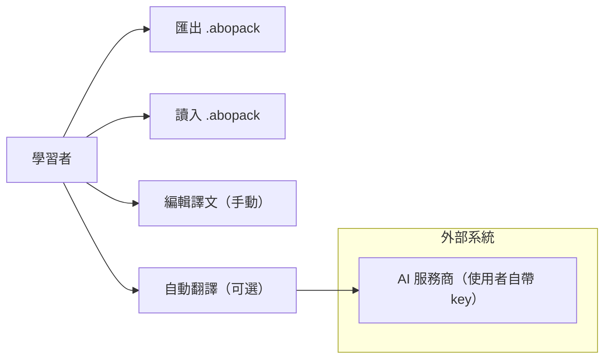

#### 3.2.2 前置條件

- 匯出：Lesson 內容就緒（原音、syllables 為必要；prosody、譯文為可選）；
- 自動翻譯：使用者已於設定輸入 API key（flutter_secure_storage 加密保存）。

#### 3.2.3 觸發事件及重要邏輯

- **觸發事件**：使用者按「儲存課件」/「開啟課件」；或在譯文欄按「自動翻譯」/直接打字。
- **重要邏輯**：
  1. `write(lesson) -> .abopack`：打包 manifest、原音、（若有）vocals/instrumental、waveform peaks、words、syllables、translations、prosody、practiceSteps 設定、`passive_practice.m4a`；
  2. 每筆 AI/分析結果附 `source / modelName / analyzerVersion / confidence / needsReview` 中繼資料；
  3. `read(path) -> Lesson`：讀回並驗證結構；損毀 zip →明確錯誤，不部分載入；
  4. 譯文：未設 key 時「自動翻譯」鈕停用但**手動輸入永遠可用**；手動輸入一律覆蓋自動結果並標 `source=manual`；
  5. AI 呼叫失敗（網路/服務商掛）→提示失敗，主流程不受阻；
  6. `.abopack` 不含授權/防盜欄位（Non-scope 4）。
- **§0.1 約束**：AIService 僅處理文字（翻譯/潤稿/建議），**不得用於生成或示範音訊**。

#### 3.2.4 節點描述

| 節點編號 | 節點名稱 | 責任物件 | 動作簡述 |
|----------|----------|----------|----------|
| N1 | 儲存/開啟操作 | 前端 | 檔案對話框、進度回饋 |
| N2 | 打包/解包 | 伺服器端（Domain：LessonPackEngine） | zip+JSON 讀寫、結構驗證 |
| N3 | 手動譯文 | 前端＋伺服器端 | 文字輸入、source=manual 覆蓋 |
| N4 | 自動翻譯 | 外部系統（AI 服務商） | 使用者自帶 key 呼叫，失敗不阻斷 |
| N5 | key 管理 | 伺服器端（Domain：AIService） | flutter_secure_storage 加密存取 |

#### 3.2.5 後續動作

- 磁碟產生/更新 `.abopack`；後置條件：write→read round-trip 後 Lesson 內容等價（音訊位元級一致、JSON 欄位一致）。

#### 3.2.6 非功能性清單

| 類別 | 指標/描述 | 實作要求 | 驗收方式 |
|------|-----------|----------|----------|
| 安全性 | API key 不落明文（M10） | flutter_secure_storage；不寫入 pack | pack 內容與程式碼審查 |
| 相容性 | `.abopack` 平台中立（zip+JSON） | 不使用平台專屬路徑/編碼 | 跨平台讀取測試（Phase 2 前置） |

#### 3.2.7 驗收測試情境

| 編號 | 類型 | 情境（帶真實值） | 操作 | 預期結果 |
|------|------|------------------|------|----------|
| AT-07-01 | 正常 | 金標準例句課件（11 音節＋prosody＋手動譯文「她有出色的溝通能力」） | 儲存後重新開啟 | round-trip 等價：11 音節時間戳一致、譯文一致、原音位元級一致 |
| AT-07-02 | 正常 | 未設 AI key | 於譯文欄手動輸入 | 儲存成功，`source=manual`；「自動翻譯」鈕呈停用態，主流程無阻 |
| AT-07-03 | 錯誤輸入 | 開啟被截斷的 `broken.abopack`（zip 損毀） | 開啟 | 明確錯誤「課件損毀」，不部分載入、App 不崩 |
| AT-07-04 | 例外 | 已設 key 但斷網 | 按自動翻譯 | 提示翻譯失敗，可改手動輸入，其餘功能正常 |
| AT-07-05 | 資料保存（安全） | 已設 key 後匯出 pack | 檢視 pack 內容 | pack 內不含 key 任何形式；key 僅存於 secure storage |
| AT-07-06 | 亂序 | 自動翻譯回應前使用者已手動輸入 | 併發 | 手動值勝出（source=manual），自動結果不覆蓋 |

---

## 十、REQ-08 練習進度與 SRS

### 3.1 需求概述

- **目的**：以 `ProgressEngine` 管理 `.aboprogress`：以 `PracticeGroup`（限單一 Lesson 內）為結算單位做 SRS 排程、提醒、跨日處理與字典歸檔；支援 `updatedAt` 合併與 Content Hash 局部重置。
- **使用動機**：使用者隔了三天回來，想一打開就看到「今天該複習哪幾組」。第一眼期待：到期清單排最前。最可能放棄點：**漏練被懲罰或催促產生罪惡感**——跨日零懲罰（M7）是刻意的產品決策。

### 3.2 業務流程

#### 3.2.1 用例圖

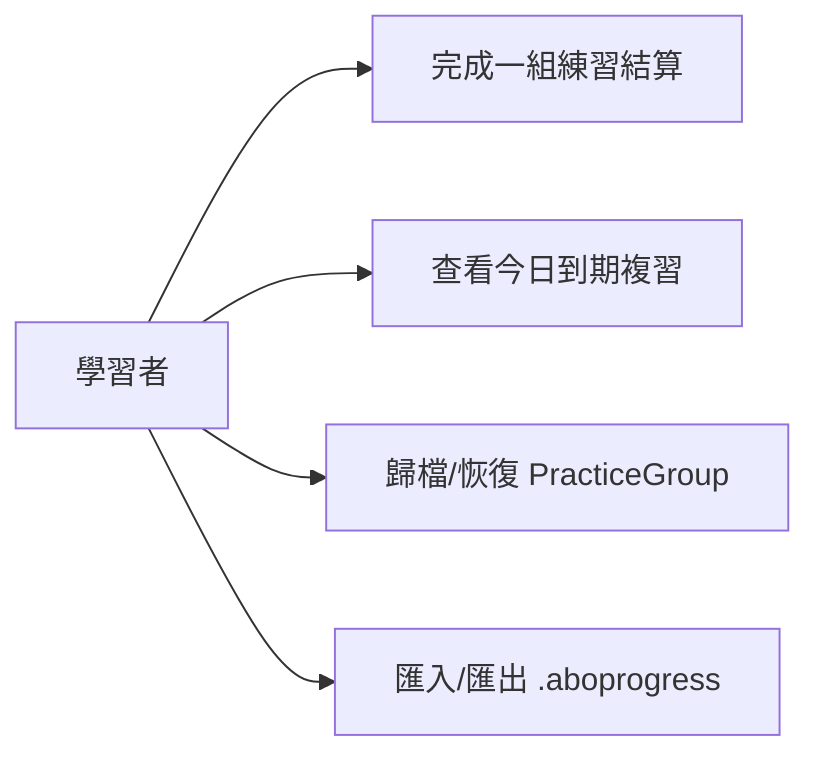

#### 3.2.2 前置條件

- 存在至少一個 Lesson 與其 `PracticeGroup` 設定；本機進度儲存（SQLite/Drift）可用。

#### 3.2.3 觸發事件及重要邏輯

- **觸發事件**：使用者完成一組練習（結算）、開啟 App（到期計算）、執行歸檔/恢復、匯入進度檔。
- **重要邏輯**：
  1. 結算單位＝`PracticeGroup`，同步鍵＝`Profile + Course + Lesson + Group`；
  2. SRS 預設複習間隔：第 **0 / 1 / 3 / 7 / 14 / 30** 天；
  3. 難度三檔：困難＝縮短間隔、最高優先；普通＝進入下一段；輕鬆＝延長間隔或最低頻；
  4. 提醒優先序：① 每次練習分鐘數 → ② 每次未達標數上限 → ③ 每日練習次數（Q9 暫定預設：15 分鐘／5 個／2 次，均為可調設定項，非硬編碼）；
  5. 跨日未完成：不催、不記失敗、不懲罰、不累積債；該次靜默作廢，Group 未來仍可叫出（M7）；
  6. `upsert(local, incoming)`：依 `updatedAt` 較新覆寫（M6）；
  7. `contentHashChanged(lesson)`：Lesson 內容變更只重置該 Lesson 之進度，不波及整個 Course（M6）；
  8. 字典歸檔：歸檔不滿 7 日可恢復；恢復後可重新排程；不影響本機課件與進度（M8）。

#### 3.2.3.1 業務流程圖

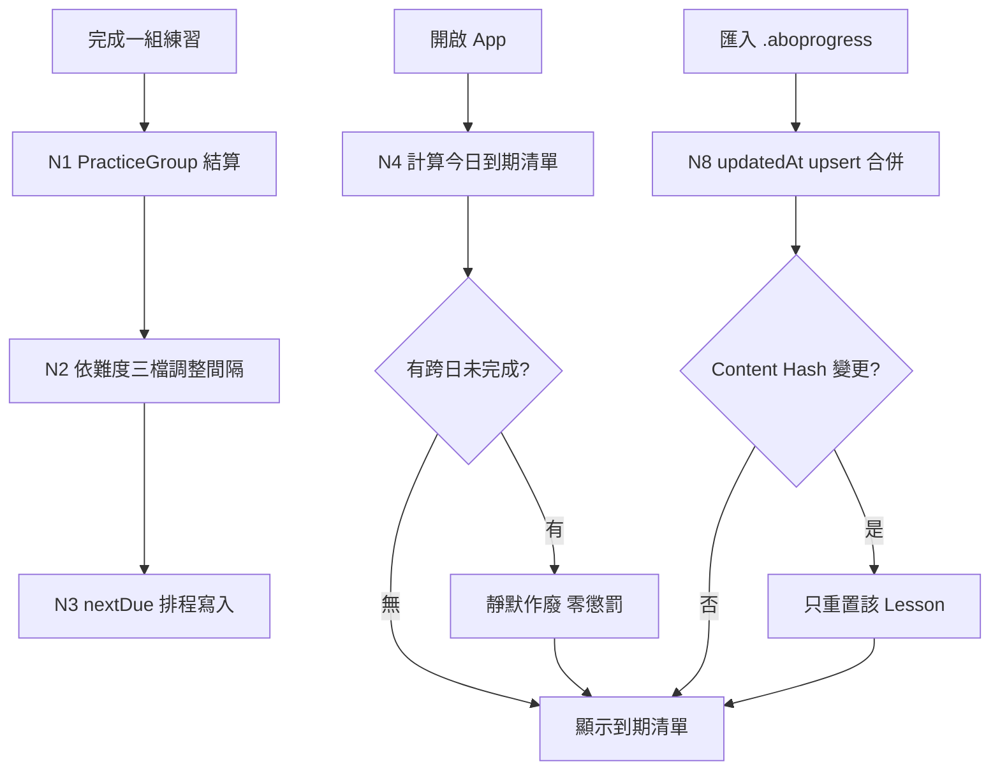

#### 3.2.4 節點描述

| 節點編號 | 節點名稱 | 責任物件 | 動作簡述 |
|----------|----------|----------|----------|
| N1 | 結算 | 伺服器端（Domain：ProgressEngine） | 以 Group 為單位寫結果 |
| N2 | 難度調檔 | 伺服器端（Domain） | 困難/普通/輕鬆 → 間隔調整 |
| N3 | 排程 | 伺服器端（Domain） | nextDue 計算與持久化 |
| N4–N7 | 到期與跨日 | 伺服器端（Domain）＋前端 | 到期清單計算與顯示；跨日靜默作廢 |
| N8–N10 | 合併與局部重置 | 伺服器端（Domain） | updatedAt upsert；hash 變更只重置該 Lesson |

#### 3.2.5 後續動作

- SRS 排程與熟練度寫入本機儲存並可匯出 `.aboprogress`（attempts 只存參數與 overlay 快照，不存錄音）；後置條件：任何合併操作後，較新 `updatedAt` 之記錄存活。

#### 3.2.6 非功能性清單

| 類別 | 指標/描述 | 實作要求 | 驗收方式 |
|------|-----------|----------|----------|
| 資料完整性 | 寫入中斷不損毀既有進度 | SQLite 交易；匯入先驗證再套用 | 中斷注入測試 |

#### 3.2.7 驗收測試情境

| 編號 | 類型 | 情境（帶真實值） | 操作 | 預期結果 |
|------|------|------------------|------|----------|
| AT-08-01 | 正常 | 7/4 完成 Group A（普通） | 結算 | nextDue＝7/5（第 1 天段）；再次普通→7/8（第 3 天段） |
| AT-08-02 | 正常（跨日） | 7/5 到期但使用者 7/6 才開 App | 開啟 | 無催促/失敗記錄；Group A 出現在可練清單，熟練度不降 |
| AT-08-03 | 合併 | 本機 Group A `updatedAt=7/4 10:00`，匯入檔同 Group `updatedAt=7/4 12:00` | 匯入 | 匯入版本覆寫本機版本 |
| AT-08-04 | 局部重置 | Course 含 Lesson X、Y；X 內容變更（hash 改變） | 重新載入 | 僅 X 的進度重置，Y 的 SRS 狀態不動 |
| AT-08-05 | 邊界 | Group B 於 7/1 00:00 歸檔，7/7 23:00 嘗試恢復（第 6 日內，未滿 168h） | 恢復 | 成功，可重新排程 |
| AT-08-06 | 邊界 | 同上，7/8 01:00 嘗試恢復（超過 168h） | 恢復 | 拒絕（Q7 定案：168 小時，不含） |
| AT-08-07 | 錯誤輸入 | 匯入結構損毀的 `.aboprogress` | 匯入 | 拒絕並提示，既有進度完全不變 |
| AT-08-08 | 資料保存 | 結算寫入途中強制結束 App | 重啟 | 已結算之既有記錄完整；最多遺失未完成那一筆 |

---

## 十一、REQ-09 跨平台兼容性架構約束

### 3.1 需求概述

- **目的**：v1 以 **macOS 桌面**為首發平台完成完整製作＋練習流程；同時以架構約束確保未來 Phase 2 手機端（iOS/Android）可走 **PWA** 或 **App Store / Play Store 原生 App** 任一路徑（或並行）而無需重寫 Domain。
- **使用動機**：需求方要保護「自用→商用、桌面→手機」的演進路線：現在寫的每一行領域邏輯，未來在手機上都要能直接複用。最可能的失敗點：**Domain 混入平台 API 或 sidecar 依賴**，導致手機/Web 端被迫重寫——此為本項存在的理由（M5）。

### 3.2 業務流程

> 本項為**架構約束型需求**，無終端使用者操作流程；「流程」為開發與建置期之守則與檢查。

#### 3.2.1 用例圖

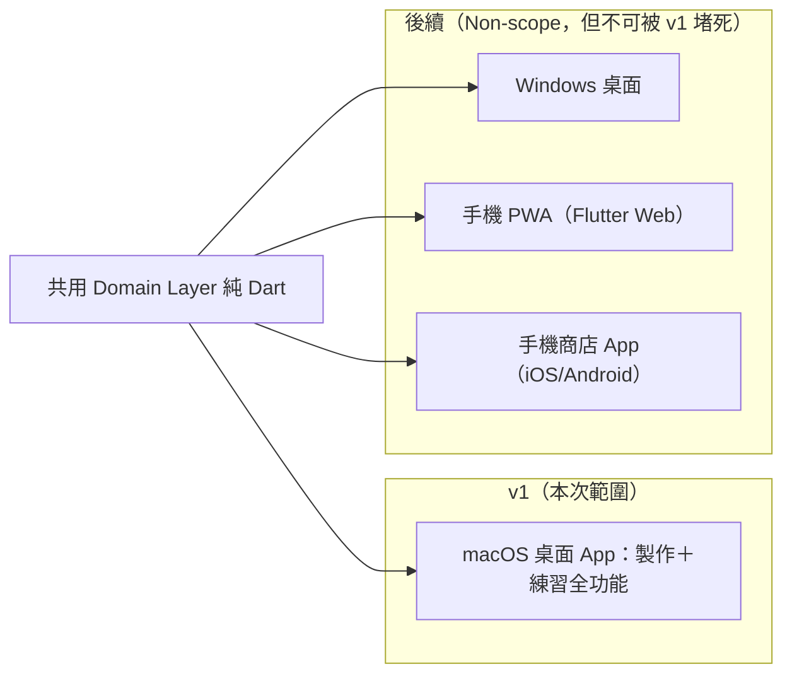

#### 3.2.2 前置條件

- 技術選型依 PLAN3.0 §8：Flutter + Dart（UI）、Domain 純 Dart、sidecar 全 C++/原生。

#### 3.2.3 觸發事件及重要邏輯

- **觸發事件**：每次建置與 CI 執行；每次新增依賴或模組時的審查。
- **重要邏輯（架構鐵則）**：
  1. **平台順序**：macOS v1（含 sidecar 之 macOS 編譯；晶片 Intel x86_64 優先，Apple Silicon 後續）；**v1 定案免簽章**——發布產物為未簽章 `.app`＋略過 Gatekeeper 操作說明（`xattr -cr` 或右鍵開啟），原因是使用者無 Apple Developer 帳號；正式簽章／notarization（原 PLAN3.0 S8 內容）延後至取得該帳號後再評估；Windows 延後（Q2 定案：macOS v1 發布後評估）；手機端 Phase 2；
  2. **Domain 純 Dart（M5）**：Domain 不 import Flutter/sidecar/平台 API；檔案 IO 經抽象介面注入（避免 `dart:io` 直接耦合，保留 Flutter Web/PWA 編譯可能）；
  3. **手機端雙路徑保留**：(a) PWA＝Flutter Web build＋PWA manifest；(b) 商店 App＝Flutter iOS/Android build。最終擇一或並行（Q3 定案：Phase 2 啟動時以 PoC 決定，商店 App 為保底）；
  4. **手機端能力邊界**（承 PLAN3.0）：手機不跑 AI/sidecar，只做：讀 `.abopack`、疊加播放（切片）、錄音比對、SRS、`.aboprogress` 匯出——此能力集不依賴 sidecar，正是雙路徑可行的原因；
  5. **檔案格式平台中立**：`.abopack` / `.aboprogress` 為 zip+JSON，不含平台專屬路徑或編碼；
  6. **PWA 已知風險（C9 盲點提示，須於 Phase 2 前驗證）**：iOS Safari 之 Web Audio/錄音、背景播放與檔案存取限制較嚴；just_audio 與錄音套件之 Web 支援度需 PoC 驗證。**若 PoC 不過，商店 App 路徑為保底**；
  7. sidecar 僅於桌面平台註冊；手機/Web 組建不包含 sidecar 二進位。

#### 3.2.4 節點描述

| 節點編號 | 節點名稱 | 責任物件 | 動作簡述 |
|----------|----------|----------|----------|
| N1 | Domain 依賴檢查 | 伺服器端（CI/建置） | 驗證 domain package 依賴清單無 flutter/sidecar/平台 API |
| N2 | 無 Flutter 環境測試 | 伺服器端（CI） | `dart test` 於純 Dart 環境全綠 |
| N3 | macOS 打包（免簽章） | 前端（建置流程） | 產出未簽章 `.app`＋略過 Gatekeeper 操作說明；v1 發布必要條件 |
| N4 | 授權白名單檢查 | 伺服器端（CI/人工） | 零 GPL/AGPL、零 Python（M9） |
| N5 | 格式中立性檢查 | 伺服器端（Domain） | pack/progress 內容不含平台專屬資訊 |

#### 3.2.5 後續動作

- 後置條件：任一時點的主幹程式碼，Domain 皆可被 macOS/Windows/iOS/Android/Web 五種目標引用而不需修改；違反即建置失敗。

#### 3.2.6 非功能性清單

| 類別 | 指標/描述 | 實作要求 | 驗收方式 |
|------|-----------|----------|----------|
| 相容性 | macOS 最低版本（定案：macOS 13+；Intel x86_64 優先，Apple Silicon 後續） | 建置目標設定；sidecar 二進位先出 x86_64 版 | 實機（Intel i5-8259U）驗證 |
| 合規性 | 商店上架之隱私政策要件（麥克風用途聲明等） | Info.plist 用途字串 | 上架前審查（Phase 2） |

#### 3.2.7 驗收測試情境

| 編號 | 類型 | 情境（帶真實值） | 操作 | 預期結果 |
|------|------|------------------|------|----------|
| AT-09-01 | 正常 | Domain package 於無 Flutter 之 CI 容器 | 執行 `dart test` | 全數通過，無 Flutter/sidecar import |
| AT-09-02 | 錯誤輸入（防線） | 開發者誤在 Domain import `package:flutter/material.dart` | CI 檢查 | 建置/檢查失敗並指出違規檔案 |
| AT-09-03 | 正常 | macOS release build（未簽章） | 使用者執行 `xattr -cr` 或右鍵開啟略過 Gatekeeper | 全流程（REQ-01→08）可跑 |
| AT-09-04 | 資料保存（中立性） | macOS 產出的 `she_has.abopack` | 於純 Dart CLI（模擬他平台）讀回 | 讀取成功、11 音節資料完整 |
| AT-09-05 | 合規 | 掃描 release 依賴清單 | 授權審查 | 無 GPL/AGPL/非商用限定項；FFmpeg 為 LGPL build 動態連結 |

---

## 十二、核心驗收總表

對 2.5「系統必須維持」每一條之「核心不被破壞」情境：

| 編號 | 對應核心條目 | 破壞性情境（帶真實值） | 預期防線行為 |
|------|--------------|------------------------|--------------|
| CT-01 | M1 原聲不可替換 | 對金標準例句第 8 步（`cel lent com mu ni ca tion skills`）呼叫 renderStep，將輸出與原檔對應 `sourceRanges` 之 PCM 逐 sample 比對 | 除端點 ≤10ms fade 外位元級相等；CI 常駐此回歸測試，任何生成路徑進入即測試失敗 |
| CT-02 | M2 疊加演算法 | 金標準例句（11 音節）buildSteps | 恰 11 步；第 2 步為 `tion skills` 而非 `communication skills`（不吸附）；5 音節句恰 5 步 |
| CT-03 | M3 靜音規則 | `thank you very much` N=3 全步合併（much 單次 0.4s） | 第一段靜音＝1.2s、第二段＝1.8s（各＝前一步總時長，容差內），以解碼後 sample 數實測 |
| CT-04 | M4 崩潰隔離 | 對齊中 `kill -9` whisper.cpp | App 不崩、回報失敗、解碼結果保留、可重試 |
| CT-05 | M5 Domain 純 Dart | 無 Flutter CI 容器執行 `dart test` | 全綠；依賴清單含 flutter/sidecar 即失敗（AT-09-02） |
| CT-06 | M6 進度合併/局部重置 | 兩份進度同 Group（updatedAt 10:00 vs 12:00）合併；Course 內單一 Lesson 改 hash | 12:00 版存活；僅該 Lesson 進度重置、其餘 Lesson 不動 |
| CT-07 | M7 跨日零懲罰 | 到期日 7/5 未練，7/6 開啟 | 無失敗記錄、無催促、熟練度不變、Group 可叫出 |
| CT-08 | M8 歸檔可恢復 | 歸檔後 167 小時恢復 vs 169 小時恢復 | 前者成功、後者拒絕（Q7 定案：168 小時不含，兩側各一測） |
| CT-09 | M9 授權白名單 | release 依賴掃描注入一個 GPL 套件 | 授權檢查（CI 或發布 checklist）擋下，發布流程中止 |
| CT-10 | M10 隱私防線 | 錄音比對完成後掃描磁碟；匯出 pack 後全文搜尋 key 字串 | 錄音檔不存在；pack 與任何落地檔案無 key 明文 |

> 2.5「系統不可接受」各條對應：合成音訊→CT-01；單字吸附→CT-02；GPL 進主程式→CT-09；key/個資明文→CT-10；未經同意留錄音→CT-10 與 AT-06-04。

---

## 附錄 A：待澄清清單（已核可定案，2026-07-04）

> 使用者於 2026-07-04 核可：Q1–Q8 以「建議預設」為**定案值**；Q9 暫以下表預設進設計、允許使用者於設定中調整；Q10 於 S1a 實測後鎖定數值。

| 編號 | 問題 | 影響範圍 | 定案值 |
|------|------|----------|--------------------------|
| Q1 | macOS 最低版本與晶片支援 | REQ-09、建置 | **定案**：macOS 13+；**Intel（x86_64）優先**（開發機為 Intel i5-8259U），Apple Silicon 為後續建置目標 |
| Q2 | Windows 版時程 | 2.4 Non-scope 2 | **定案**：macOS v1 發布後評估 |
| Q3 | 手機端最終通路 | REQ-09 | **定案**：Phase 2 啟動時以 PoC 決定；商店 App 為保底 |
| Q4 | repeatN 範圍與預設值 | REQ-03/04 | **定案**：範圍 1–10（含兩端）、預設 3 |
| Q5 | 合併匯出靜音長度容差 | REQ-04、CT-03 | **定案**：±20ms |
| Q6 | CMUdict 查無字/非英文語料之 fallback | REQ-01、2.4 Non-scope 8 | **定案**：母音團計數＋強制 needsReview |
| Q7 | 歸檔「不滿 7 日」計法 | REQ-08 M8、CT-08 | **定案**：168 小時（不含），CT-08 兩側測試以 167h/169h 為準 |
| Q8 | 支援音檔格式與單檔長度上限 | REQ-01 | **定案**：mp3/wav/m4a/flac；上限 10 分鐘 |
| Q9 | 提醒三參數預設值 | REQ-08 | 暫定：每次 15 分鐘／未達標上限 5 個／每日 2 次，**均為可調設定項**，非硬編碼 |
| Q10 | 對齊管線效能目標 | REQ-01 3.2.6 | 暫以「10 秒音檔 ≤ 60 秒（基準機＝Intel i5-8259U）」為設計目標，S1a 實測後鎖定；Intel 上 whisper/demucs 較慢，此目標偏緊，實測不過則調整數值而非換演算法 |

## 附錄 B：審查參與人建議

單人專案：需求方 Karen 本人擔任「產品/驗收」角色逐項核可附錄 A；技術可行性由後續 `fullstack-design` 階段承接驗證（尤其 Q3 之 PWA PoC 與 Q10 效能目標）。
